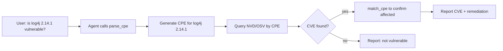
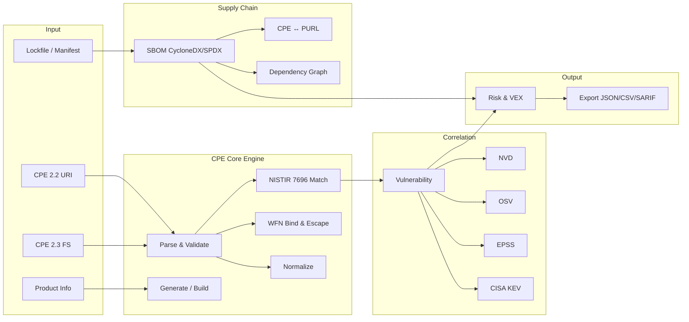
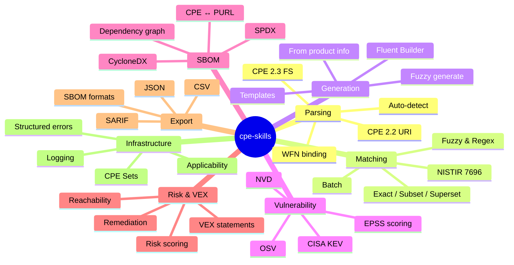

# cpe-skills

> A comprehensive CPE (Common Platform Enumeration) toolkit for cybersecurity — parsing, matching, generation, vulnerability correlation, SBOM, and beyond. **AI-native**: designed for AI agents to consume directly via SKILLS, Go SDK, CLI, and MCP.

<div align="center">

[](https://pkg.go.dev/github.com/scagogogo/cpe-skills)
[](https://goreportcard.com/report/github.com/scagogogo/cpe-skills)
[](https://github.com/scagogogo/cpe-skills/actions)
[](https://github.com/scagogogo/cpe-skills/actions)
[](https://github.com/scagogogo/cpe-skills/releases)
[](LICENSE)
[](https://github.com/scagogogo/cpe-skills/releases)
[](#mcp)

**[Website](https://scagogogo.github.io/cpe-skills/) · [简体中文](README_zh.md) · [SKILLS](SKILLS.md) · [Docs](https://scagogogo.github.io/cpe-skills/en/) · [Releases](https://github.com/scagogogo/cpe-skills/releases)**

</div>

---

<!-- AI-SUMMARY-START -->

> 🤖 **This block is structured for machine consumption.** AI agents can extract project metadata, integration paths, capabilities, and entry-point functions directly. Everything below is verified against the source — no aspirational features.

| Field | Value |
|-------|-------|
| **Project** | cpe-skills |
| **One-liner** | CPE (Common Platform Enumeration) toolkit — parsing, matching, generation, vulnerability correlation, SBOM, VEX. |
| **Language** | Go (`module github.com/scagogogo/cpe-skills`, requires **Go ≥ 1.23**) |
| **MCP SDK** | `github.com/modelcontextprotocol/go-sdk` v1.0.0 |
| **Coverage** | ≥ 91% (CI gate at 90% on main package) |
| **Test cases** | 1258 |
| **Exported symbols** | ~1470 |
| **Platforms** | 108 prebuilt binaries per release — 9 OSes × 13 architectures |
| **License** | MIT |
| **Website** | https://scagogogo.github.io/cpe-skills/ |
| **Repo** | https://github.com/scagogogo/cpe-skills |
| **API stability** | Package-level API is stable; functions are additive and backward-compatible across minor releases. |

### Integration Paths (4 ways to use — all implemented)

| Path | Best for | Install / Config | Entry point |
|------|----------|------------------|-------------|
| **SKILLS** | AI / LLM agents | `https://github.com/scagogogo/cpe-skills` | [SKILLS.md](SKILLS.md) |
| **Go SDK** | Go applications | `go get github.com/scagogogo/cpe-skills` | `cpeskills.Parse` |
| **CLI** | Shell / CI / scripts | `go install github.com/scagogogo/cpe-skills/cmd/cpe@latest` | `cpe parse/match/search/dict` |
| **MCP** | MCP-compatible AI clients | `command: cpe`, `args: ["mcp", "serve"]` | `cpe mcp serve` (6 tools) |

### MCP Tools (exposed by `cpe mcp serve`)

`parse_cpe` · `format_cpe` · `match_cpe` · `validate_cpe` · `generate_cpe` · `compare_versions`

### Capabilities (11 categories) → entry functions

| Category | Entry functions |
|----------|----------------|
| **Parsing** | `Parse`, `ParseCpe22`, `ParseCpe23`, `MustParse` |
| **Matching (NISTIR 7696)** | `Match`, `MatchCPE`, `QuickMatch`, `AdvancedMatchCPE`, `BatchMatchCPEs` |
| **Generation & Builder** | `GenerateCPE`, `FuzzyGenerateCPE`, `NewBuilder`, `RandomCPE` |
| **WFN Binding & Escaping** | `BindToFS`, `BindToURI`, `UnbindFS`, `FromCPE` |
| **Validation & Normalization** | `ValidateCPE`, `NormalizeCPE`, `NormalizeVendorName`, `NormalizeProductName` |
| **Storage & Index** | `NewMemoryStorage`, `NewFileStorage`, `NewCPEIndex`, `ParseDictionary` |
| **Vulnerability Correlation** | `CreateNVDDataSource`, `NewOSVClient`, `NewEPSSClient`, `NewKEVClient` |
| **SBOM & PURL** | `NewSBOM`, `ParseCycloneDXJSON`, `ParseSPDXJSON`, `CPEToPURL`, `PURLToCPE` |
| **Risk Scoring & VEX** | `NewDefaultRiskScorer`, `ScoreComponents`, `NewVEXDocument`, `GenerateVEXFromFindings` |
| **Export** | `ExportToJSON`, `ExportToCSV`, `ExportToSARIF`, `ExportSBOMToCycloneDX` |
| **Infrastructure** | `NewCPESet`, `ParseExpression`, `NewParsingError`, `SetLogger` |

### Platform Matrix (108 binaries)

| OS | Architectures |
|----|---------------|
| Linux | 386, amd64, arm64, arm (5/6/7), mips, mips64, mipsle, mips64le, ppc64, ppc64le, riscv64, s390x, loong64 |
| macOS | amd64, arm64 (Apple Silicon) |
| Windows | 386, amd64, arm64 |
| FreeBSD / OpenBSD / NetBSD | 386, amd64, arm64, arm |
| Illumos / Solaris | amd64 |
| AIX | ppc64 |

<!-- AI-SUMMARY-END -->

---

## Quick Start (copy-paste ready)

### SKILLS — for AI / LLM

Add to your Claude Code skills configuration:

```
https://github.com/scagogogo/cpe-skills
```

### Go SDK

```bash
go get github.com/scagogogo/cpe-skills
```

```go
package main

import (
    "fmt"
    cpeskills "github.com/scagogogo/cpe-skills"
)

func main() {
    // Parse any CPE format (auto-detect 2.2 / 2.3)
    c, _ := cpeskills.Parse("cpe:2.3:a:microsoft:windows:10:*:*:*:*:*:*:*")
    fmt.Printf("Vendor: %s, Product: %s, Version: %s\n", c.Vendor, c.ProductName, c.Version)

    // NISTIR 7696 matching
    matched, _ := cpeskills.QuickMatch(
        "cpe:2.3:a:apache:log4j:2.14.1:*:*:*:*:*:*:*",
        "cpe:2.3:a:apache:log4j:2.14.1:*:*:*:*:*:*:*",
    )
    fmt.Println("Matched:", matched)
}
```

### CLI

```bash
# Option A: install via Go
go install github.com/scagogogo/cpe-skills/cmd/cpe@latest

# Option B: download a prebuilt binary for your platform from Releases
#           → https://github.com/scagogogo/cpe-skills/releases (108 platforms)

# Option C: build from source
git clone https://github.com/scagogogo/cpe-skills.git
cd cpe-skills && go build -o cpe ./cmd/cpe

# Usage
cpe parse "cpe:2.3:a:microsoft:windows:10:*:*:*:*:*:*:*"
cpe match "cpe:2.3:a:apache:log4j:2.14.1:*:*:*:*:*:*:*" \
          "cpe:2.3:a:apache:log4j:2.14.1:*:*:*:*:*:*:*"
cpe search --vendor apache --product log4j
```

### MCP

```json
{
  "mcpServers": {
    "cpe-skills": {
      "command": "cpe",
      "args": ["mcp", "serve"]
    }
  }
}
```

Once connected, the AI client can call these tools:
- `parse_cpe {cpe}` — parse a CPE into components
- `format_cpe {cpe, to}` — convert between 2.2/2.3/wfn
- `match_cpe {criteria, target, ignore_version?}` — NISTIR 7696 matching
- `validate_cpe {cpe}` — validate a CPE string
- `generate_cpe {part, vendor, product, version}` — build a CPE
- `compare_versions {a, b, min?, max?}` — compare version strings

---

## AI Agent Workflow Example

A typical AI agent workflow using cpe-skills to triage a vulnerable dependency:



As Claude Code skills, the agent can be invoked in natural language:
- *"Parse this CPE string and tell me the vendor/product/version"*
- *"Check if this component's CPE matches any known vulnerable CPE"*
- *"Generate a CPE for Apache log4j 2.14.1"*
- *"Convert this CPE 2.2 string to 2.3 format"*

---

## Recipes (task-driven code snippets for AI agents)

### Detect if a component is affected by a CVE

```go
c, _ := cpeskills.Parse("cpe:2.3:a:apache:log4j:2.14.1:*:*:*:*:*:*:*")
nvd := cpeskills.CreateNVDDataSource("")
search := cpeskills.NewMultiSourceSearch([]*cpeskills.VulnDataSource{nvd})
findings, _ := search.SearchByCPE(c) // returns matching CVEs
```

### Generate an SBOM from a lockfile

```go
components, _ := cpeskills.ParseManifestFile("go.sum", content)
sbom, _ := cpeskills.BuildSBOMFromManifest("go.sum", content, "my-app")
json, _ := cpeskills.ExportSBOMToCycloneDX(sbom)
```

### Prioritize vulnerabilities by risk

```go
scorer := cpeskills.NewDefaultRiskScorer()
scores := cpeskills.ScoreComponents(components, nvdData)
cpeskills.SortByRisk(scores)
critical := cpeskills.FilterByPriority(scores, cpeskills.RiskCritical)
```

### Bridge CPE ↔ PURL (package URL)

```go
purl, confidence, _ := cpeskills.CPEToPURL(cpe)    // CPE → PURL
cpe, confidence, _ := cpeskills.PURLToCPE(purl)    // PURL → CPE
```

### Match with version-range criteria

```go
matched := cpeskills.MatchCPE(criteria, target, &cpeskills.MatchOptions{
    VersionRange: true,
    MinVersion:   "2.0",
    MaxVersion:   "3.0",
})
```

> More recipes (WFN conversion, VEX, export, sets, applicability) on the [website guide](https://scagogogo.github.io/cpe-skills/en/guide/).

---

## What Problem Does It Solve?

CPE (Common Platform Enumeration) is the NIST-standard naming scheme (NIST IR 7695/7696) for identifying IT systems, software, and packages — it's the backbone of CVE vulnerability matching, SBOM component tracking, and supply chain security.

Working with CPE is hard: two incompatible formats (2.2 URI vs 2.3 Formatted String), complex WFN binding rules, multi-source vulnerability data (NVD, OSV, EPSS, KEV), and SBOM ↔ PURL bridging. **cpe-skills solves all of this** with a single toolkit covering the full CPE lifecycle, exposed through 4 integration paths.

### Architecture



### Feature Mind Map



---

## Documentation

Full documentation lives on the **[website](https://scagogogo.github.io/cpe-skills/)**:

- **[Guide](https://scagogogo.github.io/cpe-skills/en/guide/)** — practical usage examples (parsing, matching, WFN, NVD, SBOM, …)
- **[API Reference](https://scagogogo.github.io/cpe-skills/en/api/)** — complete API documentation
- **[SKILLS.md](SKILLS.md)** — AI skills entry point

For comprehensive code examples covering every capability (CPE parsing, advanced matching, vulnerability correlation, SBOM, VEX, export, etc.), see the website guide.

---

## Contributing

Contributions are welcome! Please feel free to submit a Pull Request.

## License

This project is licensed under the MIT License — see the [LICENSE](LICENSE) file for details.
