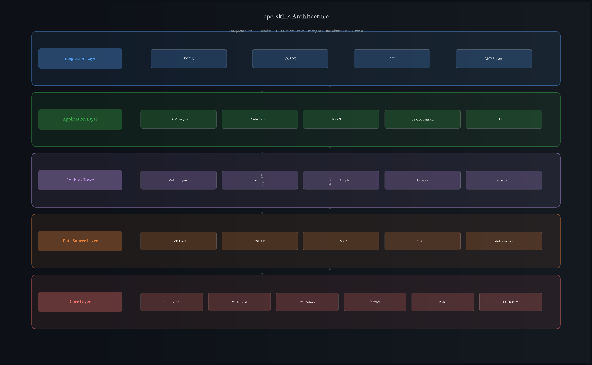
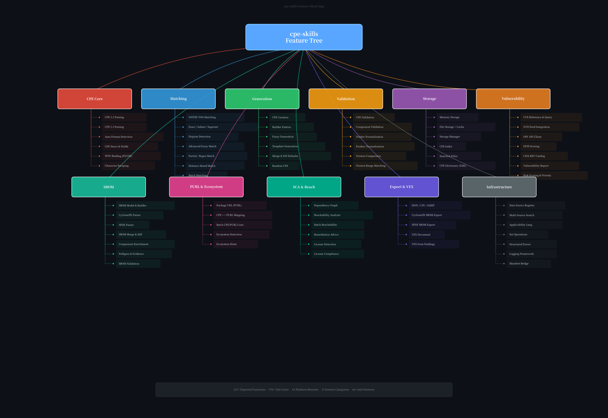

# cpe-skills

> A comprehensive CPE (Common Platform Enumeration) toolkit for cybersecurity — parsing, matching, generation, vulnerability correlation, SBOM, and beyond.

<div align="center">

[](https://pkg.go.dev/github.com/scagogogo/cpe-skills)
[](https://goreportcard.com/report/github.com/scagogogo/cpe-skills)
[](https://github.com/scagogogo/cpe-skills)
[](LICENSE)
[](https://github.com/scagogogo/cpe-skills/releases)

**[English](README.md) | [简体中文](README_zh.md) | [SKILLS Documentation](SKILLS.md)**

</div>

---

## What Problem Does It Solve?

CPE (Common Platform Enumeration) is the NIST-standard naming scheme (NIST IR 7695/7696) for identifying IT systems, software, and packages — it's the backbone of CVE vulnerability matching, SBOM component tracking, and supply chain security.

**But working with CPE is hard:**

- CPE strings come in two incompatible formats (2.2 URI vs 2.3 Formatted String)
- WFN binding rules are complex with special character escaping
- Name matching requires understanding NISTIR 7696 relation semantics
- Vulnerability correlation demands multi-source data (NVD, OSV, EPSS, KEV)
- SBOM generation and analysis need CPE ↔ PURL bridging
- Risk prioritization requires integrating EPSS scores, KEV status, and reachability

**cpe-skills solves all of this** — it's a single toolkit that provides the full CPE lifecycle from parsing to vulnerability management, with 4 integration paths (SKILLS / Go SDK / CLI / MCP).



---

## Feature Mind Map

A single glance at everything cpe-skills can do:



---

## Quick Start

### SKILLS (One-Click for AI/LLM)

Add to your Claude Code skills configuration:

```
https://github.com/scagogogo/cpe-skills
```

### Go SDK

```bash
go get github.com/scagogogo/cpe-skills
```

### CLI

```bash
go install github.com/scagogogo/cpe-skills/cmd/cpe@latest
```

### MCP

```json
{
  "mcpServers": {
    "cpe-skills": {
      "command": "cpe",
      "args": ["mcp", "serve"]
    }
  }
}
```

---

## Core Capabilities

### CPE Parsing & Formatting

Parse any CPE format — auto-detect CPE 2.2 or 2.3:

```go
c, _ := cpeskills.Parse("cpe:2.3:a:microsoft:windows:10:*:*:*:*:*:*:*")  // auto-detect
c, _ := cpeskills.ParseCpe22("cpe:/a:microsoft:windows:10")               // CPE 2.2
c, _ := cpeskills.ParseCpe23("cpe:2.3:a:microsoft:windows:10:*:*:*:*:*:*:*")  // CPE 2.3

str := cpeskills.FormatCpe23(c)          // → "cpe:2.3:a:..."
str, _ := cpeskills.FormatCPE(c, "2.2")  // → "cpe:/a:..."
```

### CPE Matching (NISTIR 7696)

Full NIST-compliant name matching with advanced options:

```go
// Standard NISTIR 7696 relation matching
matched := cpe1.Match(cpe2)         // exact, subset, superset, disjoint
matched, _ := cpeskills.QuickMatch(str1, str2)

// Advanced matching with configurable options
matched := cpeskills.AdvancedMatchCPE(criteria, target, opts)  // fuzzy, partial, regex, distance
matched := cpeskills.BatchMatchCPEs(criteria, targets)          // batch matching
```

### CPE Generation & Building

Create CPEs from product info, templates, or fluent builder:

```go
c := cpeskills.GenerateCPE("a", "apache", "log4j", "2.14.1")
c := cpeskills.FuzzyGenerateCPE("a", "apache", "log4j", "2.x")
c := cpeskills.GenerateFromTemplate(template, overrides)
c := cpeskills.RandomCPE()

// Fluent builder
built := cpeskills.NewBuilder().
    PartApplication().
    Vendor("apache").
    Product("log4j").
    Version("2.14.1").
    Build()
```

### WFN Binding & Character Escaping

Bidirectional WFN ↔ FS ↔ URI conversion with full NISTIR 7695 escaping:

```go
fs := cpeskills.BindToFS(wfn)           // WFN → Formatted String
wfn, _ := cpeskills.UnbindFS(fs)        // FS → WFN
uri := cpeskills.BindToURI(wfn)         // WFN → URI
fs, _ := cpeskills.ConvertURIToFS(uri)  // URI → FS
```

### Validation & Normalization

Validate CPEs and normalize vendor/product names for consistent matching:

```go
_ = cpeskills.ValidateCPE(cpe)         // full CPE validation
_ = cpeskills.ValidateComponent(val, "vendor")  // component validation

normalized := cpeskills.NormalizeCPE(cpe)           // normalize all fields
normalized := cpeskills.NormalizeVendorName("Apache Software Foundation")  // → "apache"
normalized := cpeskills.NormalizeProductName("apache", "log4j-core")      // → "log4j"

// Version comparison
cmp := cpeskills.CompareVersions("2.14.1", "2.15.0")    // -1, 0, 1
inRange := cpeskills.IsVersionInRange("2.14.1", "2.0", "3.0")  // true
```

### Storage & Index

In-memory and file-based CPE storage with search and indexing:

```go
ms := cpeskills.NewMemoryStorage()                        // in-memory storage
fs, _ := cpeskills.NewFileStorage("/data/cpes", true)     // file storage with cache
mgr := cpeskills.NewStorageManager(primary)               // storage manager

// CPE indexing for fast lookups
idx := cpeskills.NewCPEIndex(cpes)

// CPE Dictionary (XML) parsing
dict, _ := cpeskills.ParseDictionary(reader)
```

---

## Vulnerability Management

### Multi-Source Vulnerability Data

Correlate vulnerabilities across NVD, OSV, EPSS, and CISA KEV:

```go
// Data source configuration
nvd := cpeskills.CreateNVDDataSource(apiKey)
gh := cpeskills.CreateGitHubDataSource(token)
rh := cpeskills.CreateRedHatDataSource()
search := cpeskills.NewMultiSourceSearch([]*cpeskills.VulnDataSource{nvd, gh, rh})

// NVD feed integration
dict, _ := cpeskills.DownloadAndParseCPEDict(options)    // full CPE dictionary
match, _ := cpeskills.DownloadAndParseCPEMatch(options)  // CPE match data

// OSV API (Google Open Source Vulnerabilities)
client := cpeskills.NewOSVClient()
entries, _ := client.Query(purl)                   // query by PURL
batch, _ := client.QueryBatch(purls)               // batch query

// EPSS scoring (Exploit Prediction Scoring System)
epss := cpeskills.NewEPSSClient()
entry, _ := epss.GetEPSS("CVE-2021-44228")
risk := cpeskills.EPSSScoreToRiskFactor(entry.EPSS)     // convert to risk factor

// CISA KEV (Known Exploited Vulnerabilities)
kev := cpeskills.NewKEVClient()
entries, _ := kev.GetKEVEntries()
boost := cpeskills.KEVSeverityBoost("medium")            // boost severity for KEV
```

### CVE Operations

```go
cve := cpeskills.NewCVEReference("CVE-2021-44228")
cves := cpeskills.ExtractCVEsFromText("Affected by CVE-2021-44228 and CVE-2021-45105")
grouped := cpeskills.GroupCVEsByYear(cveIDs)
recent := cpeskills.GetRecentCVEs(cveIDs, 2)
valid := cpeskills.ValidateCVE("CVE-2021-44228")
```

### Risk Scoring & Prioritization

```go
scorer := cpeskills.NewDefaultRiskScorer()
scores := cpeskills.ScoreComponents(components, nvdData)
cpeskills.SortByRisk(scores)                             // sort by risk score
critical := cpeskills.FilterByPriority(scores, cpeskills.RiskCritical)
```

---

## SBOM & Supply Chain

### SBOM Model

Create and manage Software Bill of Materials:

```go
sbom := cpeskills.NewSBOM(cpeskills.SBOMFormatCycloneDX, "my-app")
comp := cpeskills.NewSBOMComponent("log4j", "2.14.1")
comp.CPE = "cpe:2.3:a:apache:log4j:2.14.1:*:*:*:*:*:*:*"
sbom.Components = append(sbom.Components, comp)
```

### SBOM Parsing

Parse industry-standard SBOM formats:

```go
sbom, _ := cpeskills.ParseCycloneDXJSON(data)  // CycloneDX JSON
sbom, _ := cpeskills.ParseSPDXJSON(data)        // SPDX JSON
```

### SBOM Operations

```go
merged, _ := cpeskills.MergeSBOMs(sboms, format, name)  // merge multiple SBOMs
diff := cpeskills.DiffSBOMs(oldSBOM, newSBOM)           // diff two SBOMs

// Enrichment
cpeskills.EnrichComponentWithPedigree(comp, pedigree)
cpeskills.EnrichComponentWithEvidence(comp, evidence)
cpeskills.SetComponentCopyright(comp, "Copyright 2024")

// Filtering & sorting
cpeskills.SortComponentsByName(components)
cpeskills.SortComponentsByRisk(components, nvdData)
filtered := cpeskills.FilterComponentsByEcosystem(components, cpeskills.EcosystemMaven)
deduped := cpeskills.DeduplicateComponents(components)
issues := cpeskills.ValidateSBOM(sbom)
```

### CPE ↔ PURL Mapping

Bridge between CPE and Package URL ecosystems:

```go
purl, confidence, _ := cpeskills.CPEToPURL(cpe)          // CPE → PURL
cpe, confidence, _ := cpeskills.PURLToCPE(purl)         // PURL → CPE
purl, _ := cpeskills.MapCPEToPURLWithEcosystem(cpe, eco) // with ecosystem hint

// Batch conversion
purlMap := cpeskills.BatchCPEToPURL(cpes)
cpeMap := cpeskills.BatchPURLToCPE(purls)
```

### Dependency Graph & Reachability

```go
graph := cpeskills.NewDependencyGraph()
graph.AddNode(node)
graph.AddDependency(parent, child)

// Reachability analysis
analyzer := cpeskills.NewDependencyGraphReachabilityAnalyzer()
result := cpeskills.QuickReachabilityCheck(graph, component, finding)
batch := cpeskills.BatchReachabilityAnalysis(graphs, findings)
actionable := cpeskills.GetActionableFindings(results)
summary := cpeskills.SummarizeReachability(results)
```

### License Compliance

```go
license := cpeskills.DetectLicense(component)
compliance := cpeskills.CheckLicenseCompliance(component, policy)

// Batch compliance checking
results := cpeskills.BatchCheckLicenseCompliance(components, policy)
nonCompliant := cpeskills.GetNonCompliantComponents(results)
```

### Remediation Advice

```go
advice := cpeskills.FindRemediation(component, findings)
// advice contains: fixed version, upgrade path, severity context
```

---

## Export & VEX

### Multi-Format Export

```go
json, _ := cpeskills.ExportToJSON(report)                  // JSON export
csv, _ := cpeskills.ExportToCSV(reports)                    // CSV export
sarif, _ := cpeskills.ExportToSARIF(reports)                // SARIF export

// SBOM format export
cdx, _ := cpeskills.ExportSBOMToCycloneDX(sbom)             // CycloneDX
spdx, _ := cpeskills.ExportSBOMToSPDX(sbom)                // SPDX

// Generic export with format selection
data, _ := cpeskills.ExportVulnerabilityReport(report, cpeskills.ExportFormatJSON)
```

### VEX (Vulnerability Exploitability eXchange)

```go
doc := cpeskills.NewVEXDocument("cyclonedx", "product-1", "My App", "security-team")
stmt := cpeskills.NewVEXStatement("CVE-2021-44228", "product-1", cpeskills.VEXStatusNotAffected)
doc.Statements = append(doc.Statements, stmt)

// Generate VEX from vulnerability findings
vex := cpeskills.GenerateVEXFromFindings(component, findings, "product-1")

// Apply VEX status to filter findings
filtered := cpeskills.ApplyVEXToFindings(findings, vex)

// Merge multiple VEX documents
merged := cpeskills.MergeVEXDocuments(docs)
```

---

## Infrastructure

### Applicability Language

CPE applicability expressions with AND/OR/NOT logic:

```go
expr, _ := cpeskills.ParseExpression("cpe:2.3:a:apache:log4j:* AND cpe:2.3:a:apache:tomcat:*")
filtered := cpeskills.FilterCPEs(cpes, expr)
```

### Set Operations

```go
set := cpeskills.NewCPESet("name", "description")
set.Union(other)
set.Intersection(other)
set.Difference(other)
```

### Structured Errors

```go
err := cpeskills.NewParsingError(cpeStr, cause)
if cpeskills.IsParsingError(err) { /* handle parsing error */ }
if cpeskills.IsInvalidFormatError(err) { /* handle format error */ }
```

### Logging

```go
cpeskills.SetLogger(cpeskills.NewDefaultLogger(os.Stdout, cpeskills.LogLevelInfo))
cpeskills.LogInfo("message", "key", "value")
cpeskills.SetLogger(cpeskills.NewNopLogger())  // disable logging
```

### Manifest Bridge

Parse lockfile/manifest files into SBOM components:

```go
components, _ := cpeskills.ParseManifestFile("go.sum", content)
sbom, _ := cpeskills.BuildSBOMFromManifest("go.sum", content, "my-app")
```

### Batch Operations

```go
scanner := cpeskills.NewBatchScanner(index, 10)  // concurrent scanning
results := cpeskills.BatchMatchCPEs(criteria, targets)
purlResults := cpeskills.BatchMatchPURLs(purls, cpes)
cveResults, _ := cpeskills.BatchQueryCVEs(cveIDs, sources)
```

---

## Integration Methods

### 1. SKILLS (Recommended for AI/LLM)

SKILLS provides a natural language interface for CPE operations. Add to your AI skills configuration:

```
https://github.com/scagogogo/cpe-skills
```

Once configured, you can ask your AI assistant to:
- Parse and validate CPE strings
- Match CPEs against patterns
- Generate CPE from product information
- Query CVE-CPE relationships
- Build and analyze SBOMs
- Export vulnerability reports

### 2. Go SDK

```go
package main

import (
    "fmt"
    cpeskills "github.com/scagogogo/cpe-skills"
)

func main() {
    // Parse any CPE format
    c, _ := cpeskills.Parse("cpe:2.3:a:microsoft:windows:10:*:*:*:*:*:*:*")
    fmt.Printf("Vendor: %s, Product: %s\n", c.Vendor, c.ProductName)

    // Quick match two CPEs
    matched, _ := cpeskills.QuickMatch(
        "cpe:2.3:a:apache:log4j:2.14.1:*:*:*:*:*:*:*",
        "cpe:2.3:a:apache:log4j:2.14.1:*:*:*:*:*:*:*",
    )
    fmt.Println("Matched:", matched)

    // Builder pattern
    built := cpeskills.NewBuilder().
        PartApplication().
        Vendor("apache").
        Product("log4j").
        Version("2.14.1").
        Build()

    // Convenience functions
    c2 := cpeskills.MustParse("cpe:2.3:a:microsoft:windows:10:*:*:*:*:*:*:*")
    apps := cpeskills.FilterByPart(allCPEs, cpeskills.PartApplication)
}
```

### 3. CLI

```bash
# Install
go install github.com/scagogogo/cpe-skills/cmd/cpe@latest
# Or download binary from https://github.com/scagogogo/cpe-skills/releases

# Parse a CPE
cpe parse "cpe:2.3:a:microsoft:windows:10:*:*:*:*:*:*:*"

# Match two CPEs
cpe match "cpe:2.3:a:apache:log4j:2.14.1:*:*:*:*:*:*:*" \
          "cpe:2.3:a:apache:log4j:2.14.1:*:*:*:*:*:*:*"

# Search CPEs
cpe search --vendor apache --product log4j
```

### 4. MCP (Model Context Protocol)

Use cpe-skills as an MCP server for AI-powered workflows:

```json
{
  "mcpServers": {
    "cpe-skills": {
      "command": "cpe",
      "args": ["mcp", "serve"]
    }
  }
}
```

This enables AI assistants to perform CPE operations through the standardized MCP protocol.

---

## Convenience API

Quick helpers for common operations:

```go
c := cpeskills.MustParse(str)                              // panic on error
c := cpeskills.ParseOr(str, defaultCPE)                    // fallback on error
apps := cpeskills.FilterByPart(cpes, cpeskills.PartApplication)  // filter by part
byVendor := cpeskills.FilterByVendor(cpes, "apache")       // filter by vendor
byProduct := cpeskills.FilterByProduct(cpes, "log4j")      // filter by product
strs := cpeskills.CPEsToStrings(cpes)                      // batch convert to strings
cpes := cpeskills.StringsToCPEs(strs)                      // batch parse from strings
c := cpeskills.Clone(cpe)                                  // deep copy
is22 := cpeskills.IsCPE22String(str)                       // format detection
is23 := cpeskills.IsCPE23String(str)                       // format detection
```

---

## Supported Platforms

| OS | Architectures |
|----|---------------|
| Linux | 386, amd64, arm64, arm (5/6/7), mips, mips64, mipsle, mips64le, ppc64, ppc64le, riscv64, s390x, loong64 |
| macOS | amd64, arm64 (Apple Silicon) |
| Windows | 386, amd64, arm64 |
| FreeBSD | 386, amd64, arm64, arm |
| OpenBSD | 386, amd64, arm64, arm |
| NetBSD | 386, amd64, arm64, arm |
| Illumos | amd64 |
| Solaris | amd64 |
| AIX | ppc64 |

---

## Project Stats

- **327+** exported functions
- **976+** test cases
- **91.6%** test coverage
- **44** platform binaries per release
- **11** feature categories
- **66+** sub-features

---

## Contributing

Contributions are welcome! Please feel free to submit a Pull Request.

## License

This project is licensed under the MIT License — see the [LICENSE](LICENSE) file for details.
