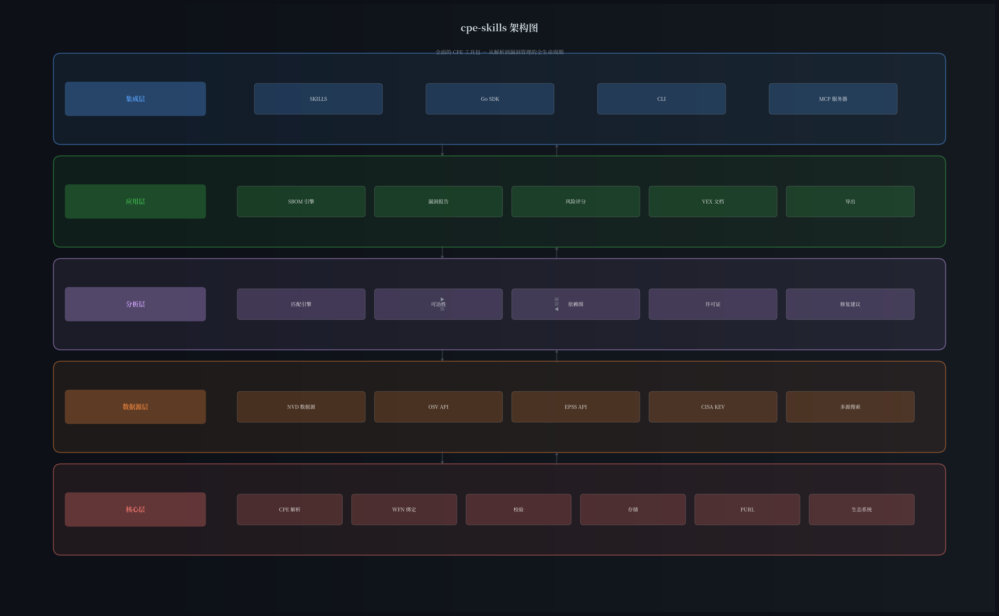
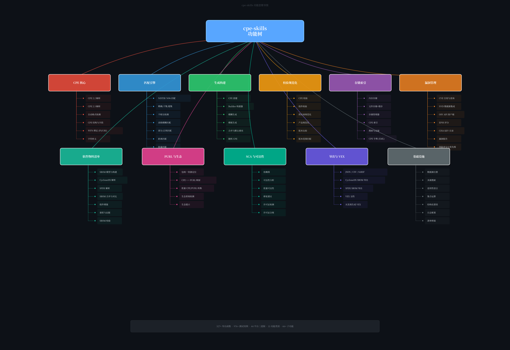

# cpe-skills

> 全面的网络安全 CPE（通用平台枚举）工具包 — 解析、匹配、生成、漏洞关联、SBOM 及更多能力。

<div align="center">

[](https://pkg.go.dev/github.com/scagogogo/cpe-skills)
[](https://goreportcard.com/report/github.com/scagogogo/cpe-skills)
[](https://github.com/scagogogo/cpe-skills)
[](LICENSE)
[](https://github.com/scagogogo/cpe-skills/releases)

**[English](README.md) | [简体中文](README_zh.md) | [SKILLS 文档](SKILLS.md)**

</div>

---

## 解决了什么问题？

CPE（通用平台枚举）是 NIST 标准的命名方案（NIST IR 7695/7696），用于标识 IT 系统、软件和软件包 — 它是 CVE 漏洞匹配、SBOM 组件追踪和供应链安全的基础。

**但使用 CPE 很困难：**

- CPE 字符串有两种不兼容的格式（2.2 URI 与 2.3 格式化字符串）
- WFN 绑定规则复杂，涉及特殊字符转义
- 名称匹配需要理解 NISTIR 7696 关系语义（精确、子集、超集、不相交）
- 漏洞关联需要多源数据（NVD、OSV、EPSS、KEV）
- SBOM 生成和分析需要 CPE ↔ PURL 桥接
- 风险优先级排序需要整合 EPSS 评分、KEV 状态和可达性分析

**cpe-skills 解决了所有这些问题** — 它是一个单一工具包，提供从解析到漏洞管理的完整 CPE 生命周期，支持 4 种接入方式（SKILLS / Go SDK / CLI / MCP）。



---

## 功能思维导图

一眼看懂 cpe-skills 的全部能力：



---

## 快速开始

### SKILLS（一键接入 AI/LLM）

添加到你的 Claude Code skills 配置中：

```
https://github.com/scagogogo/cpe-skills
```

### Go SDK

```bash
go get github.com/scagogogo/cpe-skills
```

### CLI

```bash
go install github.com/scagogogo/cpe-skills/cmd/cpe@latest
```

### MCP

```json
{
  "mcpServers": {
    "cpe-skills": {
      "command": "cpe",
      "args": ["mcp", "serve"]
    }
  }
}
```

---

## 核心能力

### CPE 解析与格式化

解析任意 CPE 格式 — 自动检测 CPE 2.2 或 2.3：

```go
c, _ := cpeskills.Parse("cpe:2.3:a:microsoft:windows:10:*:*:*:*:*:*:*")  // 自动检测
c, _ := cpeskills.ParseCpe22("cpe:/a:microsoft:windows:10")               // CPE 2.2
c, _ := cpeskills.ParseCpe23("cpe:2.3:a:microsoft:windows:10:*:*:*:*:*:*:*")  // CPE 2.3

str := cpeskills.FormatCpe23(c)          // → "cpe:2.3:a:..."
str, _ := cpeskills.FormatCPE(c, "2.2")  // → "cpe:/a:..."
```

### CPE 匹配（NISTIR 7696）

完整的 NIST 合规名称匹配，支持高级选项：

```go
// 标准 NISTIR 7696 关系匹配
matched := cpe1.Match(cpe2)         // 精确、子集、超集、不相交
matched, _ := cpeskills.QuickMatch(str1, str2)

// 高级匹配，支持可配置选项
matched := cpeskills.AdvancedMatchCPE(criteria, target, opts)  // 模糊、部分、正则、距离
matched := cpeskills.BatchMatchCPEs(criteria, targets)          // 批量匹配
```

### CPE 生成与构建

从产品信息、模板或流式构建器创建 CPE：

```go
c := cpeskills.GenerateCPE("a", "apache", "log4j", "2.14.1")
c := cpeskills.FuzzyGenerateCPE("a", "apache", "log4j", "2.x")
c := cpeskills.GenerateFromTemplate(template, overrides)
c := cpeskills.RandomCPE()

// 流式构建器
built := cpeskills.NewBuilder().
    PartApplication().
    Vendor("apache").
    Product("log4j").
    Version("2.14.1").
    Build()
```

### WFN 绑定与字符转义

WFN ↔ FS ↔ URI 双向转换，支持完整 NISTIR 7695 转义规则：

```go
fs := cpeskills.BindToFS(wfn)           // WFN → 格式化字符串
wfn, _ := cpeskills.UnbindFS(fs)        // FS → WFN
uri := cpeskills.BindToURI(wfn)         // WFN → URI
fs, _ := cpeskills.ConvertURIToFS(uri)  // URI → FS
```

### 校验与规范化

校验 CPE 并规范化供应商/产品名称，确保一致的匹配结果：

```go
_ = cpeskills.ValidateCPE(cpe)         // 完整 CPE 校验
_ = cpeskills.ValidateComponent(val, "vendor")  // 组件校验

normalized := cpeskills.NormalizeCPE(cpe)           // 规范化所有字段
normalized := cpeskills.NormalizeVendorName("Apache Software Foundation")  // → "apache"
normalized := cpeskills.NormalizeProductName("apache", "log4j-core")      // → "log4j"

// 版本比较
cmp := cpeskills.CompareVersions("2.14.1", "2.15.0")    // -1, 0, 1
inRange := cpeskills.IsVersionInRange("2.14.1", "2.0", "3.0")  // true
```

### 存储与索引

内存和文件 CPE 存储，支持搜索和索引：

```go
ms := cpeskills.NewMemoryStorage()                        // 内存存储
fs, _ := cpeskills.NewFileStorage("/data/cpes", true)     // 文件存储 + 缓存
mgr := cpeskills.NewStorageManager(primary)               // 存储管理器

// CPE 索引，快速查找
idx := cpeskills.NewCPEIndex(cpes)

// CPE 字典（XML）解析
dict, _ := cpeskills.ParseDictionary(reader)
```

---

## 漏洞管理

### 多源漏洞数据

在 NVD、OSV、EPSS 和 CISA KEV 之间关联漏洞信息：

```go
// 数据源配置
nvd := cpeskills.CreateNVDDataSource(apiKey)
gh := cpeskills.CreateGitHubDataSource(token)
rh := cpeskills.CreateRedHatDataSource()
search := cpeskills.NewMultiSourceSearch([]*cpeskills.VulnDataSource{nvd, gh, rh})

// NVD 数据源集成
dict, _ := cpeskills.DownloadAndParseCPEDict(options)    // 完整 CPE 字典
match, _ := cpeskills.DownloadAndParseCPEMatch(options)  // CPE 匹配数据

// OSV API（Google 开源漏洞）
client := cpeskills.NewOSVClient()
entries, _ := client.Query(purl)                   // 按 PURL 查询
batch, _ := client.QueryBatch(purls)               // 批量查询

// EPSS 评分（漏洞利用预测评分系统）
epss := cpeskills.NewEPSSClient()
entry, _ := epss.GetEPSS("CVE-2021-44228")
risk := cpeskills.EPSSScoreToRiskFactor(entry.EPSS)     // 转换为风险因子

// CISA KEV（已知被利用漏洞）
kev := cpeskills.NewKEVClient()
entries, _ := kev.GetKEVEntries()
boost := cpeskills.KEVSeverityBoost("medium")            // KEV 严重性提升
```

### CVE 操作

```go
cve := cpeskills.NewCVEReference("CVE-2021-44228")
cves := cpeskills.ExtractCVEsFromText("受 CVE-2021-44228 和 CVE-2021-45105 影响")
grouped := cpeskills.GroupCVEsByYear(cveIDs)
recent := cpeskills.GetRecentCVEs(cveIDs, 2)
valid := cpeskills.ValidateCVE("CVE-2021-44228")
```

### 风险评分与优先级排序

```go
scorer := cpeskills.NewDefaultRiskScorer()
scores := cpeskills.ScoreComponents(components, nvdData)
cpeskills.SortByRisk(scores)                             // 按风险评分排序
critical := cpeskills.FilterByPriority(scores, cpeskills.RiskCritical)
```

---

## SBOM 与供应链

### SBOM 模型

创建和管理软件物料清单：

```go
sbom := cpeskills.NewSBOM(cpeskills.SBOMFormatCycloneDX, "my-app")
comp := cpeskills.NewSBOMComponent("log4j", "2.14.1")
comp.CPE = "cpe:2.3:a:apache:log4j:2.14.1:*:*:*:*:*:*:*"
sbom.Components = append(sbom.Components, comp)
```

### SBOM 解析

解析行业标准 SBOM 格式：

```go
sbom, _ := cpeskills.ParseCycloneDXJSON(data)  // CycloneDX JSON
sbom, _ := cpeskills.ParseSPDXJSON(data)        // SPDX JSON
```

### SBOM 操作

```go
merged, _ := cpeskills.MergeSBOMs(sboms, format, name)  // 合并多个 SBOM
diff := cpeskills.DiffSBOMs(oldSBOM, newSBOM)           // 对比两个 SBOM

// 增强功能
cpeskills.EnrichComponentWithPedigree(comp, pedigree)
cpeskills.EnrichComponentWithEvidence(comp, evidence)
cpeskills.SetComponentCopyright(comp, "Copyright 2024")

// 过滤与排序
cpeskills.SortComponentsByName(components)
cpeskills.SortComponentsByRisk(components, nvdData)
filtered := cpeskills.FilterComponentsByEcosystem(components, cpeskills.EcosystemMaven)
deduped := cpeskills.DeduplicateComponents(components)
issues := cpeskills.ValidateSBOM(sbom)
```

### CPE ↔ PURL 映射

桥接 CPE 与 Package URL 生态：

```go
purl, confidence, _ := cpeskills.CPEToPURL(cpe)          // CPE → PURL
cpe, confidence, _ := cpeskills.PURLToCPE(purl)         // PURL → CPE
purl, _ := cpeskills.MapCPEToPURLWithEcosystem(cpe, eco) // 带生态提示

// 批量转换
purlMap := cpeskills.BatchCPEToPURL(cpes)
cpeMap := cpeskills.BatchPURLToCPE(purls)
```

### 依赖图与可达性

```go
graph := cpeskills.NewDependencyGraph()
graph.AddNode(node)
graph.AddDependency(parent, child)

// 可达性分析
analyzer := cpeskills.NewDependencyGraphReachabilityAnalyzer()
result := cpeskills.QuickReachabilityCheck(graph, component, finding)
batch := cpeskills.BatchReachabilityAnalysis(graphs, findings)
actionable := cpeskills.GetActionableFindings(results)
summary := cpeskills.SummarizeReachability(results)
```

### 许可证合规

```go
license := cpeskills.DetectLicense(component)
compliance := cpeskills.CheckLicenseCompliance(component, policy)

// 批量合规检查
results := cpeskills.BatchCheckLicenseCompliance(components, policy)
nonCompliant := cpeskills.GetNonCompliantComponents(results)
```

### 修复建议

```go
advice := cpeskills.FindRemediation(component, findings)
// advice 包含：修复版本、升级路径、严重性上下文
```

---

## 导出与 VEX

### 多格式导出

```go
json, _ := cpeskills.ExportToJSON(report)                  // JSON 导出
csv, _ := cpeskills.ExportToCSV(reports)                    // CSV 导出
sarif, _ := cpeskills.ExportToSARIF(reports)                // SARIF 导出

// SBOM 格式导出
cdx, _ := cpeskills.ExportSBOMToCycloneDX(sbom)             // CycloneDX
spdx, _ := cpeskills.ExportSBOMToSPDX(sbom)                // SPDX

// 通用导出，选择格式
data, _ := cpeskills.ExportVulnerabilityReport(report, cpeskills.ExportFormatJSON)
```

### VEX（漏洞可利用性交换）

```go
doc := cpeskills.NewVEXDocument("cyclonedx", "product-1", "My App", "security-team")
stmt := cpeskills.NewVEXStatement("CVE-2021-44228", "product-1", cpeskills.VEXStatusNotAffected)
doc.Statements = append(doc.Statements, stmt)

// 从漏洞发现生成 VEX
vex := cpeskills.GenerateVEXFromFindings(component, findings, "product-1")

// 应用 VEX 状态过滤发现
filtered := cpeskills.ApplyVEXToFindings(findings, vex)

// 合并多个 VEX 文档
merged := cpeskills.MergeVEXDocuments(docs)
```

---

## 基础设施

### 适用性语言

CPE 适用性表达式，支持 AND/OR/NOT 逻辑：

```go
expr, _ := cpeskills.ParseExpression("cpe:2.3:a:apache:log4j:* AND cpe:2.3:a:apache:tomcat:*")
filtered := cpeskills.FilterCPEs(cpes, expr)
```

### 集合操作

```go
set := cpeskills.NewCPESet("name", "description")
set.Union(other)
set.Intersection(other)
set.Difference(other)
```

### 结构化错误

```go
err := cpeskills.NewParsingError(cpeStr, cause)
if cpeskills.IsParsingError(err) { /* 处理解析错误 */ }
if cpeskills.IsInvalidFormatError(err) { /* 处理格式错误 */ }
```

### 日志框架

```go
cpeskills.SetLogger(cpeskills.NewDefaultLogger(os.Stdout, cpeskills.LogLevelInfo))
cpeskills.LogInfo("message", "key", "value")
cpeskills.SetLogger(cpeskills.NewNopLogger())  // 禁用日志
```

### 清单桥接

解析 lockfile/manifest 文件为 SBOM 组件：

```go
components, _ := cpeskills.ParseManifestFile("go.sum", content)
sbom, _ := cpeskills.BuildSBOMFromManifest("go.sum", content, "my-app")
```

### 批量操作

```go
scanner := cpeskills.NewBatchScanner(index, 10)  // 并发扫描
results := cpeskills.BatchMatchCPEs(criteria, targets)
purlResults := cpeskills.BatchMatchPURLs(purls, cpes)
cveResults, _ := cpeskills.BatchQueryCVEs(cveIDs, sources)
```

---

## 接入方式

### 1. SKILLS（推荐用于 AI/LLM）

SKILLS 提供自然语言接口用于 CPE 操作。添加到你的 AI skills 配置中：

```
https://github.com/scagogogo/cpe-skills
```

配置完成后，你可以让 AI 助手：
- 解析和校验 CPE 字符串
- 将 CPE 与模式匹配
- 从产品信息生成 CPE
- 查询 CVE-CPE 关系
- 构建和分析 SBOM
- 导出漏洞报告

### 2. Go SDK

```go
package main

import (
    "fmt"
    cpeskills "github.com/scagogogo/cpe-skills"
)

func main() {
    // 解析任意 CPE 格式
    c, _ := cpeskills.Parse("cpe:2.3:a:microsoft:windows:10:*:*:*:*:*:*:*")
    fmt.Printf("供应商: %s, 产品: %s\n", c.Vendor, c.ProductName)

    // 快速匹配两个 CPE
    matched, _ := cpeskills.QuickMatch(
        "cpe:2.3:a:apache:log4j:2.14.1:*:*:*:*:*:*:*",
        "cpe:2.3:a:apache:log4j:2.14.1:*:*:*:*:*:*:*",
    )
    fmt.Println("匹配结果:", matched)

    // Builder 模式
    built := cpeskills.NewBuilder().
        PartApplication().
        Vendor("apache").
        Product("log4j").
        Version("2.14.1").
        Build()

    // 便捷函数
    c2 := cpeskills.MustParse("cpe:2.3:a:microsoft:windows:10:*:*:*:*:*:*:*")
    apps := cpeskills.FilterByPart(allCPEs, cpeskills.PartApplication)
}
```

### 3. CLI

```bash
# 安装
go install github.com/scagogogo/cpe-skills/cmd/cpe@latest
# 或者从 https://github.com/scagogogo/cpe-skills/releases 下载二进制文件

# 解析 CPE
cpe parse "cpe:2.3:a:microsoft:windows:10:*:*:*:*:*:*:*"

# 匹配两个 CPE
cpe match "cpe:2.3:a:apache:log4j:2.14.1:*:*:*:*:*:*:*" \
          "cpe:2.3:a:apache:log4j:2.14.1:*:*:*:*:*:*:*"

# 搜索 CPE
cpe search --vendor apache --product log4j
```

### 4. MCP（模型上下文协议）

将 cpe-skills 作为 MCP 服务器用于 AI 驱动的工作流：

```json
{
  "mcpServers": {
    "cpe-skills": {
      "command": "cpe",
      "args": ["mcp", "serve"]
    }
  }
}
```

这使 AI 助手能够通过标准化的 MCP 协议执行 CPE 操作。

---

## 便捷 API

常用操作的快捷辅助：

```go
c := cpeskills.MustParse(str)                              // 出错 panic
c := cpeskills.ParseOr(str, defaultCPE)                    // 出错返回默认值
apps := cpeskills.FilterByPart(cpes, cpeskills.PartApplication)  // 按 Part 筛选
byVendor := cpeskills.FilterByVendor(cpes, "apache")       // 按供应商筛选
byProduct := cpeskills.FilterByProduct(cpes, "log4j")      // 按产品筛选
strs := cpeskills.CPEsToStrings(cpes)                      // 批量转换为字符串
cpes := cpeskills.StringsToCPEs(strs)                      // 批量从字符串解析
c := cpeskills.Clone(cpe)                                  // 深拷贝
is22 := cpeskills.IsCPE22String(str)                       // 格式检测
is23 := cpeskills.IsCPE23String(str)                       // 格式检测
```

---

## 支持平台

| 操作系统 | 架构 |
|----------|------|
| Linux | 386, amd64, arm64, arm (5/6/7), mips, mips64, mipsle, mips64le, ppc64, ppc64le, riscv64, s390x, loong64 |
| macOS | amd64, arm64 (Apple Silicon) |
| Windows | 386, amd64, arm64 |
| FreeBSD | 386, amd64, arm64, arm |
| OpenBSD | 386, amd64, arm64, arm |
| NetBSD | 386, amd64, arm64, arm |
| Illumos | amd64 |
| Solaris | amd64 |
| AIX | ppc64 |

---

## 项目统计

- **327+** 导出函数
- **976+** 测试用例
- **91.6%** 测试覆盖率
- **44** 平台二进制文件（每次发布）
- **11** 功能类别
- **66+** 子功能

---

## 贡献

欢迎贡献！请随时提交 Pull Request。

## 许可证

本项目采用 MIT 许可证 — 详见 [LICENSE](LICENSE) 文件。
