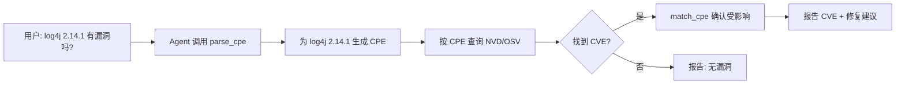
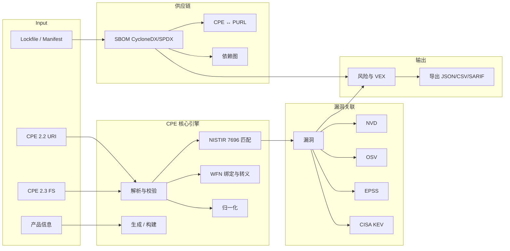
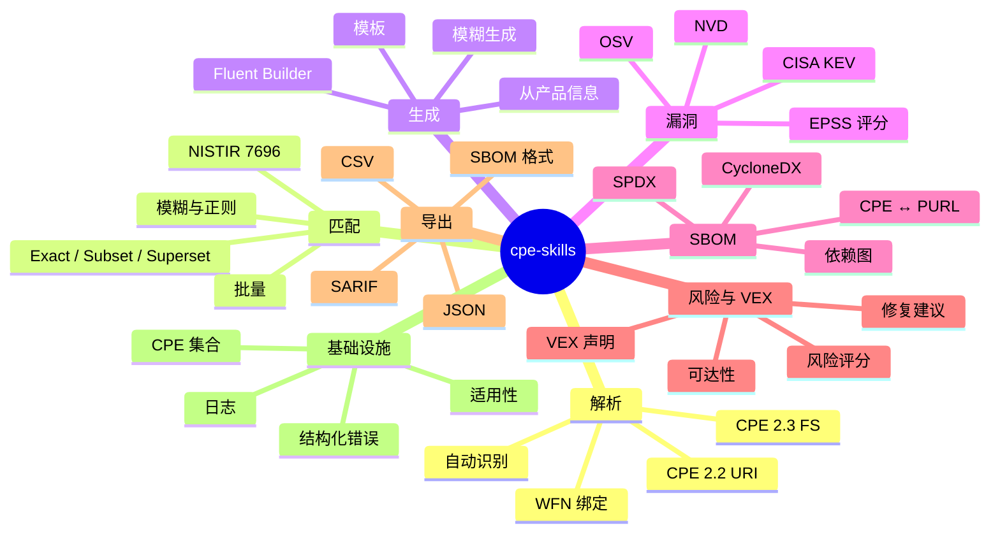

# cpe-skills

> 全面的网络安全 CPE（通用平台枚举）工具包 —— 解析、匹配、生成、漏洞关联、SBOM 及更多能力。**AI 原生**：专为 AI Agent 通过 SKILLS、Go SDK、CLI、MCP 直接消费而设计。

<div align="center">

[](https://pkg.go.dev/github.com/scagogogo/cpe-skills)
[](https://goreportcard.com/report/github.com/scagogogo/cpe-skills)
[](https://github.com/scagogogo/cpe-skills/actions)
[](https://github.com/scagogogo/cpe-skills/actions)
[](https://github.com/scagogogo/cpe-skills/releases)
[](LICENSE)
[](https://github.com/scagogogo/cpe-skills/releases)
[](#mcp)

**[官网](https://scagogogo.github.io/cpe-skills/) · [English](README.md) · [SKILLS](SKILLS.md) · [文档](https://scagogogo.github.io/cpe-skills/zh/) · [发布](https://github.com/scagogogo/cpe-skills/releases)**

</div>

---

<!-- AI-SUMMARY-START -->

> 🤖 **本区块为机器可消费的结构化摘要。** AI Agent 可直接提取项目元数据、集成方式、能力与入口函数。以下内容均与源码核对，无任何愿景性功能。

| 字段 | 值 |
|------|-----|
| **项目** | cpe-skills |
| **一句话定位** | CPE（通用平台枚举）工具包 —— 解析、匹配、生成、漏洞关联、SBOM、VEX。 |
| **语言** | Go（`module github.com/scagogogo/cpe-skills`，要求 **Go ≥ 1.23**） |
| **MCP SDK** | `github.com/modelcontextprotocol/go-sdk` v1.0.0 |
| **覆盖率** | ≥ 91%（CI 对主包门槛 90%） |
| **测试用例** | 1258 |
| **导出符号** | ~1470 |
| **平台** | 每次发布 108 个预编译二进制 —— 9 个操作系统 × 13 种架构 |
| **许可证** | MIT |
| **官网** | https://scagogogo.github.io/cpe-skills/ |
| **仓库** | https://github.com/scagogogo/cpe-skills |
| **API 稳定性** | 包级 API 稳定；跨小版本函数为增量式、向后兼容。 |

### 集成方式（4 条路径 —— 均已实现）

| 路径 | 适用场景 | 安装 / 配置 | 入口 |
|------|----------|-------------|------|
| **SKILLS** | AI / LLM Agent | `https://github.com/scagogogo/cpe-skills` | [SKILLS.md](SKILLS.md) |
| **Go SDK** | Go 应用 | `go get github.com/scagogogo/cpe-skills` | `cpeskills.Parse` |
| **CLI** | Shell / CI / 脚本 | `go install github.com/scagogogo/cpe-skills/cmd/cpe@latest` | `cpe parse/match/search/dict` |
| **MCP** | 兼容 MCP 的 AI 客户端 | `command: cpe`, `args: ["mcp", "serve"]` | `cpe mcp serve`（6 个工具） |

### MCP 工具（由 `cpe mcp serve` 暴露）

`parse_cpe` · `format_cpe` · `match_cpe` · `validate_cpe` · `generate_cpe` · `compare_versions`

### 能力（11 类）→ 入口函数

| 类别 | 入口函数 |
|------|---------|
| **解析** | `Parse`, `ParseCpe22`, `ParseCpe23`, `MustParse` |
| **匹配（NISTIR 7696）** | `Match`, `MatchCPE`, `QuickMatch`, `AdvancedMatchCPE`, `BatchMatchCPEs` |
| **生成与构建** | `GenerateCPE`, `FuzzyGenerateCPE`, `NewBuilder`, `RandomCPE` |
| **WFN 绑定与转义** | `BindToFS`, `BindToURI`, `UnbindFS`, `FromCPE` |
| **校验与归一化** | `ValidateCPE`, `NormalizeCPE`, `NormalizeVendorName`, `NormalizeProductName` |
| **存储与索引** | `NewMemoryStorage`, `NewFileStorage`, `NewCPEIndex`, `ParseDictionary` |
| **漏洞关联** | `CreateNVDDataSource`, `NewOSVClient`, `NewEPSSClient`, `NewKEVClient` |
| **SBOM 与 PURL** | `NewSBOM`, `ParseCycloneDXJSON`, `ParseSPDXJSON`, `CPEToPURL`, `PURLToCPE` |
| **风险评分与 VEX** | `NewDefaultRiskScorer`, `ScoreComponents`, `NewVEXDocument`, `GenerateVEXFromFindings` |
| **导出** | `ExportToJSON`, `ExportToCSV`, `ExportToSARIF`, `ExportSBOMToCycloneDX` |
| **基础设施** | `NewCPESet`, `ParseExpression`, `NewParsingError`, `SetLogger` |

### 平台矩阵（108 个二进制）

| 操作系统 | 架构 |
|----------|------|
| Linux | 386, amd64, arm64, arm (5/6/7), mips, mips64, mipsle, mips64le, ppc64, ppc64le, riscv64, s390x, loong64 |
| macOS | amd64, arm64 (Apple Silicon) |
| Windows | 386, amd64, arm64 |
| FreeBSD / OpenBSD / NetBSD | 386, amd64, arm64, arm |
| Illumos / Solaris | amd64 |
| AIX | ppc64 |

<!-- AI-SUMMARY-END -->

---

## 快速开始（可直接复制）

### SKILLS —— 面向 AI / LLM

添加到你的 Claude Code skills 配置：

```
https://github.com/scagogogo/cpe-skills
```

### Go SDK

```bash
go get github.com/scagogogo/cpe-skills
```

```go
package main

import (
    "fmt"
    cpeskills "github.com/scagogogo/cpe-skills"
)

func main() {
    // 解析任意 CPE 格式（自动识别 2.2 / 2.3）
    c, _ := cpeskills.Parse("cpe:2.3:a:microsoft:windows:10:*:*:*:*:*:*:*")
    fmt.Printf("Vendor: %s, Product: %s, Version: %s\n", c.Vendor, c.ProductName, c.Version)

    // NISTIR 7696 匹配
    matched, _ := cpeskills.QuickMatch(
        "cpe:2.3:a:apache:log4j:2.14.1:*:*:*:*:*:*:*",
        "cpe:2.3:a:apache:log4j:2.14.1:*:*:*:*:*:*:*",
    )
    fmt.Println("Matched:", matched)
}
```

### CLI

```bash
# 方式 A：通过 Go 安装
go install github.com/scagogogo/cpe-skills/cmd/cpe@latest

# 方式 B：从 Releases 下载你平台的预编译二进制
#         → https://github.com/scagogogo/cpe-skills/releases（108 个平台）

# 方式 C：从源码编译
git clone https://github.com/scagogogo/cpe-skills.git
cd cpe-skills && go build -o cpe ./cmd/cpe

# 用法
cpe parse "cpe:2.3:a:microsoft:windows:10:*:*:*:*:*:*:*"
cpe match "cpe:2.3:a:apache:log4j:2.14.1:*:*:*:*:*:*:*" \
          "cpe:2.3:a:apache:log4j:2.14.1:*:*:*:*:*:*:*"
cpe search --vendor apache --product log4j
```

### MCP

```json
{
  "mcpServers": {
    "cpe-skills": {
      "command": "cpe",
      "args": ["mcp", "serve"]
    }
  }
}
```

连接后，AI 客户端可调用以下工具：
- `parse_cpe {cpe}` — 解析 CPE 为各组件
- `format_cpe {cpe, to}` — 在 2.2/2.3/wfn 间转换
- `match_cpe {criteria, target, ignore_version?}` — NISTIR 7696 匹配
- `validate_cpe {cpe}` — 校验 CPE 字符串
- `generate_cpe {part, vendor, product, version}` — 生成 CPE
- `compare_versions {a, b, min?, max?}` — 比较版本字符串

---

## AI Agent 工作流示例

AI Agent 使用 cpe-skills 分诊脆弱依赖的典型工作流：



作为 Claude Code skills，可用自然语言调用 Agent：
- *"解析这个 CPE 字符串，告诉我厂商/产品/版本"*
- *"检查这个组件的 CPE 是否匹配已知漏洞 CPE"*
- *"为 Apache log4j 2.14.1 生成 CPE"*
- *"把这个 CPE 2.2 字符串转成 2.3 格式"*

---

## 任务配方（面向 AI Agent 的问题驱动代码片段）

### 检测组件是否受某 CVE 影响

```go
c, _ := cpeskills.Parse("cpe:2.3:a:apache:log4j:2.14.1:*:*:*:*:*:*:*")
nvd := cpeskills.CreateNVDDataSource("")
search := cpeskills.NewMultiSourceSearch([]*cpeskills.VulnDataSource{nvd})
findings, _ := search.SearchByCPE(c) // 返回匹配的 CVE
```

### 从 lockfile 生成 SBOM

```go
components, _ := cpeskills.ParseManifestFile("go.sum", content)
sbom, _ := cpeskills.BuildSBOMFromManifest("go.sum", content, "my-app")
json, _ := cpeskills.ExportSBOMToCycloneDX(sbom)
```

### 按风险优先级排序漏洞

```go
scorer := cpeskills.NewDefaultRiskScorer()
scores := cpeskills.ScoreComponents(components, nvdData)
cpeskills.SortByRisk(scores)
critical := cpeskills.FilterByPriority(scores, cpeskills.RiskCritical)
```

### CPE ↔ PURL（包 URL）桥接

```go
purl, confidence, _ := cpeskills.CPEToPURL(cpe)    // CPE → PURL
cpe, confidence, _ := cpeskills.PURLToCPE(purl)    // PURL → CPE
```

### 按版本范围匹配

```go
matched := cpeskills.MatchCPE(criteria, target, &cpeskills.MatchOptions{
    VersionRange: true,
    MinVersion:   "2.0",
    MaxVersion:   "3.0",
})
```

> 更多配方（WFN 转换、VEX、导出、集合、适用性）见[官网指南](https://scagogogo.github.io/cpe-skills/zh/guide/)。

---

## 解决了什么问题？

CPE（通用平台枚举）是 NIST 标准命名方案（NIST IR 7695/7696），用于标识 IT 系统、软件和包 —— 它是 CVE 漏洞匹配、SBOM 组件跟踪和供应链安全的基石。

CPE 很难用：两种不兼容格式（2.2 URI 与 2.3 Formatted String）、复杂的 WFN 绑定规则、多源漏洞数据（NVD、OSV、EPSS、KEV）、以及 SBOM ↔ PURL 桥接。**cpe-skills 解决了这一切** —— 单一工具包覆盖完整 CPE 生命周期，通过 4 条集成路径暴露。

### 架构



### 功能脑图



---

## 文档

完整文档位于**[官网](https://scagogogo.github.io/cpe-skills/)**：

- **[使用指南](https://scagogogo.github.io/cpe-skills/zh/guide/)** — 实用使用示例（解析、匹配、WFN、NVD、SBOM……）
- **[API 参考](https://scagogogo.github.io/cpe-skills/zh/api/)** — 完整 API 文档
- **[SKILLS.md](SKILLS.md)** — AI skills 入口

涵盖每项能力（CPE 解析、高级匹配、漏洞关联、SBOM、VEX、导出等）的完整代码示例，请见官网指南。

---

## 贡献

欢迎贡献！请随时提交 Pull Request。

## 许可证

本项目基于 MIT 许可证 —— 详见 [LICENSE](LICENSE) 文件。
