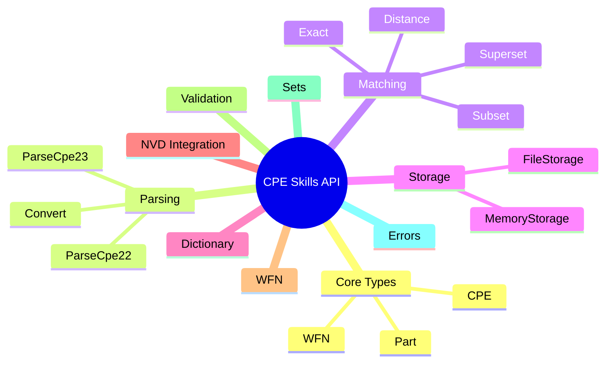

# API Reference

The CPE library provides a comprehensive set of APIs for working with Common Platform Enumeration (CPE) data. This section covers all public types, functions, and interfaces available in the library.

## Overview

The library is organized into several key areas:

- **[Core Types](./types.md)** - Basic data structures and type definitions
- **[Parsing](./parsing.md)** - Functions for parsing CPE strings
- **[Matching](./matching.md)** - CPE matching and comparison functions
- **[Storage](./storage.md)** - Data persistence interfaces and implementations
- **[Dictionary](./dictionary.md)** - CPE dictionary management
- **[NVD Integration](./nvd.md)** - National Vulnerability Database integration
- **[WFN](./wfn.md)** - Well-Formed Name format support
- **[Validation](./validation.md)** - CPE validation functions
- **[Sets](./sets.md)** - CPE set operations
- **[Errors](./errors.md)** - Error types and handling

The following mind map gives a bird's-eye view of how the API modules are organized:



## Quick Reference

### Core Functions

```go
// Parse CPE strings
func ParseCpe23(cpe23 string) (*CPE, error)
func ParseCpe22(cpe22 string) (*CPE, error)

// Format CPE strings
func FormatCpe23(cpe *CPE) string
func FormatCpe22(cpe *CPE) string

// Match CPEs
func (x *CPE) Match(other *CPE) bool
func MatchCPE(criteria *CPE, target *CPE, options *MatchOptions) bool
func AdvancedMatchCPE(criteria *CPE, target *CPE, options *AdvancedMatchOptions) bool

// Storage operations
func NewFileStorage(baseDir string, useCache bool) (*FileStorage, error)
func NewMemoryStorage() *MemoryStorage
```

### Core Types

```go
type CPE struct {
    Cpe23           string
    Part            Part
    Vendor          Vendor
    ProductName     Product
    Version         Version
    Update          Update
    Edition         Edition
    Language        Language
    SoftwareEdition string
    TargetSoftware  string
    TargetHardware  string
    Other           string
    Cve             string
    Url             string
}

type Part struct {
    ShortName   string
    LongName    string
    Description string
}
```

## Installation

```bash
go get github.com/scagogogo/cpe-skills
```

## Import

```go
import "github.com/scagogogo/cpe-skills"
```

## Basic Usage

```go
package main

import (
    "fmt"
    "log"
    "github.com/scagogogo/cpe-skills"
)

func main() {
    // Parse a CPE string
    cpeObj, err := cpeskills.ParseCpe23("cpe:2.3:a:microsoft:windows:10:*:*:*:*:*:*:*")
    if err != nil {
        log.Fatal(err)
    }
    
    // Access CPE components
    fmt.Printf("Part: %s\n", cpeObj.Part.LongName)
    fmt.Printf("Vendor: %s\n", cpeObj.Vendor)
    fmt.Printf("Product: %s\n", cpeObj.ProductName)
    fmt.Printf("Version: %s\n", cpeObj.Version)
    
    // Match with another CPE
    pattern, _ := cpeskills.ParseCpe23("cpe:2.3:a:microsoft:*:*:*:*:*:*:*:*:*")
    if pattern.Match(cpeObj) {
        fmt.Println("CPE matches the pattern")
    }
}
```

## Next Steps

- Explore the [Core Types](./types.md) to understand the data structures
- Learn about [Parsing](./parsing.md) CPE strings
- Discover [Matching](./matching.md) capabilities
- Check out practical [Examples](/en/guide/)
