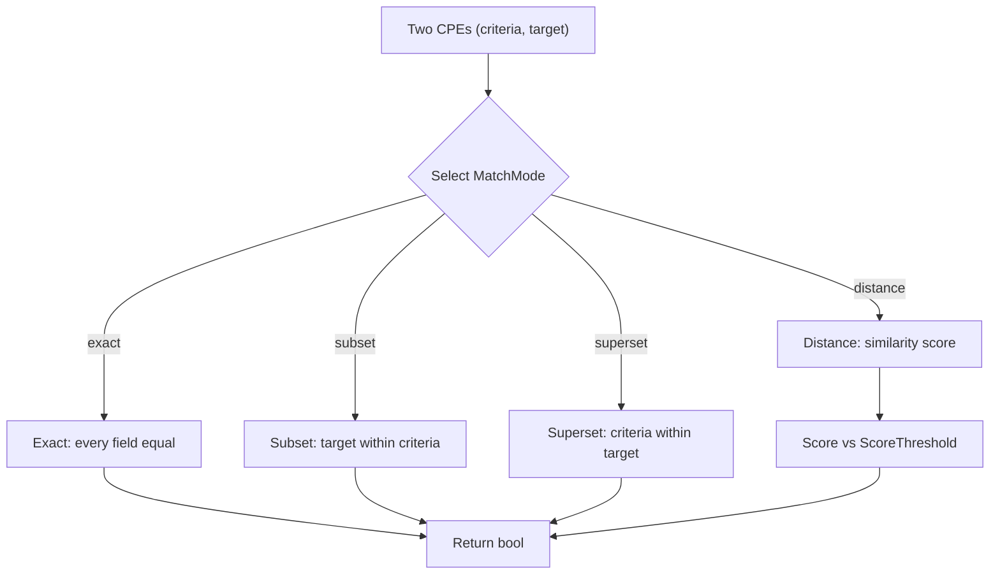

# Matching

The CPE library provides sophisticated matching capabilities for comparing CPE objects, including basic matching, advanced matching with various algorithms, and version comparison.

The flowchart below shows the advanced matching flow: two CPEs are compared under one of four modes, and the selected mode determines whether a boolean verdict or a similarity score is returned.



## Basic Matching

### CPE.Match

```go
func (c *CPE) Match(other *CPE) bool
```

Performs basic CPE matching according to the CPE Name Matching specification.

**Parameters:**
- `other` - The CPE to match against

**Returns:**
- `bool` - `true` if the CPEs match, `false` otherwise

**Matching Rules:**
1. If CPE URIs are identical, return `true`
2. Part must match exactly
3. For other attributes:
   - If either value is wildcard (`*`), they match
   - If both values are "not applicable" (`-`), they match
   - Otherwise, values must be exactly equal

**Example:**
```go
// Create CPEs
windows10, _ := cpeskills.ParseCpe23("cpe:2.3:a:microsoft:windows:10:*:*:*:*:*:*:*")
windowsPattern, _ := cpeskills.ParseCpe23("cpe:2.3:a:microsoft:windows:*:*:*:*:*:*:*:*")

// Test matching
if windowsPattern.Match(windows10) {
    fmt.Println("Windows 10 matches the Windows pattern")
}

// Test non-matching
office, _ := cpeskills.ParseCpe23("cpe:2.3:a:microsoft:office:2019:*:*:*:*:*:*:*")
if !windowsPattern.Match(office) {
    fmt.Println("Office does not match the Windows pattern")
}
```

### MatchCPE

```go
func MatchCPE(cpe1, cpe2 *CPE, options *MatchOptions) bool
```

Performs CPE matching with configurable options.

**Parameters:**
- `cpe1` - First CPE to compare
- `cpe2` - Second CPE to compare
- `options` - Matching options (can be `nil` for defaults)

**Returns:**
- `bool` - `true` if the CPEs match according to the options

### MatchOptions

```go
type MatchOptions struct {
    IgnoreVersion bool  // Ignore version field in matching
    IgnoreUpdate  bool  // Ignore update field in matching
    CaseSensitive bool  // Case-sensitive string comparison
}
```

**Example:**
```go
// Create match options
options := &cpeskills.MatchOptions{
    IgnoreVersion: true,
    CaseSensitive: false,
}

cpe1, _ := cpeskills.ParseCpe23("cpe:2.3:a:microsoft:windows:10:*:*:*:*:*:*:*")
cpe2, _ := cpeskills.ParseCpe23("cpe:2.3:a:microsoft:windows:11:*:*:*:*:*:*:*")

// Match ignoring version
if cpeskills.MatchCPE(cpe1, cpe2, options) {
    fmt.Println("CPEs match when ignoring version")
}
```

### DefaultMatchOptions

```go
func DefaultMatchOptions() *MatchOptions
```

Returns default matching options.

**Returns:**
- `*MatchOptions` - Default options with all flags set to `false`

## Advanced Matching

### AdvancedMatchCPE

```go
func AdvancedMatchCPE(criteria *CPE, target *CPE, options *AdvancedMatchOptions) bool
```

Performs advanced CPE matching with sophisticated algorithms.

**Parameters:**
- `criteria` - CPE pattern to match against
- `target` - CPE to test for matching
- `options` - Advanced matching options

**Returns:**
- `bool` - `true` if the target matches the criteria

### AdvancedMatchOptions

```go
type AdvancedMatchOptions struct {
    UseRegex            bool                        // Enable regex matching
    IgnoreCase          bool                        // Case-insensitive matching
    UseFuzzyMatch       bool                        // Enable fuzzy matching
    MatchCommonOnly     bool                        // Match only common fields
    PartialMatch        bool                        // Enable partial matching
    MatchMode           string                      // Matching mode
    VersionCompareMode  string                      // Version comparison mode
    VersionLower        string                      // Version lower bound
    VersionUpper        string                      // Version upper bound
    FieldOptions        map[string]FieldMatchOption // Field-specific options
    ScoreThreshold      float64                     // Minimum match score (0.0-1.0)
}
```

### FieldMatchOption

```go
type FieldMatchOption struct {
    Weight      float64 // Field weight (0.0-1.0)
    Required    bool    // Whether field must match
    MatchMethod string  // Matching method for this field
}
```

### NewAdvancedMatchOptions

```go
func NewAdvancedMatchOptions() *AdvancedMatchOptions
```

Creates default advanced matching options.

**Returns:**
- `*AdvancedMatchOptions` - Default advanced options

**Example:**
```go
// Create advanced matching options
options := cpeskills.NewAdvancedMatchOptions()
options.MatchMode = "distance"
options.ScoreThreshold = 0.8
options.IgnoreCase = true

// Set field-specific options
options.FieldOptions = map[string]cpeskills.FieldMatchOption{
    "vendor": {
        Weight:   1.0,
        Required: true,
    },
    "product": {
        Weight:   1.0,
        Required: true,
    },
    "version": {
        Weight:   0.7,
        Required: false,
    },
}

criteria, _ := cpeskills.ParseCpe23("cpe:2.3:a:microsoft:*:*:*:*:*:*:*:*:*")
target, _ := cpeskills.ParseCpe23("cpe:2.3:a:microsoft:windows:10:*:*:*:*:*:*:*")

if cpeskills.AdvancedMatchCPE(criteria, target, options) {
    fmt.Println("Advanced match successful")
}
```

## Match Modes

### Exact Mode

Performs exact field matching with special value handling.

```go
options := cpeskills.NewAdvancedMatchOptions()
options.MatchMode = "exact"
```

### Subset Mode

Checks if the target is a subset of the criteria.

```go
options := cpeskills.NewAdvancedMatchOptions()
options.MatchMode = "subset"
```

### Superset Mode

Checks if the target is a superset of the criteria.

```go
options := cpeskills.NewAdvancedMatchOptions()
options.MatchMode = "superset"
```

### Distance Mode

Uses similarity scoring to determine matches.

```go
options := cpeskills.NewAdvancedMatchOptions()
options.MatchMode = "distance"
options.ScoreThreshold = 0.7  // Require 70% similarity
```

## Version Comparison

### CompareVersionsString

```go
func CompareVersionsString(v1, v2 string) int
```

Compares two version strings.

**Parameters:**
- `v1` - First version string
- `v2` - Second version string

**Returns:**
- `int` - `-1` if v1 < v2, `0` if v1 == v2, `1` if v1 > v2

**Example:**
```go
result := cpeskills.CompareVersionsString("1.0.0", "1.0.1")
fmt.Printf("Comparison result: %d\n", result) // -1

result = cpeskills.CompareVersionsString("2.0", "1.9.9")
fmt.Printf("Comparison result: %d\n", result) // 1

result = cpeskills.CompareVersionsString("1.0", "1.0.0")
fmt.Printf("Comparison result: %d\n", result) // 0
```

### Version Range Matching

Advanced matching supports version range comparisons:

```go
options := cpeskills.NewAdvancedMatchOptions()
options.VersionCompareMode = "range"
options.VersionLower = "1.0"
options.VersionUpper = "2.0"

// This will match versions between 1.0 and 2.0
criteria, _ := cpeskills.ParseCpe23("cpe:2.3:a:vendor:product:*:*:*:*:*:*:*:*")
target, _ := cpeskills.ParseCpe23("cpe:2.3:a:vendor:product:1.5:*:*:*:*:*:*:*")

if cpeskills.AdvancedMatchCPE(criteria, target, options) {
    fmt.Println("Version is within range")
}
```

## Regex Matching

Enable regular expression matching for flexible pattern matching:

```go
options := cpeskills.NewAdvancedMatchOptions()
options.UseRegex = true

// Use regex patterns in CPE fields
criteria, _ := cpeskills.ParseCpe23("cpe:2.3:a:microsoft:.*office.*:*:*:*:*:*:*:*:*")
target, _ := cpeskills.ParseCpe23("cpe:2.3:a:microsoft:ms_office:2019:*:*:*:*:*:*:*")

if cpeskills.AdvancedMatchCPE(criteria, target, options) {
    fmt.Println("Regex match successful")
}
```

## Fuzzy Matching

Enable fuzzy matching for approximate string matching:

```go
options := cpeskills.NewAdvancedMatchOptions()
options.UseFuzzyMatch = true
options.ScoreThreshold = 0.8

// This might match even with slight spelling differences
criteria, _ := cpeskills.ParseCpe23("cpe:2.3:a:apache:tomcat:*:*:*:*:*:*:*:*")
target, _ := cpeskills.ParseCpe23("cpe:2.3:a:apache:tomkat:8.5:*:*:*:*:*:*:*") // Note: "tomkat" vs "tomcat"

if cpeskills.AdvancedMatchCPE(criteria, target, options) {
    fmt.Println("Fuzzy match successful")
}
```

## Complete Example

```go
package main

import (
    "fmt"
    "log"
    "github.com/scagogogo/cpe-skills"
)

func main() {
    // Parse CPEs
    pattern, _ := cpeskills.ParseCpe23("cpe:2.3:a:microsoft:*:*:*:*:*:*:*:*:*")
    windows10, _ := cpeskills.ParseCpe23("cpe:2.3:a:microsoft:windows:10:*:*:*:*:*:*:*")
    office2019, _ := cpeskills.ParseCpe23("cpe:2.3:a:microsoft:office:2019:*:*:*:*:*:*:*")
    
    // Basic matching
    fmt.Println("=== Basic Matching ===")
    fmt.Printf("Pattern matches Windows 10: %t\n", pattern.Match(windows10))
    fmt.Printf("Pattern matches Office 2019: %t\n", pattern.Match(office2019))
    
    // Advanced matching with distance mode
    fmt.Println("\n=== Advanced Matching ===")
    options := cpeskills.NewAdvancedMatchOptions()
    options.MatchMode = "distance"
    options.ScoreThreshold = 0.7
    
    fmt.Printf("Advanced match Windows 10: %t\n", 
        cpeskills.AdvancedMatchCPE(pattern, windows10, options))
    fmt.Printf("Advanced match Office 2019: %t\n", 
        cpeskills.AdvancedMatchCPE(pattern, office2019, options))
    
    // Version comparison
    fmt.Println("\n=== Version Comparison ===")
    fmt.Printf("1.0 vs 1.1: %d\n", cpeskills.CompareVersionsString("1.0", "1.1"))
    fmt.Printf("2.0 vs 1.9: %d\n", cpeskills.CompareVersionsString("2.0", "1.9"))
    fmt.Printf("1.0 vs 1.0: %d\n", cpeskills.CompareVersionsString("1.0", "1.0"))
    
    // Regex matching
    fmt.Println("\n=== Regex Matching ===")
    regexOptions := cpeskills.NewAdvancedMatchOptions()
    regexOptions.UseRegex = true
    
    regexPattern, _ := cpeskills.ParseCpe23("cpe:2.3:a:.*soft.*:.*:*:*:*:*:*:*:*:*")
    fmt.Printf("Regex pattern matches Windows: %t\n", 
        cpeskills.AdvancedMatchCPE(regexPattern, windows10, regexOptions))
}
```
