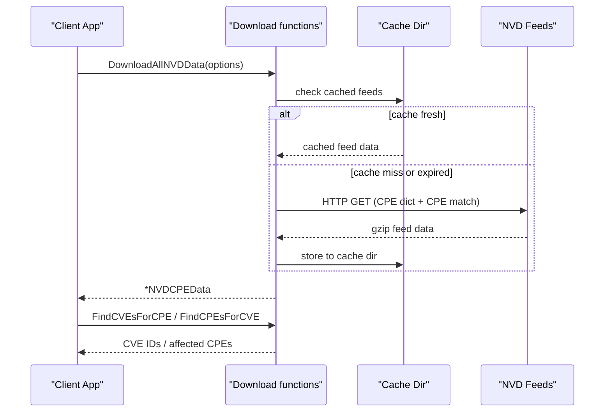

# NVD Integration

The CPE library provides integration with the National Vulnerability Database (NVD): it downloads the official CPE dictionary and CPE match feeds, caches them locally, and lets you map CPEs to CVEs (and back) from the parsed data.

The sequence below shows the NVD data flow: feeds are downloaded (or read from the local cache) and parsed into an `NVDCPEData` value; CPE-to-CVE lookups are then served from the in-memory match maps.



## NVD Data Types

### NVDCPEData

```go
type NVDCPEData struct {
    CPEDictionary *CPEDictionary // Officially registered CPE entries
    CPEMatchData  *CPEMatchData  // Bidirectional CPE-CVE mapping
    DownloadTime  time.Time      // When the data was downloaded
}
```

Aggregates the CPE dictionary and the CPE-CVE match data downloaded from NVD.

### CPEMatchData

```go
type CPEMatchData struct {
    CVEToCPEs map[string][]string // CVE ID -> affected CPE URIs
    CPEToCVEs map[string][]string // CPE URI -> associated CVE IDs
}
```

Holds the bidirectional mapping between CPE URIs and CVE IDs.

## NVD Feed Options

### NVDFeedOptions

```go
type NVDFeedOptions struct {
    CacheDir               string       // Local cache directory
    CacheMaxAge            int          // Cache validity in hours
    MaxConcurrentDownloads int          // Max concurrent downloads
    ShowProgress           bool         // Print progress to stdout
    HTTPClient             *http.Client // Custom HTTP client
}
```

Configuration options for NVD feed operations.

### DefaultNVDFeedOptions

```go
func DefaultNVDFeedOptions() *NVDFeedOptions
```

Returns feed options populated with sensible defaults (cache directory under the system temp dir, 24-hour cache, 3 concurrent downloads, progress enabled, and a 60-second HTTP client).

**Returns:**
- `*NVDFeedOptions` - Default configuration

**Example:**
```go
options := cpeskills.DefaultNVDFeedOptions()
options.CacheDir = "./nvd-cache"
options.CacheMaxAge = 12 // re-download after 12 hours
options.ShowProgress = true
```

## Downloading NVD Data

### DownloadAllNVDData

```go
func DownloadAllNVDData(options *NVDFeedOptions) (*NVDCPEData, error)
```

Downloads and parses both the CPE dictionary and the CPE match data, returning them in a single `NVDCPEData` value. The two feeds are fetched concurrently.

**Parameters:**
- `options` - Download options (can be `nil` for defaults)

**Returns:**
- `*NVDCPEData` - Complete NVD data
- `error` - Error if download or parsing fails

**Example:**
```go
// Download all NVD data
fmt.Println("Downloading NVD data...")
options := cpeskills.DefaultNVDFeedOptions()
options.CacheDir = "./nvd-cache"
options.ShowProgress = true

nvdData, err := cpeskills.DownloadAllNVDData(options)
if err != nil {
    log.Fatalf("Failed to download NVD data: %v", err)
}

fmt.Printf("Downloaded dictionary with %d items\n", len(nvdData.CPEDictionary.Items))
fmt.Printf("Downloaded %d CPE-to-CVE mappings\n", len(nvdData.CPEMatchData.CPEToCVEs))
fmt.Printf("Downloaded at: %v\n", nvdData.DownloadTime)
```

### DownloadAndParseCPEDict

```go
func DownloadAndParseCPEDict(options *NVDFeedOptions) (*CPEDictionary, error)
```

Downloads and parses only the CPE dictionary.

**Parameters:**
- `options` - Download options (can be `nil` for defaults)

**Returns:**
- `*CPEDictionary` - CPE dictionary
- `error` - Error if download or parsing fails

**Example:**
```go
dictionary, err := cpeskills.DownloadAndParseCPEDict(options)
if err != nil {
    log.Fatal(err)
}

fmt.Printf("Dictionary contains %d CPE entries\n", len(dictionary.Items))
```

### DownloadAndParseCPEMatch

```go
func DownloadAndParseCPEMatch(options *NVDFeedOptions) (*CPEMatchData, error)
```

Downloads and parses only the CPE match data.

**Parameters:**
- `options` - Download options (can be `nil` for defaults)

**Returns:**
- `*CPEMatchData` - CPE match data
- `error` - Error if download or parsing fails

**Example:**
```go
matchData, err := cpeskills.DownloadAndParseCPEMatch(options)
if err != nil {
    log.Fatal(err)
}

fmt.Printf("Match data covers %d CPE URIs\n", len(matchData.CPEToCVEs))
```

## CVE Integration

### FindCVEsForCPE

```go
func (data *NVDCPEData) FindCVEsForCPE(cpe *CPE) []string
```

Finds the CVE IDs associated with a specific CPE. It first looks for an exact CPE URI match, then falls back to a fuzzy (distance-based) match.

**Parameters:**
- `cpe` - CPE to search for

**Returns:**
- `[]string` - Associated CVE IDs

**Example:**
```go
// Find CVEs for Apache Log4j
log4jCPE, _ := cpeskills.ParseCpe23("cpe:2.3:a:apache:log4j:2.0:*:*:*:*:*:*:*")
cves := nvdData.FindCVEsForCPE(log4jCPE)

fmt.Printf("Found %d CVEs for Apache Log4j 2.0:\n", len(cves))
for _, cveID := range cves {
    fmt.Printf("- %s\n", cveID)
}
```

### FindCPEsForCVE

```go
func (data *NVDCPEData) FindCPEsForCVE(cveID string) []*CPE
```

Finds all CPEs affected by a specific CVE. The CVE ID is normalized before lookup, and each returned CPE has its `Cve` field set to the queried ID.

**Parameters:**
- `cveID` - CVE identifier (e.g., "CVE-2021-44228")

**Returns:**
- `[]*CPE` - Affected CPEs

**Example:**
```go
// Find CPEs affected by Log4Shell
affectedCPEs := nvdData.FindCPEsForCVE("CVE-2021-44228")

fmt.Printf("CVE-2021-44228 affects %d CPEs:\n", len(affectedCPEs))
for _, cpe := range affectedCPEs {
    fmt.Printf("- %s\n", cpe.GetURI())
}
```

### EnrichCPEWithVulnerabilityData

```go
func (data *NVDCPEData) EnrichCPEWithVulnerabilityData(cpe *CPE)
```

Looks up the CVEs associated with the given CPE and, if any are found, stores the first CVE ID in the CPE's `Cve` field.

**Parameters:**
- `cpe` - CPE to enrich in place

**Example:**
```go
cpe, _ := cpeskills.ParseCpe23("cpe:2.3:a:apache:log4j:2.0:*:*:*:*:*:*:*")
nvdData.EnrichCPEWithVulnerabilityData(cpe)
fmt.Printf("Associated CVE: %s\n", cpe.Cve)
```

## Caching

The download functions automatically cache the fetched feeds in `options.CacheDir` to improve performance. A cached feed is reused until it is older than `options.CacheMaxAge` hours:

```go
// Configure caching
options := cpeskills.DefaultNVDFeedOptions()
options.CacheDir = "./nvd-cache"
options.CacheMaxAge = 24

// First download fetches from NVD
nvdData1, _ := cpeskills.DownloadAllNVDData(options)

// Subsequent downloads reuse the cache while it is still fresh
nvdData2, _ := cpeskills.DownloadAllNVDData(options)
```

## Complete Example

```go
package main

import (
    "fmt"
    "log"

    cpeskills "github.com/scagogogo/cpe-skills"
)

func main() {
    // Configure NVD options
    options := cpeskills.DefaultNVDFeedOptions()
    options.CacheDir = "./nvd-cache"
    options.ShowProgress = true

    // Download NVD data
    fmt.Println("Downloading NVD data...")
    nvdData, err := cpeskills.DownloadAllNVDData(options)
    if err != nil {
        log.Fatalf("Failed to download NVD data: %v", err)
    }

    fmt.Printf("Downloaded %d dictionary items\n", len(nvdData.CPEDictionary.Items))
    fmt.Printf("Downloaded %d CPE-to-CVE mappings\n", len(nvdData.CPEMatchData.CPEToCVEs))

    // Analyze system CPEs for vulnerabilities
    systemCPEs := []string{
        "cpe:2.3:a:apache:log4j:2.0:*:*:*:*:*:*:*",
        "cpe:2.3:a:apache:tomcat:9.0.0:*:*:*:*:*:*:*",
        "cpe:2.3:o:microsoft:windows:10:*:*:*:*:*:*:*",
    }

    fmt.Println("\nVulnerability Analysis:")
    for _, cpeStr := range systemCPEs {
        cpeObj, err := cpeskills.ParseCpe23(cpeStr)
        if err != nil {
            log.Printf("Failed to parse %s: %v", cpeStr, err)
            continue
        }

        cves := nvdData.FindCVEsForCPE(cpeObj)
        fmt.Printf("\n%s:\n", cpeStr)
        fmt.Printf("  Found %d CVEs\n", len(cves))
        for _, cveID := range cves {
            fmt.Printf("  - %s\n", cveID)
        }
    }

    // Reverse lookup: which CPEs are affected by a given CVE
    fmt.Println("\nCPEs affected by CVE-2021-44228:")
    affected := nvdData.FindCPEsForCVE("CVE-2021-44228")
    for _, cpe := range affected {
        fmt.Printf("  - %s\n", cpe.GetURI())
    }
}
```
