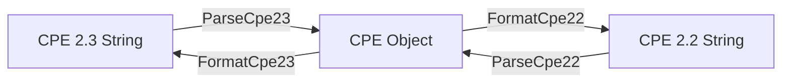

# Parsing

The CPE library provides comprehensive parsing capabilities for both CPE 2.2 and CPE 2.3 formats, converting string representations into structured `CPE` objects.

The diagram below illustrates how parsing and formatting are inverse operations, and how a CPE 2.2 string is converted to CPE 2.3 by parsing it and re-formatting the result:



## CPE 2.3 Parsing

### ParseCpe23

```go
func ParseCpe23(cpe23 string) (*CPE, error)
```

Parses a CPE 2.3 format string and converts it to a CPE structure.

**Parameters:**
- `cpe23` - CPE 2.3 format string (e.g., `"cpe:2.3:a:microsoft:windows:10:*:*:*:*:*:*:*"`)

**Returns:**
- `*CPE` - Parsed CPE object
- `error` - Error if parsing fails

**Errors:**
- An invalid-format error when the string does not have exactly 13 colon-separated parts or does not begin with `cpe:2.3:` (detectable with `IsInvalidFormatError`)
- An invalid-part error when the part field value is not `a`, `h`, `o`, or `*` (detectable with `IsInvalidPartError`)

**Example:**
```go
// Parse Windows 10 CPE
winCPE, err := cpeskills.ParseCpe23("cpe:2.3:a:microsoft:windows:10:*:*:*:*:*:*:*")
if err != nil {
    log.Fatalf("Failed to parse CPE: %v", err)
}

fmt.Printf("Vendor: %s\n", winCPE.Vendor)      // microsoft
fmt.Printf("Product: %s\n", winCPE.ProductName) // windows
fmt.Printf("Version: %s\n", winCPE.Version)     // 10

// Parse Adobe Reader CPE
adobeCPE, err := cpeskills.ParseCpe23("cpe:2.3:a:adobe:reader:2021.001.20150:*:*:*:*:*:*:*")
if err != nil {
    log.Fatalf("Failed to parse CPE: %v", err)
}

// Parse operating system CPE
osCPE, err := cpeskills.ParseCpe23("cpe:2.3:o:microsoft:windows:10:1909:*:*:*:*:*:*")
if err != nil {
    log.Fatalf("Failed to parse CPE: %v", err)
}
```

### CPE 2.3 Format Structure

The CPE 2.3 format follows this structure:
```text
cpe:2.3:<part>:<vendor>:<product>:<version>:<update>:<edition>:<language>:<sw_edition>:<target_sw>:<target_hw>:<other>
```

**Fields:**
- `part` - Component type: "a" (application), "h" (hardware), "o" (operating system)
- `vendor` - Vendor/manufacturer name
- `product` - Product name
- `version` - Product version
- `update` - Update identifier
- `edition` - Edition identifier
- `language` - Language code
- `sw_edition` - Software edition
- `target_sw` - Target software
- `target_hw` - Target hardware
- `other` - Other attributes

**Special Values:**
- `*` - Wildcard (matches any value)
- `-` - Not applicable

## CPE 2.2 Parsing

### ParseCpe22

```go
func ParseCpe22(cpe22 string) (*CPE, error)
```

Parses a CPE 2.2 format string and converts it to a CPE structure.

**Parameters:**
- `cpe22` - CPE 2.2 format string (e.g., `"cpe:/a:apache:tomcat:8.5.0"`)

**Returns:**
- `*CPE` - Parsed CPE object
- `error` - Error if parsing fails

**Errors:**
- An invalid-format error when the string does not start with `cpe:/` (detectable with `IsInvalidFormatError`)
- An invalid-part error when the part field value is not `a`, `h`, or `o` (detectable with `IsInvalidPartError`)

**Example:**
```go
// Parse basic CPE 2.2 format
tomcatCPE, err := cpeskills.ParseCpe22("cpe:/a:apache:tomcat:8.5.0")
if err != nil {
    log.Fatalf("Failed to parse CPE: %v", err)
}

fmt.Printf("Part: %s\n", tomcatCPE.Part.LongName) // Application
fmt.Printf("Vendor: %s\n", tomcatCPE.Vendor)      // apache
fmt.Printf("Product: %s\n", tomcatCPE.ProductName) // tomcat
fmt.Printf("Version: %s\n", tomcatCPE.Version)     // 8.5.0

// Parse a CPE 2.2 string with an extended (~-separated) field section
mysqlCPE, err := cpeskills.ParseCpe22("cpe:/a:mysql:mysql:5.7.12:::~~~enterprise~")
if err != nil {
    log.Fatalf("Failed to parse CPE: %v", err)
}
fmt.Printf("Software edition: %s\n", mysqlCPE.SoftwareEdition) // enterprise
```

### CPE 2.2 Format Structure

The CPE 2.2 format follows this structure:
```text
cpe:/<part>:<vendor>:<product>:<version>:<update>:<edition>:<language>
```

Extended format with additional fields:
```text
cpe:/<part>:<vendor>:<product>:<version>:<update>:<edition>:<language>:~<sw_edition>~<target_sw>~<target_hw>~<other>
```

## Format Conversion

### FormatCpe23

```go
func FormatCpe23(cpe *CPE) string
```

Converts a CPE object to a CPE 2.3 format string. If the object already carries a `Cpe23` value it is returned as-is; otherwise a new string is built from the fields, with empty fields replaced by the wildcard `*`.

**Parameters:**
- `cpe` - CPE object to format

**Returns:**
- `string` - CPE 2.3 format string

**Example:**
```go
cpeObj := &cpeskills.CPE{
    Part:        *cpeskills.PartApplication,
    Vendor:      cpeskills.Vendor("microsoft"),
    ProductName: cpeskills.Product("windows"),
    Version:     cpeskills.Version("10"),
}

cpe23String := cpeskills.FormatCpe23(cpeObj)
fmt.Println(cpe23String) // cpe:2.3:a:microsoft:windows:10:*:*:*:*:*:*:*
```

### FormatCpe22

```go
func FormatCpe22(cpe *CPE) string
```

Converts a CPE object to a CPE 2.2 format string.

**Parameters:**
- `cpe` - CPE object to format

**Returns:**
- `string` - CPE 2.2 format string

**Example:**
```go
cpeObj := &cpeskills.CPE{
    Part:        *cpeskills.PartApplication,
    Vendor:      cpeskills.Vendor("apache"),
    ProductName: cpeskills.Product("tomcat"),
    Version:     cpeskills.Version("8.5.0"),
}

cpe22String := cpeskills.FormatCpe22(cpeObj)
fmt.Println(cpe22String) // cpe:/a:apache:tomcat:8.5.0
```

### FormatCPE

```go
func FormatCPE(cpe *CPE, version string) (string, error)
```

Formats a CPE object as either a 2.2 or 2.3 string, selected by the `version` argument. Accepts `"2.3"`, `"23"` or `""` for CPE 2.3, and `"2.2"` or `"22"` for CPE 2.2. Any other value returns an error.

**Parameters:**
- `cpe` - CPE object to format
- `version` - Target version selector

**Returns:**
- `string` - Formatted CPE string
- `error` - Error if `cpe` is `nil` or `version` is unsupported

**Example:**
```go
cpeObj := &cpeskills.CPE{
    Part:        *cpeskills.PartApplication,
    Vendor:      cpeskills.Vendor("apache"),
    ProductName: cpeskills.Product("tomcat"),
    Version:     cpeskills.Version("8.5.0"),
}

str, err := cpeskills.FormatCPE(cpeObj, "2.2")
if err != nil {
    log.Fatal(err)
}
fmt.Println(str) // cpe:/a:apache:tomcat:8.5.0
```

## Conversion Between Formats

To convert a CPE 2.2 string to CPE 2.3, parse it with `ParseCpe22` and re-format the resulting object with `FormatCpe23`. (In fact, `ParseCpe22` already populates the object's `Cpe23` field, so `FormatCpe23` simply returns it.)

**Example:**
```go
cpe22 := "cpe:/a:apache:tomcat:8.5.0"

cpeObj, err := cpeskills.ParseCpe22(cpe22)
if err != nil {
    log.Fatal(err)
}

cpe23 := cpeskills.FormatCpe23(cpeObj)
fmt.Println(cpe23) // cpe:2.3:a:apache:tomcat:8.5.0:*:*:*:*:*:*:*
```

## Convenience Parsing

### Parse

```go
func Parse(cpeStr string) (*CPE, error)
```

Parses a CPE string, automatically detecting whether it is in CPE 2.2 or CPE 2.3 form.

### MustParse

```go
func MustParse(cpeStr string) *CPE
```

Like `Parse`, but panics instead of returning an error. Handy for package-level variable initialization with known-good literals.

**Example:**
```go
// Auto-detect the format
cpeObj, err := cpeskills.Parse("cpe:/a:apache:tomcat:8.5.0")
if err != nil {
    log.Fatal(err)
}
fmt.Println(cpeObj.Vendor) // apache

// Panics on invalid input; use only with trusted literals
var windows = cpeskills.MustParse("cpe:2.3:a:microsoft:windows:10:*:*:*:*:*:*:*")
fmt.Println(windows.ProductName) // windows
```

## Error Handling

```go
// Handle parsing errors
cpeObj, err := cpeskills.ParseCpe23("invalid:format")
if err != nil {
    if cpeskills.IsInvalidFormatError(err) {
        fmt.Println("Invalid CPE format")
    } else if cpeskills.IsInvalidPartError(err) {
        fmt.Println("Invalid part value")
    } else {
        fmt.Printf("Other error: %v\n", err)
    }
}
```

## Best Practices

1. **Always check for errors** when parsing CPE strings
2. **Use the appropriate parser** for the format you're working with, or `Parse` to auto-detect
3. **Validate input** before parsing if the source is untrusted
4. **Handle special characters** properly when constructing CPE strings manually
5. **Use format conversion functions** when you need to switch between formats

## Complete Example

```go
package main

import (
    "fmt"
    "log"
    "github.com/scagogogo/cpe-skills"
)

func main() {
    // Parse different CPE formats
    examples := []string{
        "cpe:2.3:a:microsoft:windows:10:*:*:*:*:*:*:*",
        "cpe:2.3:a:adobe:reader:2021.001.20150:*:*:*:*:*:*:*",
        "cpe:2.3:o:linux:kernel:5.4.0:*:*:*:*:*:*:*",
    }

    for _, example := range examples {
        cpeObj, err := cpeskills.ParseCpe23(example)
        if err != nil {
            log.Printf("Failed to parse %s: %v", example, err)
            continue
        }

        fmt.Printf("Parsed: %s\n", example)
        fmt.Printf("  Type: %s\n", cpeObj.Part.LongName)
        fmt.Printf("  Vendor: %s\n", cpeObj.Vendor)
        fmt.Printf("  Product: %s\n", cpeObj.ProductName)
        fmt.Printf("  Version: %s\n", cpeObj.Version)
        fmt.Println()
    }

    // Parse CPE 2.2 format
    cpe22Example := "cpe:/a:apache:tomcat:8.5.0"
    cpe22Obj, err := cpeskills.ParseCpe22(cpe22Example)
    if err != nil {
        log.Fatal(err)
    }

    // Convert to CPE 2.3
    cpe23String := cpeskills.FormatCpe23(cpe22Obj)
    fmt.Printf("CPE 2.2: %s\n", cpe22Example)
    fmt.Printf("CPE 2.3: %s\n", cpe23String)
}
```
