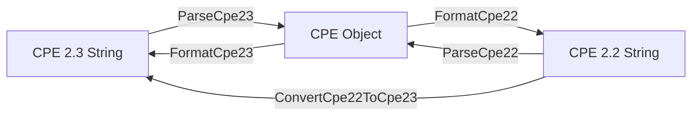

# Parsing

The CPE library provides comprehensive parsing capabilities for both CPE 2.2 and CPE 2.3 formats, converting string representations into structured `CPE` objects.

The diagram below illustrates how parsing and formatting are inverse operations, and how `ConvertCpe22ToCpe23` bridges the two string formats:



## CPE 2.3 Parsing

### ParseCpe23

```go
func ParseCpe23(cpe23 string) (*CPE, error)
```

Parses a CPE 2.3 format string and converts it to a CPE structure.

**Parameters:**
- `cpe23` - CPE 2.3 format string (e.g., `"cpe:2.3:a:microsoft:windows:10:*:*:*:*:*:*:*"`)

**Returns:**
- `*CPE` - Parsed CPE object
- `error` - Error if parsing fails

**Errors:**
- `InvalidFormatError` - When the string format doesn't conform to CPE 2.3 standard
- `InvalidPartError` - When the part field value is not "a", "h", "o", or "*"

**Example:**
```go
// Parse Windows 10 CPE
winCPE, err := cpeskills.ParseCpe23("cpe:2.3:a:microsoft:windows:10:*:*:*:*:*:*:*")
if err != nil {
    log.Fatalf("Failed to parse CPE: %v", err)
}

fmt.Printf("Vendor: %s\n", winCPE.Vendor)      // microsoft
fmt.Printf("Product: %s\n", winCPE.ProductName) // windows
fmt.Printf("Version: %s\n", winCPE.Version)     // 10

// Parse Adobe Reader CPE
adobeCPE, err := cpeskills.ParseCpe23("cpe:2.3:a:adobe:reader:2021.001.20150:*:*:*:*:*:*:*")
if err != nil {
    log.Fatalf("Failed to parse CPE: %v", err)
}

// Parse operating system CPE
osCPE, err := cpeskills.ParseCpe23("cpe:2.3:o:microsoft:windows:10:1909:*:*:*:*:*:*")
if err != nil {
    log.Fatalf("Failed to parse CPE: %v", err)
}
```

### CPE 2.3 Format Structure

The CPE 2.3 format follows this structure:
```
cpe:2.3:<part>:<vendor>:<product>:<version>:<update>:<edition>:<language>:<sw_edition>:<target_sw>:<target_hw>:<other>
```

**Fields:**
- `part` - Component type: "a" (application), "h" (hardware), "o" (operating system)
- `vendor` - Vendor/manufacturer name
- `product` - Product name
- `version` - Product version
- `update` - Update identifier
- `edition` - Edition identifier
- `language` - Language code
- `sw_edition` - Software edition
- `target_sw` - Target software
- `target_hw` - Target hardware
- `other` - Other attributes

**Special Values:**
- `*` - Wildcard (matches any value)
- `-` - Not applicable

## CPE 2.2 Parsing

### ParseCpe22

```go
func ParseCpe22(cpe22 string) (*CPE, error)
```

Parses a CPE 2.2 format string and converts it to a CPE structure.

**Parameters:**
- `cpe22` - CPE 2.2 format string (e.g., `"cpe:/a:apache:tomcat:8.5.0"`)

**Returns:**
- `*CPE` - Parsed CPE object
- `error` - Error if parsing fails

**Errors:**
- `InvalidFormatError` - When the string doesn't start with "cpe:/"
- `InvalidPartError` - When the part field value is not "a", "h", or "o"

**Example:**
```go
// Parse basic CPE 2.2 format
tomcatCPE, err := cpeskills.ParseCpe22("cpe:/a:apache:tomcat:8.5.0")
if err != nil {
    log.Fatalf("Failed to parse CPE: %v", err)
}

fmt.Printf("Part: %s\n", tomcatCPE.Part.LongName) // Application
fmt.Printf("Vendor: %s\n", tomcatCPE.Vendor)      // apache
fmt.Printf("Product: %s\n", tomcatCPE.ProductName) // tomcat
fmt.Printf("Version: %s\n", tomcatCPE.Version)     // 8.5.0

// Parse complex CPE 2.2 with more fields
complexCPE, err := cpeskills.ParseCpe22("cpe:/a:apache:tomcat:8.5.0:beta:enterprise:en")
if err != nil {
    log.Fatalf("Failed to parse CPE: %v", err)
}

// Parse CPE 2.2 with special characters
specialCPE, err := cpeskills.ParseCpe22("cpe:/a:vendor:product~name:1.0")
if err != nil {
    log.Fatalf("Failed to parse CPE: %v", err)
}
```

### CPE 2.2 Format Structure

The CPE 2.2 format follows this structure:
```
cpe:/<part>:<vendor>:<product>:<version>:<update>:<edition>:<language>
```

Extended format with additional fields:
```
cpe:/<part>:<vendor>:<product>:<version>:<update>:<edition>:<language>:~<sw_edition>~<target_sw>~<target_hw>~<other>
```

## Format Conversion

### FormatCpe23

```go
func FormatCpe23(cpe *CPE) string
```

Converts a CPE object to CPE 2.3 format string.

**Parameters:**
- `cpe` - CPE object to format

**Returns:**
- `string` - CPE 2.3 format string

**Example:**
```go
cpeObj := &cpeskills.CPE{
    Part:        *cpeskills.PartApplication,
    Vendor:      cpeskills.Vendor("microsoft"),
    ProductName: cpeskills.Product("windows"),
    Version:     cpeskills.Version("10"),
}

cpe23String := cpeskills.FormatCpe23(cpeObj)
fmt.Println(cpe23String) // cpe:2.3:a:microsoft:windows:10:*:*:*:*:*:*:*
```

### FormatCpe22

```go
func FormatCpe22(cpe *CPE) string
```

Converts a CPE object to CPE 2.2 format string.

**Parameters:**
- `cpe` - CPE object to format

**Returns:**
- `string` - CPE 2.2 format string

**Example:**
```go
cpeObj := &cpeskills.CPE{
    Part:        *cpeskills.PartApplication,
    Vendor:      cpeskills.Vendor("apache"),
    ProductName: cpeskills.Product("tomcat"),
    Version:     cpeskills.Version("8.5.0"),
}

cpe22String := cpeskills.FormatCpe22(cpeObj)
fmt.Println(cpe22String) // cpe:/a:apache:tomcat:8.5.0
```

## Conversion Between Formats

### ConvertCpe22ToCpe23

```go
func ConvertCpe22ToCpe23(cpe22 string) string
```

Converts a CPE 2.2 format string to CPE 2.3 format.

**Parameters:**
- `cpe22` - CPE 2.2 format string

**Returns:**
- `string` - Equivalent CPE 2.3 format string

**Example:**
```go
cpe22 := "cpe:/a:apache:tomcat:8.5.0"
cpe23 := cpeskills.ConvertCpe22ToCpe23(cpe22)
fmt.Println(cpe23) // cpe:2.3:a:apache:tomcat:8.5.0:*:*:*:*:*:*:*
```

## Escape Handling

The library automatically handles escape sequences in CPE strings:

### CPE 2.3 Escaping

- Colons (`:`) are escaped as `\:`
- Backslashes (`\`) are escaped as `\\`

### CPE 2.2 Escaping

- Periods (`.`) are escaped as `\.`
- Colons (`:`) are escaped as `\:`
- Slashes (`/`) are escaped as `\/`
- Tildes (`~`) are escaped as `\~`

## Error Handling

```go
// Handle parsing errors
cpeObj, err := cpeskills.ParseCpe23("invalid:format")
if err != nil {
    if cpeskills.IsInvalidFormatError(err) {
        fmt.Println("Invalid CPE format")
    } else if cpeskills.IsInvalidPartError(err) {
        fmt.Println("Invalid part value")
    } else {
        fmt.Printf("Other error: %v\n", err)
    }
}
```

## Best Practices

1. **Always check for errors** when parsing CPE strings
2. **Use the appropriate parser** for the format you're working with
3. **Validate input** before parsing if the source is untrusted
4. **Handle special characters** properly when constructing CPE strings manually
5. **Use format conversion functions** when you need to switch between formats

## Complete Example

```go
package main

import (
    "fmt"
    "log"
    "github.com/scagogogo/cpe-skills"
)

func main() {
    // Parse different CPE formats
    examples := []string{
        "cpe:2.3:a:microsoft:windows:10:*:*:*:*:*:*:*",
        "cpe:2.3:a:adobe:reader:2021.001.20150:*:*:*:*:*:*:*",
        "cpe:2.3:o:linux:kernel:5.4.0:*:*:*:*:*:*:*",
    }
    
    for _, example := range examples {
        cpeObj, err := cpeskills.ParseCpe23(example)
        if err != nil {
            log.Printf("Failed to parse %s: %v", example, err)
            continue
        }
        
        fmt.Printf("Parsed: %s\n", example)
        fmt.Printf("  Type: %s\n", cpeObj.Part.LongName)
        fmt.Printf("  Vendor: %s\n", cpeObj.Vendor)
        fmt.Printf("  Product: %s\n", cpeObj.ProductName)
        fmt.Printf("  Version: %s\n", cpeObj.Version)
        fmt.Println()
    }
    
    // Parse CPE 2.2 format
    cpe22Example := "cpe:/a:apache:tomcat:8.5.0"
    cpe22Obj, err := cpeskills.ParseCpe22(cpe22Example)
    if err != nil {
        log.Fatal(err)
    }
    
    // Convert to CPE 2.3
    cpe23String := cpeskills.FormatCpe23(cpe22Obj)
    fmt.Printf("CPE 2.2: %s\n", cpe22Example)
    fmt.Printf("CPE 2.3: %s\n", cpe23String)
}
```
