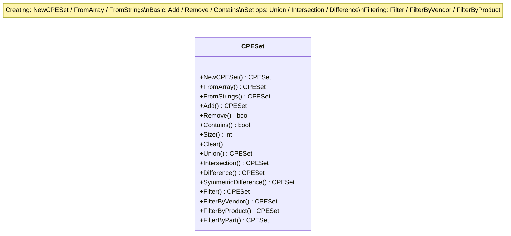
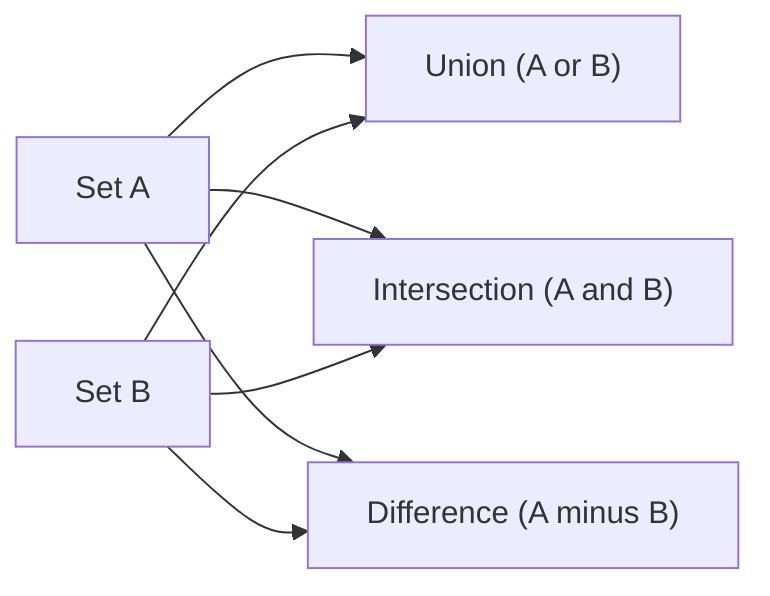

# Sets

The CPE library provides powerful set operations for managing collections of CPE objects, including union, intersection, difference, and advanced filtering capabilities.

The class diagram below groups the `CPESet` methods by purpose — creating sets, basic operations, set algebra, and filtering:



And the flow below illustrates the three core set operations over two input sets A and B:



## CPESet Structure

### CPESet

```go
type CPESet struct {
    // Internal implementation details are hidden
}
```

The `CPESet` type represents a collection of unique CPE objects with efficient set operations.

## Creating Sets

### NewCPESet

```go
func NewCPESet() *CPESet
```

Creates a new empty CPE set.

**Returns:**
- `*CPESet` - New empty set

**Example:**
```go
// Create a new empty set
set := cpeskills.NewCPESet()
fmt.Printf("Created empty set with %d items\n", set.Size())
```

### FromArray

```go
func FromArray(cpes []*CPE) *CPESet
```

Creates a CPE set from an array of CPE objects.

**Parameters:**
- `cpes` - Array of CPE objects

**Returns:**
- `*CPESet` - Set containing the CPE objects

**Example:**
```go
// Create CPEs
cpe1, _ := cpeskills.ParseCpe23("cpe:2.3:a:microsoft:windows:10:*:*:*:*:*:*:*")
cpe2, _ := cpeskills.ParseCpe23("cpe:2.3:a:microsoft:office:2019:*:*:*:*:*:*:*")
cpe3, _ := cpeskills.ParseCpe23("cpe:2.3:a:apache:tomcat:9.0:*:*:*:*:*:*:*")

// Create set from array
cpeArray := []*cpeskills.CPE{cpe1, cpe2, cpe3}
set := cpeskills.FromArray(cpeArray)
fmt.Printf("Created set with %d items\n", set.Size())
```

### FromStrings

```go
func FromStrings(cpeStrings []string) (*CPESet, error)
```

Creates a CPE set from an array of CPE strings.

**Parameters:**
- `cpeStrings` - Array of CPE string representations

**Returns:**
- `*CPESet` - Set containing parsed CPE objects
- `error` - Error if any string fails to parse

**Example:**
```go
cpeStrings := []string{
    "cpe:2.3:a:microsoft:windows:10:*:*:*:*:*:*:*",
    "cpe:2.3:a:apache:tomcat:9.0:*:*:*:*:*:*:*",
    "cpe:2.3:o:linux:kernel:5.4:*:*:*:*:*:*:*",
}

set, err := cpeskills.FromStrings(cpeStrings)
if err != nil {
    log.Fatal(err)
}

fmt.Printf("Created set from strings with %d items\n", set.Size())
```

## Basic Operations

### Add

```go
func (s *CPESet) Add(cpes ...*CPE) *CPESet
```

Adds one or more CPE objects to the set.

**Parameters:**
- `cpes` - Variable number of CPE objects to add

**Returns:**
- `*CPESet` - The set itself (for method chaining)

**Example:**
```go
set := cpeskills.NewCPESet()
cpe1, _ := cpeskills.ParseCpe23("cpe:2.3:a:microsoft:windows:10:*:*:*:*:*:*:*")
cpe2, _ := cpeskills.ParseCpe23("cpe:2.3:a:apache:tomcat:9.0:*:*:*:*:*:*:*")

// Add single CPE
set.Add(cpe1)

// Add multiple CPEs
set.Add(cpe2, cpe1) // cpe1 won't be added again (sets contain unique items)

fmt.Printf("Set size after adding: %d\n", set.Size())
```

### Remove

```go
func (s *CPESet) Remove(cpe *CPE) bool
```

Removes a CPE object from the set.

**Parameters:**
- `cpe` - CPE object to remove

**Returns:**
- `bool` - `true` if the CPE was removed, `false` if it wasn't in the set

**Example:**
```go
cpe1, _ := cpeskills.ParseCpe23("cpe:2.3:a:microsoft:windows:10:*:*:*:*:*:*:*")
set := cpeskills.NewCPESet()
set.Add(cpe1)

removed := set.Remove(cpe1)
fmt.Printf("CPE removed: %t\n", removed)
fmt.Printf("Set size after removal: %d\n", set.Size())
```

### Contains

```go
func (s *CPESet) Contains(cpe *CPE) bool
```

Checks if the set contains a specific CPE object.

**Parameters:**
- `cpe` - CPE object to check for

**Returns:**
- `bool` - `true` if the set contains the CPE, `false` otherwise

**Example:**
```go
cpe1, _ := cpeskills.ParseCpe23("cpe:2.3:a:microsoft:windows:10:*:*:*:*:*:*:*")
cpe2, _ := cpeskills.ParseCpe23("cpe:2.3:a:apache:tomcat:9.0:*:*:*:*:*:*:*")

set := cpeskills.NewCPESet()
set.Add(cpe1)

fmt.Printf("Contains Windows: %t\n", set.Contains(cpe1))
fmt.Printf("Contains Tomcat: %t\n", set.Contains(cpe2))
```

### Size

```go
func (s *CPESet) Size() int
```

Returns the number of CPE objects in the set.

**Returns:**
- `int` - Number of items in the set

### IsEmpty

```go
func (s *CPESet) IsEmpty() bool
```

Checks if the set is empty.

**Returns:**
- `bool` - `true` if the set is empty, `false` otherwise

### Clear

```go
func (s *CPESet) Clear()
```

Removes all CPE objects from the set.

**Example:**
```go
set := cpeskills.NewCPESet()
// ... add some CPEs ...

fmt.Printf("Size before clear: %d\n", set.Size())
set.Clear()
fmt.Printf("Size after clear: %d\n", set.Size())
fmt.Printf("Is empty: %t\n", set.IsEmpty())
```

## Set Operations

### Union

```go
func (s *CPESet) Union(other *CPESet) *CPESet
```

Returns a new set containing all CPEs from both sets.

**Parameters:**
- `other` - Another CPE set

**Returns:**
- `*CPESet` - New set containing union of both sets

**Example:**
```go
// Create two sets
set1 := cpeskills.NewCPESet()
set2 := cpeskills.NewCPESet()

cpe1, _ := cpeskills.ParseCpe23("cpe:2.3:a:microsoft:windows:10:*:*:*:*:*:*:*")
cpe2, _ := cpeskills.ParseCpe23("cpe:2.3:a:apache:tomcat:9.0:*:*:*:*:*:*:*")
cpe3, _ := cpeskills.ParseCpe23("cpe:2.3:a:oracle:java:11:*:*:*:*:*:*:*")

set1.Add(cpe1, cpe2)
set2.Add(cpe2, cpe3) // cpe2 is in both sets

// Union operation
unionSet := set1.Union(set2)
fmt.Printf("Set1 size: %d\n", set1.Size())
fmt.Printf("Set2 size: %d\n", set2.Size())
fmt.Printf("Union size: %d\n", unionSet.Size()) // Should be 3 (unique items)
```

### Intersection

```go
func (s *CPESet) Intersection(other *CPESet) *CPESet
```

Returns a new set containing only CPEs that exist in both sets.

**Parameters:**
- `other` - Another CPE set

**Returns:**
- `*CPESet` - New set containing intersection of both sets

**Example:**
```go
set1 := cpeskills.NewCPESet()
set2 := cpeskills.NewCPESet()

cpe1, _ := cpeskills.ParseCpe23("cpe:2.3:a:microsoft:windows:10:*:*:*:*:*:*:*")
cpe2, _ := cpeskills.ParseCpe23("cpe:2.3:a:apache:tomcat:9.0:*:*:*:*:*:*:*")
cpe3, _ := cpeskills.ParseCpe23("cpe:2.3:a:oracle:java:11:*:*:*:*:*:*:*")

set1.Add(cpe1, cpe2)
set2.Add(cpe2, cpe3)

// Intersection operation
intersectionSet := set1.Intersection(set2)
fmt.Printf("Intersection size: %d\n", intersectionSet.Size()) // Should be 1 (cpe2)
```

### Difference

```go
func (s *CPESet) Difference(other *CPESet) *CPESet
```

Returns a new set containing CPEs that are in this set but not in the other set.

**Parameters:**
- `other` - Another CPE set

**Returns:**
- `*CPESet` - New set containing difference

**Example:**
```go
set1 := cpeskills.NewCPESet()
set2 := cpeskills.NewCPESet()

cpe1, _ := cpeskills.ParseCpe23("cpe:2.3:a:microsoft:windows:10:*:*:*:*:*:*:*")
cpe2, _ := cpeskills.ParseCpe23("cpe:2.3:a:apache:tomcat:9.0:*:*:*:*:*:*:*")
cpe3, _ := cpeskills.ParseCpe23("cpe:2.3:a:oracle:java:11:*:*:*:*:*:*:*")

set1.Add(cpe1, cpe2)
set2.Add(cpe2, cpe3)

// Difference operation
diffSet := set1.Difference(set2)
fmt.Printf("Difference size: %d\n", diffSet.Size()) // Should be 1 (cpe1)
```

### SymmetricDifference

```go
func (s *CPESet) SymmetricDifference(other *CPESet) *CPESet
```

Returns a new set containing CPEs that are in either set but not in both.

**Parameters:**
- `other` - Another CPE set

**Returns:**
- `*CPESet` - New set containing symmetric difference

**Example:**
```go
set1 := cpeskills.NewCPESet()
set2 := cpeskills.NewCPESet()

cpe1, _ := cpeskills.ParseCpe23("cpe:2.3:a:microsoft:windows:10:*:*:*:*:*:*:*")
cpe2, _ := cpeskills.ParseCpe23("cpe:2.3:a:apache:tomcat:9.0:*:*:*:*:*:*:*")
cpe3, _ := cpeskills.ParseCpe23("cpe:2.3:a:oracle:java:11:*:*:*:*:*:*:*")

set1.Add(cpe1, cpe2)
set2.Add(cpe2, cpe3)

// Symmetric difference operation
symDiffSet := set1.SymmetricDifference(set2)
fmt.Printf("Symmetric difference size: %d\n", symDiffSet.Size()) // Should be 2 (cpe1, cpe3)
```

## Filtering Operations

### Filter

```go
func (s *CPESet) Filter(predicate func(*CPE) bool) *CPESet
```

Returns a new set containing only CPEs that match the predicate function.

**Parameters:**
- `predicate` - Function that returns `true` for CPEs to include

**Returns:**
- `*CPESet` - New filtered set

**Example:**
```go
set := cpeskills.NewCPESet()
cpe1, _ := cpeskills.ParseCpe23("cpe:2.3:a:microsoft:windows:10:*:*:*:*:*:*:*")
cpe2, _ := cpeskills.ParseCpe23("cpe:2.3:a:microsoft:office:2019:*:*:*:*:*:*:*")
cpe3, _ := cpeskills.ParseCpe23("cpe:2.3:a:apache:tomcat:9.0:*:*:*:*:*:*:*")

set.Add(cpe1, cpe2, cpe3)

// Filter for Microsoft products
microsoftSet := set.Filter(func(c *cpeskills.CPE) bool {
    return string(c.Vendor) == "microsoft"
})

fmt.Printf("Microsoft products: %d\n", microsoftSet.Size()) // Should be 2
```

### FilterByVendor

```go
func (s *CPESet) FilterByVendor(vendor string) *CPESet
```

Returns a new set containing only CPEs from the specified vendor.

**Parameters:**
- `vendor` - Vendor name to filter by

**Returns:**
- `*CPESet` - New filtered set

### FilterByProduct

```go
func (s *CPESet) FilterByProduct(product string) *CPESet
```

Returns a new set containing only CPEs for the specified product.

**Parameters:**
- `product` - Product name to filter by

**Returns:**
- `*CPESet` - New filtered set

### FilterByPart

```go
func (s *CPESet) FilterByPart(part *Part) *CPESet
```

Returns a new set containing only CPEs of the specified part type.

**Parameters:**
- `part` - Part type to filter by

**Returns:**
- `*CPESet` - New filtered set

**Example:**
```go
set := cpeskills.NewCPESet()
// ... add various CPEs ...

// Filter by different criteria
microsoftCPEs := set.FilterByVendor("microsoft")
windowsCPEs := set.FilterByProduct("windows")
applicationCPEs := set.FilterByPart(cpeskills.PartApplication)

fmt.Printf("Microsoft CPEs: %d\n", microsoftCPEs.Size())
fmt.Printf("Windows CPEs: %d\n", windowsCPEs.Size())
fmt.Printf("Application CPEs: %d\n", applicationCPEs.Size())
```

## Advanced Operations

### AdvancedFilter

```go
func (s *CPESet) AdvancedFilter(criteria *CPE, options *AdvancedMatchOptions) *CPESet
```

Filters the set using advanced matching criteria.

**Parameters:**
- `criteria` - CPE pattern to match against
- `options` - Advanced matching options

**Returns:**
- `*CPESet` - New filtered set

**Example:**
```go
set := cpeskills.NewCPESet()
// ... populate set ...

// Create advanced matching criteria
criteria := &cpeskills.CPE{
    Vendor: cpeskills.Vendor("microsoft"),
}

options := cpeskills.NewAdvancedMatchOptions()
options.MatchMode = "distance"
options.ScoreThreshold = 0.8

// Advanced filter
filteredSet := set.AdvancedFilter(criteria, options)
fmt.Printf("Advanced filtered set size: %d\n", filteredSet.Size())
```

### FindRelated

```go
func FindRelated(cpe *CPE, set *CPESet, options *MatchOptions) *CPESet
```

Finds CPEs in the set that are related to the given CPE.

**Parameters:**
- `cpe` - CPE to find related items for
- `set` - Set to search in
- `options` - Matching options

**Returns:**
- `*CPESet` - Set of related CPEs

**Example:**
```go
targetCPE, _ := cpeskills.ParseCpe23("cpe:2.3:a:microsoft:windows:*:*:*:*:*:*:*:*")
relatedSet := cpeskills.FindRelated(targetCPE, set, cpeskills.DefaultMatchOptions())

fmt.Printf("Found %d related CPEs\n", relatedSet.Size())
```

## Conversion Operations

### ToArray

```go
func (s *CPESet) ToArray() []*CPE
```

Converts the set to an array of CPE objects.

**Returns:**
- `[]*CPE` - Array containing all CPEs in the set

### ToStrings

```go
func (s *CPESet) ToStrings() []string
```

Converts the set to an array of CPE strings.

**Returns:**
- `[]string` - Array of CPE string representations

**Example:**
```go
set := cpeskills.NewCPESet()
// ... populate set ...

// Convert to array
cpeArray := set.ToArray()
fmt.Printf("Array length: %d\n", len(cpeArray))

// Convert to strings
cpeStrings := set.ToStrings()
for i, cpeStr := range cpeStrings {
    fmt.Printf("%d: %s\n", i+1, cpeStr)
}
```

## Complete Example

```go
package main

import (
    "fmt"
    "log"
    "github.com/scagogogo/cpe-skills"
)

func main() {
    // Create CPE objects
    cpe1, _ := cpeskills.ParseCpe23("cpe:2.3:a:microsoft:windows:10:*:*:*:*:*:*:*")
    cpe2, _ := cpeskills.ParseCpe23("cpe:2.3:a:microsoft:office:2019:*:*:*:*:*:*:*")
    cpe3, _ := cpeskills.ParseCpe23("cpe:2.3:a:apache:tomcat:9.0:*:*:*:*:*:*:*")
    cpe4, _ := cpeskills.ParseCpe23("cpe:2.3:a:oracle:java:11:*:*:*:*:*:*:*")
    
    // Create sets
    fmt.Println("=== Creating Sets ===")
    set1 := cpeskills.NewCPESet()
    set1.Add(cpe1, cpe2, cpe3)
    
    set2 := cpeskills.NewCPESet()
    set2.Add(cpe3, cpe4)
    
    fmt.Printf("Set1 size: %d\n", set1.Size())
    fmt.Printf("Set2 size: %d\n", set2.Size())
    
    // Set operations
    fmt.Println("\n=== Set Operations ===")
    unionSet := set1.Union(set2)
    intersectionSet := set1.Intersection(set2)
    differenceSet := set1.Difference(set2)
    
    fmt.Printf("Union size: %d\n", unionSet.Size())
    fmt.Printf("Intersection size: %d\n", intersectionSet.Size())
    fmt.Printf("Difference size: %d\n", differenceSet.Size())
    
    // Filtering
    fmt.Println("\n=== Filtering ===")
    microsoftSet := set1.FilterByVendor("microsoft")
    fmt.Printf("Microsoft products: %d\n", microsoftSet.Size())
    
    // Custom filter
    applicationSet := set1.Filter(func(c *cpeskills.CPE) bool {
        return c.Part.ShortName == "a"
    })
    fmt.Printf("Applications: %d\n", applicationSet.Size())
    
    // Advanced filtering
    fmt.Println("\n=== Advanced Filtering ===")
    criteria := &cpeskills.CPE{
        Vendor: cpeskills.Vendor("microsoft"),
    }
    
    options := cpeskills.NewAdvancedMatchOptions()
    options.MatchMode = "exact"
    
    advancedFiltered := set1.AdvancedFilter(criteria, options)
    fmt.Printf("Advanced filtered: %d\n", advancedFiltered.Size())
    
    // Convert to arrays
    fmt.Println("\n=== Conversion ===")
    cpeArray := microsoftSet.ToArray()
    cpeStrings := microsoftSet.ToStrings()
    
    fmt.Printf("Microsoft products:\n")
    for i, cpeStr := range cpeStrings {
        fmt.Printf("%d. %s\n", i+1, cpeStr)
    }
    
    // Set membership tests
    fmt.Println("\n=== Membership Tests ===")
    fmt.Printf("Set1 contains Windows: %t\n", set1.Contains(cpe1))
    fmt.Printf("Set1 contains Java: %t\n", set1.Contains(cpe4))
    
    // Create set from strings
    fmt.Println("\n=== Creating from Strings ===")
    cpeStrings2 := []string{
        "cpe:2.3:a:google:chrome:95.0:*:*:*:*:*:*:*",
        "cpe:2.3:a:mozilla:firefox:94.0:*:*:*:*:*:*:*",
    }
    
    browserSet, err := cpeskills.FromStrings(cpeStrings2)
    if err != nil {
        log.Fatal(err)
    }
    
    fmt.Printf("Browser set size: %d\n", browserSet.Size())
}
```
