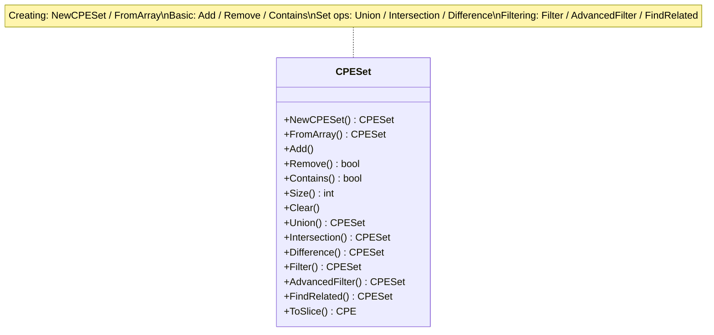
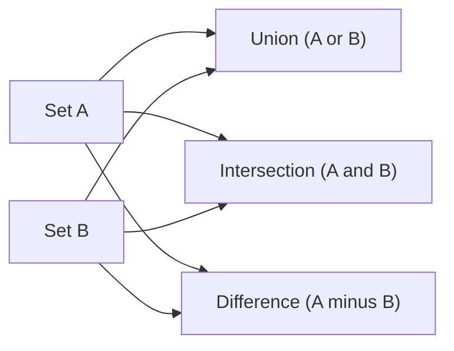

# Sets

The CPE library provides powerful set operations for managing collections of CPE objects, including union, intersection, difference, and criteria-based filtering.

The class diagram below groups the `CPESet` methods by purpose — creating sets, basic operations, set algebra, and filtering:



And the flow below illustrates the three core set operations over two input sets A and B:



## CPESet Structure

### CPESet

```go
type CPESet struct {
    // Name is the name of the set, used to identify and distinguish sets
    Name string
    // Description is a detailed description of the set
    Description string
    // Internal storage of CPE items is hidden
}
```

The `CPESet` type represents a collection of unique CPE objects with efficient set operations. Uniqueness is determined by each CPE's URI.

## Creating Sets

### NewCPESet

```go
func NewCPESet(name string, description string) *CPESet
```

Creates a new empty CPE set with the given name and description.

**Parameters:**
- `name` - Name of the set
- `description` - Description of the set

**Returns:**
- `*CPESet` - New empty set

**Example:**
```go
// Create a new empty set
set := cpeskills.NewCPESet("Microsoft Products", "Collection of Microsoft product CPEs")
fmt.Printf("Created empty set with %d items\n", set.Size())
```

### FromArray

```go
func FromArray(cpes []*CPE, name string, description string) *CPESet
```

Creates a CPE set from an array of CPE objects.

**Parameters:**
- `cpes` - Array of CPE objects
- `name` - Name of the new set
- `description` - Description of the new set

**Returns:**
- `*CPESet` - Set containing the CPE objects

**Example:**
```go
// Create CPEs
cpe1, _ := cpeskills.ParseCpe23("cpe:2.3:a:microsoft:windows:10:*:*:*:*:*:*:*")
cpe2, _ := cpeskills.ParseCpe23("cpe:2.3:a:microsoft:office:2019:*:*:*:*:*:*:*")
cpe3, _ := cpeskills.ParseCpe23("cpe:2.3:a:apache:tomcat:9.0:*:*:*:*:*:*:*")

// Create set from array
cpeArray := []*cpeskills.CPE{cpe1, cpe2, cpe3}
set := cpeskills.FromArray(cpeArray, "My Products", "A collection of products")
fmt.Printf("Created set with %d items\n", set.Size())
```

## Basic Operations

### Add

```go
func (s *CPESet) Add(cpe *CPE)
```

Adds a CPE object to the set. If an equal CPE (compared by URI) already exists, it is not added again.

**Parameters:**
- `cpe` - CPE object to add

**Example:**
```go
set := cpeskills.NewCPESet("demo", "demo set")
cpe1, _ := cpeskills.ParseCpe23("cpe:2.3:a:microsoft:windows:10:*:*:*:*:*:*:*")
cpe2, _ := cpeskills.ParseCpe23("cpe:2.3:a:apache:tomcat:9.0:*:*:*:*:*:*:*")

// Add CPEs one at a time
set.Add(cpe1)
set.Add(cpe2)
set.Add(cpe1) // cpe1 won't be added again (sets contain unique items)

fmt.Printf("Set size after adding: %d\n", set.Size())
```

### Remove

```go
func (s *CPESet) Remove(cpe *CPE) bool
```

Removes a CPE object from the set.

**Parameters:**
- `cpe` - CPE object to remove

**Returns:**
- `bool` - `true` if the CPE was removed, `false` if it wasn't in the set

**Example:**
```go
cpe1, _ := cpeskills.ParseCpe23("cpe:2.3:a:microsoft:windows:10:*:*:*:*:*:*:*")
set := cpeskills.NewCPESet("demo", "demo set")
set.Add(cpe1)

removed := set.Remove(cpe1)
fmt.Printf("CPE removed: %t\n", removed)
fmt.Printf("Set size after removal: %d\n", set.Size())
```

### Contains

```go
func (s *CPESet) Contains(cpe *CPE) bool
```

Checks if the set contains a specific CPE object.

**Parameters:**
- `cpe` - CPE object to check for

**Returns:**
- `bool` - `true` if the set contains the CPE, `false` otherwise

**Example:**
```go
cpe1, _ := cpeskills.ParseCpe23("cpe:2.3:a:microsoft:windows:10:*:*:*:*:*:*:*")
cpe2, _ := cpeskills.ParseCpe23("cpe:2.3:a:apache:tomcat:9.0:*:*:*:*:*:*:*")

set := cpeskills.NewCPESet("demo", "demo set")
set.Add(cpe1)

fmt.Printf("Contains Windows: %t\n", set.Contains(cpe1))
fmt.Printf("Contains Tomcat: %t\n", set.Contains(cpe2))
```

### Size

```go
func (s *CPESet) Size() int
```

Returns the number of CPE objects in the set.

**Returns:**
- `int` - Number of items in the set

### Clear

```go
func (s *CPESet) Clear()
```

Removes all CPE objects from the set.

**Example:**
```go
set := cpeskills.NewCPESet("demo", "demo set")
// ... add some CPEs ...

fmt.Printf("Size before clear: %d\n", set.Size())
set.Clear()
fmt.Printf("Size after clear: %d\n", set.Size())
```

## Set Operations

### Union

```go
func (s *CPESet) Union(other *CPESet) *CPESet
```

Returns a new set containing all CPEs from both sets.

**Parameters:**
- `other` - Another CPE set

**Returns:**
- `*CPESet` - New set containing union of both sets

**Example:**
```go
// Create two sets
set1 := cpeskills.NewCPESet("set1", "first set")
set2 := cpeskills.NewCPESet("set2", "second set")

cpe1, _ := cpeskills.ParseCpe23("cpe:2.3:a:microsoft:windows:10:*:*:*:*:*:*:*")
cpe2, _ := cpeskills.ParseCpe23("cpe:2.3:a:apache:tomcat:9.0:*:*:*:*:*:*:*")
cpe3, _ := cpeskills.ParseCpe23("cpe:2.3:a:oracle:java:11:*:*:*:*:*:*:*")

set1.Add(cpe1)
set1.Add(cpe2)
set2.Add(cpe2) // cpe2 is in both sets
set2.Add(cpe3)

// Union operation
unionSet := set1.Union(set2)
fmt.Printf("Set1 size: %d\n", set1.Size())
fmt.Printf("Set2 size: %d\n", set2.Size())
fmt.Printf("Union size: %d\n", unionSet.Size()) // Should be 3 (unique items)
```

### Intersection

```go
func (s *CPESet) Intersection(other *CPESet) *CPESet
```

Returns a new set containing only CPEs that exist in both sets.

**Parameters:**
- `other` - Another CPE set

**Returns:**
- `*CPESet` - New set containing intersection of both sets

**Example:**
```go
set1 := cpeskills.NewCPESet("set1", "first set")
set2 := cpeskills.NewCPESet("set2", "second set")

cpe1, _ := cpeskills.ParseCpe23("cpe:2.3:a:microsoft:windows:10:*:*:*:*:*:*:*")
cpe2, _ := cpeskills.ParseCpe23("cpe:2.3:a:apache:tomcat:9.0:*:*:*:*:*:*:*")
cpe3, _ := cpeskills.ParseCpe23("cpe:2.3:a:oracle:java:11:*:*:*:*:*:*:*")

set1.Add(cpe1)
set1.Add(cpe2)
set2.Add(cpe2)
set2.Add(cpe3)

// Intersection operation
intersectionSet := set1.Intersection(set2)
fmt.Printf("Intersection size: %d\n", intersectionSet.Size()) // Should be 1 (cpe2)
```

### Difference

```go
func (s *CPESet) Difference(other *CPESet) *CPESet
```

Returns a new set containing CPEs that are in this set but not in the other set.

**Parameters:**
- `other` - Another CPE set

**Returns:**
- `*CPESet` - New set containing difference

**Example:**
```go
set1 := cpeskills.NewCPESet("set1", "first set")
set2 := cpeskills.NewCPESet("set2", "second set")

cpe1, _ := cpeskills.ParseCpe23("cpe:2.3:a:microsoft:windows:10:*:*:*:*:*:*:*")
cpe2, _ := cpeskills.ParseCpe23("cpe:2.3:a:apache:tomcat:9.0:*:*:*:*:*:*:*")
cpe3, _ := cpeskills.ParseCpe23("cpe:2.3:a:oracle:java:11:*:*:*:*:*:*:*")

set1.Add(cpe1)
set1.Add(cpe2)
set2.Add(cpe2)
set2.Add(cpe3)

// Difference operation
diffSet := set1.Difference(set2)
fmt.Printf("Difference size: %d\n", diffSet.Size()) // Should be 1 (cpe1)
```

## Set Relations

### Equals

```go
func (s *CPESet) Equals(other *CPESet) bool
```

Checks whether two sets contain exactly the same CPEs.

**Parameters:**
- `other` - Another CPE set

**Returns:**
- `bool` - `true` if both sets contain the same CPEs

### IsSubsetOf

```go
func (s *CPESet) IsSubsetOf(other *CPESet) bool
```

Checks whether this set is a subset of `other` (every CPE in this set is also in `other`).

**Parameters:**
- `other` - The candidate superset

**Returns:**
- `bool` - `true` if this set is a subset of `other`

### IsSupersetOf

```go
func (s *CPESet) IsSupersetOf(other *CPESet) bool
```

Checks whether this set is a superset of `other` (every CPE in `other` is also in this set).

**Parameters:**
- `other` - The candidate subset

**Returns:**
- `bool` - `true` if this set is a superset of `other`

**Example:**
```go
windowsSet := cpeskills.NewCPESet("windows", "all windows")
windows10Set := cpeskills.NewCPESet("windows10", "windows 10 only")
// ... populate sets ...

fmt.Printf("windows10 ⊆ windows: %t\n", windows10Set.IsSubsetOf(windowsSet))
fmt.Printf("windows ⊇ windows10: %t\n", windowsSet.IsSupersetOf(windows10Set))
```

## Filtering Operations

### Filter

```go
func (s *CPESet) Filter(criteria *CPE, options *MatchOptions) *CPESet
```

Returns a new set containing only the CPEs that match the given criteria CPE. If `options` is `nil`, default match options are used.

**Parameters:**
- `criteria` - CPE object used as the filter criteria
- `options` - Match options; if `nil`, `DefaultMatchOptions()` is used

**Returns:**
- `*CPESet` - New filtered set

**Example:**
```go
set := cpeskills.NewCPESet("all", "all products")
cpe1, _ := cpeskills.ParseCpe23("cpe:2.3:a:microsoft:windows:10:*:*:*:*:*:*:*")
cpe2, _ := cpeskills.ParseCpe23("cpe:2.3:a:microsoft:office:2019:*:*:*:*:*:*:*")
cpe3, _ := cpeskills.ParseCpe23("cpe:2.3:a:apache:tomcat:9.0:*:*:*:*:*:*:*")

set.Add(cpe1)
set.Add(cpe2)
set.Add(cpe3)

// Filter for Microsoft products
criteria := &cpeskills.CPE{
    Vendor: cpeskills.Vendor("microsoft"),
}
microsoftSet := set.Filter(criteria, nil)

fmt.Printf("Microsoft products: %d\n", microsoftSet.Size()) // Should be 2
```

### AdvancedFilter

```go
func (s *CPESet) AdvancedFilter(criteria *CPE, options *AdvancedMatchOptions) *CPESet
```

Filters the set using advanced matching criteria such as regex or distance-based matching. If `options` is `nil`, `NewAdvancedMatchOptions()` is used.

**Parameters:**
- `criteria` - CPE pattern to match against
- `options` - Advanced matching options

**Returns:**
- `*CPESet` - New filtered set

**Example:**
```go
set := cpeskills.NewCPESet("all", "all products")
// ... populate set ...

// Create advanced matching criteria
criteria := &cpeskills.CPE{
    Vendor: cpeskills.Vendor("microsoft"),
}

options := cpeskills.NewAdvancedMatchOptions()
options.MatchMode = "distance"
options.ScoreThreshold = 0.8

// Advanced filter
filteredSet := set.AdvancedFilter(criteria, options)
fmt.Printf("Advanced filtered set size: %d\n", filteredSet.Size())
```

### FindRelated

```go
func (s *CPESet) FindRelated(cpe *CPE, options *AdvancedMatchOptions) *CPESet
```

Finds CPEs in the set that are related to the given CPE using loose distance-based matching. If `options` is `nil`, default advanced options are used.

**Parameters:**
- `cpe` - CPE to find related items for
- `options` - Advanced matching options; if `nil`, defaults are used

**Returns:**
- `*CPESet` - Set of related CPEs

**Example:**
```go
targetCPE := &cpeskills.CPE{
    Vendor:      cpeskills.Vendor("microsoft"),
    ProductName: cpeskills.Product("windows"),
    Version:     cpeskills.Version("10"),
}
relatedSet := set.FindRelated(targetCPE, nil)

fmt.Printf("Found %d related CPEs\n", relatedSet.Size())
```

## Conversion and Ordering

### ToSlice

```go
func (s *CPESet) ToSlice() []*CPE
```

Converts the set to a slice of CPE objects.

**Returns:**
- `[]*CPE` - Slice containing all CPEs in the set

### Sort

```go
func (s *CPESet) Sort(sortBy string, ascending bool) []*CPE
```

Returns the CPEs of the set as a sorted slice. This does not modify the set itself.

**Parameters:**
- `sortBy` - Sort field: `"part"`, `"vendor"`, `"product"`, `"version"`, or any other value to sort by the CPE 2.3 string
- `ascending` - `true` for ascending order, `false` for descending

**Returns:**
- `[]*CPE` - Sorted slice of CPEs

### ToString

```go
func (s *CPESet) ToString() string
```

Returns a string representation of the set, including its name, description, size, and the list of CPEs.

**Returns:**
- `string` - String representation of the set

**Example:**
```go
set := cpeskills.NewCPESet("Microsoft", "Microsoft products")
// ... populate set ...

// Convert to slice
cpeSlice := set.ToSlice()
fmt.Printf("Slice length: %d\n", len(cpeSlice))

// Sort by product name, ascending
sorted := set.Sort("product", true)
for i, cpe := range sorted {
    fmt.Printf("%d: %s\n", i+1, cpe.Cpe23)
}

// Human-readable representation
fmt.Println(set.ToString())
```

## Complete Example

```go
package main

import (
    "fmt"
    "github.com/scagogogo/cpe-skills"
)

func main() {
    // Create CPE objects
    cpe1, _ := cpeskills.ParseCpe23("cpe:2.3:a:microsoft:windows:10:*:*:*:*:*:*:*")
    cpe2, _ := cpeskills.ParseCpe23("cpe:2.3:a:microsoft:office:2019:*:*:*:*:*:*:*")
    cpe3, _ := cpeskills.ParseCpe23("cpe:2.3:a:apache:tomcat:9.0:*:*:*:*:*:*:*")
    cpe4, _ := cpeskills.ParseCpe23("cpe:2.3:a:oracle:java:11:*:*:*:*:*:*:*")

    // Create sets
    fmt.Println("=== Creating Sets ===")
    set1 := cpeskills.NewCPESet("Set1", "First set")
    set1.Add(cpe1)
    set1.Add(cpe2)
    set1.Add(cpe3)

    set2 := cpeskills.NewCPESet("Set2", "Second set")
    set2.Add(cpe3)
    set2.Add(cpe4)

    fmt.Printf("Set1 size: %d\n", set1.Size())
    fmt.Printf("Set2 size: %d\n", set2.Size())

    // Set operations
    fmt.Println("\n=== Set Operations ===")
    unionSet := set1.Union(set2)
    intersectionSet := set1.Intersection(set2)
    differenceSet := set1.Difference(set2)

    fmt.Printf("Union size: %d\n", unionSet.Size())
    fmt.Printf("Intersection size: %d\n", intersectionSet.Size())
    fmt.Printf("Difference size: %d\n", differenceSet.Size())

    // Filtering
    fmt.Println("\n=== Filtering ===")
    criteria := &cpeskills.CPE{
        Vendor: cpeskills.Vendor("microsoft"),
    }
    microsoftSet := set1.Filter(criteria, nil)
    fmt.Printf("Microsoft products: %d\n", microsoftSet.Size())

    // Advanced filtering
    fmt.Println("\n=== Advanced Filtering ===")
    options := cpeskills.NewAdvancedMatchOptions()
    options.MatchMode = "exact"

    advancedFiltered := set1.AdvancedFilter(criteria, options)
    fmt.Printf("Advanced filtered: %d\n", advancedFiltered.Size())

    // Convert to slice and sort
    fmt.Println("\n=== Conversion ===")
    cpeSlice := microsoftSet.ToSlice()
    fmt.Printf("Microsoft products (%d):\n", len(cpeSlice))
    for i, cpe := range microsoftSet.Sort("product", true) {
        fmt.Printf("%d. %s\n", i+1, cpe.Cpe23)
    }

    // Set membership tests
    fmt.Println("\n=== Membership Tests ===")
    fmt.Printf("Set1 contains Windows: %t\n", set1.Contains(cpe1))
    fmt.Printf("Set1 contains Java: %t\n", set1.Contains(cpe4))

    // Create set from array
    fmt.Println("\n=== Creating from Array ===")
    browsers := []*cpeskills.CPE{cpe1, cpe2}
    browserSet := cpeskills.FromArray(browsers, "Browsers", "Browser set")
    fmt.Printf("Browser set size: %d\n", browserSet.Size())
}
```
