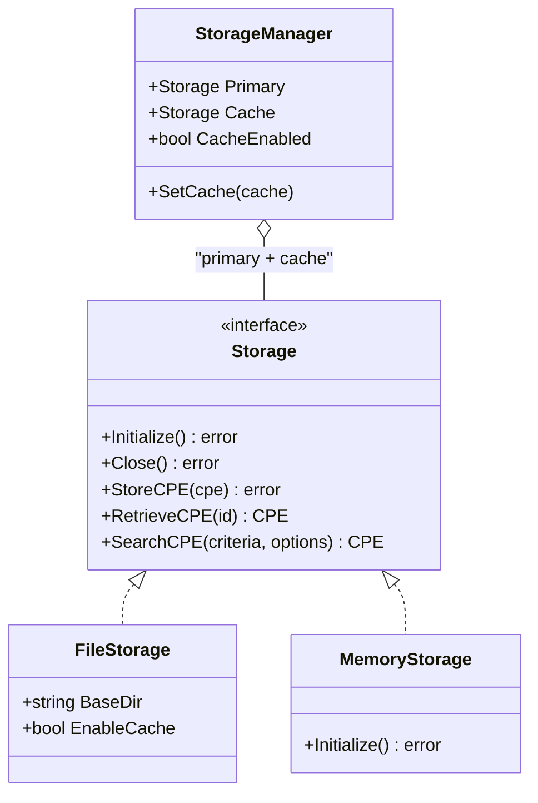

# Storage

The CPE library provides a flexible storage interface with multiple implementations for persisting CPE data, CVE information, and dictionaries.

The class diagram below shows the storage hierarchy: `FileStorage` and `MemoryStorage` implement the `Storage` interface, and `StorageManager` composes a primary backend with an optional cache backend.



## Storage Interface

### Storage

```go
type Storage interface {
    // Lifecycle
    Initialize() error
    Close() error
    
    // CPE operations
    StoreCPE(cpe *CPE) error
    RetrieveCPE(id string) (*CPE, error)
    UpdateCPE(cpe *CPE) error
    DeleteCPE(id string) error
    SearchCPE(criteria *CPE, options *MatchOptions) ([]*CPE, error)
    AdvancedSearchCPE(criteria *CPE, options *AdvancedMatchOptions) ([]*CPE, error)
    
    // CVE operations
    StoreCVE(cve *CVEReference) error
    RetrieveCVE(cveID string) (*CVEReference, error)
    UpdateCVE(cve *CVEReference) error
    DeleteCVE(cveID string) error
    SearchCVE(query string, options *SearchOptions) ([]*CVEReference, error)
    FindCVEsByCPE(cpe *CPE) ([]*CVEReference, error)
    FindCPEsByCVE(cveID string) ([]*CPE, error)
    
    // Dictionary operations
    StoreDictionary(dict *CPEDictionary) error
    RetrieveDictionary() (*CPEDictionary, error)
    
    // Metadata operations
    StoreModificationTimestamp(key string, timestamp time.Time) error
    RetrieveModificationTimestamp(key string) (time.Time, error)
}
```

## File Storage

### NewFileStorage

```go
func NewFileStorage(baseDir string, enableCache bool) (*FileStorage, error)
```

Creates a new file-based storage implementation.

**Parameters:**
- `baseDir` - Base directory for storing files
- `enableCache` - Whether to enable in-memory caching

**Returns:**
- `*FileStorage` - File storage instance
- `error` - Error if creation fails

**Example:**
```go
// Create file storage with caching
storage, err := cpeskills.NewFileStorage("./cpe-data", true)
if err != nil {
    log.Fatal(err)
}
defer storage.Close()

// Initialize storage
err = storage.Initialize()
if err != nil {
    log.Fatal(err)
}
```

### FileStorage Structure

The file storage organizes data in the following directory structure:
```
baseDir/
├── cpes/           # CPE files (JSON format)
├── cves/           # CVE files (JSON format)
├── dictionary.json # CPE dictionary
└── metadata.json   # Timestamps and metadata
```

### FileStorage Methods

#### StoreCPE

```go
func (f *FileStorage) StoreCPE(cpe *CPE) error
```

Stores a CPE object to the file system.

**Parameters:**
- `cpe` - CPE object to store

**Returns:**
- `error` - Error if storage fails

**Example:**
```go
cpeObj, _ := cpeskills.ParseCpe23("cpe:2.3:a:microsoft:windows:10:*:*:*:*:*:*:*")
err := storage.StoreCPE(cpeObj)
if err != nil {
    log.Printf("Failed to store CPE: %v", err)
}
```

#### RetrieveCPE

```go
func (f *FileStorage) RetrieveCPE(id string) (*CPE, error)
```

Retrieves a CPE object by its ID (URI).

**Parameters:**
- `id` - CPE URI or identifier

**Returns:**
- `*CPE` - Retrieved CPE object
- `error` - Error if retrieval fails or CPE not found

**Example:**
```go
cpeObj, err := storage.RetrieveCPE("cpe:2.3:a:microsoft:windows:10:*:*:*:*:*:*:*")
if err != nil {
    if errors.Is(err, cpeskills.ErrNotFound) {
        fmt.Println("CPE not found")
    } else {
        log.Printf("Failed to retrieve CPE: %v", err)
    }
} else {
    fmt.Printf("Retrieved: %s\n", cpeObj.GetURI())
}
```

#### SearchCPE

```go
func (f *FileStorage) SearchCPE(criteria *CPE, options *MatchOptions) ([]*CPE, error)
```

Searches for CPEs matching the given criteria.

**Parameters:**
- `criteria` - CPE pattern to search for
- `options` - Matching options

**Returns:**
- `[]*CPE` - Array of matching CPEs
- `error` - Error if search fails

**Example:**
```go
// Search for all Microsoft products
criteria := &cpeskills.CPE{
    Vendor: cpeskills.Vendor("microsoft"),
}

options := cpeskills.DefaultMatchOptions()
results, err := storage.SearchCPE(criteria, options)
if err != nil {
    log.Fatal(err)
}

fmt.Printf("Found %d Microsoft products\n", len(results))
for _, result := range results {
    fmt.Printf("- %s\n", result.GetURI())
}
```

#### AdvancedSearchCPE

```go
func (f *FileStorage) AdvancedSearchCPE(criteria *CPE, options *AdvancedMatchOptions) ([]*CPE, error)
```

Performs advanced search with sophisticated matching algorithms.

**Example:**
```go
criteria := &cpeskills.CPE{
    Vendor:      cpeskills.Vendor("microsoft"),
    ProductName: cpeskills.Product("windows"),
}

options := cpeskills.NewAdvancedMatchOptions()
options.MatchMode = "distance"
options.ScoreThreshold = 0.8

results, err := storage.AdvancedSearchCPE(criteria, options)
if err != nil {
    log.Fatal(err)
}

fmt.Printf("Found %d Windows products\n", len(results))
```

## Memory Storage

### NewMemoryStorage

```go
func NewMemoryStorage() *MemoryStorage
```

Creates a new in-memory storage implementation (primarily for testing).

**Returns:**
- `*MemoryStorage` - Memory storage instance

**Example:**
```go
storage := cpeskills.NewMemoryStorage()
err := storage.Initialize()
if err != nil {
    log.Fatal(err)
}

// Use the storage
cpeObj, _ := cpeskills.ParseCpe23("cpe:2.3:a:test:product:1.0:*:*:*:*:*:*:*")
err = storage.StoreCPE(cpeObj)
if err != nil {
    log.Fatal(err)
}
```

## Storage Manager

### StorageManager

```go
type StorageManager struct {
    Primary         Storage // Primary storage backend
    Cache           Storage // Cache storage backend
    CacheEnabled    bool    // Whether caching is enabled
    CacheTTLSeconds int     // Cache TTL in seconds
}
```

### NewStorageManager

```go
func NewStorageManager(primary Storage) *StorageManager
```

Creates a new storage manager with the specified primary storage.

**Parameters:**
- `primary` - Primary storage backend

**Returns:**
- `*StorageManager` - Storage manager instance

### SetCache

```go
func (sm *StorageManager) SetCache(cache Storage)
```

Sets the cache storage backend and enables caching.

**Parameters:**
- `cache` - Cache storage backend

**Example:**
```go
// Create primary storage
primaryStorage, _ := cpeskills.NewFileStorage("./data", false)

// Create cache storage
cacheStorage := cpeskills.NewMemoryStorage()

// Create storage manager
manager := cpeskills.NewStorageManager(primaryStorage)
manager.SetCache(cacheStorage)

// Initialize both storages
primaryStorage.Initialize()
cacheStorage.Initialize()
```

## Search Options

### SearchOptions

```go
type SearchOptions struct {
    Offset            int                    // Number of results to skip
    Limit             int                    // Maximum number of results
    SortBy            string                 // Field to sort by
    SortAscending     bool                   // Sort order (true = ascending)
    Filters           map[string]interface{} // Filter conditions
    FullTextQuery     string                 // Full-text search query
    IncludeDeprecated bool                   // Include deprecated items
    DateStart         *time.Time             // Date range filter (start)
    DateEnd           *time.Time             // Date range filter (end)
    MinCVSS           float64                // Minimum CVSS score
    MaxCVSS           float64                // Maximum CVSS score
}
```

### NewSearchOptions

```go
func NewSearchOptions() *SearchOptions
```

Returns default search options (`Offset: 0`, `Limit: 100`, `SortBy: "id"`, `SortAscending: true`).

**Example:**
```go
options := cpeskills.NewSearchOptions()
options.Limit = 50
options.SortBy = "vendor"
options.SortAscending = true

cves, err := storage.SearchCVE("apache", options)
if err != nil {
    log.Fatal(err)
}
```

## Storage Statistics

### StorageStats

```go
type StorageStats struct {
    TotalCPEs            int       // Total number of CPEs
    TotalCVEs            int       // Total number of CVEs
    TotalDictionaryItems int       // Total dictionary items
    StorageBytes         int64     // Storage size in bytes
    LastUpdated          time.Time // Last update timestamp
}
```

## Error Handling

The storage interface defines several standard errors:

```go
var (
    ErrNotFound              = errors.New("record not found")
    ErrDuplicate             = errors.New("duplicate record")
    ErrInvalidData           = errors.New("invalid data")
    ErrStorageDisconnected   = errors.New("storage is disconnected")
)
```

**Example:**
```go
cpeObj, err := storage.RetrieveCPE("non-existent-cpe")
if err != nil {
    if errors.Is(err, cpeskills.ErrNotFound) {
        fmt.Println("CPE not found")
    } else {
        log.Printf("Storage error: %v", err)
    }
}
```

## Complete Example

```go
package main

import (
    "fmt"
    "log"
    "github.com/scagogogo/cpe-skills"
)

func main() {
    // Create and initialize storage
    storage, err := cpeskills.NewFileStorage("./cpe-storage", true)
    if err != nil {
        log.Fatal(err)
    }
    defer storage.Close()
    
    err = storage.Initialize()
    if err != nil {
        log.Fatal(err)
    }
    
    // Store some CPEs
    cpes := []string{
        "cpe:2.3:a:microsoft:windows:10:*:*:*:*:*:*:*",
        "cpe:2.3:a:microsoft:office:2019:*:*:*:*:*:*:*",
        "cpe:2.3:a:apache:tomcat:9.0:*:*:*:*:*:*:*",
    }
    
    for _, cpeStr := range cpes {
        cpeObj, err := cpeskills.ParseCpe23(cpeStr)
        if err != nil {
            log.Printf("Failed to parse %s: %v", cpeStr, err)
            continue
        }
        
        err = storage.StoreCPE(cpeObj)
        if err != nil {
            log.Printf("Failed to store %s: %v", cpeStr, err)
        } else {
            fmt.Printf("Stored: %s\n", cpeStr)
        }
    }
    
    // Search for Microsoft products
    criteria := &cpeskills.CPE{
        Vendor: cpeskills.Vendor("microsoft"),
    }
    
    results, err := storage.SearchCPE(criteria, cpeskills.DefaultMatchOptions())
    if err != nil {
        log.Fatal(err)
    }
    
    fmt.Printf("\nFound %d Microsoft products:\n", len(results))
    for _, result := range results {
        fmt.Printf("- %s %s %s\n", 
            result.Vendor, result.ProductName, result.Version)
    }
    
    // Retrieve specific CPE
    retrieved, err := storage.RetrieveCPE("cpe:2.3:a:apache:tomcat:9.0:*:*:*:*:*:*:*")
    if err != nil {
        log.Printf("Failed to retrieve: %v", err)
    } else {
        fmt.Printf("\nRetrieved: %s\n", retrieved.GetURI())
    }
}
```
