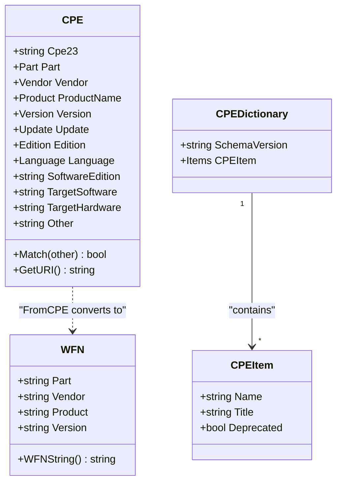

# Core Types

This section documents the core data structures and type definitions used throughout the CPE library.

The class diagram below shows how the core types relate to each other. A `CPE` can be converted to a `WFN` via the `FromCPE` function, while a `CPEDictionary` holds many `CPEItem` entries.



## CPE Structure

The `CPE` struct is the central data structure representing a Common Platform Enumeration entry.

```go
type CPE struct {
    // CPE 2.3 format string representation
    Cpe23 string `json:"cpe_23" bson:"cpe_23"`
    
    // Component type (application, hardware, or operating system)
    Part Part `json:"part" bson:"part"`
    
    // Vendor/manufacturer name
    Vendor Vendor `json:"vendor" bson:"vendor"`
    
    // Product name
    ProductName Product `json:"product_name" bson:"product_name"`
    
    // Product version
    Version Version `json:"version" bson:"version"`
    
    // Update identifier
    Update Update `json:"update" bson:"update"`
    
    // Edition identifier
    Edition Edition `json:"edition" bson:"edition"`
    
    // Language identifier
    Language Language `json:"language" bson:"language"`
    
    // Software edition (e.g., "professional", "enterprise")
    SoftwareEdition string `json:"software_edition" bson:"software_edition"`
    
    // Target software environment
    TargetSoftware string `json:"target_software" bson:"target_software"`
    
    // Target hardware environment
    TargetHardware string `json:"target_hardware" bson:"target_hardware"`
    
    // Other attributes
    Other string `json:"other" bson:"other"`
    
    // Associated CVE identifier
    Cve string `json:"cve" bson:"cve"`
    
    // Source URL
    Url string `json:"url" bson:"url"`
}
```

### Methods

#### Match

```go
func (c *CPE) Match(other *CPE) bool
```

Determines if the current CPE matches another CPE according to CPE Name Matching specification.

**Parameters:**
- `other` - The CPE to match against

**Returns:**
- `bool` - `true` if the CPEs match, `false` otherwise

**Example:**
```go
cpe1, _ := cpeskills.ParseCpe23("cpe:2.3:a:microsoft:windows:10:*:*:*:*:*:*:*")
cpe2, _ := cpeskills.ParseCpe23("cpe:2.3:a:microsoft:windows:*:*:*:*:*:*:*:*")

if cpe2.Match(cpe1) {
    fmt.Println("CPE1 matches CPE2 pattern")
}
```

#### GetURI

```go
func (c *CPE) GetURI() string
```

Returns the CPE 2.3 URI string representation.

**Returns:**
- `string` - CPE 2.3 format string

#### FromCPE

```go
func FromCPE(cpe *CPE) *WFN
```

Converts a `CPE` to Well-Formed Name (WFN) format.

**Parameters:**
- `cpe` - The CPE to convert

**Returns:**
- `*WFN` - WFN representation of the CPE

## Component Types

### Part

Represents the component type of a CPE (application, hardware, or operating system).

```go
type Part struct {
    ShortName   string  // Single character identifier ("a", "h", "o")
    LongName    string  // Full name ("Application", "Hardware", "Operation System")
    Description string  // Additional description
}
```

#### Predefined Parts

```go
var (
    // Application software
    PartApplication = &Part{
        ShortName: "a",
        LongName:  "Application",
    }
    
    // Hardware devices
    PartHardware = &Part{
        ShortName: "h",
        LongName:  "Hardware",
    }
    
    // Operating systems
    PartOperationSystem = &Part{
        ShortName: "o",
        LongName:  "Operation System",
    }
)
```

### Type Aliases

The library defines several type aliases for better type safety and clarity:

```go
// Vendor represents a product vendor/manufacturer
type Vendor string

// Product represents a product name
type Product string

// Version represents a product version
type Version string

// Update represents an update identifier
type Update string

// Edition represents an edition identifier
type Edition string

// Language represents a language identifier
type Language string
```

## Dictionary Types

### CPEDictionary

Represents a collection of CPE entries, typically from NVD.

```go
type CPEDictionary struct {
    SchemaVersion string     // XML schema version
    GeneratedAt   time.Time  // Dictionary generation timestamp
    Items         []*CPEItem // CPE entries
}
```

### CPEItem

Represents a single entry in a CPE dictionary.

```go
type CPEItem struct {
    Name            string       // CPE name (URI format)
    Title           string       // Human-readable title
    References      []Reference  // Reference links
    Deprecated      bool         // Whether the CPE is deprecated
    DeprecationDate *time.Time   // Deprecation date (if deprecated)
    CPE             *CPE         // Parsed CPE object
}
```

### Reference

Represents a reference link associated with a CPE item.

```go
type Reference struct {
    URL  string // Reference URL
    Type string // Reference type (e.g., "Vendor", "Advisory", "External")
}
```

## CVE Types

### CVEReference

Represents a CVE (Common Vulnerabilities and Exposures) entry.

```go
type CVEReference struct {
    CVEID            string                 // CVE identifier (e.g., "CVE-2021-44228")
    Description      string                 // Vulnerability description
    PublishedDate    time.Time              // Publication date
    LastModifiedDate time.Time              // Last modification date
    CVSSScore        float64                // CVSS score (0.0-10.0)
    Severity         string                 // Severity level (Low, Medium, High, Critical)
    References       []string               // Reference URLs
    AffectedCPEs     []string               // Affected CPE URIs
    Metadata         map[string]interface{} // Additional metadata
}
```

## Constants

### CPE Format Constants

```go
const (
    CPE23Header  = "cpe"    // CPE 2.3 header
    CPE23Version = "2.3"    // CPE 2.3 version
    CPE22Header  = "cpe"    // CPE 2.2 header
)
```

### Special Values

```go
const (
    ValueANY = "*"  // Wildcard logical value (matches any value)
    ValueNA  = "-"  // Not applicable logical value
)
```

## Usage Examples

### Creating CPE Objects

```go
// Create CPE manually
windowsCPE := &cpeskills.CPE{
    Cpe23:       "cpe:2.3:a:microsoft:windows:10:*:*:*:*:*:*:*",
    Part:        *cpeskills.PartApplication,
    Vendor:      cpeskills.Vendor("microsoft"),
    ProductName: cpeskills.Product("windows"),
    Version:     cpeskills.Version("10"),
}

// Parse from string
parsedCPE, err := cpeskills.ParseCpe23("cpe:2.3:a:microsoft:windows:10:*:*:*:*:*:*:*")
if err != nil {
    log.Fatal(err)
}
```

### Working with Parts

```go
// Check part type
if cpeObj.Part.ShortName == "a" {
    fmt.Println("This is an application")
}

// Use predefined parts
newCPE := &cpeskills.CPE{
    Part: *cpeskills.PartOperationSystem,
    // ... other fields
}
```

### Type Conversions

```go
// Convert to string types
vendorStr := string(cpeObj.Vendor)
productStr := string(cpeObj.ProductName)
versionStr := string(cpeObj.Version)

// Create from strings
cpeObj.Vendor = cpeskills.Vendor("apache")
cpeObj.ProductName = cpeskills.Product("tomcat")
cpeObj.Version = cpeskills.Version("9.0.0")
```
