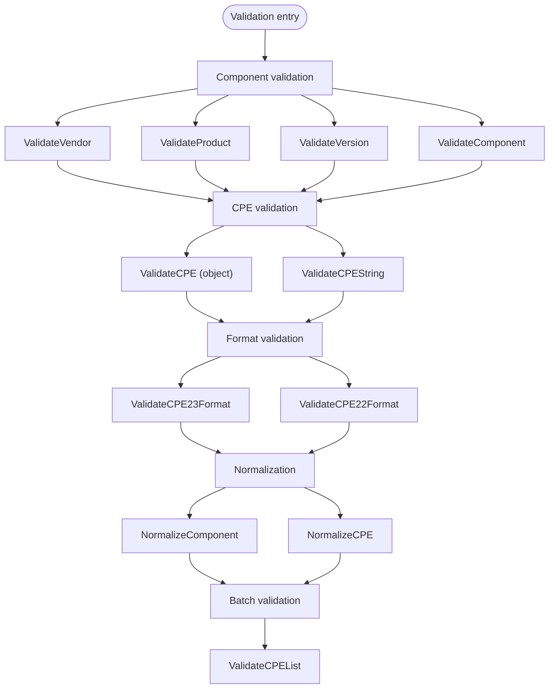

# Validation

The CPE library provides comprehensive validation functions to ensure CPE data integrity and compliance with CPE specifications.

The diagram below shows the validation pipeline, from single-field component checks up through whole-CPE, format, normalization, and batch validation:



## Component Validation

### ValidateComponent

```go
func ValidateComponent(component string) error
```

Validates a single CPE component (vendor, product, version, etc.) for compliance with CPE naming rules.

**Parameters:**
- `component` - Component string to validate

**Returns:**
- `error` - Error if validation fails, `nil` if valid

**Validation Rules:**
- Must not contain illegal characters (control characters, etc.)
- Special values `*` (ANY) and `-` (NA) are allowed
- Empty strings are allowed
- Must follow CPE character encoding rules

**Example:**
```go
// Valid components
err := cpeskills.ValidateComponent("microsoft")
if err != nil {
    fmt.Printf("Invalid: %v\n", err)
} else {
    fmt.Println("Valid component")
}

// Test special values
err = cpeskills.ValidateComponent("*")  // ANY value
if err == nil {
    fmt.Println("Wildcard is valid")
}

err = cpeskills.ValidateComponent("-")  // NA value
if err == nil {
    fmt.Println("NA value is valid")
}

// Invalid component with control characters
err = cpeskills.ValidateComponent("invalid\x00component")
if err != nil {
    fmt.Printf("Invalid component: %v\n", err)
}
```

### ValidateVendor

```go
func ValidateVendor(vendor string) error
```

Validates a vendor name specifically.

**Parameters:**
- `vendor` - Vendor name to validate

**Returns:**
- `error` - Error if validation fails

### ValidateProduct

```go
func ValidateProduct(product string) error
```

Validates a product name specifically.

**Parameters:**
- `product` - Product name to validate

**Returns:**
- `error` - Error if validation fails

### ValidateVersion

```go
func ValidateVersion(version string) error
```

Validates a version string with additional version-specific rules.

**Parameters:**
- `version` - Version string to validate

**Returns:**
- `error` - Error if validation fails

**Example:**
```go
// Validate different components
components := map[string]string{
    "vendor":  "microsoft",
    "product": "windows",
    "version": "10.0.19041",
}

for name, value := range components {
    var err error
    switch name {
    case "vendor":
        err = cpeskills.ValidateVendor(value)
    case "product":
        err = cpeskills.ValidateProduct(value)
    case "version":
        err = cpeskills.ValidateVersion(value)
    }
    
    if err != nil {
        fmt.Printf("Invalid %s '%s': %v\n", name, value, err)
    } else {
        fmt.Printf("Valid %s: %s\n", name, value)
    }
}
```

## CPE Validation

### ValidateCPE

```go
func ValidateCPE(cpe *CPE) error
```

Validates a complete CPE object for correctness and compliance.

**Parameters:**
- `cpe` - CPE object to validate

**Returns:**
- `error` - Error if validation fails

**Validation Checks:**
- All components are valid
- Part is one of the allowed values
- CPE 2.3 string format is correct (if present)
- Required fields are not empty
- Field relationships are consistent

**Example:**
```go
// Create and validate a CPE
cpeObj := &cpeskills.CPE{
    Part:        *cpeskills.PartApplication,
    Vendor:      cpeskills.Vendor("microsoft"),
    ProductName: cpeskills.Product("windows"),
    Version:     cpeskills.Version("10"),
}

err := cpeskills.ValidateCPE(cpeObj)
if err != nil {
    fmt.Printf("CPE validation failed: %v\n", err)
} else {
    fmt.Println("CPE is valid")
}

// Test invalid CPE
invalidCPE := &cpeskills.CPE{
    Part:        cpeskills.Part{ShortName: "x"}, // Invalid part
    Vendor:      cpeskills.Vendor("microsoft"),
    ProductName: cpeskills.Product("windows"),
}

err = cpeskills.ValidateCPE(invalidCPE)
if err != nil {
    fmt.Printf("Expected validation error: %v\n", err)
}
```

### ValidateCPEString

```go
func ValidateCPEString(cpeString string) error
```

Validates a CPE string without parsing it into a structure.

**Parameters:**
- `cpeString` - CPE string to validate

**Returns:**
- `error` - Error if validation fails

**Example:**
```go
// Valid CPE strings
validCPEs := []string{
    "cpe:2.3:a:microsoft:windows:10:*:*:*:*:*:*:*",
    "cpe:/a:apache:tomcat:8.5.0",
    "cpe:2.3:o:linux:kernel:5.4.0:*:*:*:*:*:*:*",
}

for _, cpeStr := range validCPEs {
    err := cpeskills.ValidateCPEString(cpeStr)
    if err != nil {
        fmt.Printf("Invalid CPE '%s': %v\n", cpeStr, err)
    } else {
        fmt.Printf("Valid CPE: %s\n", cpeStr)
    }
}

// Invalid CPE string
err := cpeskills.ValidateCPEString("invalid:format")
if err != nil {
    fmt.Printf("Expected error for invalid format: %v\n", err)
}
```

## Format Validation

### ValidateCPE23Format

```go
func ValidateCPE23Format(cpe23 string) error
```

Validates CPE 2.3 format specifically.

**Parameters:**
- `cpe23` - CPE 2.3 string to validate

**Returns:**
- `error` - Error if format is invalid

**Validation Rules:**
- Must start with "cpe:2.3:"
- Must have exactly 13 colon-separated parts
- Part field must be "a", "h", "o", or "*"
- All components must be properly escaped

**Example:**
```go
// Test CPE 2.3 format validation
cpe23Examples := []string{
    "cpe:2.3:a:microsoft:windows:10:*:*:*:*:*:*:*",  // Valid
    "cpe:2.3:a:microsoft:windows:10",                 // Invalid - too few parts
    "cpe:2.2:a:microsoft:windows:10:*:*:*:*:*:*:*",  // Invalid - wrong version
}

for _, example := range cpe23Examples {
    err := cpeskills.ValidateCPE23Format(example)
    if err != nil {
        fmt.Printf("Invalid CPE 2.3 format '%s': %v\n", example, err)
    } else {
        fmt.Printf("Valid CPE 2.3 format: %s\n", example)
    }
}
```

### ValidateCPE22Format

```go
func ValidateCPE22Format(cpe22 string) error
```

Validates CPE 2.2 format specifically.

**Parameters:**
- `cpe22` - CPE 2.2 string to validate

**Returns:**
- `error` - Error if format is invalid

**Validation Rules:**
- Must start with "cpe:/"
- Part field must be "a", "h", or "o"
- Components must be properly escaped
- Extended format with tildes is supported

**Example:**
```go
// Test CPE 2.2 format validation
cpe22Examples := []string{
    "cpe:/a:apache:tomcat:8.5.0",           // Valid
    "cpe:/a:apache:tomcat:8.5.0:beta",      // Valid with update
    "invalid:/a:apache:tomcat:8.5.0",       // Invalid prefix
}

for _, example := range cpe22Examples {
    err := cpeskills.ValidateCPE22Format(example)
    if err != nil {
        fmt.Printf("Invalid CPE 2.2 format '%s': %v\n", example, err)
    } else {
        fmt.Printf("Valid CPE 2.2 format: %s\n", example)
    }
}
```

## Normalization

### NormalizeComponent

```go
func NormalizeComponent(component string) string
```

Normalizes a CPE component according to CPE specification rules.

**Parameters:**
- `component` - Component to normalize

**Returns:**
- `string` - Normalized component

**Normalization Rules:**
- Convert to lowercase
- Replace spaces with underscores
- Preserve special values (`*` and `-`)
- Remove leading/trailing whitespace

**Example:**
```go
// Test component normalization
components := []string{
    "Microsoft",      // -> "microsoft"
    "Windows 10",     // -> "windows_10"
    "  Apache  ",     // -> "apache"
    "*",              // -> "*" (unchanged)
    "-",              // -> "-" (unchanged)
}

for _, comp := range components {
    normalized := cpeskills.NormalizeComponent(comp)
    fmt.Printf("'%s' -> '%s'\n", comp, normalized)
}
```

### NormalizeCPE

```go
func NormalizeCPE(cpe *CPE) *CPE
```

Normalizes all components of a CPE object.

**Parameters:**
- `cpe` - CPE to normalize

**Returns:**
- `*CPE` - New CPE with normalized components

**Example:**
```go
// Create CPE with non-normalized components
originalCPE := &cpeskills.CPE{
    Part:        *cpeskills.PartApplication,
    Vendor:      cpeskills.Vendor("Microsoft"),
    ProductName: cpeskills.Product("Windows 10"),
    Version:     cpeskills.Version("Build 19041"),
}

// Normalize the CPE
normalizedCPE := cpeskills.NormalizeCPE(originalCPE)

fmt.Printf("Original vendor: %s\n", originalCPE.Vendor)
fmt.Printf("Normalized vendor: %s\n", normalizedCPE.Vendor)
fmt.Printf("Original product: %s\n", originalCPE.ProductName)
fmt.Printf("Normalized product: %s\n", normalizedCPE.ProductName)
```

## Validation Options

### ValidationOptions

```go
type ValidationOptions struct {
    StrictMode      bool // Enable strict validation rules
    AllowEmpty      bool // Allow empty components
    NormalizeFirst  bool // Normalize before validation
    CheckReferences bool // Validate reference URLs
}
```

### ValidateCPEWithOptions

```go
func ValidateCPEWithOptions(cpe *CPE, options *ValidationOptions) error
```

Validates a CPE with custom validation options.

**Parameters:**
- `cpe` - CPE to validate
- `options` - Validation options

**Returns:**
- `error` - Error if validation fails

**Example:**
```go
// Create validation options
options := &cpeskills.ValidationOptions{
    StrictMode:     true,
    AllowEmpty:     false,
    NormalizeFirst: true,
}

cpeObj, _ := cpeskills.ParseCpe23("cpe:2.3:a:Microsoft:Windows:10:*:*:*:*:*:*:*")

err := cpeskills.ValidateCPEWithOptions(cpeObj, options)
if err != nil {
    fmt.Printf("Validation with options failed: %v\n", err)
} else {
    fmt.Println("CPE passed strict validation")
}
```

## Batch Validation

### ValidateCPEList

```go
func ValidateCPEList(cpes []*CPE) []error
```

Validates a list of CPE objects and returns any validation errors.

**Parameters:**
- `cpes` - Array of CPEs to validate

**Returns:**
- `[]error` - Array of validation errors (nil entries for valid CPEs)

**Example:**
```go
// Create list of CPEs to validate
cpeList := []*CPE{
    {Part: *cpeskills.PartApplication, Vendor: "microsoft", ProductName: "windows"},
    {Part: cpeskills.Part{ShortName: "x"}, Vendor: "invalid"}, // Invalid part
    {Part: *cpeskills.PartApplication, Vendor: "apache", ProductName: "tomcat"},
}

errors := cpeskills.ValidateCPEList(cpeList)

for i, err := range errors {
    if err != nil {
        fmt.Printf("CPE %d validation failed: %v\n", i, err)
    } else {
        fmt.Printf("CPE %d is valid\n", i)
    }
}
```

## Complete Example

```go
package main

import (
    "fmt"
    "log"
    "github.com/scagogogo/cpe-skills"
)

func main() {
    // Component validation
    fmt.Println("=== Component Validation ===")
    components := []string{
        "microsoft",      // Valid
        "windows_10",     // Valid
        "*",              // Valid (wildcard)
        "-",              // Valid (NA)
        "invalid\x00",    // Invalid (control character)
    }
    
    for _, comp := range components {
        err := cpeskills.ValidateComponent(comp)
        if err != nil {
            fmt.Printf("Invalid component '%s': %v\n", comp, err)
        } else {
            fmt.Printf("Valid component: %s\n", comp)
        }
    }
    
    // CPE string validation
    fmt.Println("\n=== CPE String Validation ===")
    cpeStrings := []string{
        "cpe:2.3:a:microsoft:windows:10:*:*:*:*:*:*:*",
        "cpe:/a:apache:tomcat:8.5.0",
        "invalid:format",
    }
    
    for _, cpeStr := range cpeStrings {
        err := cpeskills.ValidateCPEString(cpeStr)
        if err != nil {
            fmt.Printf("Invalid CPE string '%s': %v\n", cpeStr, err)
        } else {
            fmt.Printf("Valid CPE string: %s\n", cpeStr)
        }
    }
    
    // CPE object validation
    fmt.Println("\n=== CPE Object Validation ===")
    validCPE := &cpeskills.CPE{
        Part:        *cpeskills.PartApplication,
        Vendor:      cpeskills.Vendor("microsoft"),
        ProductName: cpeskills.Product("windows"),
        Version:     cpeskills.Version("10"),
    }
    
    err := cpeskills.ValidateCPE(validCPE)
    if err != nil {
        fmt.Printf("CPE validation failed: %v\n", err)
    } else {
        fmt.Println("CPE object is valid")
    }
    
    // Component normalization
    fmt.Println("\n=== Component Normalization ===")
    unnormalizedComponents := []string{
        "Microsoft",
        "Windows 10",
        "  Apache  ",
        "Product Name",
    }
    
    for _, comp := range unnormalizedComponents {
        normalized := cpeskills.NormalizeComponent(comp)
        fmt.Printf("'%s' -> '%s'\n", comp, normalized)
    }
    
    // CPE normalization
    fmt.Println("\n=== CPE Normalization ===")
    unnormalizedCPE := &cpeskills.CPE{
        Part:        *cpeskills.PartApplication,
        Vendor:      cpeskills.Vendor("Microsoft"),
        ProductName: cpeskills.Product("Windows 10"),
        Version:     cpeskills.Version("Build 19041"),
    }
    
    normalizedCPE := cpeskills.NormalizeCPE(unnormalizedCPE)
    fmt.Printf("Original: %s %s %s\n", 
        unnormalizedCPE.Vendor, unnormalizedCPE.ProductName, unnormalizedCPE.Version)
    fmt.Printf("Normalized: %s %s %s\n", 
        normalizedCPE.Vendor, normalizedCPE.ProductName, normalizedCPE.Version)
    
    // Validation with options
    fmt.Println("\n=== Validation with Options ===")
    options := &cpeskills.ValidationOptions{
        StrictMode:     true,
        AllowEmpty:     false,
        NormalizeFirst: true,
    }
    
    err = cpeskills.ValidateCPEWithOptions(unnormalizedCPE, options)
    if err != nil {
        fmt.Printf("Strict validation failed: %v\n", err)
    } else {
        fmt.Println("CPE passed strict validation")
    }
}
```
