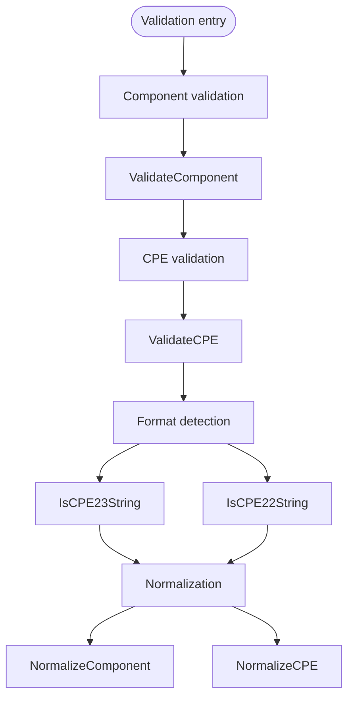

# Validation

The CPE library provides validation, format-detection, and normalization functions to ensure CPE data integrity and compliance with CPE specifications.

The diagram below shows the validation pipeline, from single-field component checks up through whole-CPE validation, format detection, and normalization:



## Component Validation

### ValidateComponent

```go
func ValidateComponent(value string, componentName string) error
```

Validates a single CPE component value (vendor, product, version, etc.) for compliance with CPE naming rules.

**Parameters:**
- `value` - Component value to validate
- `componentName` - Name of the component (used in the error message to identify which field failed)

**Returns:**
- `error` - Error if validation fails, `nil` if valid

**Validation Rules:**
- Empty strings are treated as valid (wildcard)
- Special values `*` (ANY) and `-` (NA) are allowed
- Must not contain illegal characters (`! @ # $ % ^ & ( ) { } [ ] | \ ; " ' < > ?`)
- Must not contain control characters or characters outside the printable ASCII range (32–126)

**Example:**
```go
// Valid components
err := cpeskills.ValidateComponent("microsoft", "Vendor")
if err != nil {
    fmt.Printf("Invalid: %v\n", err)
} else {
    fmt.Println("Valid component")
}

// Special values
err = cpeskills.ValidateComponent("*", "Version") // ANY value
if err == nil {
    fmt.Println("Wildcard is valid")
}

err = cpeskills.ValidateComponent("-", "Version") // NA value
if err == nil {
    fmt.Println("NA value is valid")
}

// Invalid component with a control character
err = cpeskills.ValidateComponent("invalid\x00component", "Product")
if err != nil {
    fmt.Printf("Invalid component: %v\n", err)
}
```

## CPE Validation

### ValidateCPE

```go
func ValidateCPE(cpe *CPE) error
```

Validates a complete CPE object for correctness and compliance.

**Parameters:**
- `cpe` - CPE object to validate

**Returns:**
- `error` - Error if validation fails

**Validation Checks:**
- `cpe` must not be `nil`
- `Part` must not be empty and must be one of `a`, `h`, `o`, or `*`
- `Vendor` and `ProductName` must not be empty
- Every component field is passed through `ValidateComponent`

**Example:**
```go
// Create and validate a CPE
cpeObj := &cpeskills.CPE{
    Part:        *cpeskills.PartApplication,
    Vendor:      cpeskills.Vendor("microsoft"),
    ProductName: cpeskills.Product("windows"),
    Version:     cpeskills.Version("10"),
}

err := cpeskills.ValidateCPE(cpeObj)
if err != nil {
    fmt.Printf("CPE validation failed: %v\n", err)
} else {
    fmt.Println("CPE is valid")
}

// Test invalid CPE
invalidCPE := &cpeskills.CPE{
    Part:        cpeskills.Part{ShortName: "x"}, // Invalid part
    Vendor:      cpeskills.Vendor("microsoft"),
    ProductName: cpeskills.Product("windows"),
}

err = cpeskills.ValidateCPE(invalidCPE)
if err != nil {
    fmt.Printf("Expected validation error: %v\n", err)
}
```

## Format Detection

### IsCPE23String

```go
func IsCPE23String(s string) bool
```

Reports whether a string looks like a CPE 2.3 URI (i.e. it starts with `cpe:2.3:`).

**Parameters:**
- `s` - String to check

**Returns:**
- `bool` - `true` if the string is in CPE 2.3 form

**Example:**
```go
cpe23Examples := []string{
    "cpe:2.3:a:microsoft:windows:10:*:*:*:*:*:*:*", // CPE 2.3
    "cpe:/a:apache:tomcat:8.5.0",                    // CPE 2.2
    "not a cpe",                                      // Not a CPE
}

for _, example := range cpe23Examples {
    if cpeskills.IsCPE23String(example) {
        fmt.Printf("CPE 2.3 string: %s\n", example)
    } else {
        fmt.Printf("Not a CPE 2.3 string: %s\n", example)
    }
}
```

### IsCPE22String

```go
func IsCPE22String(s string) bool
```

Reports whether a string looks like a CPE 2.2 URI (i.e. it starts with `cpe:/`).

**Parameters:**
- `s` - String to check

**Returns:**
- `bool` - `true` if the string is in CPE 2.2 form

**Example:**
```go
cpe22Examples := []string{
    "cpe:/a:apache:tomcat:8.5.0",                    // CPE 2.2
    "cpe:2.3:a:microsoft:windows:10:*:*:*:*:*:*:*", // CPE 2.3
    "invalid:/a:apache:tomcat:8.5.0",                // Invalid prefix
}

for _, example := range cpe22Examples {
    if cpeskills.IsCPE22String(example) {
        fmt.Printf("CPE 2.2 string: %s\n", example)
    } else {
        fmt.Printf("Not a CPE 2.2 string: %s\n", example)
    }
}
```

## Normalization

### NormalizeComponent

```go
func NormalizeComponent(value string) string
```

Normalizes a CPE component according to CPE specification rules.

**Parameters:**
- `value` - Component to normalize

**Returns:**
- `string` - Normalized component

**Normalization Rules:**
- Special values (`*`, `-`, and the empty string) are returned unchanged
- Convert to lowercase
- Replace spaces with underscores
- Collapse repeated underscores into a single underscore

**Example:**
```go
// Test component normalization
components := []string{
    "Microsoft",              // -> "microsoft"
    "Windows 10",             // -> "windows_10"
    "Microsoft  Office",      // -> "microsoft_office"
    "*",                      // -> "*" (unchanged)
    "-",                      // -> "-" (unchanged)
}

for _, comp := range components {
    normalized := cpeskills.NormalizeComponent(comp)
    fmt.Printf("'%s' -> '%s'\n", comp, normalized)
}
```

### NormalizeCPE

```go
func NormalizeCPE(cpe *CPE) *CPE
```

Normalizes all components of a CPE object. The input object is left unchanged; a new normalized object is returned (or `nil` if the input is `nil`).

**Parameters:**
- `cpe` - CPE to normalize

**Returns:**
- `*CPE` - New CPE with normalized components

**Example:**
```go
// Create CPE with non-normalized components
originalCPE := &cpeskills.CPE{
    Part:        *cpeskills.PartApplication,
    Vendor:      cpeskills.Vendor("Microsoft"),
    ProductName: cpeskills.Product("Windows 10"),
    Version:     cpeskills.Version("1.0"),
}

// Normalize the CPE
normalizedCPE := cpeskills.NormalizeCPE(originalCPE)

fmt.Printf("Original vendor: %s\n", originalCPE.Vendor)
fmt.Printf("Normalized vendor: %s\n", normalizedCPE.Vendor)
fmt.Printf("Original product: %s\n", originalCPE.ProductName)
fmt.Printf("Normalized product: %s\n", normalizedCPE.ProductName)
```

## Complete Example

```go
package main

import (
    "fmt"
    "github.com/scagogogo/cpe-skills"
)

func main() {
    // Component validation
    fmt.Println("=== Component Validation ===")
    components := []string{
        "microsoft",   // Valid
        "windows_10",  // Valid
        "*",           // Valid (wildcard)
        "-",           // Valid (NA)
        "invalid\x00", // Invalid (control character)
    }

    for _, comp := range components {
        err := cpeskills.ValidateComponent(comp, "Component")
        if err != nil {
            fmt.Printf("Invalid component '%s': %v\n", comp, err)
        } else {
            fmt.Printf("Valid component: %s\n", comp)
        }
    }

    // Format detection
    fmt.Println("\n=== Format Detection ===")
    cpeStrings := []string{
        "cpe:2.3:a:microsoft:windows:10:*:*:*:*:*:*:*",
        "cpe:/a:apache:tomcat:8.5.0",
        "invalid:format",
    }

    for _, cpeStr := range cpeStrings {
        switch {
        case cpeskills.IsCPE23String(cpeStr):
            fmt.Printf("CPE 2.3 string: %s\n", cpeStr)
        case cpeskills.IsCPE22String(cpeStr):
            fmt.Printf("CPE 2.2 string: %s\n", cpeStr)
        default:
            fmt.Printf("Not a CPE string: %s\n", cpeStr)
        }
    }

    // CPE object validation
    fmt.Println("\n=== CPE Object Validation ===")
    validCPE := &cpeskills.CPE{
        Part:        *cpeskills.PartApplication,
        Vendor:      cpeskills.Vendor("microsoft"),
        ProductName: cpeskills.Product("windows"),
        Version:     cpeskills.Version("10"),
    }

    err := cpeskills.ValidateCPE(validCPE)
    if err != nil {
        fmt.Printf("CPE validation failed: %v\n", err)
    } else {
        fmt.Println("CPE object is valid")
    }

    // Component normalization
    fmt.Println("\n=== Component Normalization ===")
    unnormalizedComponents := []string{
        "Microsoft",
        "Windows 10",
        "Microsoft  Office",
        "Product Name",
    }

    for _, comp := range unnormalizedComponents {
        normalized := cpeskills.NormalizeComponent(comp)
        fmt.Printf("'%s' -> '%s'\n", comp, normalized)
    }

    // CPE normalization
    fmt.Println("\n=== CPE Normalization ===")
    unnormalizedCPE := &cpeskills.CPE{
        Part:        *cpeskills.PartApplication,
        Vendor:      cpeskills.Vendor("Microsoft"),
        ProductName: cpeskills.Product("Windows 10"),
        Version:     cpeskills.Version("1.0"),
    }

    normalizedCPE := cpeskills.NormalizeCPE(unnormalizedCPE)
    fmt.Printf("Original: %s %s %s\n",
        unnormalizedCPE.Vendor, unnormalizedCPE.ProductName, unnormalizedCPE.Version)
    fmt.Printf("Normalized: %s %s %s\n",
        normalizedCPE.Vendor, normalizedCPE.ProductName, normalizedCPE.Version)
}
```
