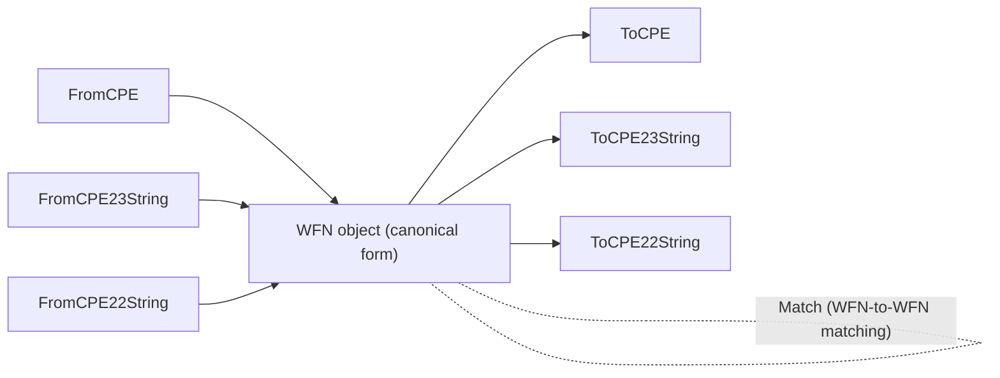

# WFN (Well-Formed Name)

The CPE library provides comprehensive support for Well-Formed Names (WFN), which are the canonical internal representation of CPE names as defined in the CPE specification.

The WFN object acts as a central conversion hub: any CPE representation can be turned into a WFN, and a WFN can be serialized back into any format. WFN objects can also be matched directly against each other.



## WFN Structure

### WFN

```go
type WFN struct {
    Part            string // Component type
    Vendor          string // Vendor name
    Product         string // Product name
    Version         string // Version
    Update          string // Update
    Edition         string // Edition
    Language        string // Language
    SoftwareEdition string // Software edition
    TargetSoftware  string // Target software
    TargetHardware  string // Target hardware
    Other           string // Other attributes
}
```

The WFN structure represents the canonical form of a CPE name with all attributes properly normalized.

## Creating WFN Objects

### NewWFN

```go
func NewWFN() *WFN
```

Creates an empty WFN. Unset attributes default to the logical value `ANY` (`*`) when read through `Get`.

**Returns:**
- `*WFN` - Empty WFN object

**Example:**
```go
wfn := cpeskills.NewWFN()
wfn.Set("part", "a")
wfn.Set("vendor", "microsoft")
fmt.Println(wfn.Get("vendor")) // microsoft
```

### FromCPE

```go
func FromCPE(cpe *CPE) *WFN
```

Creates a WFN from a CPE object.

**Parameters:**
- `cpe` - CPE object to convert

**Returns:**
- `*WFN` - WFN representation

**Example:**
```go
// Create CPE and convert to WFN
cpeObj, _ := cpeskills.ParseCpe23("cpe:2.3:a:microsoft:windows:10:*:*:*:*:*:*:*")
wfn := cpeskills.FromCPE(cpeObj)

fmt.Printf("WFN Part: %s\n", wfn.Part)
fmt.Printf("WFN Vendor: %s\n", wfn.Vendor)
fmt.Printf("WFN Product: %s\n", wfn.Product)
fmt.Printf("WFN Version: %s\n", wfn.Version)
```

### FromCPE23String

```go
func FromCPE23String(cpe23 string) (*WFN, error)
```

Creates a WFN directly from a CPE 2.3 format string.

**Parameters:**
- `cpe23` - CPE 2.3 format string

**Returns:**
- `*WFN` - WFN object
- `error` - Error if parsing fails

**Example:**
```go
wfn, err := cpeskills.FromCPE23String("cpe:2.3:a:apache:tomcat:9.0.0:*:*:*:*:*:*:*")
if err != nil {
    log.Fatal(err)
}

fmt.Printf("Vendor: %s, Product: %s, Version: %s\n", 
    wfn.Vendor, wfn.Product, wfn.Version)
```

### FromCPE22String

```go
func FromCPE22String(cpe22 string) (*WFN, error)
```

Creates a WFN from a CPE 2.2 format string.

**Parameters:**
- `cpe22` - CPE 2.2 format string

**Returns:**
- `*WFN` - WFN object
- `error` - Error if parsing fails

**Example:**
```go
wfn, err := cpeskills.FromCPE22String("cpe:/a:apache:tomcat:8.5.0")
if err != nil {
    log.Fatal(err)
}

fmt.Printf("Converted CPE 2.2 to WFN: %s %s %s\n", 
    wfn.Vendor, wfn.Product, wfn.Version)
```

## Converting from WFN

### ToCPE

```go
func (w *WFN) ToCPE() *CPE
```

Converts a WFN to a CPE object.

**Returns:**
- `*CPE` - CPE object representation

**Example:**
```go
// Create WFN and convert to CPE
wfn := &cpeskills.WFN{
    Part:    "a",
    Vendor:  "microsoft",
    Product: "windows",
    Version: "10",
}

cpeObj := wfn.ToCPE()
fmt.Printf("CPE URI: %s\n", cpeObj.GetURI())
```

### ToCPE23String

```go
func (w *WFN) ToCPE23String() string
```

Converts a WFN to CPE 2.3 format string.

**Returns:**
- `string` - CPE 2.3 format string

**Example:**
```go
wfn := &cpeskills.WFN{
    Part:    "a",
    Vendor:  "apache",
    Product: "tomcat",
    Version: "9.0.0",
}

cpe23 := wfn.ToCPE23String()
fmt.Printf("CPE 2.3: %s\n", cpe23)
// Output: cpe:2.3:a:apache:tomcat:9.0.0:*:*:*:*:*:*:*
```

### ToCPE22String

```go
func (w *WFN) ToCPE22String() string
```

Converts a WFN to CPE 2.2 format string.

**Returns:**
- `string` - CPE 2.2 format string

**Example:**
```go
wfn := &cpeskills.WFN{
    Part:    "a",
    Vendor:  "apache",
    Product: "tomcat",
    Version: "8.5.0",
}

cpe22 := wfn.ToCPE22String()
fmt.Printf("CPE 2.2: %s\n", cpe22)
// Output: cpe:/a:apache:tomcat:8.5.0
```

## Attribute Access

### Get

```go
func (w *WFN) Get(attr string) string
```

Returns the value of an attribute by name. Empty attributes are returned as the logical value `ANY` (`*`). Valid attribute names are `part`, `vendor`, `product`, `version`, `update`, `edition`, `language`, `sw_edition`, `target_sw`, `target_hw`, and `other`.

**Parameters:**
- `attr` - Attribute name

**Returns:**
- `string` - Attribute value (or `*` if unset)

### Set

```go
func (w *WFN) Set(attr string, value string)
```

Sets the value of an attribute by name.

**Parameters:**
- `attr` - Attribute name
- `value` - Value to assign

### WFNString

```go
func (w *WFN) WFNString() string
```

Returns the canonical WFN string representation, e.g. `wfn:[part="a",vendor="microsoft",product="windows"]`.

**Returns:**
- `string` - WFN string representation

### IsIdentifierName

```go
func (w *WFN) IsIdentifierName() bool
```

Reports whether the WFN qualifies as a CPE identifier name (i.e. it has concrete `part`, `vendor`, and `product` values and no unquoted wildcards).

**Returns:**
- `bool` - `true` if the WFN is a valid identifier name

**Example:**
```go
wfn := cpeskills.NewWFN()
wfn.Set("part", "a")
wfn.Set("vendor", "microsoft")
wfn.Set("product", "windows")

fmt.Println(wfn.WFNString())        // wfn:[part="a",vendor="microsoft",product="windows"]
fmt.Println(wfn.IsIdentifierName()) // true
```

## WFN Matching

### Match

```go
func (w *WFN) Match(other *WFN) bool
```

Compares two WFN objects and reports whether they match according to the CPE matching rules. An attribute of `*` (ANY) matches any value; two `-` (NA) values match; otherwise an exact match is required.

**Parameters:**
- `other` - WFN to match against

**Returns:**
- `bool` - `true` if the WFNs match, `false` otherwise

**Example:**
```go
pattern, _ := cpeskills.FromCPE23String("cpe:2.3:a:microsoft:windows:*:*:*:*:*:*:*:*")
target, _ := cpeskills.FromCPE23String("cpe:2.3:a:microsoft:windows:10:*:*:*:*:*:*:*")

if pattern.Match(target) {
    fmt.Println("Target matches pattern")
}
```

## Value Handling

WFN uses special value handling for logical values:

### Special Values

- `ANY` (`*`) - Matches any value
- `NA` (`-`) - Not applicable/undefined

### FSStringToURI

```go
func FSStringToURI(fs string) string
```

Converts a CPE 2.3 formatted string to CPE 2.2 URI format.

**Parameters:**
- `fs` - Formatted string value

**Returns:**
- `string` - URI-format value

### URIToFSString

```go
func URIToFSString(uri string) string
```

Converts a CPE 2.2 URI value to CPE 2.3 formatted string.

**Parameters:**
- `uri` - URI value

**Returns:**
- `string` - Formatted string value

## Format Binding

For binding WFN objects to and from the standard CPE string formats, the library also provides the `BindToFS`, `UnbindFS`, `BindToURI`, and `UnbindURI` functions. See the Binding documentation for details.

## Complete Example

```go
package main

import (
    "fmt"
    "log"
    "github.com/scagogogo/cpe-skills"
)

func main() {
    // Create WFN from CPE 2.3 string
    fmt.Println("=== Creating WFN from CPE 2.3 ===")
    wfn1, err := cpeskills.FromCPE23String("cpe:2.3:a:apache:tomcat:9.0.0:*:*:*:*:*:*:*")
    if err != nil {
        log.Fatal(err)
    }

    fmt.Printf("Part: %s\n", wfn1.Part)
    fmt.Printf("Vendor: %s\n", wfn1.Vendor)
    fmt.Printf("Product: %s\n", wfn1.Product)
    fmt.Printf("Version: %s\n", wfn1.Version)

    // Create WFN from CPE 2.2 string
    fmt.Println("\n=== Creating WFN from CPE 2.2 ===")
    wfn2, err := cpeskills.FromCPE22String("cpe:/a:microsoft:windows:10")
    if err != nil {
        log.Fatal(err)
    }

    fmt.Printf("Vendor: %s\n", wfn2.Vendor)
    fmt.Printf("Product: %s\n", wfn2.Product)
    fmt.Printf("Version: %s\n", wfn2.Version)

    // Convert WFN back to different formats
    fmt.Println("\n=== Converting WFN to different formats ===")
    cpe23 := wfn1.ToCPE23String()
    cpe22 := wfn1.ToCPE22String()

    fmt.Printf("CPE 2.3: %s\n", cpe23)
    fmt.Printf("CPE 2.2: %s\n", cpe22)

    // Convert to CPE object
    cpeObj := wfn1.ToCPE()
    fmt.Printf("CPE URI: %s\n", cpeObj.GetURI())

    // WFN matching
    fmt.Println("\n=== WFN Matching ===")
    pattern, _ := cpeskills.FromCPE23String("cpe:2.3:a:apache:*:*:*:*:*:*:*:*:*")
    target, _ := cpeskills.FromCPE23String("cpe:2.3:a:apache:tomcat:9.0.0:*:*:*:*:*:*:*")

    if pattern.Match(target) {
        fmt.Println("Target matches pattern")
    } else {
        fmt.Println("Target does not match pattern")
    }

    // Create WFN manually and inspect it
    fmt.Println("\n=== Creating WFN manually ===")
    manualWFN := cpeskills.NewWFN()
    manualWFN.Set("part", "a")
    manualWFN.Set("vendor", "oracle")
    manualWFN.Set("product", "java")
    manualWFN.Set("version", "11.0.12")

    fmt.Printf("WFN string: %s\n", manualWFN.WFNString())
    fmt.Printf("Is identifier name: %t\n", manualWFN.IsIdentifierName())

    // Convert manual WFN to CPE
    manualCPE := manualWFN.ToCPE()
    fmt.Printf("Manual WFN as CPE: %s\n", manualCPE.GetURI())
}
```
