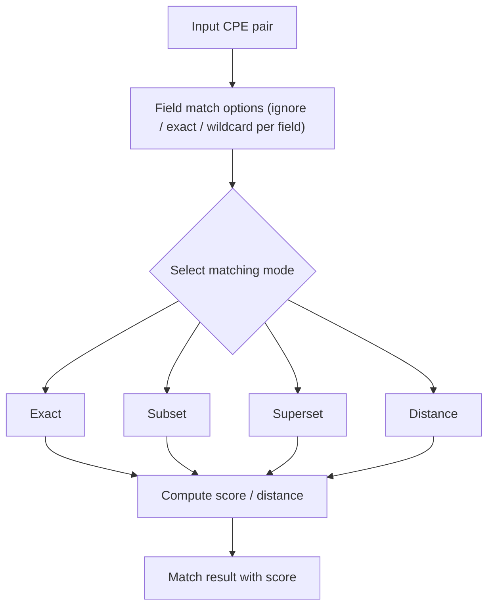

# Advanced Matching

This example demonstrates sophisticated CPE matching techniques including fuzzy matching, pattern matching, and complex matching algorithms.

## Overview

Advanced matching goes beyond simple string comparison to provide intelligent matching capabilities that can handle variations, patterns, and complex matching scenarios commonly encountered in real-world applications.

The diagram below outlines the advanced matching pipeline: a CPE pair enters, per-field match options control whether each field is ignored, matched exactly, or wildcarded, a matching mode is selected, a score or distance is computed, and the scored result is returned.



## Complete Example

```go
package main

import (
    "fmt"
    "log"

    "github.com/scagogogo/cpe-skills"
)

func main() {
    fmt.Println("=== Advanced CPE Matching Examples ===")

    // Example 1: Basic Matching (CPE.Match / MatchCPE)
    fmt.Println("\n1. Basic Matching:")

    // A wildcard pattern matches any version of Windows.
    patternCPE, err := cpeskills.ParseCpe23("cpe:2.3:a:microsoft:windows:*:*:*:*:*:*:*:*")
    if err != nil {
        log.Fatal(err)
    }
    targetCPE, err := cpeskills.ParseCpe23("cpe:2.3:a:microsoft:windows:10:*:*:*:*:*:*:*")
    if err != nil {
        log.Fatal(err)
    }

    // Method form: pattern.Match(target) follows the CPE Name Matching spec,
    // where a "*" in any field matches any value in the corresponding field.
    fmt.Printf("Pattern %s matches %s: %v\n",
        patternCPE.GetURI(), targetCPE.GetURI(), patternCPE.Match(targetCPE))

    // Functional form using MatchOptions. Here IgnoreVersion lets the version
    // field be skipped during comparison.
    opts := cpeskills.DefaultMatchOptions()
    opts.IgnoreVersion = true
    fmt.Printf("MatchCPE (IgnoreVersion=true): %v\n",
        cpeskills.MatchCPE(patternCPE, targetCPE, opts))

    // Example 2: Advanced Matching Modes (exact / subset / superset / distance)
    fmt.Println("\n2. Advanced Matching Modes:")

    // criteria is a more general pattern; target is a specific CPE.
    criteria, _ := cpeskills.ParseCpe23("cpe:2.3:a:microsoft:windows:*:*:*:*:*:*:*:*")
    specific, _ := cpeskills.ParseCpe23("cpe:2.3:a:microsoft:windows:10:*:*:*:*:*:*:*")

    modes := []struct {
        name string
        mode string
    }{
        {"exact", "exact"},
        {"subset", "subset"},      // criteria is a subset of (more specific than) target
        {"superset", "superset"}, // criteria is a superset of (more general than) target
        {"distance", "distance"}, // distance / similarity based matching
    }

    for _, m := range modes {
        o := cpeskills.NewAdvancedMatchOptions()
        o.MatchMode = m.mode
        result := cpeskills.AdvancedMatchCPE(criteria, specific, o)
        fmt.Printf("  mode=%-8s -> %v\n", m.name, result)
    }

    // Example 3: Regex, IgnoreCase, and PartialMatch Options
    fmt.Println("\n3. Regex / IgnoreCase / PartialMatch Options:")

    // UseRegex treats vendor/product fields as regular expressions.
    // IgnoreCase makes those regex matches case-insensitive.
    regexCriteria, _ := cpeskills.ParseCpe23("cpe:2.3:a:.*soft.*:.*:1.*:*:*:*:*:*:*")
    regexTarget, _ := cpeskills.ParseCpe23("cpe:2.3:a:microsoft:office:2019:*:*:*:*:*:*:*")

    regexOpts := cpeskills.NewAdvancedMatchOptions()
    regexOpts.MatchMode = "exact"
    regexOpts.UseRegex = true
    regexOpts.IgnoreCase = true
    fmt.Printf("UseRegex+IgnoreCase match: %v\n",
        cpeskills.AdvancedMatchCPE(regexCriteria, regexTarget, regexOpts))

    // PartialMatch allows substring matching on string fields.
    partialCriteria, _ := cpeskills.ParseCpe23("cpe:2.3:a:apache:tomcat:*:*:*:*:*:*:*:*")
    partialTarget, _ := cpeskills.ParseCpe23("cpe:2.3:a:apache:tomcat_server:9.0.0:*:*:*:*:*:*:*")
    partialOpts := cpeskills.NewAdvancedMatchOptions()
    partialOpts.MatchMode = "exact"
    partialOpts.PartialMatch = true
    fmt.Printf("PartialMatch (tomcat in tomcat_server): %v\n",
        cpeskills.AdvancedMatchCPE(partialCriteria, partialTarget, partialOpts))

    // Example 4: FieldOptions (per-field Weight and Required)
    fmt.Println("\n4. FieldOptions (Weight / Required):")

    // Configure per-field behavior. "vendor" and "product" are required and
    // carry higher weight; "version" is optional with a lower weight.
    fieldCriteria, _ := cpeskills.ParseCpe23("cpe:2.3:a:apache:tomcat:*:*:*:*:*:*:*:*")
    fieldTarget, _ := cpeskills.ParseCpe23("cpe:2.3:a:apache:tomcat:9.0.0:*:*:*:*:*:*:*")

    fieldOpts := cpeskills.NewAdvancedMatchOptions()
    fieldOpts.MatchMode = "exact"
    fieldOpts.FieldOptions = map[string]cpeskills.FieldMatchOption{
        "vendor":  {Weight: 0.3, Required: true, MatchMethod: "exact"},
        "product": {Weight: 0.4, Required: true, MatchMethod: "exact"},
        "version": {Weight: 0.2, Required: false, MatchMethod: "exact"},
    }
    fmt.Printf("FieldOptions match: %v\n",
        cpeskills.AdvancedMatchCPE(fieldCriteria, fieldTarget, fieldOpts))

    // Example 5: ScoreThreshold
    fmt.Println("\n5. ScoreThreshold:")

    // Lowering ScoreThreshold relaxes distance matching so near-misses pass.
    distCriteria, _ := cpeskills.ParseCpe23("cpe:2.3:a:apache:tomcat:9.0.0:*:*:*:*:*:*:*")
    distTarget, _ := cpeskills.ParseCpe23("cpe:2.3:a:apache:tomcat:9.0.1:*:*:*:*:*:*:*")

    strictOpts := cpeskills.NewAdvancedMatchOptions()
    strictOpts.MatchMode = "distance"
    strictOpts.ScoreThreshold = 0.9
    fmt.Printf("ScoreThreshold=0.9: %v\n",
        cpeskills.AdvancedMatchCPE(distCriteria, distTarget, strictOpts))

    looseOpts := cpeskills.NewAdvancedMatchOptions()
    looseOpts.MatchMode = "distance"
    looseOpts.ScoreThreshold = 0.5
    fmt.Printf("ScoreThreshold=0.5: %v\n",
        cpeskills.AdvancedMatchCPE(distCriteria, distTarget, looseOpts))

    // Example 6: Version Comparison (CompareVersions + type conversion)
    fmt.Println("\n6. Version Comparison:")

    // CPE field types (Vendor/Product/Version) are `type X string` aliases,
    // so they must be converted with string() before being passed to generic
    // string helpers like strings.Contains or CompareVersions.
    v1 := targetCPE.Version
    fmt.Printf("CompareVersions(%q, %q) = %d\n",
        string(v1), "10", cpeskills.CompareVersions(string(v1), "10"))

    fmt.Printf("IsVersionInRange(%q, %q, %q) = %v\n",
        string(v1), "1.0", "99.0",
        cpeskills.IsVersionInRange(string(v1), "1.0", "99.0"))

    // Example 7: Version Range Matching via AdvancedMatchOptions
    fmt.Println("\n7. Version Range Matching:")

    // VersionCompareMode together with VersionLower / VersionUpper performs
    // range-based version matching inside AdvancedMatchCPE.
    rangeCriteria, _ := cpeskills.ParseCpe23("cpe:2.3:a:oracle:java:*:*:*:*:*:*:*:*")
    rangeTarget, _ := cpeskills.ParseCpe23("cpe:2.3:a:oracle:java:8.0.291:*:*:*:*:*:*:*")

    rangeOpts := cpeskills.NewAdvancedMatchOptions()
    rangeOpts.MatchMode = "exact"
    rangeOpts.VersionCompareMode = "range"
    rangeOpts.VersionLower = "8.0.0"
    rangeOpts.VersionUpper = "8.0.999"
    fmt.Printf("Java 8.0.291 in [8.0.0, 8.0.999]: %v\n",
        cpeskills.AdvancedMatchCPE(rangeCriteria, rangeTarget, rangeOpts))
}
```

## Key Concepts

### 1. Matching Types

- **Exact**: Perfect string match
- **Fuzzy**: Similarity-based matching
- **Pattern**: Wildcard and regex matching
- **Semantic**: Meaning-based matching
- **Contextual**: Environment-aware matching

### 2. Scoring Systems

- **Binary**: Match/no-match
- **Similarity**: 0.0 to 1.0 score
- **Weighted**: Component-based scoring
- **Confidence**: Prediction certainty

### 3. Advanced Techniques

- **Machine Learning**: Trained models for prediction
- **Context Awareness**: Environment-specific matching
- **Version Ranges**: Flexible version matching
- **Semantic Equivalence**: Alias and abbreviation handling

## Best Practices

1. **Choose Appropriate Method**: Select matching technique based on use case
2. **Tune Thresholds**: Adjust score thresholds for your domain
3. **Validate Results**: Test matching accuracy with known datasets
4. **Consider Performance**: Balance accuracy with computational cost
5. **Handle Edge Cases**: Account for unusual CPE formats and values

## Performance Considerations

1. **Caching**: Cache expensive matching computations
2. **Indexing**: Use appropriate data structures for large datasets
3. **Parallel Processing**: Distribute matching across multiple cores
4. **Early Termination**: Stop processing when confidence is sufficient

## Next Steps

- Learn about [NVD Integration](./nvd-integration.md) for real-world matching
- Explore [CVE Mapping](./cve-mapping.md) for vulnerability correlation
- Check out [Storage](./storage.md) for persisting matching results
