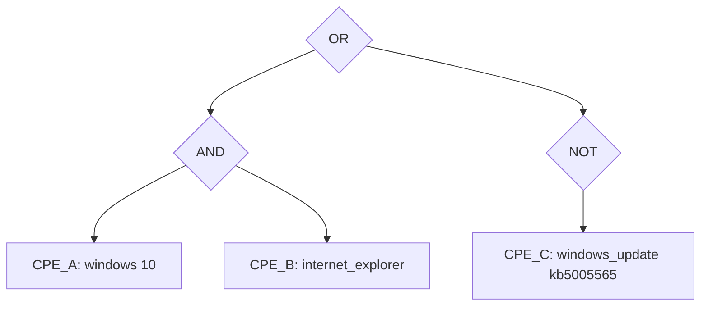

# Applicability Language

This example demonstrates how to use CPE Applicability Language for expressing complex matching conditions and logical relationships between CPE names.

## Overview

CPE Applicability Language allows you to create sophisticated expressions that define when a particular piece of information (like a vulnerability) applies to a system. It supports logical operators (AND, OR, NOT) and complex nested conditions.

An applicability expression is parsed into a logical expression tree. The diagram below shows how a rule like `(CPE_A AND CPE_B) OR (NOT CPE_C)` is represented: an `OR` root combines an `AND` branch and a `NOT` branch, with concrete CPE names as the leaves.



## Complete Example

```go
package main

import (
    "fmt"
    "log"

    "github.com/scagogogo/cpe-skills"
)

func main() {
    fmt.Println("=== CPE Applicability Language Examples ===")

    // Example 1: Basic Applicability Expressions
    fmt.Println("\n1. Basic Applicability Expressions:")

    // Simple expression: applies to Windows 10
    expr1 := "cpe:2.3:o:microsoft:windows:10:*:*:*:*:*:*:*"

    // OR expression: applies to Windows 10 OR Windows 11
    expr2 := "OR(cpe:2.3:o:microsoft:windows:10:*:*:*:*:*:*:*, cpe:2.3:o:microsoft:windows:11:*:*:*:*:*:*:*)"

    // AND expression: a single CPE that is BOTH Windows 10 AND has a specific
    // update applied. Note: AND is evaluated against one target CPE, so in
    // practice you combine CPEs that can all match the same name (e.g. using
    // wildcards), or you evaluate the expression against each CPE in a system.
    expr3 := "AND(cpe:2.3:o:microsoft:windows:10:*:*:*:*:*:*:*, cpe:2.3:o:microsoft:windows_update:kb5005565:*:*:*:*:*:*:*)"

    expressions := []struct {
        name string
        expr string
        desc string
    }{
        {"Simple", expr1, "Single CPE match"},
        {"OR Logic", expr2, "Multiple alternatives"},
        {"AND Logic", expr3, "Multiple requirements on one target"},
    }

    for _, e := range expressions {
        fmt.Printf("\n%s Expression:\n", e.name)
        fmt.Printf("  Description: %s\n", e.desc)
        fmt.Printf("  Expression: %s\n", e.expr)

        // Parse the expression with the real ParseExpression API.
        parsedExpr, err := cpeskills.ParseExpression(e.expr)
        if err != nil {
            log.Printf("Failed to parse expression: %v", err)
            continue
        }

        fmt.Printf("  Parsed successfully: %t\n", parsedExpr != nil)
        fmt.Printf("  Expression type: %d\n", parsedExpr.Type())
        fmt.Printf("  String form: %s\n", parsedExpr.String())
    }

    // Example 2: Complex Nested Expressions
    fmt.Println("\n2. Complex Nested Expressions:")

    // Complex vulnerability applicability.
    // Syntax: AND(...), OR(...), NOT(...) with comma-separated operands.
    complexExpr := "AND(OR(cpe:2.3:o:microsoft:windows:10:*:*:*:*:*:*:*, cpe:2.3:o:microsoft:windows:11:*:*:*:*:*:*:*), NOT(cpe:2.3:a:microsoft:edge:*:*:*:*:*:*:*:*))"

    fmt.Printf("Complex Expression:\n%s\n", complexExpr)

    parsedComplex, err := cpeskills.ParseExpression(complexExpr)
    if err != nil {
        log.Printf("Failed to parse complex expression: %v", err)
    } else {
        fmt.Printf("Successfully parsed complex expression\n")
        fmt.Printf("Expression type: %d\n", parsedComplex.Type())
        fmt.Printf("String form: %s\n", parsedComplex.String())
    }

    // Example 3: Testing Applicability
    fmt.Println("\n3. Testing Applicability:")

    // Define test systems. Each system is a set of CPEs installed on it.
    testSystems := []struct {
        name string
        cpes []string
    }{
        {
            "Windows 10 with IE",
            []string{
                "cpe:2.3:o:microsoft:windows:10:*:*:*:*:*:*:*",
                "cpe:2.3:a:microsoft:internet_explorer:11:*:*:*:*:*:*:*",
            },
        },
        {
            "Windows 11 with Edge",
            []string{
                "cpe:2.3:o:microsoft:windows:11:*:*:*:*:*:*:*",
                "cpe:2.3:a:microsoft:edge:95.0.1020.44:*:*:*:*:*:*:*",
            },
        },
        {
            "Windows 10 with patch",
            []string{
                "cpe:2.3:o:microsoft:windows:10:*:*:*:*:*:*:*",
                "cpe:2.3:a:microsoft:internet_explorer:11:*:*:*:*:*:*:*",
                "cpe:2.3:a:microsoft:windows_update:kb5005565:*:*:*:*:*:*:*",
            },
        },
        {
            "Linux system",
            []string{
                "cpe:2.3:o:canonical:ubuntu:20.04:*:*:*:*:*:*:*",
                "cpe:2.3:a:mozilla:firefox:95.0:*:*:*:*:*:*:*",
            },
        },
    }

    // The real Evaluate API evaluates an expression against a single target
    // CPE. To decide whether an expression "applies" to a whole system, we
    // evaluate it against every CPE in the system and OR the results: if any
    // installed CPE satisfies the expression, the system is applicable.
    systemApplies := func(expr cpeskills.Expression, cpes []*cpeskills.CPE) bool {
        for _, c := range cpes {
            if expr.Evaluate(c) {
                return true
            }
        }
        return false
    }

    for _, system := range testSystems {
        fmt.Printf("\nTesting system: %s\n", system.name)

        // Convert CPE strings to objects
        systemCPEs := make([]*cpeskills.CPE, 0, len(system.cpes))
        for _, cpeStr := range system.cpes {
            cpeObj, err := cpeskills.ParseCpe23(cpeStr)
            if err != nil {
                log.Printf("Failed to parse CPE %s: %v", cpeStr, err)
                continue
            }
            systemCPEs = append(systemCPEs, cpeObj)
        }

        var applies bool
        if parsedComplex != nil {
            applies = systemApplies(parsedComplex, systemCPEs)
        }

        status := "Not applicable"
        if applies {
            status = "Applicable"
        }

        fmt.Printf("  Result: %s\n", status)
        fmt.Printf("  System CPEs:\n")
        for _, cpeStr := range system.cpes {
            fmt.Printf("    - %s\n", cpeStr)
        }
    }

    // Example 4: Version Range Applicability
    fmt.Println("\n4. Version Range Applicability:")

    // Expression for Java versions 8.x, 9.x, or 10.x
    javaRangeExpr := "OR(cpe:2.3:a:oracle:java:8.*:*:*:*:*:*:*:*, cpe:2.3:a:oracle:java:9.*:*:*:*:*:*:*:*, cpe:2.3:a:oracle:java:10.*:*:*:*:*:*:*:*)"

    fmt.Printf("Java Version Range Expression:\n%s\n", javaRangeExpr)

    javaExpr, err := cpeskills.ParseExpression(javaRangeExpr)
    if err != nil {
        log.Printf("Failed to parse Java expression: %v", err)
    } else {
        // Test different Java versions
        javaVersions := []string{
            "cpe:2.3:a:oracle:java:7.0.80:*:*:*:*:*:*:*",
            "cpe:2.3:a:oracle:java:8.0.291:*:*:*:*:*:*:*",
            "cpe:2.3:a:oracle:java:9.0.4:*:*:*:*:*:*:*",
            "cpe:2.3:a:oracle:java:11.0.12:*:*:*:*:*:*:*",
            "cpe:2.3:a:oracle:java:17.0.1:*:*:*:*:*:*:*",
        }

        fmt.Println("\nTesting Java versions:")
        for _, javaVer := range javaVersions {
            javaCPE, perr := cpeskills.ParseCpe23(javaVer)
            if perr != nil {
                log.Printf("Failed to parse %s: %v", javaVer, perr)
                continue
            }
            // Evaluate the expression against a single target CPE.
            applies := javaExpr.Evaluate(javaCPE)

            status := "no"
            if applies {
                status = "yes"
            }

            fmt.Printf("  [%s] %s\n", status, javaVer)
        }
    }

    // Example 5: Platform-Specific Applicability
    fmt.Println("\n5. Platform-Specific Applicability:")

    // Expression for a web server running on Linux.
    webServerLinuxExpr := "AND(OR(cpe:2.3:o:*:linux:*:*:*:*:*:*:*:*, cpe:2.3:o:canonical:ubuntu:*:*:*:*:*:*:*:*, cpe:2.3:o:redhat:enterprise_linux:*:*:*:*:*:*:*:*), OR(cpe:2.3:a:apache:http_server:*:*:*:*:*:*:*:*, cpe:2.3:a:nginx:nginx:*:*:*:*:*:*:*:*))"

    fmt.Printf("Web Server on Linux Expression:\n%s\n", webServerLinuxExpr)

    webServerExpr, err := cpeskills.ParseExpression(webServerLinuxExpr)
    if err != nil {
        log.Printf("Failed to parse web server expression: %v", err)
    } else {
        // Test different server configurations
        serverConfigs := []struct {
            name string
            cpes []string
        }{
            {
                "Apache on Ubuntu",
                []string{
                    "cpe:2.3:o:canonical:ubuntu:20.04:*:*:*:*:*:*:*",
                    "cpe:2.3:a:apache:http_server:2.4.41:*:*:*:*:*:*:*",
                },
            },
            {
                "Nginx on RHEL",
                []string{
                    "cpe:2.3:o:redhat:enterprise_linux:8:*:*:*:*:*:*:*",
                    "cpe:2.3:a:nginx:nginx:1.18.0:*:*:*:*:*:*:*",
                },
            },
            {
                "IIS on Windows",
                []string{
                    "cpe:2.3:o:microsoft:windows:10:*:*:*:*:*:*:*",
                    "cpe:2.3:a:microsoft:internet_information_services:10.0:*:*:*:*:*:*:*",
                },
            },
        }

        fmt.Println("\nTesting server configurations:")
        for _, config := range serverConfigs {
            configCPEs := make([]*cpeskills.CPE, 0, len(config.cpes))
            for _, cpeStr := range config.cpes {
                cpeObj, perr := cpeskills.ParseCpe23(cpeStr)
                if perr != nil {
                    log.Printf("Failed to parse %s: %v", cpeStr, perr)
                    continue
                }
                configCPEs = append(configCPEs, cpeObj)
            }

            applies := systemApplies(webServerExpr, configCPEs)

            status := "no"
            if applies {
                status = "yes"
            }

            fmt.Printf("  [%s] %s\n", status, config.name)
        }
    }

    // Example 6: Filtering a CPE List
    fmt.Println("\n6. Filtering a CPE List:")

    // FilterCPEs returns every CPE in a list that satisfies the expression.
    allCPEs := []*cpeskills.CPE{
        mustParse("cpe:2.3:o:microsoft:windows:10:*:*:*:*:*:*:*"),
        mustParse("cpe:2.3:o:microsoft:windows:11:*:*:*:*:*:*:*"),
        mustParse("cpe:2.3:o:canonical:ubuntu:20.04:*:*:*:*:*:*:*"),
        mustParse("cpe:2.3:o:redhat:enterprise_linux:8:*:*:*:*:*:*:*"),
    }

    winExpr, err := cpeskills.ParseExpression("OR(cpe:2.3:o:microsoft:windows:10:*:*:*:*:*:*:*, cpe:2.3:o:microsoft:windows:11:*:*:*:*:*:*:*)")
    if err != nil {
        log.Fatalf("Failed to parse Windows expression: %v", err)
    }

    matched := cpeskills.FilterCPEs(allCPEs, winExpr)
    fmt.Printf("Matched %d Windows CPE(s):\n", len(matched))
    for _, c := range matched {
        fmt.Printf("  - %s\n", c.Cpe23)
    }
}

func mustParse(cpeStr string) *cpeskills.CPE {
    cpeObj, err := cpeskills.ParseCpe23(cpeStr)
    if err != nil {
        panic(err)
    }
    return cpeObj
}
```

## Key Concepts

### 1. Logical Operators

- **AND**: All conditions must be true
- **OR**: At least one condition must be true  
- **NOT**: Condition must be false

### 2. Expression Structure

- **Simple**: Single CPE match
- **Compound**: Multiple CPEs with operators
- **Nested**: Complex hierarchical conditions

### 3. Use Cases

- **Vulnerability Applicability**: Define affected systems
- **Policy Compliance**: Specify required configurations
- **Asset Classification**: Group similar systems
- **Patch Management**: Identify update targets

## Best Practices

1. **Use Wildcards**: Simplify expressions with wildcards when appropriate
2. **Group Logically**: Group related conditions together
3. **Test Thoroughly**: Validate expressions against known systems
4. **Document Intent**: Comment complex expressions
5. **Optimize Performance**: Prefer simpler expressions when possible

## Next Steps

- Learn about [Advanced Matching](./advanced-matching.md) for complex scenarios
- Explore [CPE Sets](./sets.md) for bulk operations
- Check out [NVD Integration](./nvd-integration.md) for real-world applicability
