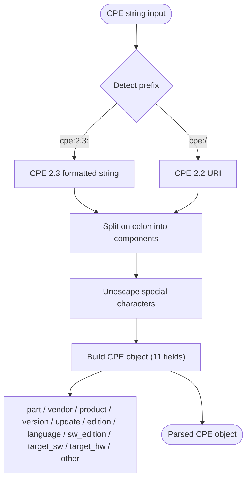

# Basic Parsing

This example demonstrates the fundamental parsing capabilities of the CPE library, showing how to parse CPE strings in both 2.2 and 2.3 formats.

## Overview

The CPE library supports parsing Common Platform Enumeration strings in two standard formats:
- **CPE 2.3**: `cpe:2.3:part:vendor:product:version:update:edition:language:sw_edition:target_sw:target_hw:other`
- **CPE 2.2**: `cpe:/part:vendor:product:version:update:edition:language`

The diagram below shows how a raw CPE string flows through the parser to become a structured CPE object:



The next diagram shows the 13-segment ordering of a CPE 2.3 formatted string:


## Complete Example

```go
package main

import (
    "fmt"
    "log"
    "github.com/scagogogo/cpe-skills"
)

func main() {
    fmt.Println("=== CPE Parsing Examples ===")
    
    // Example 1: Parse CPE 2.3 format
    fmt.Println("\n1. Parsing CPE 2.3 Format:")
    cpe23Examples := []string{
        "cpe:2.3:a:microsoft:windows:10:*:*:*:*:*:*:*",
        "cpe:2.3:a:adobe:reader:2021.001.20150:*:*:*:*:*:*:*",
        "cpe:2.3:o:linux:kernel:5.4.0:*:*:*:*:*:*:*",
        "cpe:2.3:h:cisco:catalyst_2960:*:*:*:*:*:*:*:*",
    }
    
    for i, cpeStr := range cpe23Examples {
        fmt.Printf("\nExample %d: %s\n", i+1, cpeStr)
        
        cpeObj, err := cpeskills.ParseCpe23(cpeStr)
        if err != nil {
            log.Printf("Failed to parse: %v", err)
            continue
        }
        
        // Display parsed components
        fmt.Printf("  Part: %s (%s)\n", cpeObj.Part.ShortName, cpeObj.Part.LongName)
        fmt.Printf("  Vendor: %s\n", cpeObj.Vendor)
        fmt.Printf("  Product: %s\n", cpeObj.ProductName)
        fmt.Printf("  Version: %s\n", cpeObj.Version)
        
        if cpeObj.Update != "" {
            fmt.Printf("  Update: %s\n", cpeObj.Update)
        }
        if cpeObj.Edition != "" {
            fmt.Printf("  Edition: %s\n", cpeObj.Edition)
        }
    }
    
    // Example 2: Parse CPE 2.2 format
    fmt.Println("\n2. Parsing CPE 2.2 Format:")
    cpe22Examples := []string{
        "cpe:/a:apache:tomcat:8.5.0",
        "cpe:/a:oracle:java:11.0.12",
        "cpe:/o:microsoft:windows:10",
        "cpe:/h:dell:poweredge_r740",
    }
    
    for i, cpeStr := range cpe22Examples {
        fmt.Printf("\nExample %d: %s\n", i+1, cpeStr)
        
        cpeObj, err := cpeskills.ParseCpe22(cpeStr)
        if err != nil {
            log.Printf("Failed to parse: %v", err)
            continue
        }
        
        fmt.Printf("  Part: %s (%s)\n", cpeObj.Part.ShortName, cpeObj.Part.LongName)
        fmt.Printf("  Vendor: %s\n", cpeObj.Vendor)
        fmt.Printf("  Product: %s\n", cpeObj.ProductName)
        fmt.Printf("  Version: %s\n", cpeObj.Version)
        
        // Show the equivalent CPE 2.3 format
        fmt.Printf("  CPE 2.3 equivalent: %s\n", cpeObj.Cpe23)
    }
    
    // Example 3: Error handling
    fmt.Println("\n3. Error Handling:")
    invalidCPEs := []string{
        "invalid:format",
        "cpe:2.3:x:vendor:product:1.0:*:*:*:*:*:*:*", // Invalid part
        "cpe:2.3:a:vendor:product", // Too few components
        "cpe:/x:vendor:product:1.0", // Invalid part in 2.2
    }
    
    for i, invalidCPE := range invalidCPEs {
        fmt.Printf("\nInvalid Example %d: %s\n", i+1, invalidCPE)
        
        // Try parsing as CPE 2.3 first
        _, err := cpeskills.ParseCpe23(invalidCPE)
        if err != nil {
            if cpeskills.IsInvalidFormatError(err) {
                fmt.Printf("  ❌ Invalid CPE 2.3 format: %v\n", err)
            } else if cpeskills.IsInvalidPartError(err) {
                fmt.Printf("  ❌ Invalid part value: %v\n", err)
            } else {
                fmt.Printf("  ❌ Other parsing error: %v\n", err)
            }
        }
    }
    
    // Example 4: Working with parsed CPE objects
    fmt.Println("\n4. Working with Parsed CPE Objects:")
    
    windowsCPE, err := cpeskills.ParseCpe23("cpe:2.3:a:microsoft:windows:10:*:*:*:*:*:*:*")
    if err != nil {
        log.Fatal(err)
    }
    
    fmt.Printf("Original CPE: %s\n", windowsCPE.GetURI())
    fmt.Printf("Vendor: %s\n", windowsCPE.Vendor)
    fmt.Printf("Product: %s\n", windowsCPE.ProductName)
    fmt.Printf("Version: %s\n", windowsCPE.Version)
    
    // Modify the CPE
    windowsCPE.Version = "11"
    fmt.Printf("Modified CPE: %s\n", cpeskills.FormatCpe23(windowsCPE))
    
    // Example 5: Format conversion
    fmt.Println("\n5. Format Conversion:")
    
    // Parse CPE 2.2 and convert to 2.3
    tomcatCPE, err := cpeskills.ParseCpe22("cpe:/a:apache:tomcat:9.0.0")
    if err != nil {
        log.Fatal(err)
    }
    
    fmt.Printf("Original CPE 2.2: cpe:/a:apache:tomcat:9.0.0\n")
    fmt.Printf("Converted to CPE 2.3: %s\n", tomcatCPE.Cpe23)
    
    // Convert back to CPE 2.2 format
    cpe22Format := cpeskills.FormatCpe22(tomcatCPE)
    fmt.Printf("Back to CPE 2.2: %s\n", cpe22Format)
    
    // Example 6: Special values
    fmt.Println("\n6. Special Values:")
    
    specialCPE, err := cpeskills.ParseCpe23("cpe:2.3:a:*:*:*:*:*:*:*:*:*:*")
    if err != nil {
        log.Fatal(err)
    }
    
    fmt.Printf("Wildcard CPE: %s\n", specialCPE.GetURI())
    fmt.Printf("Vendor (wildcard): %s\n", specialCPE.Vendor)
    fmt.Printf("Product (wildcard): %s\n", specialCPE.ProductName)
    
    naCPE, err := cpeskills.ParseCpe23("cpe:2.3:a:vendor:product:-:-:-:*:*:*:*:*")
    if err != nil {
        log.Fatal(err)
    }
    
    fmt.Printf("CPE with NA values: %s\n", naCPE.GetURI())
    fmt.Printf("Version (NA): %s\n", naCPE.Version)
    fmt.Printf("Update (NA): %s\n", naCPE.Update)
}
```

## Expected Output

```text
=== CPE Parsing Examples ===

1. Parsing CPE 2.3 Format:

Example 1: cpe:2.3:a:microsoft:windows:10:*:*:*:*:*:*:*
  Part: a (Application)
  Vendor: microsoft
  Product: windows
  Version: 10

Example 2: cpe:2.3:a:adobe:reader:2021.001.20150:*:*:*:*:*:*:*
  Part: a (Application)
  Vendor: adobe
  Product: reader
  Version: 2021.001.20150

Example 3: cpe:2.3:o:linux:kernel:5.4.0:*:*:*:*:*:*:*
  Part: o (Operation System)
  Vendor: linux
  Product: kernel
  Version: 5.4.0

Example 4: cpe:2.3:h:cisco:catalyst_2960:*:*:*:*:*:*:*:*
  Part: h (Hardware)
  Vendor: cisco
  Product: catalyst_2960
  Version: *

2. Parsing CPE 2.2 Format:

Example 1: cpe:/a:apache:tomcat:8.5.0
  Part: a (Application)
  Vendor: apache
  Product: tomcat
  Version: 8.5.0
  CPE 2.3 equivalent: cpe:2.3:a:apache:tomcat:8.5.0:*:*:*:*:*:*:*

...
```

## Key Concepts

### 1. CPE Components

Every CPE has these main components:
- **Part**: Type of component (a=application, h=hardware, o=operating system)
- **Vendor**: Manufacturer or developer
- **Product**: Product name
- **Version**: Version number
- **Additional fields**: Update, edition, language, etc.

### 2. Special Values

- `*` (asterisk): Wildcard - matches any value
- `-` (hyphen): Not Applicable - indicates the attribute is not relevant

### 3. Error Handling

The library provides specific error types:
- `InvalidFormatError`: Malformed CPE string
- `InvalidPartError`: Invalid part value
- `ParsingError`: General parsing failure

### 4. Format Conversion

The library automatically handles conversion between CPE 2.2 and 2.3 formats, allowing you to work with either format seamlessly.

## Best Practices

1. **Always handle errors** when parsing CPE strings
2. **Validate input** before parsing if the source is untrusted
3. **Use the appropriate format** for your use case
4. **Check for special values** when processing CPE components

## Next Steps

- Learn about [CPE Matching](./matching.md) to compare CPE objects
- Explore [WFN Conversion](./wfn-conversion.md) for internal representation
- See [Storage](./storage.md) for persisting parsed CPE data
