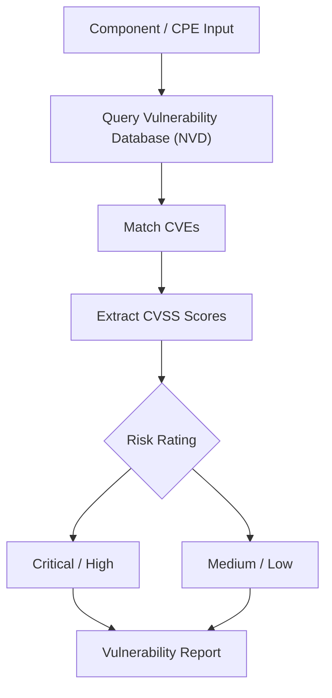

# CVE Mapping

This example demonstrates how to map CPE names to Common Vulnerabilities and Exposures (CVE) for comprehensive vulnerability management and security assessment.

## Overview

CVE mapping allows you to correlate software components identified by CPE names with known security vulnerabilities. This is essential for vulnerability assessment, patch management, and security compliance.

The following diagram shows the CVE mapping and risk assessment workflow:



## Complete Example

```go
package main

import (
    "fmt"
    "sort"
    "strings"
    "time"

    "github.com/scagogogo/cpe-skills"
)

func main() {
    fmt.Println("=== CVE Mapping Examples ===")

    // Example 1: Build a CVE reference list and map CPEs to CVEs
    fmt.Println("\n1. Basic CPE to CVE Mapping:")

    // Build a list of CVEReference objects (in real code you would load
    // these from an NVD feed via DownloadAllNVDData; here we build them by
    // hand so the example is self-contained and runs offline).
    cves := buildSampleCVEReferences()
    fmt.Printf("Loaded %d CVE entries\n", len(cves))

    // Test CPEs for vulnerability lookup
    testCPEs := []string{
        "cpe:2.3:a:apache:log4j:2.14.1:*:*:*:*:*:*:*",
        "cpe:2.3:a:apache:tomcat:8.5.0:*:*:*:*:*:*:*",
        "cpe:2.3:a:oracle:java:8.0.291:*:*:*:*:*:*:*",
        "cpe:2.3:o:microsoft:windows:10:*:*:*:*:*:*:*",
        "cpe:2.3:a:nginx:nginx:1.18.0:*:*:*:*:*:*:*",
    }

    for _, cpeStr := range testCPEs {
        fmt.Printf("\nCPE: %s\n", cpeStr)

        // QueryByCVE returns the *CPE objects that a given CVE affects, so to
        // discover which CVEs affect a given CPE string we parse it and use
        // QueryByProduct on the parsed vendor/product/version.
        cpeObj, err := cpeskills.ParseCpe23(cpeStr)
        if err != nil {
            fmt.Printf("  parse error: %v\n", err)
            continue
        }

        affecting := cpeskills.QueryByProduct(
            cves,
            string(cpeObj.Vendor),
            string(cpeObj.ProductName),
            string(cpeObj.Version),
        )

        if len(affecting) == 0 {
            fmt.Println("  No known vulnerabilities")
        } else {
            fmt.Printf("  Found %d vulnerabilities:\n", len(affecting))
            for i, cve := range affecting[:minInt(3, len(affecting))] {
                fmt.Printf("    %d. %s (CVSS: %.1f, %s)\n", i+1, cve.CVEID, cve.CVSSScore, cve.Severity)
                fmt.Printf("       %s\n", truncateString(cve.Description, 60))
            }
            if len(affecting) > 3 {
                fmt.Printf("    ... and %d more\n", len(affecting)-3)
            }
        }
    }

    // Example 2: Version range vulnerability mapping
    fmt.Println("\n2. Version Range Vulnerability Mapping:")

    versionRanges := []struct {
        product  string
        vendor   string
        versions []string
    }{
        {product: "log4j", vendor: "apache", versions: []string{"2.0", "2.10.0", "2.14.1", "2.15.0", "2.16.0"}},
        {product: "tomcat", vendor: "apache", versions: []string{"8.5.0", "8.5.50", "9.0.0", "9.0.45", "10.0.0"}},
    }

    for _, vr := range versionRanges {
        fmt.Printf("\n%s %s version vulnerability analysis:\n", vr.vendor, vr.product)

        for _, version := range vr.versions {
            matched := cpeskills.QueryByProduct(cves, vr.vendor, vr.product, version)

            status, riskLevel := "OK", "Low"
            if len(matched) > 0 {
                maxScore := 0.0
                for _, cve := range matched {
                    if cve.CVSSScore > maxScore {
                        maxScore = cve.CVSSScore
                    }
                }
                status, riskLevel = riskBadge(maxScore)
            }

            fmt.Printf("  %s v%s: %d CVEs (%s risk)\n", status, version, len(matched), riskLevel)
        }
    }

    // Example 3: System inventory vulnerability assessment
    fmt.Println("\n3. System Inventory Vulnerability Assessment:")

    systemInventory := []struct {
        name string
        cpes []string
    }{
        {
            name: "Web Server",
            cpes: []string{
                "cpe:2.3:o:canonical:ubuntu:20.04:*:*:*:*:*:*:*",
                "cpe:2.3:a:apache:http_server:2.4.41:*:*:*:*:*:*:*",
                "cpe:2.3:a:apache:tomcat:8.5.0:*:*:*:*:*:*:*",
                "cpe:2.3:a:oracle:java:8.0.291:*:*:*:*:*:*:*",
            },
        },
        {
            name: "Application Server",
            cpes: []string{
                "cpe:2.3:o:redhat:enterprise_linux:8:*:*:*:*:*:*:*",
                "cpe:2.3:a:apache:tomcat:9.0.0:*:*:*:*:*:*:*",
                "cpe:2.3:a:oracle:java:11.0.12:*:*:*:*:*:*:*",
                "cpe:2.3:a:apache:log4j:2.14.1:*:*:*:*:*:*:*",
            },
        },
    }

    fmt.Println("System vulnerability assessment:")
    for _, system := range systemInventory {
        fmt.Printf("\n%s:\n", system.name)

        totalCVEs, criticalCVEs, highCVEs := 0, 0, 0
        maxScore := 0.0

        for _, cpeStr := range system.cpes {
            cpeObj, err := cpeskills.ParseCpe23(cpeStr)
            if err != nil {
                continue
            }
            matched := cpeskills.QueryByProduct(
                cves,
                string(cpeObj.Vendor),
                string(cpeObj.ProductName),
                string(cpeObj.Version),
            )
            totalCVEs += len(matched)

            for _, cve := range matched {
                if cve.CVSSScore > maxScore {
                    maxScore = cve.CVSSScore
                }
                if cve.CVSSScore >= 9.0 {
                    criticalCVEs++
                } else if cve.CVSSScore >= 7.0 {
                    highCVEs++
                }
            }
        }

        fmt.Printf("  Components: %d\n", len(system.cpes))
        fmt.Printf("  Total CVEs: %d\n", totalCVEs)
        fmt.Printf("  Critical: %d, High: %d\n", criticalCVEs, highCVEs)
        fmt.Printf("  Max CVSS: %.1f\n", maxScore)
        fmt.Printf("  Risk Level: %s\n", riskLevel(maxScore))
    }

    // Example 4: CVE timeline analysis
    fmt.Println("\n4. CVE Timeline Analysis:")

    // Sort the CVE list by publication date to build a timeline.
    timeline := make([]*cpeskills.CVEReference, len(cves))
    copy(timeline, cves)
    sort.Slice(timeline, func(i, j int) bool {
        return timeline[i].PublishedDate.Before(timeline[j].PublishedDate)
    })

    fmt.Println("CVE timeline (sorted by publication date):")
    for _, cve := range timeline {
        fmt.Printf("  %s: %s (CVSS: %.1f)\n",
            cve.PublishedDate.Format("2006-01-02"), cve.CVEID, cve.CVSSScore)
    }

    if len(timeline) > 1 {
        firstCVE := timeline[0].PublishedDate
        lastCVE := timeline[len(timeline)-1].PublishedDate
        timespan := lastCVE.Sub(firstCVE)

        fmt.Println("\nVulnerability trend:")
        fmt.Printf("  First CVE: %s\n", firstCVE.Format("2006-01-02"))
        fmt.Printf("  Latest CVE: %s\n", lastCVE.Format("2006-01-02"))
        days := timespan.Hours() / 24
        if days > 0 {
            fmt.Printf("  Timespan: %.0f days\n", days)
            fmt.Printf("  Rate: %.2f CVEs/month\n", float64(len(timeline))/(days/30))
        }
    }

    // Example 5: Patch priority analysis
    fmt.Println("\n5. Patch Priority Analysis:")

    patchCandidates := []string{
        "cpe:2.3:a:apache:log4j:2.14.1:*:*:*:*:*:*:*",
        "cpe:2.3:a:apache:tomcat:8.5.0:*:*:*:*:*:*:*",
        "cpe:2.3:a:oracle:java:8.0.291:*:*:*:*:*:*:*",
    }

    type patchPriority struct {
        cpe      string
        cveCount int
        maxScore float64
        priority string
        urgency  string
    }

    var priorities []patchPriority
    for _, cpeStr := range patchCandidates {
        cpeObj, err := cpeskills.ParseCpe23(cpeStr)
        if err != nil {
            continue
        }
        matched := cpeskills.QueryByProduct(
            cves,
            string(cpeObj.Vendor),
            string(cpeObj.ProductName),
            string(cpeObj.Version),
        )

        maxScore := 0.0
        for _, cve := range matched {
            if cve.CVSSScore > maxScore {
                maxScore = cve.CVSSScore
            }
        }

        priorities = append(priorities, patchPriority{
            cpe:      cpeStr,
            cveCount: len(matched),
            maxScore: maxScore,
            priority: patchPriorityLevel(len(matched), maxScore),
            urgency:  patchUrgency(maxScore, matched),
        })
    }

    sort.Slice(priorities, func(i, j int) bool {
        return priorities[i].maxScore > priorities[j].maxScore
    })

    fmt.Println("Patch priority ranking:")
    for i, p := range priorities {
        cpeObj, _ := cpeskills.ParseCpe23(p.cpe)
        fmt.Printf("  %d. %s %s\n", i+1, cpeObj.Vendor, cpeObj.ProductName)
        fmt.Printf("     CVEs: %d, Max CVSS: %.1f\n", p.cveCount, p.maxScore)
        fmt.Printf("     Priority: %s, Urgency: %s\n", p.priority, p.urgency)
    }

    // Example 6: CVE impact analysis (look up a CVE and its affected CPEs)
    fmt.Println("\n6. CVE Impact Analysis:")

    impactAnalysis := []string{
        "CVE-2021-44228", // Log4Shell
        "CVE-2021-25122", // Apache Tomcat
    }

    for _, cveID := range impactAnalysis {
        fmt.Printf("\n%s Impact Analysis:\n", cveID)

        cveInfo := cpeskills.GetCVEInfo(cves, cveID)
        if cveInfo == nil {
            fmt.Println("  CVE not found in database")
            continue
        }

        fmt.Printf("  CVSS Score: %.1f\n", cveInfo.CVSSScore)
        fmt.Printf("  Severity: %s\n", cveInfo.Severity)
        fmt.Printf("  Published: %s\n", cveInfo.PublishedDate.Format("2006-01-02"))
        fmt.Printf("  Description: %s\n", cveInfo.Description)

        // QueryByCVE returns the parsed CPE objects this CVE affects.
        affectedCPEs := cpeskills.QueryByCVE(cves, cveID)
        fmt.Printf("  Affected CPEs: %d\n", len(affectedCPEs))
        if len(affectedCPEs) > 0 {
            fmt.Println("  Sample affected products:")
            for i, cpe := range affectedCPEs[:minInt(5, len(affectedCPEs))] {
                fmt.Printf("    %d. %s %s %s\n", i+1, cpe.Vendor, cpe.ProductName, cpe.Version)
            }
        }
    }

    // Example 7: CVE text extraction, grouping, sorting, dedup, validation
    fmt.Println("\n7. CVE Text Mining & Validation:")

    sampleText := `The system is affected by CVE-2021-44228 and cve-2021-45046.
Also see CVE-2017-5638 (Apache Struts) and the duplicate cve-2021-44228.`

    extracted := cpeskills.ExtractCVEsFromText(sampleText)
    fmt.Printf("Extracted from text: %v\n", extracted)

    unique := cpeskills.RemoveDuplicateCVEs(extracted)
    fmt.Printf("After dedup: %v\n", unique)

    sorted := cpeskills.SortCVEs(unique)
    fmt.Printf("Sorted: %v\n", sorted)

    grouped := cpeskills.GroupCVEsByYear(sorted)
    fmt.Println("Grouped by year:")
    for year, ids := range grouped {
        fmt.Printf("  %s: %v\n", year, ids)
    }

    fmt.Println("Validation:")
    for _, id := range []string{"CVE-2021-44228", "CVE-2099-12345", "CVE2021-44228"} {
        fmt.Printf("  %s -> valid=%v\n", id, cpeskills.ValidateCVE(id))
    }

    fmt.Println("\nCVE mapping example complete")
}

// buildSampleCVEReferences creates a small in-memory CVE list using the real
// CVEReference API: NewCVEReference + AddAffectedCPE + SetSeverity + metadata.
func buildSampleCVEReferences() []*cpeskills.CVEReference {
    log4j := cpeskills.NewCVEReference("CVE-2021-44228")
    log4j.Description = "Apache Log4j2 JNDI features do not protect against attacker controlled LDAP and other JNDI related endpoints."
    log4j.PublishedDate = time.Date(2021, 12, 10, 0, 0, 0, 0, time.UTC)
    log4j.AddAffectedCPE("cpe:2.3:a:apache:log4j:2.0:*:*:*:*:*:*:*")
    log4j.AddAffectedCPE("cpe:2.3:a:apache:log4j:2.14.1:*:*:*:*:*:*:*")
    log4j.AddAffectedCPE("cpe:2.3:a:apache:log4j:2.15.0:*:*:*:*:*:*:*")
    log4j.SetSeverity(10.0)
    log4j.SetMetadata("exploitAvailable", true)

    tomcat := cpeskills.NewCVEReference("CVE-2021-25122")
    tomcat.Description = "When responding to new h2c connection requests, Apache Tomcat could duplicate request headers."
    tomcat.PublishedDate = time.Date(2021, 3, 1, 0, 0, 0, 0, time.UTC)
    tomcat.AddAffectedCPE("cpe:2.3:a:apache:tomcat:8.5.0:*:*:*:*:*:*:*")
    tomcat.AddAffectedCPE("cpe:2.3:a:apache:tomcat:9.0.0:*:*:*:*:*:*:*")
    tomcat.SetSeverity(7.5)

    struts := cpeskills.NewCVEReference("CVE-2017-5638")
    struts.Description = "The Jakarta Multipart parser in Apache Struts 2 allows remote code execution."
    struts.PublishedDate = time.Date(2017, 3, 10, 0, 0, 0, 0, time.UTC)
    struts.AddAffectedCPE("cpe:2.3:a:apache:struts:2.3.5:*:*:*:*:*:*:*")
    struts.SetSeverity(9.8)

    return []*cpeskills.CVEReference{log4j, tomcat, struts}
}

func riskLevel(score float64) string {
    switch {
    case score >= 9.0:
        return "Critical"
    case score >= 7.0:
        return "High"
    case score >= 4.0:
        return "Medium"
    case score > 0:
        return "Low"
    default:
        return "None"
    }
}

func riskBadge(score float64) (string, string) {
    switch {
    case score >= 9.0:
        return "CRITICAL", "Critical"
    case score >= 7.0:
        return "HIGH", "High"
    case score >= 4.0:
        return "MEDIUM", "Medium"
    default:
        return "LOW", "Low"
    }
}

func patchPriorityLevel(cveCount int, maxScore float64) string {
    switch {
    case maxScore >= 9.0 || cveCount >= 5:
        return "Critical"
    case maxScore >= 7.0 || cveCount >= 3:
        return "High"
    case maxScore >= 4.0 || cveCount >= 1:
        return "Medium"
    }
    return "Low"
}

func patchUrgency(maxScore float64, cves []*cpeskills.CVEReference) string {
    recent := 0
    thirtyDaysAgo := time.Now().AddDate(0, 0, -30)
    for _, cve := range cves {
        if cve.PublishedDate.After(thirtyDaysAgo) {
            recent++
        }
    }
    switch {
    case maxScore >= 9.0 && recent > 0:
        return "Immediate"
    case maxScore >= 7.0:
        return "Urgent"
    case recent > 0:
        return "Soon"
    }
    return "Scheduled"
}

func minInt(a, b int) int {
    if a < b {
        return a
    }
    return b
}

func truncateString(s string, maxLen int) string {
    if len(s) <= maxLen {
        return s
    }
    if maxLen < 3 {
        return s[:maxLen]
    }
    return s[:maxLen-3] + "..."
}

// ensure strings import is used (placeholder for future text processing)
var _ = strings.TrimSpace
```

## Key Concepts

### 1. CVE Mapping Process

- **CPE Identification**: Identify software components using CPE names
- **Vulnerability Lookup**: Find CVEs associated with each CPE
- **Impact Assessment**: Evaluate severity and risk levels
- **Prioritization**: Rank vulnerabilities for remediation

### 2. Risk Assessment

- **CVSS Scoring**: Use Common Vulnerability Scoring System
- **Temporal Factors**: Consider age and exploit availability
- **Environmental Context**: Factor in system criticality
- **Business Impact**: Assess potential business consequences

### 3. Reporting and Analysis

- **Vulnerability Reports**: Generate comprehensive security reports
- **Trend Analysis**: Track vulnerability patterns over time
- **Patch Management**: Prioritize and schedule updates
- **Compliance**: Meet security compliance requirements

## Best Practices

1. **Regular Updates**: Keep CVE database current
2. **Automated Scanning**: Implement automated vulnerability scanning
3. **Risk-Based Prioritization**: Focus on highest-risk vulnerabilities first
4. **Documentation**: Maintain detailed vulnerability records
5. **Verification**: Validate CVE mappings for accuracy

## Integration Patterns

1. **CI/CD Integration**: Include vulnerability scanning in build pipelines
2. **Asset Management**: Link with configuration management databases
3. **Incident Response**: Integrate with security incident workflows
4. **Compliance Reporting**: Generate regulatory compliance reports

## Performance Considerations

1. **Database Optimization**: Index CVE data for fast lookups
2. **Caching**: Cache frequently accessed vulnerability data
3. **Batch Processing**: Process multiple CPEs efficiently
4. **Incremental Updates**: Update only changed vulnerability data

## Next Steps

- Learn about [Storage](./storage.md) for persisting vulnerability data
- Explore [Advanced Matching](./advanced-matching.md) for sophisticated detection
- Check out [NVD Integration](./nvd-integration.md) for official vulnerability feeds
