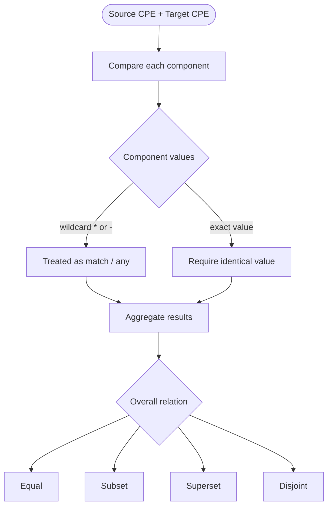
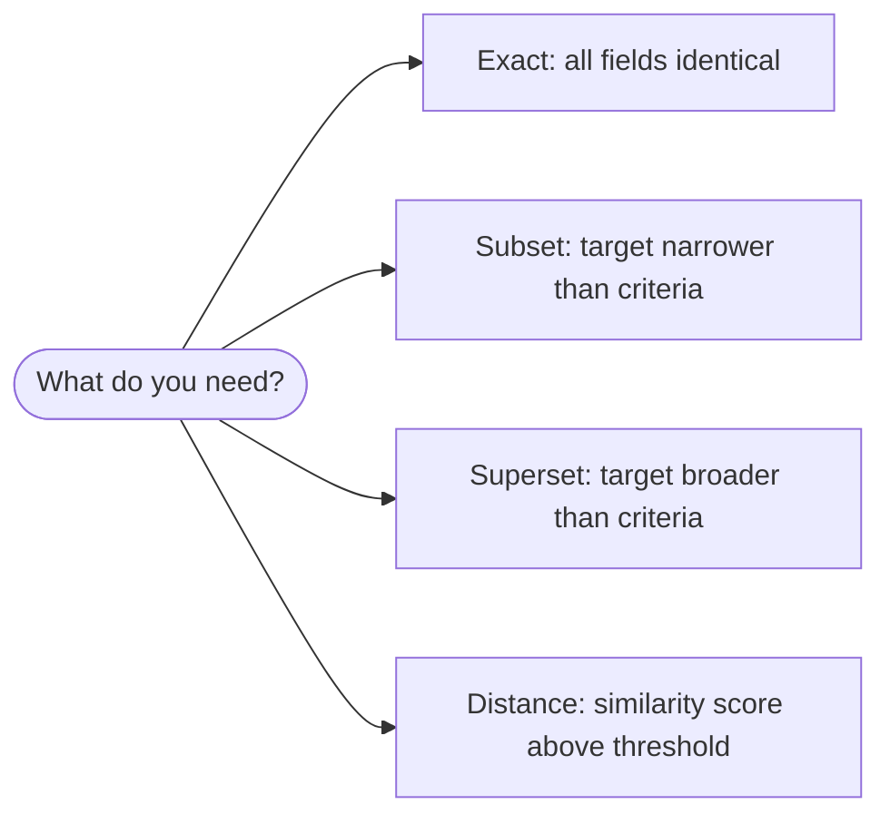

# CPE Matching

This example demonstrates various CPE matching techniques, from basic wildcard matching to advanced pattern matching with scoring algorithms.

## Overview

CPE matching allows you to compare CPE objects to determine if they represent the same or related software/hardware components. The library supports several matching modes:

- **Basic Matching**: Simple wildcard and exact matching
- **Advanced Matching**: Fuzzy matching, regex patterns, and scoring
- **Version Comparison**: Semantic version comparison and ranges

The diagram below shows how two CPEs are compared component by component to derive their relationship:



The next diagram summarizes how to pick a matching mode:



## Complete Example

```go
package main

import (
    "fmt"
    "log"
    "github.com/scagogogo/cpe-skills"
)

func main() {
    fmt.Println("=== CPE Matching Examples ===")
    
    // Create test CPEs
    windows10, _ := cpeskills.ParseCpe23("cpe:2.3:a:microsoft:windows:10:*:*:*:*:*:*:*")
    windows11, _ := cpeskills.ParseCpe23("cpe:2.3:a:microsoft:windows:11:*:*:*:*:*:*:*")
    windowsPattern, _ := cpeskills.ParseCpe23("cpe:2.3:a:microsoft:windows:*:*:*:*:*:*:*:*")
    microsoftPattern, _ := cpeskills.ParseCpe23("cpe:2.3:a:microsoft:*:*:*:*:*:*:*:*:*")
    office2019, _ := cpeskills.ParseCpe23("cpe:2.3:a:microsoft:office:2019:*:*:*:*:*:*:*")
    
    // Example 1: Basic matching
    fmt.Println("\n1. Basic Matching:")
    
    fmt.Printf("Windows pattern matches Windows 10: %t\n", 
        windowsPattern.Match(windows10))
    fmt.Printf("Windows pattern matches Windows 11: %t\n", 
        windowsPattern.Match(windows11))
    fmt.Printf("Microsoft pattern matches Windows 10: %t\n", 
        microsoftPattern.Match(windows10))
    fmt.Printf("Microsoft pattern matches Office 2019: %t\n", 
        microsoftPattern.Match(office2019))
    fmt.Printf("Windows 10 matches Windows 11: %t\n", 
        windows10.Match(windows11))
    
    // Example 2: Matching with options
    fmt.Println("\n2. Matching with Options:")
    
    options := &cpeskills.MatchOptions{
        IgnoreVersion: true,
        CaseSensitive: false,
    }
    
    fmt.Printf("Windows 10 vs Windows 11 (ignore version): %t\n",
        cpeskills.MatchCPE(windows10, windows11, options))
    
    // Example 3: Advanced matching
    fmt.Println("\n3. Advanced Matching:")
    
    advancedOptions := cpeskills.NewAdvancedMatchOptions()
    advancedOptions.MatchMode = "exact"
    advancedOptions.IgnoreCase = true
    
    // Test case-insensitive matching
    microsoftUpper, _ := cpeskills.ParseCpe23("cpe:2.3:a:MICROSOFT:WINDOWS:10:*:*:*:*:*:*:*")
    fmt.Printf("Case-insensitive match: %t\n",
        cpeskills.AdvancedMatchCPE(windows10, microsoftUpper, advancedOptions))
    
    // Example 4: Distance-based matching
    fmt.Println("\n4. Distance-based Matching:")
    
    distanceOptions := cpeskills.NewAdvancedMatchOptions()
    distanceOptions.MatchMode = "distance"
    distanceOptions.ScoreThreshold = 0.7
    
    // Create similar but not identical CPEs
    similar1, _ := cpeskills.ParseCpe23("cpe:2.3:a:microsoft:windows:10:*:*:*:*:*:*:*")
    similar2, _ := cpeskills.ParseCpe23("cpe:2.3:a:microsoft:windows:10.0:*:*:*:*:*:*:*")
    
    fmt.Printf("Distance match (threshold 0.7): %t\n",
        cpeskills.AdvancedMatchCPE(similar1, similar2, distanceOptions))
    
    // Example 5: Regex matching
    fmt.Println("\n5. Regex Matching:")
    
    regexOptions := cpeskills.NewAdvancedMatchOptions()
    regexOptions.UseRegex = true
    
    // Create pattern with regex
    regexPattern, _ := cpeskills.ParseCpe23("cpe:2.3:a:.*soft.*:.*:*:*:*:*:*:*:*:*")
    
    fmt.Printf("Regex pattern matches Microsoft Windows: %t\n",
        cpeskills.AdvancedMatchCPE(regexPattern, windows10, regexOptions))
    
    // Example 6: Version comparison
    fmt.Println("\n6. Version Comparison:")
    
    versionOptions := cpeskills.NewAdvancedMatchOptions()
    versionOptions.VersionCompareMode = "range"
    versionOptions.VersionLower = "9.0"
    versionOptions.VersionUpper = "11.0"
    
    versionPattern, _ := cpeskills.ParseCpe23("cpe:2.3:a:microsoft:windows:*:*:*:*:*:*:*:*")
    
    fmt.Printf("Version 10 in range [9.0, 11.0]: %t\n",
        cpeskills.AdvancedMatchCPE(versionPattern, windows10, versionOptions))
    
    // Example 7: Field-specific matching
    fmt.Println("\n7. Field-specific Matching:")
    
    fieldOptions := cpeskills.NewAdvancedMatchOptions()
    fieldOptions.FieldOptions = map[string]cpeskills.FieldMatchOption{
        "vendor": {
            Weight:   1.0,
            Required: true,
        },
        "product": {
            Weight:   1.0,
            Required: true,
        },
        "version": {
            Weight:   0.5,
            Required: false,
        },
    }
    
    fmt.Printf("Field-specific match: %t\n",
        cpeskills.AdvancedMatchCPE(windowsPattern, windows10, fieldOptions))
    
    // Example 8: Batch matching
    fmt.Println("\n8. Batch Matching:")
    
    testCPEs := []*cpeskills.CPE{windows10, windows11, office2019}
    pattern := microsoftPattern
    
    fmt.Printf("Testing pattern: %s\n", pattern.GetURI())
    for i, testCPE := range testCPEs {
        matches := pattern.Match(testCPE)
        fmt.Printf("  %d. %s: %t\n", i+1, testCPE.GetURI(), matches)
    }
}
```

## Expected Output

```
=== CPE Matching Examples ===

1. Basic Matching:
Windows pattern matches Windows 10: true
Windows pattern matches Windows 11: true
Microsoft pattern matches Windows 10: true
Microsoft pattern matches Office 2019: true
Windows 10 matches Windows 11: false

2. Matching with Options:
Windows 10 vs Windows 11 (ignore version): true

3. Advanced Matching:
Case-insensitive match: true

4. Distance-based Matching:
Distance match (threshold 0.7): true

5. Regex Matching:
Regex pattern matches Microsoft Windows: true

6. Version Comparison:
Version 10 in range [9.0, 11.0]: true

7. Field-specific Matching:
Field-specific match: true

8. Batch Matching:
Testing pattern: cpe:2.3:a:microsoft:*:*:*:*:*:*:*:*:*
  1. cpe:2.3:a:microsoft:windows:10:*:*:*:*:*:*:*: true
  2. cpe:2.3:a:microsoft:windows:11:*:*:*:*:*:*:*: true
  3. cpe:2.3:a:microsoft:office:2019:*:*:*:*:*:*:*: true
```

## Key Concepts

### 1. Wildcard Matching
- `*` matches any value
- `-` indicates "not applicable"
- Exact values must match exactly

### 2. Match Options
- `IgnoreVersion`: Skip version comparison
- `IgnoreUpdate`: Skip update comparison  
- `CaseSensitive`: Control case sensitivity

### 3. Advanced Match Modes
- `exact`: Precise field matching
- `subset`: Target is subset of criteria
- `superset`: Target is superset of criteria
- `distance`: Similarity-based matching

### 4. Version Comparison
- `exact`: Exact version match
- `greater`: Target version >= criteria
- `less`: Target version <= criteria
- `range`: Version within specified range

## Best Practices

1. **Use appropriate matching mode** for your use case
2. **Set reasonable thresholds** for distance-based matching
3. **Handle case sensitivity** appropriately
4. **Consider version semantics** when comparing versions
5. **Use field weights** to prioritize important attributes

## Next Steps

- Learn about [Advanced Matching](./advanced-matching.md) for complex scenarios
- Explore [Version Comparison](./version-comparison.md) for detailed version handling
- See [CPE Sets](./sets.md) for matching collections of CPEs
