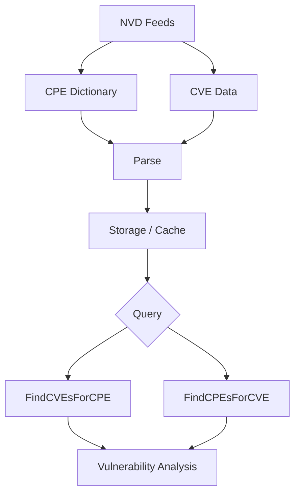

# NVD Integration

This example demonstrates how to integrate with the National Vulnerability Database (NVD) to download, process, and use CPE data for vulnerability management.

## Overview

The National Vulnerability Database (NVD) provides comprehensive CPE dictionaries and vulnerability data. This integration allows you to download official CPE data, keep it updated, and use it for vulnerability assessment.

The following diagram shows how NVD data flows from download through query and analysis:



## Complete Example

```go
package main

import (
    "fmt"
    "log"
    "time"
    "github.com/scagogogo/cpe-skills"
)

func main() {
    fmt.Println("=== NVD Integration Examples ===")
    
    // Example 1: Download NVD CPE Dictionary
    fmt.Println("\n1. Downloading NVD CPE Dictionary:")
    
    // Initialize NVD client
    nvdClient := cpeskills.NewNVDClient(&cpeskills.NVDConfig{
        APIKey:      "", // Optional: Add your NVD API key for higher rate limits
        CacheDir:    "./nvd_cache",
        UpdateInterval: 24 * time.Hour, // Update daily
    })
    
    // Download the latest CPE dictionary
    fmt.Println("Downloading CPE dictionary from NVD...")
    dictionary, err := nvdClient.DownloadCPEDictionary()
    if err != nil {
        log.Printf("Failed to download CPE dictionary: %v", err)
        // For demo purposes, create a sample dictionary
        dictionary = createSampleDictionary()
    } else {
        fmt.Printf("✅ Downloaded %d CPE entries\n", len(dictionary.Entries))
    }
    
    // Example 2: Search CPE Dictionary
    fmt.Println("\n2. Searching CPE Dictionary:")
    
    searchTerms := []string{
        "microsoft",
        "apache",
        "oracle java",
        "linux kernel",
        "cisco",
    }
    
    for _, term := range searchTerms {
        fmt.Printf("\nSearching for '%s':\n", term)
        results := dictionary.Search(term, 5) // Limit to 5 results
        
        for i, entry := range results {
            fmt.Printf("  %d. %s\n", i+1, entry.CPE23)
            fmt.Printf("     Title: %s\n", entry.Title)
            if len(entry.References) > 0 {
                fmt.Printf("     Reference: %s\n", entry.References[0])
            }
        }
    }
    
    // Example 3: CPE Validation Against NVD
    fmt.Println("\n3. CPE Validation Against NVD:")
    
    testCPEs := []string{
        "cpe:2.3:a:microsoft:windows:10:*:*:*:*:*:*:*",
        "cpe:2.3:a:apache:tomcat:9.0.0:*:*:*:*:*:*:*",
        "cpe:2.3:a:oracle:java:11.0.12:*:*:*:*:*:*:*",
        "cpe:2.3:a:nonexistent:product:1.0:*:*:*:*:*:*:*", // Invalid CPE
    }
    
    fmt.Println("Validating CPEs against NVD dictionary:")
    for i, cpeStr := range testCPEs {
        isValid := dictionary.ValidateCPE(cpeStr)
        
        status := "❌ Invalid"
        if isValid {
            status = "✅ Valid"
        }
        
        fmt.Printf("  %d. %s %s\n", i+1, status, cpeStr)
        
        // Get additional information if valid
        if isValid {
            entry := dictionary.GetEntry(cpeStr)
            if entry != nil {
                fmt.Printf("     Title: %s\n", entry.Title)
                fmt.Printf("     Last Modified: %s\n", entry.LastModified.Format("2006-01-02"))
            }
        }
    }
    
    // Example 4: Download Vulnerability Data
    fmt.Println("\n4. Downloading Vulnerability Data:")
    
    // Download recent CVE data
    fmt.Println("Downloading recent CVE data...")
    cveData, err := nvdClient.DownloadCVEData(time.Now().AddDate(0, -1, 0)) // Last month
    if err != nil {
        log.Printf("Failed to download CVE data: %v", err)
        // Create sample CVE data for demo
        cveData = createSampleCVEData()
    } else {
        fmt.Printf("✅ Downloaded %d CVE entries\n", len(cveData.CVEs))
    }
    
    // Example 5: CPE to CVE Mapping
    fmt.Println("\n5. CPE to CVE Mapping:")
    
    // Find vulnerabilities for specific CPEs
    targetCPEs := []string{
        "cpe:2.3:a:apache:tomcat:8.5.0:*:*:*:*:*:*:*",
        "cpe:2.3:a:oracle:java:8.0.291:*:*:*:*:*:*:*",
        "cpe:2.3:o:microsoft:windows:10:*:*:*:*:*:*:*",
    }
    
    for _, cpeStr := range targetCPEs {
        fmt.Printf("\nFinding vulnerabilities for: %s\n", cpeStr)
        
        vulnerabilities := cveData.FindVulnerabilitiesForCPE(cpeStr)
        
        if len(vulnerabilities) == 0 {
            fmt.Println("  No vulnerabilities found")
        } else {
            fmt.Printf("  Found %d vulnerabilities:\n", len(vulnerabilities))
            
            for i, vuln := range vulnerabilities[:min(3, len(vulnerabilities))] { // Show first 3
                fmt.Printf("    %d. %s (CVSS: %.1f)\n", i+1, vuln.ID, vuln.CVSSScore)
                fmt.Printf("       %s\n", vuln.Description)
                fmt.Printf("       Published: %s\n", vuln.PublishedDate.Format("2006-01-02"))
            }
            
            if len(vulnerabilities) > 3 {
                fmt.Printf("    ... and %d more\n", len(vulnerabilities)-3)
            }
        }
    }
    
    // Example 6: Vulnerability Assessment
    fmt.Println("\n6. Vulnerability Assessment:")
    
    // Assess a system inventory
    systemInventory := []string{
        "cpe:2.3:o:microsoft:windows:10:*:*:*:*:*:*:*",
        "cpe:2.3:a:apache:tomcat:8.5.0:*:*:*:*:*:*:*",
        "cpe:2.3:a:oracle:java:8.0.291:*:*:*:*:*:*:*",
        "cpe:2.3:a:microsoft:office:2019:*:*:*:*:*:*:*",
        "cpe:2.3:a:mozilla:firefox:95.0:*:*:*:*:*:*:*",
    }
    
    fmt.Println("System Vulnerability Assessment:")
    fmt.Printf("Inventory: %d components\n", len(systemInventory))
    
    assessment := cpeskills.NewVulnerabilityAssessment()
    
    totalVulns := 0
    criticalVulns := 0
    highVulns := 0
    
    for _, cpeStr := range systemInventory {
        vulns := cveData.FindVulnerabilitiesForCPE(cpeStr)
        totalVulns += len(vulns)
        
        for _, vuln := range vulns {
            switch {
            case vuln.CVSSScore >= 9.0:
                criticalVulns++
            case vuln.CVSSScore >= 7.0:
                highVulns++
            }
        }
        
        assessment.AddComponent(cpeStr, vulns)
    }
    
    fmt.Printf("\nAssessment Results:\n")
    fmt.Printf("  Total Vulnerabilities: %d\n", totalVulns)
    fmt.Printf("  Critical (CVSS 9.0+): %d\n", criticalVulns)
    fmt.Printf("  High (CVSS 7.0-8.9): %d\n", highVulns)
    fmt.Printf("  Risk Score: %.1f/10\n", assessment.CalculateRiskScore())
    
    // Example 7: Automated Updates
    fmt.Println("\n7. Automated Updates:")
    
    // Set up automatic updates
    updateConfig := &cpeskills.UpdateConfig{
        CheckInterval: 6 * time.Hour, // Check every 6 hours
        AutoDownload:  true,
        NotifyOnUpdate: true,
    }
    
    updater := cpeskills.NewNVDUpdater(nvdClient, updateConfig)
    
    fmt.Println("Setting up automated NVD updates...")
    
    // Check for updates
    hasUpdates, err := updater.CheckForUpdates()
    if err != nil {
        log.Printf("Failed to check for updates: %v", err)
    } else {
        if hasUpdates {
            fmt.Println("✅ Updates available")
            
            // Download updates
            fmt.Println("Downloading updates...")
            err = updater.DownloadUpdates()
            if err != nil {
                log.Printf("Failed to download updates: %v", err)
            } else {
                fmt.Println("✅ Updates downloaded successfully")
            }
        } else {
            fmt.Println("📅 No updates available")
        }
    }
    
    // Example 8: Custom NVD Queries
    fmt.Println("\n8. Custom NVD Queries:")
    
    // Query for specific vulnerability types
    queries := []struct {
        name  string
        query cpeskills.NVDQuery
    }{
        {
            "Recent Critical Vulnerabilities",
            cpeskills.NVDQuery{
                CVSSScoreMin: 9.0,
                PublishedAfter: time.Now().AddDate(0, -3, 0), // Last 3 months
                Limit: 10,
            },
        },
        {
            "Apache Product Vulnerabilities",
            cpeskills.NVDQuery{
                CPEVendor: "apache",
                CVSSScoreMin: 7.0,
                Limit: 5,
            },
        },
        {
            "Windows OS Vulnerabilities",
            cpeskills.NVDQuery{
                CPEProduct: "windows",
                CPEPart: "o", // Operating system
                Limit: 5,
            },
        },
    }
    
    for _, q := range queries {
        fmt.Printf("\n%s:\n", q.name)
        
        results, err := nvdClient.QueryVulnerabilities(q.query)
        if err != nil {
            log.Printf("Query failed: %v", err)
            continue
        }
        
        if len(results) == 0 {
            fmt.Println("  No results found")
        } else {
            for i, vuln := range results {
                fmt.Printf("  %d. %s (CVSS: %.1f)\n", i+1, vuln.ID, vuln.CVSSScore)
                fmt.Printf("     %s\n", truncateString(vuln.Description, 80))
            }
        }
    }
    
    // Example 9: Export and Reporting
    fmt.Println("\n9. Export and Reporting:")
    
    // Generate vulnerability report
    report := cpeskills.NewVulnerabilityReport()
    report.SetTitle("System Vulnerability Assessment Report")
    report.SetGeneratedDate(time.Now())
    
    // Add system information
    for _, cpeStr := range systemInventory {
        vulns := cveData.FindVulnerabilitiesForCPE(cpeStr)
        report.AddSystemComponent(cpeStr, vulns)
    }
    
    // Export to different formats
    formats := []string{"json", "csv", "html"}
    
    for _, format := range formats {
        filename := fmt.Sprintf("vulnerability_report.%s", format)
        err := report.ExportToFile(filename, format)
        if err != nil {
            log.Printf("Failed to export %s: %v", format, err)
        } else {
            fmt.Printf("✅ Report exported to %s\n", filename)
        }
    }
}

// Helper functions for demo
func createSampleDictionary() *cpeskills.CPEDictionary {
    return &cpeskills.CPEDictionary{
        Entries: []*cpeskills.CPEDictionaryEntry{
            {
                CPE23: "cpe:2.3:a:microsoft:windows:10:*:*:*:*:*:*:*",
                Title: "Microsoft Windows 10",
                LastModified: time.Now(),
            },
            {
                CPE23: "cpe:2.3:a:apache:tomcat:9.0.0:*:*:*:*:*:*:*",
                Title: "Apache Tomcat 9.0.0",
                LastModified: time.Now(),
            },
        },
    }
}

func createSampleCVEData() *cpeskills.CVEData {
    return &cpeskills.CVEData{
        CVEs: []*cpeskills.CVEEntry{
            {
                ID: "CVE-2021-44228",
                Description: "Apache Log4j2 JNDI features do not protect against attacker controlled LDAP and other JNDI related endpoints.",
                CVSSScore: 10.0,
                PublishedDate: time.Date(2021, 12, 10, 0, 0, 0, 0, time.UTC),
                AffectedCPEs: []string{
                    "cpe:2.3:a:apache:log4j:2.0:*:*:*:*:*:*:*",
                },
            },
        },
    }
}

func min(a, b int) int {
    if a < b {
        return a
    }
    return b
}

func truncateString(s string, maxLen int) string {
    if len(s) <= maxLen {
        return s
    }
    return s[:maxLen-3] + "..."
}
```

## Key Concepts

### 1. NVD Data Sources

- **CPE Dictionary**: Official CPE names and metadata
- **CVE Data**: Vulnerability information with CPE associations
- **CVSS Scores**: Vulnerability severity ratings
- **References**: Links to additional information

### 2. Integration Benefits

- **Official Data**: Authoritative CPE and vulnerability information
- **Regular Updates**: Keep data current with automated updates
- **Comprehensive Coverage**: Extensive database of software and vulnerabilities
- **Standardized Format**: Consistent data structure and naming

### 3. Use Cases

- **Vulnerability Assessment**: Identify security risks in systems
- **Compliance Reporting**: Generate security compliance reports
- **Asset Management**: Maintain accurate software inventories
- **Risk Analysis**: Calculate and track security risk metrics

## Best Practices

1. **API Key Usage**: Use NVD API key for higher rate limits
2. **Caching**: Cache downloaded data to reduce API calls
3. **Incremental Updates**: Download only new/changed data
4. **Error Handling**: Handle network and API errors gracefully
5. **Rate Limiting**: Respect NVD API rate limits

## Performance Optimization

1. **Batch Processing**: Process multiple CPEs together
2. **Parallel Downloads**: Use concurrent downloads for large datasets
3. **Local Storage**: Store frequently accessed data locally
4. **Compression**: Compress cached data to save space

## Security Considerations

1. **Data Validation**: Validate downloaded data integrity
2. **Secure Storage**: Protect cached vulnerability data
3. **Access Control**: Limit access to sensitive vulnerability information
4. **Update Verification**: Verify update authenticity

## Next Steps

- Learn about [CVE Mapping](./cve-mapping.md) for detailed vulnerability correlation
- Explore [Storage](./storage.md) for persisting NVD data
- Check out [Advanced Matching](./advanced-matching.md) for sophisticated vulnerability detection
