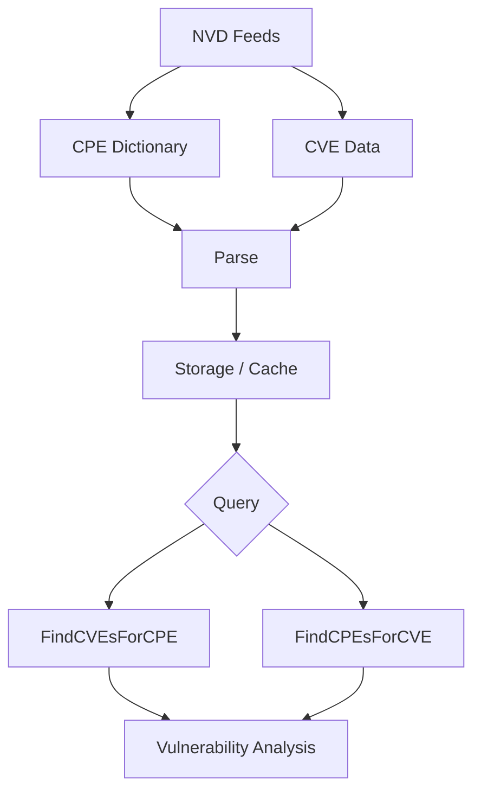

# NVD Integration

This example demonstrates how to integrate with the National Vulnerability Database (NVD) to download, process, and use CPE data for vulnerability management.

## Overview

The National Vulnerability Database (NVD) provides comprehensive CPE dictionaries and vulnerability data. This integration allows you to download official CPE data, keep it updated, and use it for vulnerability assessment.

The following diagram shows how NVD data flows from download through query and analysis:



## Complete Example

```go
package main

import (
    "fmt"
    "log"
    "time"

    "github.com/scagogogo/cpe-skills"
)

func main() {
    fmt.Println("=== NVD Integration Examples ===")

    // Example 1: Configure NVD feed options.
    // NVDFeedOptions controls caching, concurrency and the HTTP client used
    // when downloading NVD data. Start from the defaults and tweak as needed.
    fmt.Println("\n1. Configuring NVD feed options:")

    options := cpeskills.DefaultNVDFeedOptions()
    options.CacheDir = "./nvd_cache" // store downloaded feeds here
    options.CacheMaxAge = 24         // refresh cache after 24 hours
    options.MaxConcurrentDownloads = 2
    options.ShowProgress = false

    fmt.Printf("CacheDir:               %s\n", options.CacheDir)
    fmt.Printf("CacheMaxAge:            %d hours\n", options.CacheMaxAge)
    fmt.Printf("MaxConcurrentDownloads: %d\n", options.MaxConcurrentDownloads)

    // Example 2: Download all NVD data (CPE dictionary + CPE/CVE mappings).
    // DownloadAllNVDData fetches the CPE dictionary and the CPE match data,
    // returning an NVDCPEData that bundles both. It needs network access, so
    // here we only keep the error and continue with an empty data set.
    fmt.Println("\n2. Downloading NVD data:")

    fmt.Println("Downloading CPE dictionary and CPE/CVE mappings from NVD...")
    nvdData, err := cpeskills.DownloadAllNVDData(options)
    if err != nil {
        log.Printf("Failed to download NVD data: %v", err)
        // Fall back to an empty data set so the rest of the example compiles
        // and runs without network access.
        nvdData = &cpeskills.NVDCPEData{
            CPEDictionary: &cpeskills.CPEDictionary{
                Items:         []*cpeskills.CPEItem{},
                GeneratedAt:   time.Now(),
                SchemaVersion: "2.3",
            },
            CPEMatchData: &cpeskills.CPEMatchData{
                CVEToCPEs: map[string][]string{},
                CPEToCVEs: map[string][]string{},
            },
            DownloadTime: time.Now(),
        }
    } else {
        fmt.Printf("Downloaded %d CPE entries (schema %s)\n",
            len(nvdData.CPEDictionary.Items), nvdData.CPEDictionary.SchemaVersion)
        fmt.Printf("Data downloaded at: %s\n", nvdData.DownloadTime.Format(time.RFC3339))
    }

    // Example 3: Inspect the CPE dictionary.
    fmt.Println("\n3. Inspecting the CPE dictionary:")

    dict := nvdData.CPEDictionary
    fmt.Printf("Dictionary generated at: %s\n", dict.GeneratedAt.Format("2006-01-02"))
    fmt.Printf("Schema version:          %s\n", dict.SchemaVersion)
    fmt.Printf("Total entries:           %d\n", len(dict.Items))

    // Show a few dictionary entries (title, name and first reference URL).
    shown := 0
    for _, item := range dict.Items {
        if item.Deprecated {
            continue
        }
        fmt.Printf("  - %s\n", item.Title)
        fmt.Printf("    %s\n", item.Name)
        if len(item.References) > 0 {
            fmt.Printf("    ref: %s\n", item.References[0].URL)
        }
        shown++
        if shown >= 3 {
            break
        }
    }
    if shown == 0 {
        fmt.Println("  (no non-deprecated entries available)")
    }

    // Example 4: Find CVEs for a specific CPE.
    fmt.Println("\n4. Finding CVEs for a CPE:")

    tomcatCPE, err := cpeskills.ParseCpe23("cpe:2.3:a:apache:tomcat:9.0.0:*:*:*:*:*:*:*")
    if err != nil {
        log.Fatalf("Failed to parse CPE: %v", err)
    }

    cves := nvdData.FindCVEsForCPE(tomcatCPE)
    fmt.Printf("Found %d CVE(s) for %s\n", len(cves), tomcatCPE.Cpe23)
    for i, cveID := range cves {
        if i >= 5 {
            fmt.Printf("  ... and %d more\n", len(cves)-5)
            break
        }
        fmt.Printf("  %d. %s\n", i+1, cveID)
    }

    // Example 5: Find CPEs affected by a specific CVE.
    fmt.Println("\n5. Finding CPEs affected by a CVE:")

    log4Shell := "CVE-2021-44228"
    affectedCPEs := nvdData.FindCPEsForCVE(log4Shell)
    fmt.Printf("%s affects %d CPE(s)\n", log4Shell, len(affectedCPEs))
    for i, cpe := range affectedCPEs {
        if i >= 5 {
            fmt.Printf("  ... and %d more\n", len(affectedCPEs)-5)
            break
        }
        fmt.Printf("  %d. %s\n", i+1, cpe.Cpe23)
    }

    // Example 6: Enrich a CPE with vulnerability data.
    // EnrichCPEWithVulnerabilityData sets the CPE's Cve field to the first
    // related CVE ID found in the NVD data.
    fmt.Println("\n6. Enriching a CPE with vulnerability data:")

    fmt.Printf("Before: Cve=%q\n", tomcatCPE.Cve)
    nvdData.EnrichCPEWithVulnerabilityData(tomcatCPE)
    fmt.Printf("After:  Cve=%q\n", tomcatCPE.Cve)

    // Example 7: Vulnerability assessment over a system inventory.
    fmt.Println("\n7. Vulnerability assessment:")

    systemInventory := []string{
        "cpe:2.3:o:microsoft:windows:10:*:*:*:*:*:*:*",
        "cpe:2.3:a:apache:tomcat:8.5.0:*:*:*:*:*:*:*",
        "cpe:2.3:a:oracle:java:8.0.291:*:*:*:*:*:*:*",
        "cpe:2.3:a:mozilla:firefox:95.0:*:*:*:*:*:*:*",
    }

    fmt.Printf("Inventory: %d components\n", len(systemInventory))

    totalVulns := 0
    for _, cpeStr := range systemInventory {
        cpe, err := cpeskills.ParseCpe23(cpeStr)
        if err != nil {
            log.Printf("  skipping invalid CPE %q: %v", cpeStr, err)
            continue
        }
        vulns := nvdData.FindCVEsForCPE(cpe)
        totalVulns += len(vulns)
        fmt.Printf("  %s -> %d vulnerability(ies)\n", cpeStr, len(vulns))
    }

    fmt.Printf("Assessment results:\n")
    fmt.Printf("  Total vulnerabilities: %d\n", totalVulns)

    // Example 8: Download only the CPE dictionary.
    // When you do not need CVE mappings, DownloadAndParseCPEDict is cheaper
    // than DownloadAllNVDData.
    fmt.Println("\n8. Downloading only the CPE dictionary:")

    dictOnly, err := cpeskills.DownloadAndParseCPEDict(options)
    if err != nil {
        log.Printf("Failed to download CPE dictionary: %v", err)
    } else {
        fmt.Printf("Downloaded %d CPE entries\n", len(dictOnly.Items))
    }

    // Example 9: Download only the CPE match data.
    fmt.Println("\n9. Downloading only the CPE match data:")

    matchData, err := cpeskills.DownloadAndParseCPEMatch(options)
    if err != nil {
        log.Printf("Failed to download CPE match data: %v", err)
    } else {
        fmt.Printf("CPE match data: %d CVE->CPE entries, %d CPE->CVE entries\n",
            len(matchData.CVEToCPEs), len(matchData.CPEToCVEs))

        // Direct map lookups are available on CPEMatchData.
        for cveID, cpeURIs := range matchData.CVEToCPEs {
            fmt.Printf("  %s -> %d CPE(s)\n", cveID, len(cpeURIs))
            break // just show one example
        }
    }

    fmt.Println("\n=== NVD integration example finished ===")
}
```

## Key Concepts

### 1. NVD Data Sources

- **CPE Dictionary**: Official CPE names and metadata
- **CVE Data**: Vulnerability information with CPE associations
- **CVSS Scores**: Vulnerability severity ratings
- **References**: Links to additional information

### 2. Integration Benefits

- **Official Data**: Authoritative CPE and vulnerability information
- **Regular Updates**: Keep data current with automated updates
- **Comprehensive Coverage**: Extensive database of software and vulnerabilities
- **Standardized Format**: Consistent data structure and naming

### 3. Use Cases

- **Vulnerability Assessment**: Identify security risks in systems
- **Compliance Reporting**: Generate security compliance reports
- **Asset Management**: Maintain accurate software inventories
- **Risk Analysis**: Calculate and track security risk metrics

## Best Practices

1. **API Key Usage**: Use NVD API key for higher rate limits
2. **Caching**: Cache downloaded data to reduce API calls
3. **Incremental Updates**: Download only new/changed data
4. **Error Handling**: Handle network and API errors gracefully
5. **Rate Limiting**: Respect NVD API rate limits

## Performance Optimization

1. **Batch Processing**: Process multiple CPEs together
2. **Parallel Downloads**: Use concurrent downloads for large datasets
3. **Local Storage**: Store frequently accessed data locally
4. **Compression**: Compress cached data to save space

## Security Considerations

1. **Data Validation**: Validate downloaded data integrity
2. **Secure Storage**: Protect cached vulnerability data
3. **Access Control**: Limit access to sensitive vulnerability information
4. **Update Verification**: Verify update authenticity

## Next Steps

- Learn about [CVE Mapping](./cve-mapping.md) for detailed vulnerability correlation
- Explore [Storage](./storage.md) for persisting NVD data
- Check out [Advanced Matching](./advanced-matching.md) for sophisticated vulnerability detection
