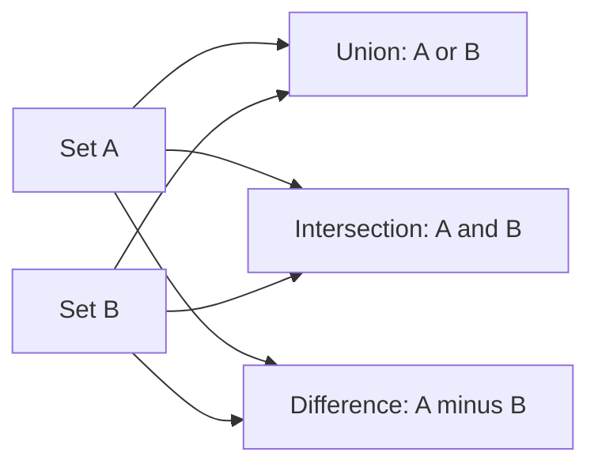
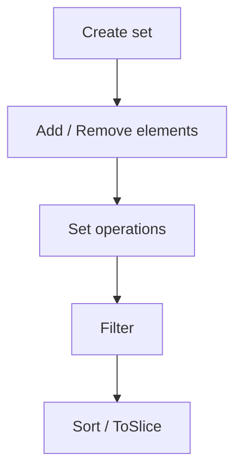

# CPE Sets

This example demonstrates how to work with collections of CPE objects using the CPE Sets functionality for efficient bulk operations.

## Overview

CPE Sets provide a powerful way to manage collections of CPE objects, perform set operations (union, intersection, difference), and apply bulk transformations and filters.

The diagram below shows how two CPE sets A and B combine under the three set operations, each producing its own result set.



Sets are typically processed through a pipeline: create the set, add or remove elements, apply set operations, filter, and finally sort or extract the results.



## Complete Example

```go
package main

import (
    "fmt"
    "log"

    "github.com/scagogogo/cpe-skills"
)

// parseAll parses a list of CPE 2.3 strings into CPE objects, skipping any
// that fail to parse. Returns the successfully parsed objects.
func parseAll(strs []string) []*cpeskills.CPE {
    var out []*cpeskills.CPE
    for _, s := range strs {
        c, err := cpeskills.ParseCpe23(s)
        if err != nil {
            log.Printf("Failed to parse %s: %v", s, err)
            continue
        }
        out = append(out, c)
    }
    return out
}

// printSet prints every CPE in a set, in the order returned by ToSlice.
func printSet(label string, s *cpeskills.CPESet) {
    fmt.Printf("%s (size: %d):\n", label, s.Size())
    for _, c := range s.ToSlice() {
        fmt.Printf("  - %s\n", c.GetURI())
    }
}

func main() {
    fmt.Println("=== CPE Sets Examples ===")

    // Example 1: Creating CPE Sets
    fmt.Println("\n1. Creating CPE Sets:")

    cpeStrings := []string{
        "cpe:2.3:a:microsoft:windows:10:*:*:*:*:*:*:*",
        "cpe:2.3:a:microsoft:office:2019:*:*:*:*:*:*:*",
        "cpe:2.3:a:apache:tomcat:9.0.0:*:*:*:*:*:*:*",
        "cpe:2.3:a:oracle:java:11.0.12:*:*:*:*:*:*:*",
        "cpe:2.3:o:canonical:ubuntu:20.04:*:*:*:*:*:*:*",
    }

    // Method 1: Parse the strings, then build a set from the resulting slice.
    // FromArray takes a []*CPE plus a name and description for the set.
    set1 := cpeskills.FromArray(parseAll(cpeStrings), "set1", "all parsed CPEs")
    fmt.Printf("Set 1 size: %d\n", set1.Size())

    // Method 2: Create an empty set (name + description are required) and Add items.
    set2 := cpeskills.NewCPESet("set2", "first three CPEs")
    for _, c := range parseAll(cpeStrings[:3]) {
        set2.Add(c)
    }
    fmt.Printf("Set 2 size: %d\n", set2.Size())

    // Method 3: Build from a sub-slice of CPE objects.
    set3 := cpeskills.FromArray(parseAll(cpeStrings[2:]), "set3", "last three CPEs")
    fmt.Printf("Set 3 size: %d\n", set3.Size())

    // Example 2: Set Operations
    fmt.Println("\n2. Set Operations:")

    printSet("Set 1", set1)
    printSet("Set 2", set2)
    printSet("Set 3", set3)

    // Union: all unique items from both sets.
    unionSet := set2.Union(set3)
    printSet("\nUnion of Set 2 and Set 3", unionSet)

    // Intersection: items present in both sets.
    intersectionSet := set1.Intersection(set2)
    printSet("\nIntersection of Set 1 and Set 2", intersectionSet)

    // Difference: items in the first set but not in the second.
    differenceSet := set1.Difference(set2)
    printSet("\nDifference of Set 1 - Set 2", differenceSet)

    // Example 3: Filtering Sets
    fmt.Println("\n3. Filtering Sets:")

    // Build a larger set for the filtering examples.
    largeSetStrings := []string{
        "cpe:2.3:a:microsoft:windows:10:*:*:*:*:*:*:*",
        "cpe:2.3:a:microsoft:office:2019:*:*:*:*:*:*:*",
        "cpe:2.3:a:microsoft:edge:95.0.1020.44:*:*:*:*:*:*:*",
        "cpe:2.3:a:apache:tomcat:9.0.0:*:*:*:*:*:*:*",
        "cpe:2.3:a:apache:http_server:2.4.41:*:*:*:*:*:*:*",
        "cpe:2.3:a:oracle:java:11.0.12:*:*:*:*:*:*:*",
        "cpe:2.3:a:oracle:mysql:8.0.26:*:*:*:*:*:*:*",
        "cpe:2.3:o:canonical:ubuntu:20.04:*:*:*:*:*:*:*",
        "cpe:2.3:o:microsoft:windows:10:*:*:*:*:*:*:*",
        "cpe:2.3:h:cisco:catalyst_2960:*:*:*:*:*:*:*:*",
    }
    largeSet := cpeskills.FromArray(parseAll(largeSetStrings), "largeSet", "filtering demo set")
    fmt.Printf("Large set size: %d\n", largeSet.Size())

    // Filter accepts a criteria CPE and MatchOptions. Empty / "*" fields in
    // the criteria act as wildcards, so setting only Vendor matches any CPE
    // from that vendor. IgnoreVersion keeps version out of the comparison.
    msOpts := &cpeskills.MatchOptions{IgnoreVersion: true}

    microsoftCPE := &cpeskills.CPE{Vendor: cpeskills.Vendor("microsoft")}
    printSet("\nMicrosoft CPEs", largeSet.Filter(microsoftCPE, msOpts))

    // Filter by part (applications only). Part is a struct; only ShortName
    // participates in the match.
    appCPE := &cpeskills.CPE{Part: cpeskills.Part{ShortName: "a"}}
    printSet("\nApplication CPEs", largeSet.Filter(appCPE, msOpts))

    // Filter by product. Apache ships two products, so use a regex match.
    apacheOpts := &cpeskills.MatchOptions{IgnoreVersion: true, UseRegex: true}
    apacheCPE := &cpeskills.CPE{ProductName: cpeskills.Product("apache")}
    // Vendor "apache" alone won't match http_server, so match by vendor via
    // regex on the vendor field instead.
    apacheVendor := &cpeskills.CPE{Vendor: cpeskills.Vendor("apache")}
    printSet("\nApache CPEs", largeSet.Filter(apacheVendor, apacheOpts))
    _ = apacheCPE // criteria demonstrating the Product field

    // Example 4: Iteration and Aggregation
    fmt.Println("\n4. Iteration and Aggregation:")

    // There is no built-in Map/GroupBy; iterate ToSlice() and aggregate with
    // ordinary Go maps and slices.
    vendorGroups := make(map[string][]*cpeskills.CPE)
    for _, c := range largeSet.ToSlice() {
        vendorGroups[string(c.Vendor)] = append(vendorGroups[string(c.Vendor)], c)
    }

    fmt.Println("CPEs grouped by vendor:")
    for vendor, cpes := range vendorGroups {
        fmt.Printf("  %s (%d items):\n", vendor, len(cpes))
        for _, c := range cpes {
            fmt.Printf("    - %s\n", c.GetURI())
        }
    }

    // Collect a unique, sorted list of vendors.
    uniqueVendors := make([]string, 0, len(vendorGroups))
    for v := range vendorGroups {
        uniqueVendors = append(uniqueVendors, v)
    }
    fmt.Printf("\nUnique vendors: %v\n", uniqueVendors)

    // Example 5: Sorting
    fmt.Println("\n5. Sorting:")

    // Sort returns a sorted []*CPE slice. Valid sortBy values are "part",
    // "vendor", "product", "version"; anything else falls back to Cpe23.
    sortedByProduct := largeSet.Sort("product", true)
    fmt.Println("Sorted by product (ascending):")
    for _, c := range sortedByProduct {
        fmt.Printf("  - %s\n", c.GetURI())
    }

    // Example 6: Set Comparison
    fmt.Println("\n6. Set Comparison:")

    setA := cpeskills.FromArray(parseAll([]string{
        "cpe:2.3:a:microsoft:windows:10:*:*:*:*:*:*:*",
        "cpe:2.3:a:microsoft:office:2019:*:*:*:*:*:*:*",
        "cpe:2.3:a:apache:tomcat:9.0.0:*:*:*:*:*:*:*",
    }), "setA", "comparison set A")

    setB := cpeskills.FromArray(parseAll([]string{
        "cpe:2.3:a:microsoft:windows:10:*:*:*:*:*:*:*",
        "cpe:2.3:a:microsoft:office:2019:*:*:*:*:*:*:*",
        "cpe:2.3:a:oracle:java:11.0.12:*:*:*:*:*:*:*",
    }), "setB", "comparison set B")

    fmt.Printf("Set A size: %d\n", setA.Size())
    fmt.Printf("Set B size: %d\n", setB.Size())

    // Check equality.
    fmt.Printf("Sets are equal: %t\n", setA.Equals(setB))

    // Check subset / superset relationships.
    fmt.Printf("Set A is subset of Set B: %t\n", setA.IsSubsetOf(setB))
    fmt.Printf("Set A is superset of Set B: %t\n", setA.IsSupersetOf(setB))

    // Find common and unique elements via set operations.
    common := setA.Intersection(setB)
    uniqueA := setA.Difference(setB)
    uniqueB := setB.Difference(setA)
    fmt.Printf("Common elements: %d\n", common.Size())
    fmt.Printf("Unique to Set A: %d\n", uniqueA.Size())
    fmt.Printf("Unique to Set B: %d\n", uniqueB.Size())

    // ToString produces a human-readable summary of the whole set.
    fmt.Printf("\nSet A summary: %s\n", setA.ToString())
}
```

## Key Concepts

### 1. Set Creation

- **From Strings**: Parse CPE strings directly into a set
- **From Objects**: Create set from existing CPE objects
- **Empty Set**: Start with empty set and add items

### 2. Set Operations

- **Union**: Combine two sets (A ∪ B)
- **Intersection**: Common elements (A ∩ B)
- **Difference**: Elements in A but not B (A - B)

### 3. Filtering and Transformation

- **Filter**: Select subset based on criteria
- **Map**: Transform each element
- **GroupBy**: Organize elements by key

### 4. Set Analysis

- **Statistics**: Count elements by type
- **Comparison**: Check equality and subset relationships
- **Aggregation**: Summarize set contents

## Best Practices

1. **Use Sets for Bulk Operations**: More efficient than individual operations
2. **Filter Early**: Apply filters to reduce set size before expensive operations
3. **Cache Results**: Store frequently used filtered sets
4. **Validate Input**: Check CPE validity before adding to sets
5. **Monitor Memory**: Large sets can consume significant memory

## Performance Tips

1. **Batch Operations**: Group multiple operations together
2. **Use Appropriate Data Structures**: Sets are optimized for uniqueness
3. **Parallel Processing**: Use goroutines for independent set operations
4. **Lazy Evaluation**: Defer expensive operations until needed

## Next Steps

- Learn about [Advanced Matching](./advanced-matching.md) with sets
- Explore [Storage](./storage.md) for persisting large sets
- Check out [NVD Integration](./nvd-integration.md) for real-world datasets
