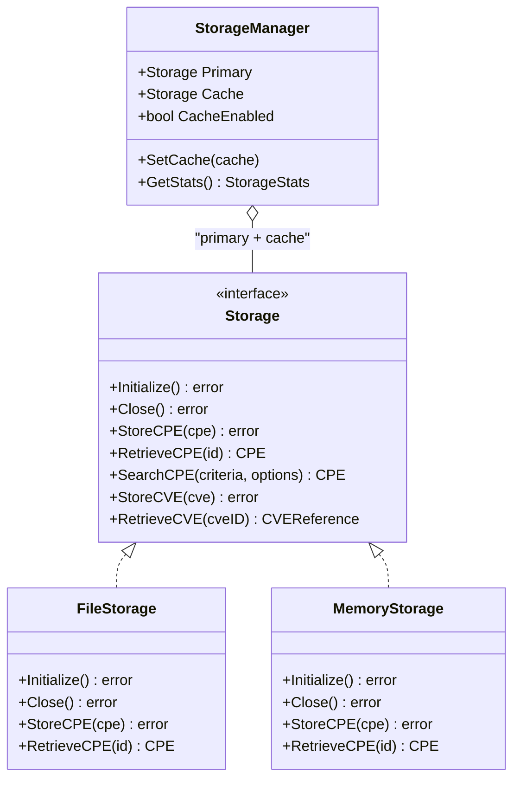

# Storage

This example demonstrates how to use the CPE library's storage capabilities to persist CPE data, CVE information, and dictionaries using different storage backends.

## Overview

The CPE library provides a flexible storage interface with multiple implementations:
- **File Storage**: JSON-based file storage with optional caching
- **Memory Storage**: In-memory storage for testing and temporary data
- **Storage Manager**: Coordinated storage with primary and cache backends

The following diagram shows the storage architecture and how the concrete backends relate to the `Storage` interface:



## Complete Example

```go
package main

import (
    "fmt"
    "log"
    "os"
    "github.com/scagogogo/cpe-skills"
)

func main() {
    fmt.Println("=== CPE Storage Examples ===")
    
    // Example 1: File Storage
    fmt.Println("\n1. File Storage:")
    
    // Create file storage with caching enabled
    storage, err := cpeskills.NewFileStorage("./cpe-storage-demo", true)
    if err != nil {
        log.Fatal(err)
    }
    defer storage.Close()
    
    // Initialize storage
    err = storage.Initialize()
    if err != nil {
        log.Fatal(err)
    }
    
    fmt.Println("✓ File storage initialized")
    
    // Example 2: Store CPE objects
    fmt.Println("\n2. Storing CPE Objects:")
    
    cpeObjects := []string{
        "cpe:2.3:a:microsoft:windows:10:*:*:*:*:*:*:*",
        "cpe:2.3:a:microsoft:office:2019:*:*:*:*:*:*:*",
        "cpe:2.3:a:apache:tomcat:9.0:*:*:*:*:*:*:*",
        "cpe:2.3:a:oracle:java:11:*:*:*:*:*:*:*",
        "cpe:2.3:o:linux:kernel:5.4.0:*:*:*:*:*:*:*",
    }
    
    for i, cpeStr := range cpeObjects {
        cpeObj, err := cpeskills.ParseCpe23(cpeStr)
        if err != nil {
            log.Printf("Failed to parse %s: %v", cpeStr, err)
            continue
        }
        
        err = storage.StoreCPE(cpeObj)
        if err != nil {
            log.Printf("Failed to store %s: %v", cpeStr, err)
        } else {
            fmt.Printf("  %d. Stored: %s\n", i+1, cpeStr)
        }
    }
    
    // Example 3: Retrieve CPE objects
    fmt.Println("\n3. Retrieving CPE Objects:")
    
    retrieveID := "cpe:2.3:a:microsoft:windows:10:*:*:*:*:*:*:*"
    retrieved, err := storage.RetrieveCPE(retrieveID)
    if err != nil {
        log.Printf("Failed to retrieve: %v", err)
    } else {
        fmt.Printf("✓ Retrieved: %s\n", retrieved.GetURI())
        fmt.Printf("  Vendor: %s, Product: %s, Version: %s\n", 
            retrieved.Vendor, retrieved.ProductName, retrieved.Version)
    }
    
    // Example 4: Search CPE objects
    fmt.Println("\n4. Searching CPE Objects:")
    
    // Search for Microsoft products
    criteria := &cpeskills.CPE{
        Vendor: cpeskills.Vendor("microsoft"),
    }
    
    results, err := storage.SearchCPE(criteria, cpeskills.DefaultMatchOptions())
    if err != nil {
        log.Printf("Search failed: %v", err)
    } else {
        fmt.Printf("Found %d Microsoft products:\n", len(results))
        for i, result := range results {
            fmt.Printf("  %d. %s\n", i+1, result.GetURI())
        }
    }
    
    // Example 5: Advanced search
    fmt.Println("\n5. Advanced Search:")
    
    advancedCriteria := &cpeskills.CPE{
        Part: *cpeskills.PartApplication,
    }
    
    advancedOptions := cpeskills.NewAdvancedMatchOptions()
    advancedOptions.MatchMode = "exact"
    
    advancedResults, err := storage.AdvancedSearchCPE(advancedCriteria, advancedOptions)
    if err != nil {
        log.Printf("Advanced search failed: %v", err)
    } else {
        fmt.Printf("Found %d applications:\n", len(advancedResults))
        for i, result := range advancedResults[:3] { // Show first 3
            fmt.Printf("  %d. %s\n", i+1, result.GetURI())
        }
    }
    
    // Example 6: Memory Storage
    fmt.Println("\n6. Memory Storage:")
    
    memStorage := cpeskills.NewMemoryStorage()
    err = memStorage.Initialize()
    if err != nil {
        log.Fatal(err)
    }
    
    // Store some test data
    testCPE, _ := cpeskills.ParseCpe23("cpe:2.3:a:test:product:1.0:*:*:*:*:*:*:*")
    err = memStorage.StoreCPE(testCPE)
    if err != nil {
        log.Printf("Failed to store in memory: %v", err)
    } else {
        fmt.Println("✓ Stored CPE in memory storage")
    }
    
    // Retrieve from memory
    memRetrieved, err := memStorage.RetrieveCPE(testCPE.GetURI())
    if err != nil {
        log.Printf("Failed to retrieve from memory: %v", err)
    } else {
        fmt.Printf("✓ Retrieved from memory: %s\n", memRetrieved.GetURI())
    }
    
    // Example 7: Storage Manager
    fmt.Println("\n7. Storage Manager:")
    
    // Create storage manager with file storage as primary
    manager := cpeskills.NewStorageManager(storage)
    manager.SetCache(memStorage) // Use memory storage as cache
    
    fmt.Println("✓ Storage manager created with file primary and memory cache")
    
    // Example 8: CVE Storage
    fmt.Println("\n8. CVE Storage:")
    
    // Create a sample CVE
    sampleCVE := &cpeskills.CVEReference{
        CVEID:       "CVE-2021-44228",
        Description: "Apache Log4j2 JNDI features do not protect against attacker controlled LDAP",
        CVSSScore:   10.0,
        Severity:    "Critical",
    }
    sampleCVE.AddAffectedCPE("cpe:2.3:a:apache:log4j:2.14:*:*:*:*:*:*:*")
    
    err = storage.StoreCVE(sampleCVE)
    if err != nil {
        log.Printf("Failed to store CVE: %v", err)
    } else {
        fmt.Printf("✓ Stored CVE: %s\n", sampleCVE.CVEID)
    }
    
    // Retrieve CVE
    retrievedCVE, err := storage.RetrieveCVE("CVE-2021-44228")
    if err != nil {
        log.Printf("Failed to retrieve CVE: %v", err)
    } else {
        fmt.Printf("✓ Retrieved CVE: %s (CVSS: %.1f, Severity: %s)\n",
            retrievedCVE.CVEID, retrievedCVE.CVSSScore, retrievedCVE.Severity)
    }
    
    // Example 9: Update and Delete operations
    fmt.Println("\n9. Update and Delete Operations:")
    
    // Update a CPE
    updateCPE := retrieved
    updateCPE.Version = "10.0.19041"
    
    err = storage.UpdateCPE(updateCPE)
    if err != nil {
        log.Printf("Failed to update CPE: %v", err)
    } else {
        fmt.Printf("✓ Updated CPE version to: %s\n", updateCPE.Version)
    }
    
    // Delete a CPE
    deleteCPE, _ := cpeskills.ParseCpe23("cpe:2.3:a:oracle:java:11:*:*:*:*:*:*:*")
    err = storage.DeleteCPE(deleteCPE.GetURI())
    if err != nil {
        log.Printf("Failed to delete CPE: %v", err)
    } else {
        fmt.Printf("✓ Deleted CPE: %s\n", deleteCPE.GetURI())
    }
    
    // Example 10: Cleanup
    fmt.Println("\n10. Cleanup:")
    
    // Clean up storage directory
    defer func() {
        err := os.RemoveAll("./cpe-storage-demo")
        if err != nil {
            log.Printf("Failed to cleanup: %v", err)
        } else {
            fmt.Println("✓ Cleaned up storage directory")
        }
    }()
    
    fmt.Println("\n=== Storage Examples Complete ===")
}
```

## Expected Output

```text
=== CPE Storage Examples ===

1. File Storage:
✓ File storage initialized

2. Storing CPE Objects:
  1. Stored: cpe:2.3:a:microsoft:windows:10:*:*:*:*:*:*:*
  2. Stored: cpe:2.3:a:microsoft:office:2019:*:*:*:*:*:*:*
  3. Stored: cpe:2.3:a:apache:tomcat:9.0:*:*:*:*:*:*:*
  4. Stored: cpe:2.3:a:oracle:java:11:*:*:*:*:*:*:*
  5. Stored: cpe:2.3:o:linux:kernel:5.4.0:*:*:*:*:*:*:*

3. Retrieving CPE Objects:
✓ Retrieved: cpe:2.3:a:microsoft:windows:10:*:*:*:*:*:*:*
  Vendor: microsoft, Product: windows, Version: 10

4. Searching CPE Objects:
Found 2 Microsoft products:
  1. cpe:2.3:a:microsoft:windows:10:*:*:*:*:*:*:*
  2. cpe:2.3:a:microsoft:office:2019:*:*:*:*:*:*:*

...
```

## Key Concepts

### 1. Storage Interface
All storage implementations follow the same interface, making them interchangeable.

### 2. File Storage
- Stores data as JSON files
- Supports caching for performance
- Organizes data in directory structure
- Handles concurrent access safely

### 3. Memory Storage
- Fast in-memory storage
- Perfect for testing
- Data lost when program exits
- No persistence

### 4. Storage Manager
- Coordinates multiple storage backends
- Implements caching strategies
- Provides unified interface

## Best Practices

1. **Enable caching** for file storage in production
2. **Handle errors** appropriately for each operation
3. **Use memory storage** for testing only
4. **Initialize storage** before use
5. **Close storage** when done to free resources

## Next Steps

- Learn about [NVD Integration](./nvd-integration.md) for external data
- Explore [Advanced Matching](./advanced-matching.md) with stored data
- See [CVE Mapping](./cve-mapping.md) for vulnerability management
