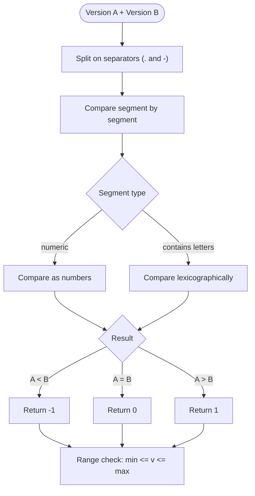

# Version Comparison

This example demonstrates how to compare versions in CPE strings and perform version-based matching operations.

## Overview

Version comparison is crucial when working with CPE data for vulnerability management and software inventory. The CPE library provides several methods to compare versions and determine compatibility.

The diagram below shows how two version strings are compared segment by segment and how the result feeds range checks:



## Complete Example

```go
package main

import (
    "fmt"
    "log"
    "github.com/scagogogo/cpe-skills"
)

func main() {
    fmt.Println("=== CPE Version Comparison Examples ===")
    
    // Example 1: Basic Version Comparison
    fmt.Println("\n1. Basic Version Comparison:")
    
    versions := []string{
        "cpe:2.3:a:apache:tomcat:8.5.0:*:*:*:*:*:*:*",
        "cpe:2.3:a:apache:tomcat:8.5.1:*:*:*:*:*:*:*",
        "cpe:2.3:a:apache:tomcat:9.0.0:*:*:*:*:*:*:*",
        "cpe:2.3:a:apache:tomcat:9.0.1:*:*:*:*:*:*:*",
    }
    
    for i, versionStr := range versions {
        cpeObj, err := cpeskills.ParseCpe23(versionStr)
        if err != nil {
            log.Printf("Failed to parse %s: %v", versionStr, err)
            continue
        }
        
        fmt.Printf("Version %d: %s (Version: %s)\n", i+1, cpeObj.ProductName, cpeObj.Version)
    }
    
    // Example 2: Version Range Matching
    fmt.Println("\n2. Version Range Matching:")
    
    targetVersion, _ := cpeskills.ParseCpe23("cpe:2.3:a:apache:tomcat:8.5.5:*:*:*:*:*:*:*")
    
    ranges := []struct {
        min string
        max string
        description string
    }{
        {"8.5.0", "8.5.10", "Tomcat 8.5.x series (0-10)"},
        {"8.0.0", "9.0.0", "Tomcat 8.x series"},
        {"9.0.0", "10.0.0", "Tomcat 9.x series"},
    }
    
    for _, r := range ranges {
        inRange := cpeskills.IsVersionInRange(targetVersion.Version, r.min, r.max)
        fmt.Printf("Version %s in range %s - %s (%s): %t\n", 
            targetVersion.Version, r.min, r.max, r.description, inRange)
    }
    
    // Example 3: Semantic Version Comparison
    fmt.Println("\n3. Semantic Version Comparison:")
    
    baseVersion := "8.5.0"
    compareVersions := []string{"8.4.9", "8.5.0", "8.5.1", "9.0.0"}
    
    for _, compareVer := range compareVersions {
        result := cpeskills.CompareVersions(baseVersion, compareVer)
        var relationship string
        switch result {
        case -1:
            relationship = "older than"
        case 0:
            relationship = "equal to"
        case 1:
            relationship = "newer than"
        }
        
        fmt.Printf("%s is %s %s\n", baseVersion, relationship, compareVer)
    }
    
    // Example 4: Version Pattern Matching
    fmt.Println("\n4. Version Pattern Matching:")
    
    patterns := []string{
        "cpe:2.3:a:microsoft:windows:10:*:*:*:*:*:*:*",
        "cpe:2.3:a:microsoft:windows:11:*:*:*:*:*:*:*",
        "cpe:2.3:a:oracle:java:1.8.*:*:*:*:*:*:*:*",
        "cpe:2.3:a:oracle:java:11.*:*:*:*:*:*:*:*",
    }
    
    testCPEs := []string{
        "cpe:2.3:a:microsoft:windows:10:*:*:*:*:*:*:*",
        "cpe:2.3:a:oracle:java:1.8.0_291:*:*:*:*:*:*:*",
        "cpe:2.3:a:oracle:java:11.0.12:*:*:*:*:*:*:*",
    }
    
    for _, testCPE := range testCPEs {
        testObj, _ := cpeskills.ParseCpe23(testCPE)
        fmt.Printf("\nTesting: %s\n", testCPE)
        
        for _, pattern := range patterns {
            patternObj, _ := cpeskills.ParseCpe23(pattern)
            if cpeskills.MatchesVersionPattern(testObj, patternObj) {
                fmt.Printf("  ✓ Matches pattern: %s\n", pattern)
            }
        }
    }
    
    // Example 5: Version Vulnerability Checking
    fmt.Println("\n5. Version Vulnerability Checking:")
    
    vulnerableRanges := []struct {
        product string
        minVersion string
        maxVersion string
        description string
    }{
        {"tomcat", "8.5.0", "8.5.4", "CVE-2021-25122"},
        {"java", "1.8.0", "1.8.0_291", "CVE-2021-2163"},
        {"windows", "10.0.0", "10.0.19041", "CVE-2021-1675"},
    }
    
    checkCPEs := []string{
        "cpe:2.3:a:apache:tomcat:8.5.3:*:*:*:*:*:*:*",
        "cpe:2.3:a:oracle:java:1.8.0_281:*:*:*:*:*:*:*",
        "cpe:2.3:o:microsoft:windows:10.0.19042:*:*:*:*:*:*:*",
    }
    
    for _, checkCPE := range checkCPEs {
        cpeObj, _ := cpeskills.ParseCpe23(checkCPE)
        fmt.Printf("\nChecking: %s\n", checkCPE)
        
        for _, vuln := range vulnerableRanges {
            if cpeObj.ProductName == vuln.product {
                isVulnerable := cpeskills.IsVersionInRange(cpeObj.Version, vuln.minVersion, vuln.maxVersion)
                if isVulnerable {
                    fmt.Printf("  ⚠️  VULNERABLE: %s (versions %s - %s)\n", 
                        vuln.description, vuln.minVersion, vuln.maxVersion)
                } else {
                    fmt.Printf("  ✅ Not vulnerable to %s\n", vuln.description)
                }
            }
        }
    }
    
    // Example 6: Version Sorting
    fmt.Println("\n6. Version Sorting:")
    
    unsortedCPEs := []string{
        "cpe:2.3:a:apache:tomcat:9.0.1:*:*:*:*:*:*:*",
        "cpe:2.3:a:apache:tomcat:8.5.0:*:*:*:*:*:*:*",
        "cpe:2.3:a:apache:tomcat:9.0.0:*:*:*:*:*:*:*",
        "cpe:2.3:a:apache:tomcat:8.5.10:*:*:*:*:*:*:*",
        "cpe:2.3:a:apache:tomcat:10.0.0:*:*:*:*:*:*:*",
    }
    
    fmt.Println("Unsorted versions:")
    for _, cpeStr := range unsortedCPEs {
        cpeObj, _ := cpeskills.ParseCpe23(cpeStr)
        fmt.Printf("  %s\n", cpeObj.Version)
    }
    
    sortedCPEs := cpeskills.SortCPEsByVersion(unsortedCPEs)
    
    fmt.Println("\nSorted versions (ascending):")
    for _, cpeObj := range sortedCPEs {
        fmt.Printf("  %s\n", cpeObj.Version)
    }
}
```

## Expected Output

```
=== CPE Version Comparison Examples ===

1. Basic Version Comparison:
Version 1: tomcat (Version: 8.5.0)
Version 2: tomcat (Version: 8.5.1)
Version 3: tomcat (Version: 9.0.0)
Version 4: tomcat (Version: 9.0.1)

2. Version Range Matching:
Version 8.5.5 in range 8.5.0 - 8.5.10 (Tomcat 8.5.x series (0-10)): true
Version 8.5.5 in range 8.0.0 - 9.0.0 (Tomcat 8.x series): true
Version 8.5.5 in range 9.0.0 - 10.0.0 (Tomcat 9.x series): false

3. Semantic Version Comparison:
8.5.0 is newer than 8.4.9
8.5.0 is equal to 8.5.0
8.5.0 is older than 8.5.1
8.5.0 is older than 9.0.0

4. Version Pattern Matching:
Testing: cpe:2.3:a:microsoft:windows:10:*:*:*:*:*:*:*
  ✓ Matches pattern: cpe:2.3:a:microsoft:windows:10:*:*:*:*:*:*:*

Testing: cpe:2.3:a:oracle:java:1.8.0_291:*:*:*:*:*:*:*
  ✓ Matches pattern: cpe:2.3:a:oracle:java:1.8.*:*:*:*:*:*:*:*

Testing: cpe:2.3:a:oracle:java:11.0.12:*:*:*:*:*:*:*
  ✓ Matches pattern: cpe:2.3:a:oracle:java:11.*:*:*:*:*:*:*:*

5. Version Vulnerability Checking:
Checking: cpe:2.3:a:apache:tomcat:8.5.3:*:*:*:*:*:*:*
  ⚠️  VULNERABLE: CVE-2021-25122 (versions 8.5.0 - 8.5.4)

Checking: cpe:2.3:a:oracle:java:1.8.0_281:*:*:*:*:*:*:*
  ⚠️  VULNERABLE: CVE-2021-2163 (versions 1.8.0 - 1.8.0_291)

Checking: cpe:2.3:o:microsoft:windows:10.0.19042:*:*:*:*:*:*:*
  ✅ Not vulnerable to CVE-2021-1675

6. Version Sorting:
Unsorted versions:
  9.0.1
  8.5.0
  9.0.0
  8.5.10
  10.0.0

Sorted versions (ascending):
  8.5.0
  8.5.10
  9.0.0
  9.0.1
  10.0.0
```

## Key Concepts

### 1. Version Comparison Types

- **Exact Match**: Direct string comparison
- **Semantic Versioning**: Understanding version hierarchy (major.minor.patch)
- **Range Matching**: Checking if a version falls within a range
- **Pattern Matching**: Using wildcards and patterns

### 2. Version Formats

The library supports various version formats:
- Semantic versions: `1.2.3`
- Build numbers: `1.8.0_291`
- Date-based: `2021.03.15`
- Custom formats: `10.0.19041.1234`

### 3. Vulnerability Assessment

Version comparison is essential for:
- Identifying vulnerable software versions
- Checking patch levels
- Compliance verification
- Security scanning

## Best Practices

1. **Normalize Versions**: Always normalize version strings before comparison
2. **Handle Edge Cases**: Account for pre-release, beta, and RC versions
3. **Use Ranges**: Define vulnerability ranges rather than exact versions
4. **Sort Consistently**: Use semantic sorting for version lists
5. **Validate Input**: Always validate version strings before processing

## Next Steps

- Learn about [Advanced Matching](./advanced-matching.md) for complex scenarios
- Explore [NVD Integration](./nvd-integration.md) for vulnerability data
- Check out [CVE Mapping](./cve-mapping.md) for security applications
