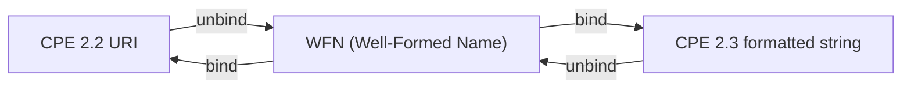

# WFN Conversion

This example demonstrates how to work with Well-Formed Names (WFN), the internal representation format used by the CPE library for processing and matching.

## Overview

Well-Formed Names (WFN) are the canonical internal representation of CPE names. They provide a standardized way to represent CPE components that makes matching and comparison operations more efficient and reliable.

The diagram below shows WFN as the hub of the three formats, with bind and unbind operations converting to and from each external representation:



## Complete Example

```go
package main

import (
    "fmt"
    "log"

    "github.com/scagogogo/cpe-skills"
)

func main() {
    fmt.Println("=== WFN Conversion Examples ===")

    // Example 1: CPE to WFN Conversion
    fmt.Println("\n1. CPE to WFN Conversion:")

    cpeStrings := []string{
        "cpe:2.3:a:microsoft:windows:10:*:*:*:*:*:*:*",
        "cpe:2.3:a:apache:tomcat:9.0.0:*:*:*:*:*:*:*",
        "cpe:/a:oracle:java:1.8.0_291",
        "cpe:2.3:o:linux:kernel:5.4.0:*:*:*:*:*:*:*",
    }

    for i, cpeStr := range cpeStrings {
        fmt.Printf("\nExample %d: %s\n", i+1, cpeStr)

        // Parse CPE string (auto-detects 2.2 vs 2.3)
        cpeObj, err := cpeskills.Parse(cpeStr)
        if err != nil {
            log.Printf("Failed to parse CPE: %v", err)
            continue
        }

        // Convert CPE to WFN
        wfn := cpeskills.FromCPE(cpeObj)

        fmt.Printf("  Original CPE: %s\n", cpeStr)
        fmt.Printf("  WFN Format:   %s\n", wfn.WFNString())
        fmt.Printf("  Part:         %s\n", wfn.Get(cpeskills.AttrPart))
        fmt.Printf("  Vendor:       %s\n", wfn.Get(cpeskills.AttrVendor))
        fmt.Printf("  Product:      %s\n", wfn.Get(cpeskills.AttrProduct))
        fmt.Printf("  Version:      %s\n", wfn.Get(cpeskills.AttrVersion))
    }

    // Example 2: WFN to CPE Conversion
    fmt.Println("\n2. WFN to CPE Conversion:")

    // Create WFN manually (unset string fields read back as ANY via Get)
    wfn := &cpeskills.WFN{
        Part:    "a",
        Vendor:  "adobe",
        Product: "reader",
        Version: "2021.001.20150",
    }

    fmt.Printf("WFN: %s\n", wfn.WFNString())

    // Bind WFN to CPE 2.3 formatted string
    fmt.Printf("CPE 2.3: %s\n", wfn.ToCPE23String())
    // Bind WFN to CPE 2.2 URI
    fmt.Printf("CPE 2.2: %s\n", wfn.ToCPE22String())

    // Example 3: WFN Attribute Values and Get/Set
    fmt.Println("\n3. WFN Attribute Values:")

    w := cpeskills.NewWFN() // all attributes default to ANY
    fmt.Printf("  Empty WFN Get(product): %s (ANY matches any value)\n", w.Get(cpeskills.AttrProduct))
    w.Set(cpeskills.AttrPart, cpeskills.PartApplicationShort)
    w.Set(cpeskills.AttrVendor, "microsoft")
    w.Set(cpeskills.AttrProduct, "windows")
    w.Set(cpeskills.AttrVersion, "10")
    w.Set(cpeskills.AttrUpdate, cpeskills.ValueNA) // NA = not applicable
    fmt.Printf("  After Set: %s\n", w.WFNString())
    fmt.Printf("  ANY constant: %q\n", cpeskills.ValueANY)
    fmt.Printf("  NA  constant: %q\n", cpeskills.ValueNA)

    // Example 4: WFN Matching
    fmt.Println("\n4. WFN Matching:")

    // ANY (*) on a source attribute matches any target value
    sourceWFN := &cpeskills.WFN{
        Part:    "a",
        Vendor:  "microsoft",
        Product: cpeskills.ValueANY, // any product
        Version: cpeskills.ValueANY, // any version
    }

    targetWFNs := []*cpeskills.WFN{
        {Part: "a", Vendor: "microsoft", Product: "windows", Version: "10"},
        {Part: "a", Vendor: "microsoft", Product: "office", Version: "2019"},
        {Part: "a", Vendor: "oracle", Product: "java", Version: "11"},
        {Part: "o", Vendor: "microsoft", Product: "windows", Version: "10"},
    }

    fmt.Printf("Source WFN: %s\n", sourceWFN.WFNString())
    fmt.Println("Matching against targets:")

    for i, targetWFN := range targetWFNs {
        match := sourceWFN.Match(targetWFN)
        status := "NO"
        if match {
            status = "YES"
        }
        fmt.Printf("  [%s] Target %d: %s\n", status, i+1, targetWFN.WFNString())
    }

    // Example 5: WFN Validation (identifier name check)
    fmt.Println("\n5. WFN Validation:")

    validationTests := []struct {
        wfn  *cpeskills.WFN
        desc string
        want bool
    }{
        {
            &cpeskills.WFN{Part: "a", Vendor: "microsoft", Product: "windows"},
            "Has part, vendor and product => identifier",
            true,
        },
        {
            &cpeskills.WFN{Part: "x", Vendor: "microsoft", Product: "windows"},
            "Still an identifier (part value not validated here)",
            true,
        },
        {
            &cpeskills.WFN{Part: "a", Vendor: "", Product: "windows"},
            "Empty vendor (ANY) is not an identifier",
            false,
        },
        {
            &cpeskills.WFN{Part: "a", Vendor: "microsoft", Product: ""},
            "Empty product (ANY) is not an identifier",
            false,
        },
    }

    for i, test := range validationTests {
        isValid := test.wfn.IsIdentifierName()
        status := "OK"
        if isValid != test.want {
            status = "FAIL"
        }
        fmt.Printf("  [%s] Test %d: %s\n", status, i+1, test.desc)
        fmt.Printf("    WFN: %s\n", test.wfn.WFNString())
    }

    // Example 6: Binding to external formats
    fmt.Println("\n6. Binding to External Formats:")

    bindWFN := &cpeskills.WFN{
        Part:    "a",
        Vendor:  "apache",
        Product: "tomcat",
        Version: "9.0.0",
    }
    fmt.Printf("  WFN:        %s\n", bindWFN.WFNString())
    fmt.Printf("  BindToFS:   %s\n", cpeskills.BindToFS(bindWFN))
    fmt.Printf("  BindToURI:  %s\n", cpeskills.BindToURI(bindWFN))

    // Unbind back to a WFN
    roundTrip, err := cpeskills.UnbindFS(cpeskills.BindToFS(bindWFN))
    if err != nil {
        log.Printf("  UnbindFS failed: %v", err)
    } else {
        fmt.Printf("  UnbindFS:   %s\n", roundTrip.WFNString())
    }

    // Example 7: Attribute-level comparison
    fmt.Println("\n7. Attribute-level Comparison:")

    wfn1 := &cpeskills.WFN{Part: "a", Vendor: "apache", Product: "tomcat", Version: "9.0.0"}
    wfn2 := &cpeskills.WFN{Part: "a", Vendor: "apache", Product: "tomcat", Version: "9.0.1"}
    wfn3 := &cpeskills.WFN{Part: "a", Vendor: "apache", Product: "tomcat", Version: "9.0.0"}

    fmt.Printf("WFN1: %s\n", wfn1.WFNString())
    fmt.Printf("WFN2: %s\n", wfn2.WFNString())
    fmt.Printf("WFN3: %s\n", wfn3.WFNString())

    // CompareWFNs returns a per-attribute relation map.
    // Each value is: 1=superset, 0=equal, -1=subset, -2=disjoint.
    cmp12 := cpeskills.CompareWFNs(wfn1, wfn2)
    cmp13 := cpeskills.CompareWFNs(wfn1, wfn3)
    fmt.Printf("WFN1 vs WFN2 version relation: %d (0=equal, -2=disjoint)\n", cmp12[cpeskills.AttrVersion])
    fmt.Printf("WFN1 vs WFN3 version relation: %d (0=equal)\n", cmp13[cpeskills.AttrVersion])
    fmt.Printf("WFN1 vs WFN3 equal on all attrs: %t\n", cpeskills.CompareWFNRelation(cmp13) == cpeskills.RelationEqual)

    // Example 8: Batch conversion
    fmt.Println("\n8. Batch Conversion:")

    batchCPEs := []string{
        "cpe:2.3:a:microsoft:windows:10:*:*:*:*:*:*:*",
        "cpe:2.3:a:apache:tomcat:9.0.0:*:*:*:*:*:*:*",
        "cpe:2.3:a:oracle:java:11.0.12:*:*:*:*:*:*:*",
        "cpe:2.3:o:canonical:ubuntu:20.04:*:*:*:*:*:*:*",
    }

    fmt.Printf("Batch converting %d CPEs:\n", len(batchCPEs))

    wfnList := make([]*cpeskills.WFN, 0, len(batchCPEs))
    for i, cpeStr := range batchCPEs {
        cpeObj, err := cpeskills.Parse(cpeStr)
        if err != nil {
            fmt.Printf("  [NO] %d. parse failed: %s\n", i+1, cpeStr)
            continue
        }
        w := cpeskills.FromCPE(cpeObj)
        wfnList = append(wfnList, w)
        fmt.Printf("  [OK] %d. %s %s %s\n", i+1, w.Get(cpeskills.AttrVendor), w.Get(cpeskills.AttrProduct), w.Get(cpeskills.AttrVersion))
    }

    fmt.Println("\nConvert back to CPE 2.3:")
    for i, w := range wfnList {
        fmt.Printf("  [OK] %d. %s\n", i+1, w.ToCPE23String())
    }
}
```

## Expected Output

```text
=== WFN Conversion Examples ===

1. CPE to WFN Conversion:

Example 1: cpe:2.3:a:microsoft:windows:10:*:*:*:*:*:*:*
  Original CPE: cpe:2.3:a:microsoft:windows:10:*:*:*:*:*:*:*
  WFN Format:   wfn:[part="a",vendor="microsoft",product="windows",version="10"]
  Part:         a
  Vendor:       microsoft
  Product:      windows
  Version:      10

Example 2: cpe:2.3:a:apache:tomcat:9.0.0:*:*:*:*:*:*:*
  Original CPE: cpe:2.3:a:apache:tomcat:9.0.0:*:*:*:*:*:*:*
  WFN Format:   wfn:[part="a",vendor="apache",product="tomcat",version="9.0.0"]
  Part:         a
  Vendor:       apache
  Product:      tomcat
  Version:      9.0.0

Example 3: cpe:/a:oracle:java:1.8.0_291
  Original CPE: cpe:/a:oracle:java:1.8.0_291
  WFN Format:   wfn:[part="a",vendor="oracle",product="java",version="1.8.0_291"]
  Part:         a
  Vendor:       oracle
  Product:      java
  Version:      1.8.0_291

Example 4: cpe:2.3:o:linux:kernel:5.4.0:*:*:*:*:*:*:*
  Original CPE: cpe:2.3:o:linux:kernel:5.4.0:*:*:*:*:*:*:*
  WFN Format:   wfn:[part="o",vendor="linux",product="kernel",version="5.4.0"]
  Part:         o
  Vendor:       linux
  Product:      kernel
  Version:      5.4.0

2. WFN to CPE Conversion:
WFN: wfn:[part="a",vendor="adobe",product="reader",version="2021.001.20150"]
CPE 2.3: cpe:2.3:a:adobe:reader:2021\.001\.20150:::::::
CPE 2.2: cpe:/a:adobe:reader:2021%2e001%2e20150:

3. WFN Attribute Values:
  Empty WFN Get(product): * (ANY matches any value)
  After Set: wfn:[part="a",vendor="microsoft",product="windows",version="10",update="-"]
  ANY constant: "*"
  NA  constant: "-"

4. WFN Matching:
Source WFN: wfn:[part="a",vendor="microsoft"]
Matching against targets:
  [YES] Target 1: wfn:[part="a",vendor="microsoft",product="windows",version="10"]
  [YES] Target 2: wfn:[part="a",vendor="microsoft",product="office",version="2019"]
  [NO] Target 3: wfn:[part="a",vendor="oracle",product="java",version="11"]
  [NO] Target 4: wfn:[part="o",vendor="microsoft",product="windows",version="10"]

5. WFN Validation:
  [OK] Test 1: Has part, vendor and product => identifier
    WFN: wfn:[part="a",vendor="microsoft",product="windows"]
  [OK] Test 2: Still an identifier (part value not validated here)
    WFN: wfn:[part="x",vendor="microsoft",product="windows"]
  [OK] Test 3: Empty vendor (ANY) is not an identifier
    WFN: wfn:[part="a",product="windows"]
  [OK] Test 4: Empty product (ANY) is not an identifier
    WFN: wfn:[part="a",vendor="microsoft"]

6. Binding to External Formats:
  WFN:        wfn:[part="a",vendor="apache",product="tomcat",version="9.0.0"]
  BindToFS:   cpe:2.3:a:apache:tomcat:9\.0\.0:*:*:*:*:*:*:*
  BindToURI:  cpe:/a:apache:tomcat:9%2e0%2e0:*
  UnbindFS:   wfn:[part="a",vendor="apache",product="tomcat",version="9.0.0"]

7. Attribute-level Comparison:
WFN1: wfn:[part="a",vendor="apache",product="tomcat",version="9.0.0"]
WFN2: wfn:[part="a",vendor="apache",product="tomcat",version="9.0.1"]
WFN3: wfn:[part="a",vendor="apache",product="tomcat",version="9.0.0"]
WFN1 vs WFN2 version relation: -2 (0=equal, -2=disjoint)
WFN1 vs WFN3 version relation: 0 (0=equal)
WFN1 vs WFN3 equal on all attrs: true

8. Batch Conversion:
Batch converting 4 CPEs:
  [OK] 1. microsoft windows 10
  [OK] 2. apache tomcat 9.0.0
  [OK] 3. oracle java 11.0.12
  [OK] 4. canonical ubuntu 20.04

Convert back to CPE 2.3:
  [OK] 1. cpe:2.3:a:microsoft:windows:10:*:*:*:*:*:*:*
  [OK] 2. cpe:2.3:a:apache:tomcat:9\.0\.0:*:*:*:*:*:*:*
  [OK] 3. cpe:2.3:a:oracle:java:11\.0\.12:*:*:*:*:*:*:*
  [OK] 4. cpe:2.3:o:canonical:ubuntu:20\.04:*:*:*:*:*:*:*
```

## Key Concepts

### 1. WFN Structure

A WFN consists of 11 attributes:
- **part**: Component type (a, h, o)
- **vendor**: Vendor name
- **product**: Product name
- **version**: Version string
- **update**: Update identifier
- **edition**: Edition information
- **language**: Language code
- **sw_edition**: Software edition
- **target_sw**: Target software
- **target_hw**: Target hardware
- **other**: Other information

### 2. Special Values

- **ANY (*)**: Matches any value
- **NA (-)**: Not applicable/undefined
- **Literal**: Exact string match

### 3. WFN Benefits

- **Canonical Form**: Standardized representation
- **Efficient Matching**: Optimized for comparison operations
- **Validation**: Built-in validation rules
- **Normalization**: Consistent formatting

## Best Practices

1. **Use WFN for Internal Processing**: Convert CPE strings to WFN for operations
2. **Validate WFNs**: Always validate WFN objects before use
3. **Normalize Input**: Normalize WFNs for consistent comparison
4. **Handle Special Values**: Properly handle ANY and NA values
5. **Convert Back**: Convert WFN back to CPE format for output

## Next Steps

- Learn about [Advanced Matching](./advanced-matching.md) using WFN
- Explore [CPE Sets](./sets.md) for bulk WFN operations
- Check out [Storage](./storage.md) for persisting WFN data
