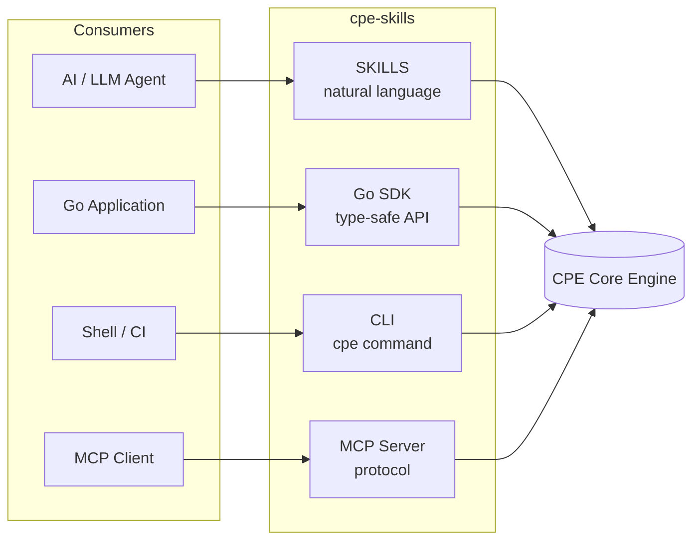
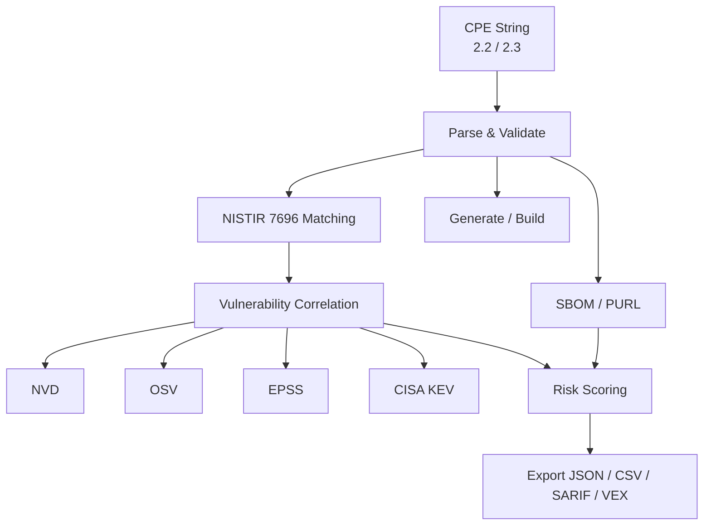

## Why cpe-skills?

CPE is the NIST-standard naming scheme (NIST IR 7695/7696) for identifying IT systems and software — it's the backbone of CVE vulnerability matching, SBOM tracking, and supply chain security. But working with CPE is hard: two incompatible formats, complex WFN binding, multi-source vulnerability data, SBOM bridging.

**cpe-skills solves all of this** with a single toolkit covering the full CPE lifecycle, from parsing to vulnerability management.

## Four Integration Paths



### 1. SKILLS — for AI / LLM

Add to your Claude Code skills configuration:

```
https://github.com/scagogogo/cpe-skills
```

### 2. Go SDK

```bash
go get github.com/scagogogo/cpe-skills
```

```go
c, _ := cpeskills.Parse("cpe:2.3:a:microsoft:windows:10:*:*:*:*:*:*:*")
fmt.Println(c.Vendor, c.ProductName, c.Version)
```

### 3. CLI

```bash
# Install via Go
go install github.com/scagogogo/cpe-skills/cmd/cpe@latest

# Or download a prebuilt binary from Releases (108 platforms)
cpe parse "cpe:2.3:a:microsoft:windows:10:*:*:*:*:*:*:*"
cpe match "cpe:2.3:a:apache:log4j:2.14.1:*:*:*:*:*:*:*" \
         "cpe:2.3:a:apache:log4j:2.14.1:*:*:*:*:*:*:*"
```

### 4. MCP (Model Context Protocol)

```json
{
  "mcpServers": {
    "cpe-skills": {
      "command": "cpe",
      "args": ["mcp", "serve"]
    }
  }
}
```

## Data Flow



## Feature Mind Map


## Documentation

- [Guide](/en/guide/) — Practical usage examples
- [API Reference](/en/api/) — Complete API documentation
- [GitHub Repository](https://github.com/scagogogo/cpe-skills) — Source code, releases, issues
