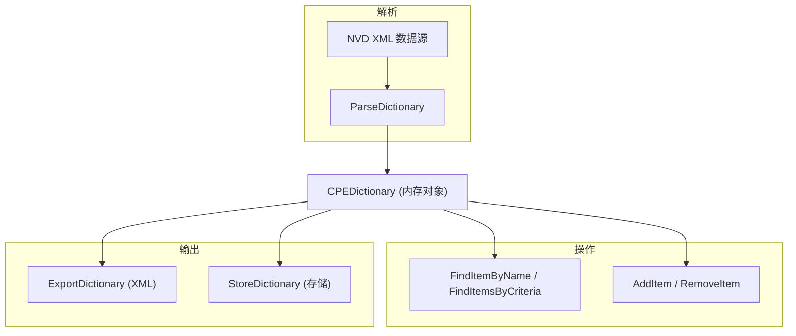

# 字典管理

CPE 库提供对 CPE 字典的支持，包括解析 NVD XML 字典、在内存中管理字典条目、查询条目，以及将字典导出回 XML。

下图展示了 CPE 字典的生命周期：从解析原始 XML，到内存中的各类操作，再到导出与存储。



## 字典类型

### CPEDictionary

```go
type CPEDictionary struct {
    Items         []*CPEItem // CPE 字典条目
    GeneratedAt   time.Time  // 字典生成时间
    SchemaVersion string     // 字典符合的 CPE 规范版本
}
```

表示一个完整的 CPE 字典，通常来自美国国家漏洞数据库（NVD）。

### CPEItem

```go
type CPEItem struct {
    Name            string      // CPE 名称（通常为 CPE 2.3 格式）
    Title           string      // 人类可读标题
    References      []Reference // 相关参考链接
    Deprecated      bool        // 是否已弃用
    DeprecationDate *time.Time  // 弃用日期（如果已弃用）
    CPE             *CPE        // 解析后的 CPE 对象
}
```

表示 CPE 字典中的单个条目。

### Reference

```go
type Reference struct {
    URL  string // 参考 URL
    Type string // 参考类型，如 "Vendor"、"Advisory"、"External"
}
```

表示与 CPE 条目关联的参考链接。

## 字典解析

### ParseDictionary

```go
func ParseDictionary(r io.Reader) (*CPEDictionary, error)
```

从 XML 数据流（通常为 NVD 格式）解析 CPE 字典。

**参数：**
- `r` - XML 数据流（来自文件或 HTTP 响应）

**返回值：**
- `*CPEDictionary` - 解析后的字典
- `error` - 解析失败时返回错误

**示例：**
```go
// 从文件解析字典
file, err := os.Open("official-cpe-dictionary_v2.3.xml")
if err != nil {
    log.Fatalf("Failed to open dictionary file: %v", err)
}
defer file.Close()

dictionary, err := cpeskills.ParseDictionary(file)
if err != nil {
    log.Fatalf("Failed to parse dictionary: %v", err)
}

fmt.Printf("Dictionary contains %d CPE items\n", len(dictionary.Items))
fmt.Printf("Generated at: %v\n", dictionary.GeneratedAt)

// 显示前 5 个 CPE 项
for i, item := range dictionary.Items[:5] {
    fmt.Printf("%d. %s - %s\n", i+1, item.Name, item.Title)
}
```

## 字典操作

### NewCPEItem

```go
func NewCPEItem(cpe *CPE, title string) *CPEItem
```

根据已解析的 CPE 和标题创建一个新的 CPE 项。

**参数：**
- `cpe` - 解析后的 CPE 对象
- `title` - 人类可读标题

**返回值：**
- `*CPEItem` - 新的 CPE 项

**示例：**
```go
cpe, err := cpeskills.ParseCpe23("cpe:2.3:a:microsoft:windows:10:*:*:*:*:*:*:*")
if err != nil {
    log.Fatal(err)
}

item := cpeskills.NewCPEItem(cpe, "Microsoft Windows 10")
fmt.Printf("Created item: %s\n", item.Name)
```

### AddItem

```go
func (d *CPEDictionary) AddItem(item *CPEItem)
```

向字典添加一个 CPE 项。如果已存在同名项，则替换该项。

**参数：**
- `item` - 要添加的 CPE 项

**示例：**
```go
cpe, _ := cpeskills.ParseCpe23("cpe:2.3:a:apache:tomcat:9.0.0:*:*:*:*:*:*:*")
item := cpeskills.NewCPEItem(cpe, "Apache Tomcat 9.0.0")

dictionary.AddItem(item)
fmt.Printf("Dictionary now has %d items\n", len(dictionary.Items))
```

### RemoveItem

```go
func (d *CPEDictionary) RemoveItem(name string) bool
```

按名称从字典中移除 CPE 项。若移除了某项则返回 `true`。

**参数：**
- `name` - 要移除项的 CPE 名称

**返回值：**
- `bool` - 是否移除了某项

**示例：**
```go
removed := dictionary.RemoveItem("cpe:2.3:a:apache:tomcat:9.0.0:*:*:*:*:*:*:*")
if removed {
    fmt.Println("Item removed")
} else {
    fmt.Println("Item not found")
}
```

### FindItemByName

```go
func (d *CPEDictionary) FindItemByName(name string) *CPEItem
```

按 CPE 名称查找字典项。若没有匹配项则返回 `nil`。

**参数：**
- `name` - 要查找的 CPE 名称

**返回值：**
- `*CPEItem` - 匹配的项，或 `nil`

**示例：**
```go
item := dictionary.FindItemByName("cpe:2.3:a:microsoft:windows:10:*:*:*:*:*:*:*")
if item != nil {
    fmt.Printf("Found: %s\n", item.Title)
} else {
    fmt.Println("Not found")
}
```

### FindItemsByCriteria

```go
func (d *CPEDictionary) FindItemsByCriteria(criteria *CPE, options *MatchOptions) []*CPEItem
```

查找其解析后的 CPE 与给定条件匹配的字典项，使用提供的匹配选项。

**参数：**
- `criteria` - 用于匹配的 CPE
- `options` - 匹配选项（使用 `DefaultMatchOptions()` 获取默认值）

**返回值：**
- `[]*CPEItem` - 匹配的项

**示例：**
```go
// 匹配所有 Apache 产品，忽略版本
criteria, _ := cpeskills.ParseCpe23("cpe:2.3:a:apache:*:*:*:*:*:*:*:*:*")
options := cpeskills.DefaultMatchOptions()
options.IgnoreVersion = true

results := dictionary.FindItemsByCriteria(criteria, options)
fmt.Printf("Found %d Apache items\n", len(results))

for _, item := range results {
    fmt.Printf("- %s: %s\n", item.Name, item.Title)
}
```

## 字典存储

### StoreDictionary

```go
func (fs *FileStorage) StoreDictionary(dict *CPEDictionary) error
```

使用存储后端存储字典。`StoreDictionary` 是 `Storage` 接口的一部分，`FileStorage` 和 `MemoryStorage` 均已实现。

**示例：**
```go
// 存储到文件存储
storage, err := cpeskills.NewFileStorage("./data", true)
if err != nil {
    log.Fatal(err)
}
defer storage.Close()

if err := storage.Initialize(); err != nil {
    log.Fatal(err)
}

if err := storage.StoreDictionary(dictionary); err != nil {
    log.Printf("Failed to store dictionary: %v", err)
} else {
    fmt.Println("Dictionary stored successfully")
}
```

### RetrieveDictionary

```go
func (fs *FileStorage) RetrieveDictionary() (*CPEDictionary, error)
```

检索已存储的字典。若尚未存储任何字典，则返回 `ErrNotFound`。

**示例：**
```go
dictionary, err := storage.RetrieveDictionary()
if err != nil {
    if errors.Is(err, cpeskills.ErrNotFound) {
        fmt.Println("No dictionary found")
    } else {
        log.Printf("Failed to retrieve dictionary: %v", err)
    }
} else {
    fmt.Printf("Retrieved dictionary with %d items\n", len(dictionary.Items))
}
```

## 字典导出

### ExportDictionary

```go
func ExportDictionary(dict *CPEDictionary, w io.Writer) error
```

将字典导出为 NVD 风格的 XML 格式。

**参数：**
- `dict` - 要导出的字典
- `w` - 用于输出 XML 数据的写入器

**返回值：**
- `error` - 导出失败时返回错误

**示例：**
```go
// 导出到文件
file, err := os.Create("dictionary.xml")
if err != nil {
    log.Fatal(err)
}
defer file.Close()

if err := cpeskills.ExportDictionary(dictionary, file); err != nil {
    log.Printf("Failed to export dictionary: %v", err)
} else {
    fmt.Println("Dictionary exported to XML")
}
```

## 完整示例

```go
package main

import (
    "fmt"
    "log"
    "os"

    cpeskills "github.com/scagogogo/cpe-skills"
)

func main() {
    // 从 NVD XML 文件解析字典
    fmt.Println("Parsing CPE dictionary...")
    file, err := os.Open("official-cpe-dictionary_v2.3.xml")
    if err != nil {
        log.Fatalf("Failed to open dictionary file: %v", err)
    }
    defer file.Close()

    dictionary, err := cpeskills.ParseDictionary(file)
    if err != nil {
        log.Fatalf("Failed to parse dictionary: %v", err)
    }

    // 显示基本信息
    fmt.Printf("Dictionary loaded successfully!\n")
    fmt.Printf("Schema version: %s\n", dictionary.SchemaVersion)
    fmt.Printf("Generated at: %v\n", dictionary.GeneratedAt)
    fmt.Printf("Total items: %d\n", len(dictionary.Items))

    // 添加一个新项
    cpe, _ := cpeskills.ParseCpe23("cpe:2.3:a:apache:tomcat:9.0.0:*:*:*:*:*:*:*")
    dictionary.AddItem(cpeskills.NewCPEItem(cpe, "Apache Tomcat 9.0.0"))

    // 查找匹配条件的项
    fmt.Println("\nSearching for Apache products...")
    criteria, _ := cpeskills.ParseCpe23("cpe:2.3:a:apache:*:*:*:*:*:*:*:*:*")
    options := cpeskills.DefaultMatchOptions()
    options.IgnoreVersion = true

    apacheItems := dictionary.FindItemsByCriteria(criteria, options)
    fmt.Printf("Found %d Apache products:\n", len(apacheItems))

    for i, item := range apacheItems {
        fmt.Printf("%d. %s\n", i+1, item.Title)
        if item.Deprecated {
            fmt.Printf("   (DEPRECATED)\n")
        }

        // 显示参考信息
        for _, ref := range item.References {
            fmt.Printf("   Reference (%s): %s\n", ref.Type, ref.URL)
        }
    }

    // 按名称查找特定项
    item := dictionary.FindItemByName("cpe:2.3:a:apache:tomcat:9.0.0:*:*:*:*:*:*:*")
    if item != nil {
        fmt.Printf("\nFound by name: %s\n", item.Title)
    }

    // 存储字典
    fmt.Println("\nStoring dictionary...")
    storage, err := cpeskills.NewFileStorage("./dictionary-data", true)
    if err != nil {
        log.Fatal(err)
    }
    defer storage.Close()

    if err := storage.Initialize(); err != nil {
        log.Fatal(err)
    }

    if err := storage.StoreDictionary(dictionary); err != nil {
        log.Printf("Failed to store dictionary: %v", err)
    } else {
        fmt.Println("Dictionary stored successfully!")
    }

    // 导出为 XML
    fmt.Println("Exporting to XML...")
    out, err := os.Create("dictionary.xml")
    if err != nil {
        log.Fatal(err)
    }
    defer out.Close()

    if err := cpeskills.ExportDictionary(dictionary, out); err != nil {
        log.Printf("Failed to export dictionary: %v", err)
    } else {
        fmt.Println("Dictionary exported to dictionary.xml")
    }
}
```
