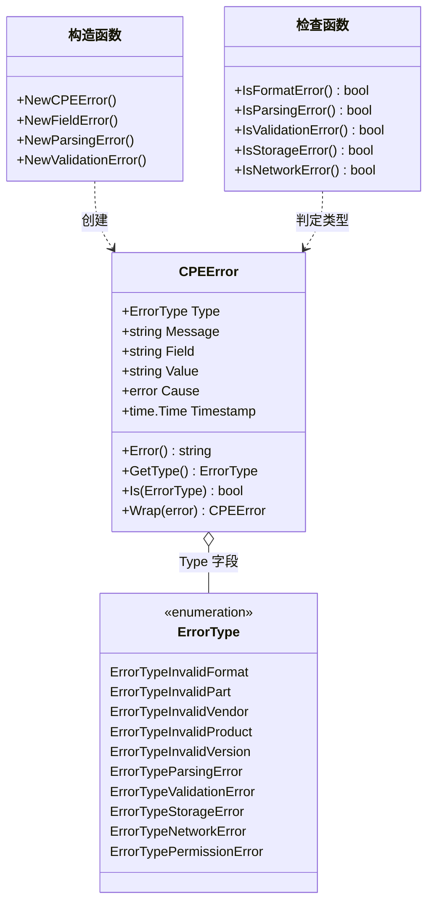

# 错误处理

本页面描述了CPE库中的错误处理机制，包括错误类型、错误检查和错误恢复策略。

下面的类图展示了 `CPEError` 如何携带 `ErrorType` 字段，以及构造函数（NewXxx）与检查函数（IsXxx）成对存在的关系：



## 错误类型

### CPEError

CPE相关错误的基础类型。

```go
type CPEError struct {
    Type      ErrorType // 错误类型
    Message   string    // 错误消息
    Field     string    // 相关字段
    Value     string    // 错误值
    Cause     error     // 原始错误
    Timestamp time.Time // 错误时间
}
```

### ErrorType

错误类型枚举。

```go
type ErrorType int

const (
    ErrorTypeInvalidFormat ErrorType = iota // 无效格式
    ErrorTypeInvalidPart                    // 无效组件类型
    ErrorTypeInvalidVendor                  // 无效供应商
    ErrorTypeInvalidProduct                 // 无效产品
    ErrorTypeInvalidVersion                 // 无效版本
    ErrorTypeParsingError                   // 解析错误
    ErrorTypeValidationError                // 验证错误
    ErrorTypeStorageError                   // 存储错误
    ErrorTypeNetworkError                   // 网络错误
    ErrorTypePermissionError                // 权限错误
)
```

### 错误方法

```go
// 实现error接口
func (e *CPEError) Error() string

// 获取错误类型
func (e *CPEError) GetType() ErrorType

// 检查是否为特定类型的错误
func (e *CPEError) Is(errorType ErrorType) bool

// 获取错误详情
func (e *CPEError) GetDetails() map[string]interface{}

// 包装错误
func (e *CPEError) Wrap(cause error) *CPEError
```

**示例：**
```go
// 创建CPE错误
err := &cpeskills.CPEError{
    Type:    cpeskills.ErrorTypeInvalidFormat,
    Message: "CPE格式无效",
    Field:   "cpe_string",
    Value:   "invalid-cpe",
}

fmt.Printf("错误: %v\n", err)
fmt.Printf("错误类型: %d\n", err.GetType())
fmt.Printf("是否为格式错误: %t\n", err.Is(cpeskills.ErrorTypeInvalidFormat))
```

## 错误创建函数

### NewCPEError

创建新的CPE错误。

```go
func NewCPEError(errorType ErrorType, message string) *CPEError
```

### NewFieldError

创建字段相关错误。

```go
func NewFieldError(errorType ErrorType, field, value, message string) *CPEError
```

### NewParsingError

创建解析错误。

```go
func NewParsingError(input string, cause error) *CPEError
```

### NewValidationError

创建验证错误。

```go
func NewValidationError(field, value, message string) *CPEError
```

**示例：**
```go
// 创建不同类型的错误
formatError := cpeskills.NewCPEError(cpeskills.ErrorTypeInvalidFormat, "CPE格式不正确")

fieldError := cpeskills.NewFieldError(
    cpeskills.ErrorTypeInvalidVendor,
    "vendor",
    "",
    "供应商不能为空",
)

parsingError := cpeskills.NewParsingError(
    "invalid-cpe-string",
    fmt.Errorf("unexpected character"),
)

validationError := cpeskills.NewValidationError(
    "version",
    "invalid-version",
    "版本格式不符合规范",
)
```

## 错误检查函数

### IsFormatError

检查是否为格式错误。

```go
func IsFormatError(err error) bool
```

### IsParsingError

检查是否为解析错误。

```go
func IsParsingError(err error) bool
```

### IsValidationError

检查是否为验证错误。

```go
func IsValidationError(err error) bool
```

### IsStorageError

检查是否为存储错误。

```go
func IsStorageError(err error) bool
```

### IsNetworkError

检查是否为网络错误。

```go
func IsNetworkError(err error) bool
```

**示例：**
```go
_, err := cpeskills.ParseCpe23("invalid-cpe-format")
if err != nil {
    if cpeskills.IsFormatError(err) {
        fmt.Println("这是一个格式错误")
    } else if cpeskills.IsParsingError(err) {
        fmt.Println("这是一个解析错误")
    } else {
        fmt.Printf("其他错误: %v\n", err)
    }
}
```

## 错误聚合

### ErrorList

错误列表类型。

```go
type ErrorList struct {
    Errors []error // 错误列表
}
```

### ErrorList方法

```go
// 添加错误
func (el *ErrorList) Add(err error)

// 检查是否有错误
func (el *ErrorList) HasErrors() bool

// 获取错误数量
func (el *ErrorList) Count() int

// 获取第一个错误
func (el *ErrorList) First() error

// 实现error接口
func (el *ErrorList) Error() string

// 过滤特定类型的错误
func (el *ErrorList) FilterByType(errorType ErrorType) []error
```

**示例：**
```go
// 创建错误列表
errorList := &cpeskills.ErrorList{}

// 批量解析CPE并收集错误
cpeStrings := []string{
    "cpe:2.3:a:microsoft:windows:10:*:*:*:*:*:*:*",
    "invalid-cpe-1",
    "invalid-cpe-2",
    "cpe:2.3:a:apache:tomcat:9.0.0:*:*:*:*:*:*:*",
}

for _, cpeStr := range cpeStrings {
    _, err := cpeskills.ParseCpe23(cpeStr)
    if err != nil {
        errorList.Add(err)
    }
}

if errorList.HasErrors() {
    fmt.Printf("发现 %d 个错误:\n", errorList.Count())
    for i, err := range errorList.Errors {
        fmt.Printf("  %d. %v\n", i+1, err)
    }
}
```

## 错误恢复

### ErrorRecovery

错误恢复接口。

```go
type ErrorRecovery interface {
    // 尝试恢复错误
    Recover(err error) (*CPE, error)
    
    // 检查是否可以恢复
    CanRecover(err error) bool
    
    // 获取恢复建议
    GetSuggestions(err error) []string
}
```

### DefaultErrorRecovery

默认错误恢复实现。

```go
type DefaultErrorRecovery struct {
    EnableAutoFix    bool // 启用自动修复
    EnableSuggestions bool // 启用建议
}
```

**示例：**
```go
// 创建错误恢复器
recovery := &cpeskills.DefaultErrorRecovery{
    EnableAutoFix:    true,
    EnableSuggestions: true,
}

// 尝试解析有问题的CPE
invalidCPE := "cpe:2.3:a:microsoft:windows:10" // 缺少字段

_, err := cpeskills.ParseCpe23(invalidCPE)
if err != nil {
    fmt.Printf("解析失败: %v\n", err)
    
    // 尝试恢复
    if recovery.CanRecover(err) {
        recoveredCPE, recoverErr := recovery.Recover(err)
        if recoverErr == nil {
            fmt.Printf("恢复成功: %s\n", recoveredCPE.GetURI())
        } else {
            fmt.Printf("恢复失败: %v\n", recoverErr)
        }
    }
    
    // 获取建议
    suggestions := recovery.GetSuggestions(err)
    if len(suggestions) > 0 {
        fmt.Println("修复建议:")
        for i, suggestion := range suggestions {
            fmt.Printf("  %d. %s\n", i+1, suggestion)
        }
    }
}
```

## 错误日志

### ErrorLogger

错误日志接口。

```go
type ErrorLogger interface {
    LogError(err error)
    LogErrorWithContext(err error, context map[string]interface{})
    GetErrorHistory() []ErrorLogEntry
}
```

### ErrorLogEntry

错误日志条目。

```go
type ErrorLogEntry struct {
    Timestamp time.Time              // 时间戳
    Error     error                  // 错误
    Context   map[string]interface{} // 上下文信息
    Level     LogLevel               // 日志级别
}
```

### FileErrorLogger

文件错误日志实现。

```go
type FileErrorLogger struct {
    LogFile    string   // 日志文件路径
    MaxSize    int64    // 最大文件大小
    MaxBackups int      // 最大备份数量
    Compress   bool     // 是否压缩
}
```

**示例：**
```go
// 创建文件日志记录器
logger := &cpeskills.FileErrorLogger{
    LogFile:    "./cpe_errors.log",
    MaxSize:    10 * 1024 * 1024, // 10MB
    MaxBackups: 5,
    Compress:   true,
}

// 记录错误
err := cpeskills.NewCPEError(cpeskills.ErrorTypeInvalidFormat, "测试错误")
logger.LogError(err)

// 带上下文记录错误
context := map[string]interface{}{
    "operation": "parse_cpe",
    "input":     "invalid-cpe-string",
    "user_id":   "12345",
}
logger.LogErrorWithContext(err, context)

// 获取错误历史
history := logger.GetErrorHistory()
fmt.Printf("错误历史记录: %d 条\n", len(history))
```

## 错误统计

### ErrorStatistics

错误统计信息。

```go
type ErrorStatistics struct {
    TotalErrors      int                    // 总错误数
    ErrorsByType     map[ErrorType]int      // 按类型分组的错误数
    ErrorsByField    map[string]int         // 按字段分组的错误数
    RecentErrors     []ErrorLogEntry        // 最近的错误
    ErrorRate        float64                // 错误率
    LastErrorTime    time.Time              // 最后错误时间
}
```

### GetErrorStatistics

获取错误统计信息。

```go
func GetErrorStatistics() *ErrorStatistics
```

**示例：**
```go
// 获取错误统计
stats := cpeskills.GetErrorStatistics()

fmt.Printf("错误统计信息:\n")
fmt.Printf("  总错误数: %d\n", stats.TotalErrors)
fmt.Printf("  错误率: %.2f%%\n", stats.ErrorRate*100)
fmt.Printf("  最后错误时间: %s\n", stats.LastErrorTime.Format("2006-01-02 15:04:05"))

fmt.Println("按类型分组:")
for errorType, count := range stats.ErrorsByType {
    fmt.Printf("  类型 %d: %d 次\n", errorType, count)
}

fmt.Println("按字段分组:")
for field, count := range stats.ErrorsByField {
    fmt.Printf("  %s: %d 次\n", field, count)
}
```

## 完整示例

```go
package main

import (
    "fmt"
    "log"
    "github.com/scagogogo/cpe-skills"
)

func main() {
    fmt.Println("=== CPE错误处理示例 ===")
    
    // 设置错误日志记录器
    logger := &cpeskills.FileErrorLogger{
        LogFile:    "./cpe_errors.log",
        MaxSize:    1024 * 1024, // 1MB
        MaxBackups: 3,
    }
    
    // 设置错误恢复器
    recovery := &cpeskills.DefaultErrorRecovery{
        EnableAutoFix:    true,
        EnableSuggestions: true,
    }
    
    // 测试CPE字符串（包含各种错误）
    testCPEs := []string{
        "cpe:2.3:a:microsoft:windows:10:*:*:*:*:*:*:*",  // 正确
        "invalid-cpe-format",                            // 格式错误
        "cpe:2.3:x:vendor:product:1.0:*:*:*:*:*:*:*",   // 无效部件
        "cpe:2.3:a::product:1.0:*:*:*:*:*:*:*",         // 空供应商
        "cpe:2.3:a:vendor::1.0:*:*:*:*:*:*:*",          // 空产品
        "cpe:2.3:a:vendor:product",                      // 不完整
    }
    
    errorList := &cpeskills.ErrorList{}
    successCount := 0
    recoveredCount := 0
    
    fmt.Println("1. 解析测试:")
    for i, cpeStr := range testCPEs {
        fmt.Printf("\n测试 %d: %s\n", i+1, cpeStr)
        
        // 尝试解析
        cpeObj, err := cpeskills.ParseCpe23(cpeStr)
        if err != nil {
            fmt.Printf("  ❌ 解析失败: %v\n", err)
            
            // 记录错误
            logger.LogErrorWithContext(err, map[string]interface{}{
                "test_case": i + 1,
                "input":     cpeStr,
            })
            
            // 添加到错误列表
            errorList.Add(err)
            
            // 错误类型检查
            if cpeskills.IsFormatError(err) {
                fmt.Println("    类型: 格式错误")
            } else if cpeskills.IsParsingError(err) {
                fmt.Println("    类型: 解析错误")
            } else if cpeskills.IsValidationError(err) {
                fmt.Println("    类型: 验证错误")
            }
            
            // 尝试错误恢复
            if recovery.CanRecover(err) {
                fmt.Println("    尝试错误恢复...")
                recoveredCPE, recoverErr := recovery.Recover(err)
                if recoverErr == nil {
                    fmt.Printf("    ✅ 恢复成功: %s\n", recoveredCPE.GetURI())
                    recoveredCount++
                } else {
                    fmt.Printf("    ❌ 恢复失败: %v\n", recoverErr)
                }
                
                // 显示修复建议
                suggestions := recovery.GetSuggestions(err)
                if len(suggestions) > 0 {
                    fmt.Println("    修复建议:")
                    for j, suggestion := range suggestions {
                        fmt.Printf("      %d. %s\n", j+1, suggestion)
                    }
                }
            }
        } else {
            fmt.Printf("  ✅ 解析成功: %s %s %s\n", 
                cpeObj.Vendor, cpeObj.ProductName, cpeObj.Version)
            successCount++
        }
    }
    
    // 错误汇总
    fmt.Println("\n2. 错误汇总:")
    fmt.Printf("总测试数: %d\n", len(testCPEs))
    fmt.Printf("成功解析: %d\n", successCount)
    fmt.Printf("解析失败: %d\n", errorList.Count())
    fmt.Printf("成功恢复: %d\n", recoveredCount)
    
    if errorList.HasErrors() {
        fmt.Println("\n错误详情:")
        for i, err := range errorList.Errors {
            fmt.Printf("  %d. %v\n", i+1, err)
            
            // 如果是CPE错误，显示详细信息
            if cpeErr, ok := err.(*cpeskills.CPEError); ok {
                details := cpeErr.GetDetails()
                for key, value := range details {
                    fmt.Printf("     %s: %v\n", key, value)
                }
            }
        }
        
        // 按类型过滤错误
        formatErrors := errorList.FilterByType(cpeskills.ErrorTypeInvalidFormat)
        if len(formatErrors) > 0 {
            fmt.Printf("\n格式错误数量: %d\n", len(formatErrors))
        }
    }
    
    // 错误统计
    fmt.Println("\n3. 错误统计:")
    stats := cpeskills.GetErrorStatistics()
    fmt.Printf("总错误数: %d\n", stats.TotalErrors)
    fmt.Printf("错误率: %.2f%%\n", stats.ErrorRate*100)
    
    if len(stats.ErrorsByType) > 0 {
        fmt.Println("按类型分组:")
        for errorType, count := range stats.ErrorsByType {
            var typeName string
            switch errorType {
            case cpeskills.ErrorTypeInvalidFormat:
                typeName = "格式错误"
            case cpeskills.ErrorTypeInvalidPart:
                typeName = "无效部件"
            case cpeskills.ErrorTypeInvalidVendor:
                typeName = "无效供应商"
            case cpeskills.ErrorTypeInvalidProduct:
                typeName = "无效产品"
            case cpeskills.ErrorTypeParsingError:
                typeName = "解析错误"
            default:
                typeName = fmt.Sprintf("类型%d", errorType)
            }
            fmt.Printf("  %s: %d 次\n", typeName, count)
        }
    }
    
    // 自定义错误处理
    fmt.Println("\n4. 自定义错误处理:")
    
    customErr := &cpeskills.CPEError{
        Type:      cpeskills.ErrorTypeValidationError,
        Message:   "自定义验证失败",
        Field:     "custom_field",
        Value:     "custom_value",
        Timestamp: time.Now(),
    }
    
    fmt.Printf("自定义错误: %v\n", customErr)
    fmt.Printf("错误类型: %d\n", customErr.GetType())
    fmt.Printf("是否为验证错误: %t\n", customErr.Is(cpeskills.ErrorTypeValidationError))
    
    // 包装错误
    wrappedErr := customErr.Wrap(fmt.Errorf("底层错误"))
    fmt.Printf("包装后的错误: %v\n", wrappedErr)
}
```

## 最佳实践

### 1. 错误处理策略

- **及早检查**: 在函数入口处验证参数
- **明确错误**: 提供清晰的错误消息和上下文
- **分类处理**: 根据错误类型采取不同的处理策略
- **记录错误**: 记录重要的错误信息用于调试

### 2. 错误恢复

- **优雅降级**: 在可能的情况下提供备选方案
- **用户友好**: 向用户提供有用的错误信息和建议
- **自动修复**: 对于常见错误提供自动修复功能
- **防止级联**: 避免一个错误导致系统崩溃

### 3. 错误监控

- **统计分析**: 定期分析错误模式和趋势
- **告警机制**: 对于严重错误设置告警
- **性能影响**: 监控错误对系统性能的影响
- **持续改进**: 根据错误数据改进系统设计

## 下一步

- 了解[核心类型](./types.md)来理解错误相关的数据结构
- 学习[验证功能](./validation.md)来预防错误的发生
- 探索[存储接口](./storage.md)来持久化错误日志
