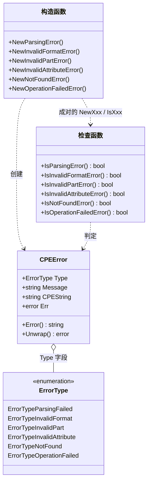

# 错误处理

CPE 库提供了一套完善的错误处理系统，为不同的失败场景定义了结构化的错误类型。

下面的类图展示了 `CPEError` 如何携带 `ErrorType` 字段，以及每个 `NewXxxError` 构造函数如何与对应的 `IsXxxError` 检查函数成对出现：



## 错误类型

### ErrorType

```go
type ErrorType int

const (
    ErrorTypeParsingFailed    ErrorType = iota // 解析操作失败
    ErrorTypeInvalidFormat                     // 检测到无效格式
    ErrorTypeInvalidPart                       // 无效的部件值
    ErrorTypeInvalidAttribute                  // 无效的属性值
    ErrorTypeNotFound                          // 资源未找到
    ErrorTypeOperationFailed                   // 一般性操作失败
)
```

库中可能出现的各种错误类型的枚举。

### CPEError

```go
type CPEError struct {
    Type      ErrorType // 错误类型分类
    Message   string    // 人类可读的错误消息
    CPEString string    // 相关的 CPE 字符串（如果适用）
    Err       error     // 底层错误（如果有）
}
```

库中通用的主要错误类型，提供结构化的错误信息。

#### 方法

##### Error

```go
func (e *CPEError) Error() string
```

实现 `error` 接口，返回格式化的错误消息。

**返回值：**
- `string` - 格式化的错误消息

**示例：**
```go
err := cpeskills.NewInvalidFormatError("invalid:cpe:format")
fmt.Printf("Error: %s\n", err.Error())
// 输出: invalid CPE format: invalid:cpe:format
```

##### Unwrap

```go
func (e *CPEError) Unwrap() error
```

返回底层错误，用于错误链解包。

**返回值：**
- `error` - 底层错误或 `nil`

**示例：**
```go
originalErr := errors.New("underlying issue")
cpeErr := cpeskills.NewOperationFailedError("parse", originalErr)

unwrapped := cpeErr.Unwrap()
fmt.Printf("Underlying error: %v\n", unwrapped)
```

## 错误构造函数

### NewParsingError

```go
func NewParsingError(cpeString string, err error) *CPEError
```

当 CPE 字符串解析失败时创建解析错误。

**参数：**
- `cpeString` - 解析失败的 CPE 字符串
- `err` - 底层解析错误

**返回值：**
- `*CPEError` - 解析错误

**示例：**
```go
err := cpeskills.NewParsingError("invalid:format", errors.New("malformed string"))
fmt.Printf("Parsing error: %v\n", err)
```

### NewInvalidFormatError

```go
func NewInvalidFormatError(cpeString string) *CPEError
```

为无效的 CPE 格式创建错误。

**参数：**
- `cpeString` - 无效的 CPE 字符串

**返回值：**
- `*CPEError` - 无效格式错误

**示例：**
```go
err := cpeskills.NewInvalidFormatError("not:a:valid:cpe")
fmt.Printf("Format error: %v\n", err)
```

### NewInvalidPartError

```go
func NewInvalidPartError(part string) *CPEError
```

为无效的 CPE 部件值创建错误。

**参数：**
- `part` - 无效的部件值

**返回值：**
- `*CPEError` - 无效部件错误

**示例：**
```go
err := cpeskills.NewInvalidPartError("x") // 有效的部件值为 "a"、"h"、"o"
fmt.Printf("Part error: %v\n", err)
```

### NewInvalidAttributeError

```go
func NewInvalidAttributeError(attribute, value string) *CPEError
```

为无效的属性值创建错误。

**参数：**
- `attribute` - 无效属性的名称
- `value` - 无效的值

**返回值：**
- `*CPEError` - 无效属性错误

**示例：**
```go
err := cpeskills.NewInvalidAttributeError("vendor", "invalid\x00vendor")
fmt.Printf("Attribute error: %v\n", err)
```

### NewNotFoundError

```go
func NewNotFoundError(what string) *CPEError
```

当资源未找到时创建错误。

**参数：**
- `what` - 未找到内容的描述

**返回值：**
- `*CPEError` - 未找到错误

**示例：**
```go
err := cpeskills.NewNotFoundError("CPE dictionary")
fmt.Printf("Not found error: %v\n", err)
```

### NewOperationFailedError

```go
func NewOperationFailedError(operation string, err error) *CPEError
```

当操作失败时创建错误。

**参数：**
- `operation` - 失败操作的名称
- `err` - 底层错误

**返回值：**
- `*CPEError` - 操作失败错误

**示例：**
```go
err := cpeskills.NewOperationFailedError("download", errors.New("network timeout"))
fmt.Printf("Operation error: %v\n", err)
```

## 错误检查函数

### IsParsingError

```go
func IsParsingError(err error) bool
```

检查错误是否为解析错误。

**参数：**
- `err` - 要检查的错误

**返回值：**
- `bool` - 如果是解析错误则为 `true`

**示例：**
```go
_, err := cpeskills.ParseCpe23("invalid:format")
if cpeskills.IsParsingError(err) {
    fmt.Println("This is a parsing error")
}
```

### IsInvalidFormatError

```go
func IsInvalidFormatError(err error) bool
```

检查错误是否为无效格式错误。

**参数：**
- `err` - 要检查的错误

**返回值：**
- `bool` - 如果是无效格式错误则为 `true`

### IsInvalidPartError

```go
func IsInvalidPartError(err error) bool
```

检查错误是否为无效部件错误。

**参数：**
- `err` - 要检查的错误

**返回值：**
- `bool` - 如果是无效部件错误则为 `true`

### IsInvalidAttributeError

```go
func IsInvalidAttributeError(err error) bool
```

检查错误是否为无效属性错误。

**参数：**
- `err` - 要检查的错误

**返回值：**
- `bool` - 如果是无效属性错误则为 `true`

### IsNotFoundError

```go
func IsNotFoundError(err error) bool
```

检查错误是否为未找到错误。

**参数：**
- `err` - 要检查的错误

**返回值：**
- `bool` - 如果是未找到错误则为 `true`

### IsOperationFailedError

```go
func IsOperationFailedError(err error) bool
```

检查错误是否为操作失败错误。

**参数：**
- `err` - 要检查的错误

**返回值：**
- `bool` - 如果是操作失败错误则为 `true`

## 存储错误

库还定义了标准的存储错误：

```go
var (
    ErrNotFound              = errors.New("record not found")
    ErrDuplicate             = errors.New("duplicate record")
    ErrInvalidData           = errors.New("invalid data")
    ErrStorageDisconnected   = errors.New("storage is disconnected")
)
```

这些错误可以配合 `errors.Is()` 使用来进行检查：

**示例：**
```go
cpe, err := storage.RetrieveCPE("non-existent")
if errors.Is(err, cpeskills.ErrNotFound) {
    fmt.Println("CPE not found in storage")
}
```

## 错误处理模式

### 基本错误处理

```go
// 解析 CPE 并处理错误
cpeObj, err := cpeskills.ParseCpe23("invalid:format")
if err != nil {
    if cpeskills.IsInvalidFormatError(err) {
        fmt.Println("Invalid CPE format provided")
    } else {
        fmt.Printf("Other parsing error: %v\n", err)
    }
    return
}
```

### 详细的错误信息

```go
// 获取详细的错误信息
_, err := cpeskills.ParseCpe23("cpe:2.3:x:vendor:product:1.0:*:*:*:*:*:*:*")
if err != nil {
    if cpeErr, ok := err.(*cpeskills.CPEError); ok {
        fmt.Printf("Error type: %d\n", cpeErr.Type)
        fmt.Printf("Message: %s\n", cpeErr.Message)
        fmt.Printf("CPE string: %s\n", cpeErr.CPEString)
        
        if cpeErr.Err != nil {
            fmt.Printf("Underlying error: %v\n", cpeErr.Err)
        }
    }
}
```

### 错误链解包

```go
// 处理错误链
err := someComplexOperation()
if err != nil {
    // 在错误链中检查特定的错误类型
    var cpeErr *cpeskills.CPEError
    if errors.As(err, &cpeErr) {
        fmt.Printf("CPE error found: %s\n", cpeErr.Message)
    }
    
    // 检查存储错误
    if errors.Is(err, cpeskills.ErrNotFound) {
        fmt.Println("Resource not found")
    }
}
```

### 全面的错误处理

```go
func handleCPEOperation(cpeString string) {
    cpeObj, err := cpeskills.ParseCpe23(cpeString)
    if err != nil {
        switch {
        case cpeskills.IsInvalidFormatError(err):
            fmt.Printf("Invalid format: %s\n", cpeString)
        case cpeskills.IsInvalidPartError(err):
            fmt.Printf("Invalid part in: %s\n", cpeString)
        case cpeskills.IsParsingError(err):
            fmt.Printf("General parsing error: %v\n", err)
        default:
            fmt.Printf("Unexpected error: %v\n", err)
        }
        return
    }
    
    // 使用解析后的 CPE
    fmt.Printf("Successfully parsed: %s\n", cpeObj.GetURI())
}
```

## 完整示例

```go
package main

import (
    "errors"
    "fmt"
    "github.com/scagogogo/cpe-skills"
)

func main() {
    // 测试不同的错误场景
    fmt.Println("=== Error Handling Examples ===")
    
    // 无效格式错误
    fmt.Println("\n1. Invalid Format Error:")
    _, err := cpeskills.ParseCpe23("invalid:format")
    if err != nil {
        if cpeskills.IsInvalidFormatError(err) {
            fmt.Printf("✓ Detected invalid format error: %v\n", err)
        }
    }
    
    // 无效部件错误
    fmt.Println("\n2. Invalid Part Error:")
    _, err = cpeskills.ParseCpe23("cpe:2.3:x:vendor:product:1.0:*:*:*:*:*:*:*")
    if err != nil {
        if cpeskills.IsInvalidPartError(err) {
            fmt.Printf("✓ Detected invalid part error: %v\n", err)
        }
    }
    
    // 存储错误模拟
    fmt.Println("\n3. Storage Error:")
    storage := cpeskills.NewMemoryStorage()
    storage.Initialize()
    
    _, err = storage.RetrieveCPE("non-existent-cpe")
    if err != nil {
        if errors.Is(err, cpeskills.ErrNotFound) {
            fmt.Printf("✓ Detected not found error: %v\n", err)
        }
    }
    
    // 详细的错误信息
    fmt.Println("\n4. Detailed Error Information:")
    _, err = cpeskills.ParseCpe23("cpe:2.3:invalid:vendor:product:1.0:*:*:*:*:*:*:*")
    if err != nil {
        if cpeErr, ok := err.(*cpeskills.CPEError); ok {
            fmt.Printf("Error Type: %d\n", cpeErr.Type)
            fmt.Printf("Message: %s\n", cpeErr.Message)
            fmt.Printf("CPE String: %s\n", cpeErr.CPEString)
        }
    }
    
    // 错误类型检查
    fmt.Println("\n5. Error Type Checking:")
    testCases := []struct {
        input       string
        description string
    }{
        {"invalid", "completely invalid"},
        {"cpe:2.3:x:vendor:product:1.0:*:*:*:*:*:*:*", "invalid part"},
        {"cpe:2.3:a:vendor:product", "too few components"},
    }
    
    for _, tc := range testCases {
        _, err := cpeskills.ParseCpe23(tc.input)
        if err != nil {
            fmt.Printf("Input: %s (%s)\n", tc.input, tc.description)
            
            switch {
            case cpeskills.IsInvalidFormatError(err):
                fmt.Println("  → Invalid format error")
            case cpeskills.IsInvalidPartError(err):
                fmt.Println("  → Invalid part error")
            case cpeskills.IsParsingError(err):
                fmt.Println("  → General parsing error")
            default:
                fmt.Println("  → Other error type")
            }
        }
    }
    
    // 成功的操作
    fmt.Println("\n6. Successful Operation:")
    cpeObj, err := cpeskills.ParseCpe23("cpe:2.3:a:microsoft:windows:10:*:*:*:*:*:*:*")
    if err != nil {
        fmt.Printf("Unexpected error: %v\n", err)
    } else {
        fmt.Printf("✓ Successfully parsed: %s\n", cpeObj.GetURI())
    }
}
```
