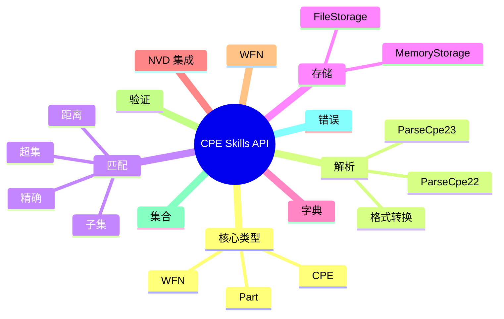

# API 参考

CPE库提供了一套全面的API，用于处理通用平台枚举（CPE）数据。本节涵盖了库中所有可用的公共类型、函数和接口。

## 概览

该库分为几个关键领域：

- **[核心类型](./types.md)** - 基本数据结构和类型定义
- **[解析功能](./parsing.md)** - 解析CPE字符串的函数
- **[匹配算法](./matching.md)** - CPE匹配和比较函数
- **[存储接口](./storage.md)** - 数据持久化接口和实现
- **[字典管理](./dictionary.md)** - CPE字典管理
- **[NVD集成](./nvd.md)** - 国家漏洞数据库集成
- **[WFN格式](./wfn.md)** - Well-Formed Name格式支持
- **[验证功能](./validation.md)** - CPE验证函数
- **[集合操作](./sets.md)** - CPE集合操作
- **[错误处理](./errors.md)** - 错误类型和处理

下面的脑图从整体上展示了各 API 模块的组织方式：



## 快速参考

### 核心函数

```go
// 解析CPE字符串
func ParseCpe23(cpe23 string) (*CPE, error)
func ParseCpe22(cpe22 string) (*CPE, error)

// 格式化CPE字符串
func FormatCpe23(cpe *CPE) string
func FormatCpe22(cpe *CPE) string

// 匹配CPE
func (c *CPE) Match(other *CPE) bool
func MatchCPE(cpe1, cpe2 *CPE, options *MatchOptions) bool
func AdvancedMatchCPE(criteria, target *CPE, options *AdvancedMatchOptions) bool

// 存储操作
func NewFileStorage(baseDir string, enableCache bool) (*FileStorage, error)
func NewMemoryStorage() *MemoryStorage
```

### 核心类型

```go
type CPE struct {
    Cpe23           string
    Part            Part
    Vendor          Vendor
    ProductName     Product
    Version         Version
    Update          Update
    Edition         Edition
    Language        Language
    SoftwareEdition string
    TargetSoftware  string
    TargetHardware  string
    Other           string
    Cve             string
    Url             string
}

type Part struct {
    ShortName   string
    LongName    string
    Description string
}
```

## 安装

```bash
go get github.com/scagogogo/cpe-skills
```

## 导入

```go
import "github.com/scagogogo/cpe-skills"
```

## 基本用法

```go
package main

import (
    "fmt"
    "log"
    "github.com/scagogogo/cpe-skills"
)

func main() {
    // 解析CPE字符串
    cpeObj, err := cpeskills.ParseCpe23("cpe:2.3:a:microsoft:windows:10:*:*:*:*:*:*:*")
    if err != nil {
        log.Fatal(err)
    }
    
    // 访问CPE组件
    fmt.Printf("部件: %s\n", cpeObj.Part.LongName)
    fmt.Printf("供应商: %s\n", cpeObj.Vendor)
    fmt.Printf("产品: %s\n", cpeObj.ProductName)
    fmt.Printf("版本: %s\n", cpeObj.Version)
    
    // 与另一个CPE匹配
    pattern, _ := cpeskills.ParseCpe23("cpe:2.3:a:microsoft:*:*:*:*:*:*:*:*:*")
    if pattern.Match(cpeObj) {
        fmt.Println("CPE匹配模式")
    }
}
```

## 下一步

- 探索[核心类型](./types.md)以了解数据结构
- 学习[解析](./parsing.md)CPE字符串
- 发现[匹配](./matching.md)功能
- 查看实用的[指南](/zh/guide/)
