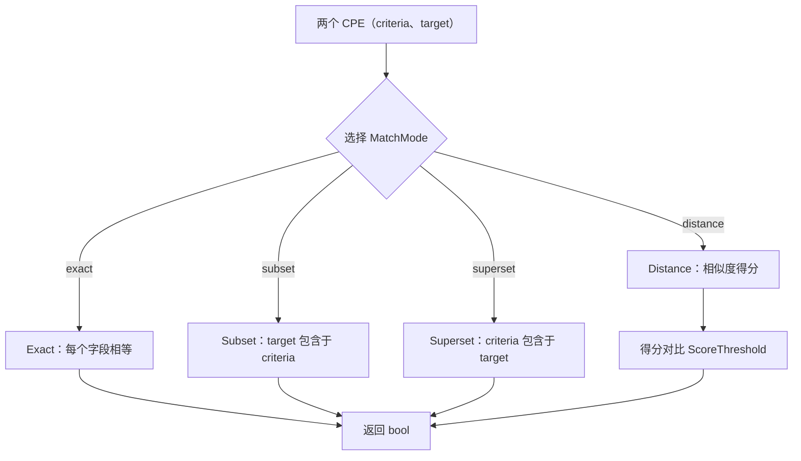

# 匹配

CPE 库提供了强大的匹配能力，用于比较 CPE 对象，包括基础匹配、使用多种算法的高级匹配以及版本比较。

下面的流程图展示了高级匹配的流程：两个 CPE 在四种模式之一下进行比较，所选模式决定返回布尔判定结果还是相似度得分。



## 基础匹配

### CPE.Match

```go
func (c *CPE) Match(other *CPE) bool
```

根据 CPE 名称匹配规范执行基础 CPE 匹配。

**参数：**
- `other` - 用于匹配的目标 CPE

**返回值：**
- `bool` - 匹配返回 `true`，否则返回 `false`

**匹配规则：**
1. 如果两个 CPE URI 相同，返回 `true`
2. Part 必须完全匹配
3. 对于其他属性：
   - 如果任一值是通配符（`*`），则匹配
   - 如果两个值都是"不适用"（`-`），则匹配
   - 否则，值必须完全相等

**示例：**
```go
// 创建 CPE
windows10, _ := cpeskills.ParseCpe23("cpe:2.3:a:microsoft:windows:10:*:*:*:*:*:*:*")
windowsPattern, _ := cpeskills.ParseCpe23("cpe:2.3:a:microsoft:windows:*:*:*:*:*:*:*:*")

// 测试匹配
if windowsPattern.Match(windows10) {
    fmt.Println("Windows 10 匹配 Windows 模式")
}

// 测试不匹配
office, _ := cpeskills.ParseCpe23("cpe:2.3:a:microsoft:office:2019:*:*:*:*:*:*:*")
if !windowsPattern.Match(office) {
    fmt.Println("Office 不匹配 Windows 模式")
}
```

### MatchCPE

```go
func MatchCPE(cpe1, cpe2 *CPE, options *MatchOptions) bool
```

使用可配置选项执行 CPE 匹配。

**参数：**
- `cpe1` - 要比较的第一个 CPE
- `cpe2` - 要比较的第二个 CPE
- `options` - 匹配选项（可以为 `nil` 以使用默认值）

**返回值：**
- `bool` - 如果两个 CPE 根据选项匹配，则返回 `true`

### MatchOptions

```go
type MatchOptions struct {
    IgnoreVersion    bool   // 匹配时忽略版本字段
    AllowSubVersions bool   // 允许子版本匹配（例如 "1.0" 匹配 "1.0.1"）
    UseRegex         bool   // 对字符串字段使用正则表达式
    VersionRange     bool   // 匹配版本范围而非精确值
    MinVersion       string // 版本范围下限（含）
    MaxVersion       string // 版本范围上限（含）
}
```

**示例：**
```go
// 创建匹配选项
options := &cpeskills.MatchOptions{
    IgnoreVersion: true,
}

cpe1, _ := cpeskills.ParseCpe23("cpe:2.3:a:microsoft:windows:10:*:*:*:*:*:*:*")
cpe2, _ := cpeskills.ParseCpe23("cpe:2.3:a:microsoft:windows:11:*:*:*:*:*:*:*")

// 忽略版本进行匹配
if cpeskills.MatchCPE(cpe1, cpe2, options) {
    fmt.Println("忽略版本时 CPE 匹配")
}
```

### DefaultMatchOptions

```go
func DefaultMatchOptions() *MatchOptions
```

返回默认匹配选项（`IgnoreVersion: false`、`AllowSubVersions: true`、`UseRegex: false`、`VersionRange: false`）。

**返回值：**
- `*MatchOptions` - 默认匹配选项

## 高级匹配

### AdvancedMatchCPE

```go
func AdvancedMatchCPE(criteria *CPE, target *CPE, options *AdvancedMatchOptions) bool
```

使用复杂算法执行高级 CPE 匹配。

**参数：**
- `criteria` - 用于匹配的 CPE 模式
- `target` - 要测试匹配的 CPE
- `options` - 高级匹配选项

**返回值：**
- `bool` - 如果 target 匹配 criteria，则返回 `true`

### AdvancedMatchOptions

```go
type AdvancedMatchOptions struct {
    UseRegex            bool                        // 启用正则表达式匹配
    IgnoreCase          bool                        // 不区分大小写匹配
    UseFuzzyMatch       bool                        // 启用模糊匹配
    MatchCommonOnly     bool                        // 仅匹配常见字段
    PartialMatch        bool                        // 启用部分匹配
    MatchMode           string                      // 匹配模式
    VersionCompareMode  string                      // 版本比较模式
    VersionLower        string                      // 版本下界
    VersionUpper        string                      // 版本上界
    FieldOptions        map[string]FieldMatchOption // 字段特定选项
    ScoreThreshold      float64                     // 最小匹配得分（0.0-1.0）
}
```

### FieldMatchOption

```go
type FieldMatchOption struct {
    Weight      float64 // 字段权重（0.0-1.0）
    Required    bool    // 该字段是否必须匹配
    MatchMethod string  // 该字段的匹配方法
}
```

### NewAdvancedMatchOptions

```go
func NewAdvancedMatchOptions() *AdvancedMatchOptions
```

创建默认的高级匹配选项。

**返回值：**
- `*AdvancedMatchOptions` - 默认高级选项

**示例：**
```go
// 创建高级匹配选项
options := cpeskills.NewAdvancedMatchOptions()
options.MatchMode = "distance"
options.ScoreThreshold = 0.8
options.IgnoreCase = true

// 设置字段特定选项
options.FieldOptions = map[string]cpeskills.FieldMatchOption{
    "vendor": {
        Weight:   1.0,
        Required: true,
    },
    "product": {
        Weight:   1.0,
        Required: true,
    },
    "version": {
        Weight:   0.7,
        Required: false,
    },
}

criteria, _ := cpeskills.ParseCpe23("cpe:2.3:a:microsoft:*:*:*:*:*:*:*:*:*")
target, _ := cpeskills.ParseCpe23("cpe:2.3:a:microsoft:windows:10:*:*:*:*:*:*:*")

if cpeskills.AdvancedMatchCPE(criteria, target, options) {
    fmt.Println("高级匹配成功")
}
```

## 匹配模式

### Exact 模式

执行精确字段匹配，并处理特殊值。

```go
options := cpeskills.NewAdvancedMatchOptions()
options.MatchMode = "exact"
```

### Subset 模式

检查 target 是否是 criteria 的子集。

```go
options := cpeskills.NewAdvancedMatchOptions()
options.MatchMode = "subset"
```

### Superset 模式

检查 target 是否是 criteria 的超集。

```go
options := cpeskills.NewAdvancedMatchOptions()
options.MatchMode = "superset"
```

### Distance 模式

使用相似度评分来判定匹配。

```go
options := cpeskills.NewAdvancedMatchOptions()
options.MatchMode = "distance"
options.ScoreThreshold = 0.7  // 要求 70% 的相似度
```

## 版本比较

### CompareVersions

```go
func CompareVersions(v1, v2 string) int
```

比较两个版本字符串。

**参数：**
- `v1` - 第一个版本字符串
- `v2` - 第二个版本字符串

**返回值：**
- `int` - 若 v1 < v2 返回 `-1`，若 v1 == v2 返回 `0`，若 v1 > v2 返回 `1`

**示例：**
```go
result := cpeskills.CompareVersions("1.0.0", "1.0.1")
fmt.Printf("比较结果: %d\n", result) // -1

result = cpeskills.CompareVersions("2.0", "1.9.9")
fmt.Printf("比较结果: %d\n", result) // 1

result = cpeskills.CompareVersions("1.0", "1.0.0")
fmt.Printf("比较结果: %d\n", result) // 0
```

### 版本范围匹配

高级匹配支持版本范围比较：

```go
options := cpeskills.NewAdvancedMatchOptions()
options.VersionCompareMode = "range"
options.VersionLower = "1.0"
options.VersionUpper = "2.0"

// 这将匹配 1.0 到 2.0 之间的版本
criteria, _ := cpeskills.ParseCpe23("cpe:2.3:a:vendor:product:*:*:*:*:*:*:*:*")
target, _ := cpeskills.ParseCpe23("cpe:2.3:a:vendor:product:1.5:*:*:*:*:*:*:*")

if cpeskills.AdvancedMatchCPE(criteria, target, options) {
    fmt.Println("版本在范围内")
}
```

## 正则表达式匹配

启用正则表达式匹配以实现灵活的模式匹配：

```go
options := cpeskills.NewAdvancedMatchOptions()
options.UseRegex = true

// 在 CPE 字段中使用正则表达式模式
criteria, _ := cpeskills.ParseCpe23("cpe:2.3:a:microsoft:.*office.*:*:*:*:*:*:*:*:*")
target, _ := cpeskills.ParseCpe23("cpe:2.3:a:microsoft:ms_office:2019:*:*:*:*:*:*:*")

if cpeskills.AdvancedMatchCPE(criteria, target, options) {
    fmt.Println("正则表达式匹配成功")
}
```

## 模糊匹配

启用模糊匹配以实现近似字符串匹配：

```go
options := cpeskills.NewAdvancedMatchOptions()
options.UseFuzzyMatch = true
options.ScoreThreshold = 0.8

// 即使有轻微的拼写差异也可能匹配
criteria, _ := cpeskills.ParseCpe23("cpe:2.3:a:apache:tomcat:*:*:*:*:*:*:*:*")
target, _ := cpeskills.ParseCpe23("cpe:2.3:a:apache:tomkat:8.5:*:*:*:*:*:*:*") // 注意："tomkat" 与 "tomcat"

if cpeskills.AdvancedMatchCPE(criteria, target, options) {
    fmt.Println("模糊匹配成功")
}
```

## 完整示例

```go
package main

import (
    "fmt"
    "log"
    "github.com/scagogogo/cpe-skills"
)

func main() {
    // 解析 CPE
    pattern, _ := cpeskills.ParseCpe23("cpe:2.3:a:microsoft:*:*:*:*:*:*:*:*:*")
    windows10, _ := cpeskills.ParseCpe23("cpe:2.3:a:microsoft:windows:10:*:*:*:*:*:*:*")
    office2019, _ := cpeskills.ParseCpe23("cpe:2.3:a:microsoft:office:2019:*:*:*:*:*:*:*")
    
    // 基础匹配
    fmt.Println("=== 基础匹配 ===")
    fmt.Printf("模式匹配 Windows 10: %t\n", pattern.Match(windows10))
    fmt.Printf("模式匹配 Office 2019: %t\n", pattern.Match(office2019))
    
    // 使用 distance 模式的高级匹配
    fmt.Println("\n=== 高级匹配 ===")
    options := cpeskills.NewAdvancedMatchOptions()
    options.MatchMode = "distance"
    options.ScoreThreshold = 0.7
    
    fmt.Printf("高级匹配 Windows 10: %t\n", 
        cpeskills.AdvancedMatchCPE(pattern, windows10, options))
    fmt.Printf("高级匹配 Office 2019: %t\n", 
        cpeskills.AdvancedMatchCPE(pattern, office2019, options))
    
    // 版本比较
    fmt.Println("\n=== 版本比较 ===")
    fmt.Printf("1.0 vs 1.1: %d\n", cpeskills.CompareVersions("1.0", "1.1"))
    fmt.Printf("2.0 vs 1.9: %d\n", cpeskills.CompareVersions("2.0", "1.9"))
    fmt.Printf("1.0 vs 1.0: %d\n", cpeskills.CompareVersions("1.0", "1.0"))
    
    // 正则表达式匹配
    fmt.Println("\n=== 正则表达式匹配 ===")
    regexOptions := cpeskills.NewAdvancedMatchOptions()
    regexOptions.UseRegex = true
    
    regexPattern, _ := cpeskills.ParseCpe23("cpe:2.3:a:.*soft.*:.*:*:*:*:*:*:*:*:*")
    fmt.Printf("正则模式匹配 Windows: %t\n", 
        cpeskills.AdvancedMatchCPE(regexPattern, windows10, regexOptions))
}
```
