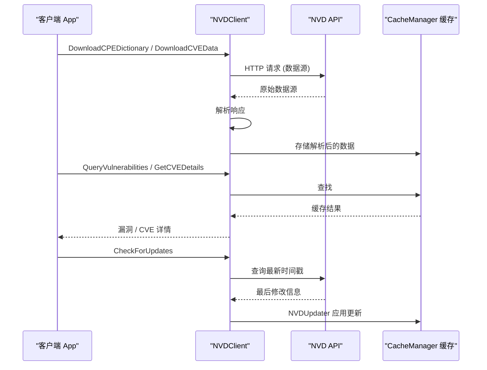

# NVD集成

本页面描述了CPE库与美国国家漏洞数据库(NVD)的集成功能，包括数据下载、更新和漏洞查询。

下图展示了 NVD 数据流：下载并解析数据源，将结果写入缓存，基于缓存查询漏洞，更新器负责检查并应用新数据。



## NVD客户端

### NVDClient

NVD API客户端。

```go
type NVDClient struct {
    APIKey      string        // NVD API密钥
    BaseURL     string        // API基础URL
    Timeout     time.Duration // 请求超时时间
    RateLimit   int           // 速率限制（请求/分钟）
    UserAgent   string        // 用户代理字符串
    RetryCount  int           // 重试次数
}
```

### NewNVDClient

创建新的NVD客户端。

```go
func NewNVDClient(config *NVDConfig) *NVDClient
```

### NVDConfig

NVD客户端配置。

```go
type NVDConfig struct {
    APIKey         string        // API密钥（可选，用于提高速率限制）
    CacheDir       string        // 缓存目录
    UpdateInterval time.Duration // 更新间隔
    EnableCache    bool          // 是否启用缓存
    Timeout        time.Duration // 请求超时
}
```

**示例：**
```go
config := &cpeskills.NVDConfig{
    APIKey:         "your-api-key", // 可选
    CacheDir:       "./nvd_cache",
    UpdateInterval: 24 * time.Hour,
    EnableCache:    true,
    Timeout:        30 * time.Second,
}

client := cpeskills.NewNVDClient(config)
```

## CPE字典下载

### DownloadCPEDictionary

下载官方CPE字典。

```go
func (c *NVDClient) DownloadCPEDictionary() (*CPEDictionary, error)
```

### DownloadCPEDictionaryToFile

下载CPE字典到文件。

```go
func (c *NVDClient) DownloadCPEDictionaryToFile(filename string) error
```

**示例：**
```go
// 下载到内存
fmt.Println("下载CPE字典...")
dictionary, err := client.DownloadCPEDictionary()
if err != nil {
    log.Fatal(err)
}

fmt.Printf("下载完成，包含 %d 个CPE条目\n", len(dictionary.Entries))

// 下载到文件
err = client.DownloadCPEDictionaryToFile("official_cpe_dictionary.xml")
if err != nil {
    log.Printf("下载到文件失败: %v", err)
}
```

## CVE数据下载

### DownloadCVEData

下载CVE漏洞数据。

```go
func (c *NVDClient) DownloadCVEData(startDate time.Time) (*CVEData, error)
```

### DownloadCVEDataRange

下载指定时间范围的CVE数据。

```go
func (c *NVDClient) DownloadCVEDataRange(startDate, endDate time.Time) (*CVEData, error)
```

### CVEData

CVE数据结构。

```go
type CVEData struct {
    CVEs         []*CVEEntry // CVE条目列表
    LastModified time.Time   // 最后修改时间
    TotalResults int         // 总结果数
    StartIndex   int         // 起始索引
}
```

**示例：**
```go
// 下载最近30天的CVE数据
startDate := time.Now().AddDate(0, 0, -30)
cveData, err := client.DownloadCVEData(startDate)
if err != nil {
    log.Fatal(err)
}

fmt.Printf("下载了 %d 个CVE条目\n", len(cveData.CVEs))

// 下载指定时间范围的数据
endDate := time.Now()
rangeData, err := client.DownloadCVEDataRange(startDate, endDate)
if err != nil {
    log.Printf("下载范围数据失败: %v", err)
}
```

## 漏洞查询

### QueryVulnerabilities

查询漏洞信息。

```go
func (c *NVDClient) QueryVulnerabilities(query NVDQuery) ([]*CVEEntry, error)
```

### NVDQuery

NVD查询参数。

```go
type NVDQuery struct {
    CPEName        string    // CPE名称
    CPEVendor      string    // CPE供应商
    CPEProduct     string    // CPE产品
    CPEVersion     string    // CPE版本
    CPEPart        string    // CPE部件类型
    CVSSScoreMin   float64   // 最小CVSS分数
    CVSSScoreMax   float64   // 最大CVSS分数
    PublishedAfter time.Time // 发布时间之后
    PublishedBefore time.Time // 发布时间之前
    ModifiedAfter  time.Time // 修改时间之后
    ModifiedBefore time.Time // 修改时间之前
    Keyword        string    // 关键词
    Limit          int       // 结果限制
    Offset         int       // 偏移量
}
```

**示例：**
```go
// 查询Apache Tomcat的漏洞
query := cpeskills.NVDQuery{
    CPEVendor:    "apache",
    CPEProduct:   "tomcat",
    CVSSScoreMin: 7.0, // 只查询高危漏洞
    Limit:        50,
}

vulnerabilities, err := client.QueryVulnerabilities(query)
if err != nil {
    log.Printf("查询失败: %v", err)
} else {
    fmt.Printf("找到 %d 个Tomcat高危漏洞\n", len(vulnerabilities))
    
    for i, cve := range vulnerabilities {
        fmt.Printf("  %d. %s (CVSS: %.1f)\n", i+1, cve.ID, cve.BaseScore)
    }
}
```

### GetCVEDetails

获取特定CVE的详细信息。

```go
func (c *NVDClient) GetCVEDetails(cveID string) (*CVEEntry, error)
```

**示例：**
```go
// 获取特定CVE的详细信息
cveDetails, err := client.GetCVEDetails("CVE-2021-44228")
if err != nil {
    log.Printf("获取CVE详情失败: %v", err)
} else {
    fmt.Printf("CVE ID: %s\n", cveDetails.ID)
    fmt.Printf("CVSS分数: %.1f\n", cveDetails.BaseScore)
    fmt.Printf("描述: %s\n", cveDetails.Description)
    fmt.Printf("发布日期: %s\n", cveDetails.PublishedDate.Format("2006-01-02"))
    
    fmt.Printf("受影响的CPE:\n")
    for i, cpe := range cveDetails.AffectedCPEs {
        fmt.Printf("  %d. %s\n", i+1, cpe)
    }
}
```

## 数据更新

### CheckForUpdates

检查是否有数据更新。

```go
func (c *NVDClient) CheckForUpdates() (*UpdateInfo, error)
```

### UpdateInfo

更新信息结构。

```go
type UpdateInfo struct {
    HasUpdates       bool      // 是否有更新
    LastModified     time.Time // 最后修改时间
    NewEntriesCount  int       // 新条目数量
    UpdatedEntriesCount int    // 更新条目数量
    TotalSize        int64     // 总大小
}
```

### DownloadUpdates

下载更新数据。

```go
func (c *NVDClient) DownloadUpdates() error
```

**示例：**
```go
// 检查更新
updateInfo, err := client.CheckForUpdates()
if err != nil {
    log.Printf("检查更新失败: %v", err)
} else if updateInfo.HasUpdates {
    fmt.Printf("发现更新:\n")
    fmt.Printf("  新条目: %d\n", updateInfo.NewEntriesCount)
    fmt.Printf("  更新条目: %d\n", updateInfo.UpdatedEntriesCount)
    fmt.Printf("  数据大小: %d MB\n", updateInfo.TotalSize/1024/1024)
    
    // 下载更新
    fmt.Println("正在下载更新...")
    err = client.DownloadUpdates()
    if err != nil {
        log.Printf("下载更新失败: %v", err)
    } else {
        fmt.Println("更新下载完成")
    }
} else {
    fmt.Println("没有可用更新")
}
```

## 自动更新

### NVDUpdater

自动更新器。

```go
type NVDUpdater struct {
    Client   *NVDClient    // NVD客户端
    Config   *UpdateConfig // 更新配置
    Storage  Storage       // 存储接口
    Logger   Logger        // 日志记录器
}
```

### UpdateConfig

更新配置。

```go
type UpdateConfig struct {
    CheckInterval  time.Duration // 检查间隔
    AutoDownload   bool          // 自动下载
    NotifyOnUpdate bool          // 更新时通知
    MaxRetries     int           // 最大重试次数
    BackupOldData  bool          // 备份旧数据
}
```

### NewNVDUpdater

创建自动更新器。

```go
func NewNVDUpdater(client *NVDClient, config *UpdateConfig) *NVDUpdater
```

### StartAutoUpdate

启动自动更新。

```go
func (u *NVDUpdater) StartAutoUpdate() error
```

### StopAutoUpdate

停止自动更新。

```go
func (u *NVDUpdater) StopAutoUpdate() error
```

**示例：**
```go
// 配置自动更新
updateConfig := &cpeskills.UpdateConfig{
    CheckInterval:  6 * time.Hour, // 每6小时检查一次
    AutoDownload:   true,
    NotifyOnUpdate: true,
    MaxRetries:     3,
    BackupOldData:  true,
}

// 创建更新器
updater := cpeskills.NewNVDUpdater(client, updateConfig)

// 启动自动更新
err := updater.StartAutoUpdate()
if err != nil {
    log.Printf("启动自动更新失败: %v", err)
} else {
    fmt.Println("自动更新已启动")
}

// 程序结束时停止更新器
defer updater.StopAutoUpdate()
```

## 缓存管理

### CacheManager

缓存管理器。

```go
type CacheManager struct {
    CacheDir    string        // 缓存目录
    MaxSize     int64         // 最大缓存大小
    TTL         time.Duration // 缓存生存时间
    Compression bool          // 是否压缩
}
```

### ClearCache

清除缓存。

```go
func (c *NVDClient) ClearCache() error
```

### GetCacheStats

获取缓存统计信息。

```go
func (c *NVDClient) GetCacheStats() *CacheStats
```

**示例：**
```go
// 获取缓存统计
stats := client.GetCacheStats()
fmt.Printf("缓存统计:\n")
fmt.Printf("  文件数量: %d\n", stats.FileCount)
fmt.Printf("  总大小: %d MB\n", stats.TotalSize/1024/1024)
fmt.Printf("  命中率: %.2f%%\n", stats.HitRate*100)

// 清除缓存
err := client.ClearCache()
if err != nil {
    log.Printf("清除缓存失败: %v", err)
} else {
    fmt.Println("缓存已清除")
}
```

## 错误处理

### NVDError

NVD相关错误类型。

```go
type NVDError struct {
    Type    NVDErrorType // 错误类型
    Message string       // 错误消息
    Code    int          // HTTP状态码
    Details string       // 详细信息
}
```

### NVDErrorType

错误类型枚举。

```go
const (
    ErrorTypeNetworkError NVDErrorType = iota // 网络错误
    ErrorTypeAPIError                         // API错误
    ErrorTypeRateLimit                        // 速率限制
    ErrorTypeParseError                       // 解析错误
    ErrorTypeAuthError                        // 认证错误
)
```

### 错误检查函数

```go
// 检查是否为网络错误
func IsNetworkError(err error) bool

// 检查是否为速率限制错误
func IsRateLimitError(err error) bool

// 检查是否为API错误
func IsAPIError(err error) bool
```

**示例：**
```go
_, err := client.DownloadCPEDictionary()
if err != nil {
    if cpeskills.IsRateLimitError(err) {
        fmt.Println("遇到速率限制，请稍后重试")
        time.Sleep(time.Minute)
    } else if cpeskills.IsNetworkError(err) {
        fmt.Println("网络错误，检查网络连接")
    } else if cpeskills.IsAPIError(err) {
        fmt.Printf("API错误: %v\n", err)
    } else {
        fmt.Printf("未知错误: %v\n", err)
    }
}
```

## 完整示例

```go
package main

import (
    "fmt"
    "log"
    "time"
    "github.com/scagogogo/cpe-skills"
)

func main() {
    fmt.Println("=== NVD集成示例 ===")
    
    // 创建NVD客户端
    config := &cpeskills.NVDConfig{
        CacheDir:       "./nvd_cache",
        UpdateInterval: 24 * time.Hour,
        EnableCache:    true,
        Timeout:        30 * time.Second,
    }
    
    client := cpeskills.NewNVDClient(config)
    
    // 下载CPE字典
    fmt.Println("下载CPE字典...")
    dictionary, err := client.DownloadCPEDictionary()
    if err != nil {
        log.Printf("下载字典失败: %v", err)
        // 使用缓存的字典或创建示例字典
        dictionary = createSampleDictionary()
    } else {
        fmt.Printf("✅ 下载完成，包含 %d 个CPE条目\n", len(dictionary.Entries))
    }
    
    // 搜索字典
    fmt.Println("\n=== 字典搜索示例 ===")
    results := dictionary.Search("apache", 5)
    fmt.Printf("搜索'apache'找到 %d 个结果:\n", len(results))
    for i, entry := range results {
        fmt.Printf("  %d. %s\n", i+1, entry.Title)
    }
    
    // 查询漏洞
    fmt.Println("\n=== 漏洞查询示例 ===")
    query := cpeskills.NVDQuery{
        CPEVendor:    "apache",
        CPEProduct:   "tomcat",
        CVSSScoreMin: 7.0,
        Limit:        5,
    }
    
    vulnerabilities, err := client.QueryVulnerabilities(query)
    if err != nil {
        log.Printf("查询漏洞失败: %v", err)
    } else {
        fmt.Printf("找到 %d 个Apache Tomcat高危漏洞:\n", len(vulnerabilities))
        for i, cve := range vulnerabilities {
            fmt.Printf("  %d. %s (CVSS: %.1f)\n", i+1, cve.ID, cve.BaseScore)
            fmt.Printf("     %s\n", truncateString(cve.Description, 60))
        }
    }
    
    // 获取特定CVE详情
    fmt.Println("\n=== CVE详情示例 ===")
    cveID := "CVE-2021-44228" // Log4Shell
    cveDetails, err := client.GetCVEDetails(cveID)
    if err != nil {
        log.Printf("获取CVE详情失败: %v", err)
    } else {
        fmt.Printf("CVE详情 - %s:\n", cveID)
        fmt.Printf("  CVSS分数: %.1f\n", cveDetails.BaseScore)
        fmt.Printf("  发布日期: %s\n", cveDetails.PublishedDate.Format("2006-01-02"))
        fmt.Printf("  描述: %s\n", truncateString(cveDetails.Description, 100))
        
        if len(cveDetails.AffectedCPEs) > 0 {
            fmt.Printf("  受影响的CPE数量: %d\n", len(cveDetails.AffectedCPEs))
            fmt.Printf("  示例CPE: %s\n", cveDetails.AffectedCPEs[0])
        }
    }
    
    // 检查更新
    fmt.Println("\n=== 更新检查示例 ===")
    updateInfo, err := client.CheckForUpdates()
    if err != nil {
        log.Printf("检查更新失败: %v", err)
    } else {
        if updateInfo.HasUpdates {
            fmt.Printf("发现更新:\n")
            fmt.Printf("  新条目: %d\n", updateInfo.NewEntriesCount)
            fmt.Printf("  更新条目: %d\n", updateInfo.UpdatedEntriesCount)
            fmt.Printf("  数据大小: %.1f MB\n", float64(updateInfo.TotalSize)/1024/1024)
        } else {
            fmt.Println("数据已是最新版本")
        }
    }
    
    // 缓存统计
    fmt.Println("\n=== 缓存统计 ===")
    cacheStats := client.GetCacheStats()
    fmt.Printf("缓存文件数: %d\n", cacheStats.FileCount)
    fmt.Printf("缓存大小: %.1f MB\n", float64(cacheStats.TotalSize)/1024/1024)
    fmt.Printf("缓存命中率: %.2f%%\n", cacheStats.HitRate*100)
}

func createSampleDictionary() *cpeskills.CPEDictionary {
    // 创建示例字典用于演示
    dict := cpeskills.NewCPEDictionary()
    
    entries := []*cpeskills.CPEDictionaryEntry{
        {
            CPE23: "cpe:2.3:a:apache:tomcat:9.0.0:*:*:*:*:*:*:*",
            Title: "Apache Tomcat 9.0.0",
        },
        {
            CPE23: "cpe:2.3:a:apache:http_server:2.4.41:*:*:*:*:*:*:*",
            Title: "Apache HTTP Server 2.4.41",
        },
    }
    
    for _, entry := range entries {
        dict.AddEntry(entry)
    }
    
    return dict
}

func truncateString(s string, maxLen int) string {
    if len(s) <= maxLen {
        return s
    }
    return s[:maxLen-3] + "..."
}
```

## 下一步

- 了解[CVE映射](../guide/cve-mapping.md)来关联CPE和漏洞
- 学习[存储接口](./storage.md)来持久化NVD数据
- 探索[字典管理](./dictionary.md)来管理下载的CPE字典
