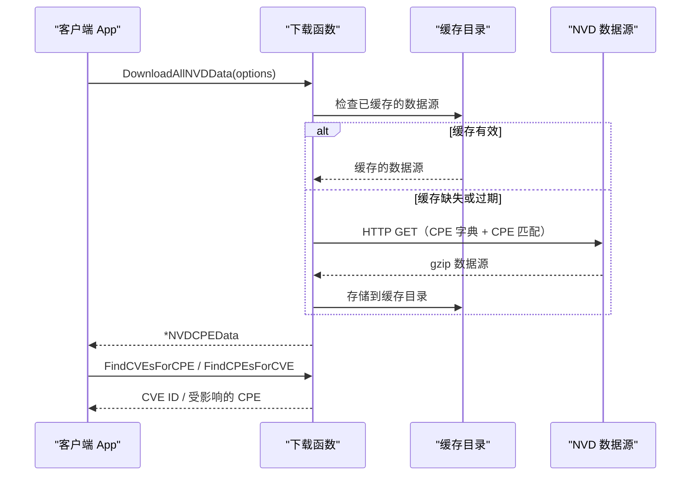

# NVD 集成

CPE 库提供了与美国国家漏洞数据库（NVD）的集成：下载官方 CPE 字典和 CPE 匹配数据源，在本地缓存，并让你在解析后的数据中将 CPE 映射到 CVE（以及反向映射）。

下图展示了 NVD 数据流：数据源被下载（或从本地缓存读取）并解析为一个 `NVDCPEData` 值；随后 CPE 到 CVE 的查找便由内存中的匹配映射提供。



## NVD 数据类型

### NVDCPEData

```go
type NVDCPEData struct {
    CPEDictionary *CPEDictionary // 正式注册的 CPE 条目
    CPEMatchData  *CPEMatchData  // CPE-CVE 双向映射
    DownloadTime  time.Time      // 数据下载时间
}
```

聚合了从 NVD 下载的 CPE 字典与 CPE-CVE 匹配数据。

### CPEMatchData

```go
type CPEMatchData struct {
    CVEToCPEs map[string][]string // CVE ID -> 受影响的 CPE URI
    CPEToCVEs map[string][]string // CPE URI -> 关联的 CVE ID
}
```

保存 CPE URI 与 CVE ID 之间的双向映射。

## NVD 数据源选项

### NVDFeedOptions

```go
type NVDFeedOptions struct {
    CacheDir               string       // 本地缓存目录
    CacheMaxAge            int          // 缓存有效期（小时）
    MaxConcurrentDownloads int          // 最大并发下载数
    ShowProgress           bool         // 向标准输出打印进度
    HTTPClient             *http.Client // 自定义 HTTP 客户端
}
```

NVD 数据源操作的配置选项。

### DefaultNVDFeedOptions

```go
func DefaultNVDFeedOptions() *NVDFeedOptions
```

返回填充了合理默认值的数据源选项（缓存目录位于系统临时目录下、24 小时缓存、3 个并发下载、启用进度显示、以及一个 60 秒超时的 HTTP 客户端）。

**返回：**
- `*NVDFeedOptions` - 默认配置

**示例：**
```go
options := cpeskills.DefaultNVDFeedOptions()
options.CacheDir = "./nvd-cache"
options.CacheMaxAge = 12 // 12 小时后重新下载
options.ShowProgress = true
```

## 下载 NVD 数据

### DownloadAllNVDData

```go
func DownloadAllNVDData(options *NVDFeedOptions) (*NVDCPEData, error)
```

下载并解析 CPE 字典和 CPE 匹配数据，将二者一并放入单个 `NVDCPEData` 值返回。这两个数据源是并发获取的。

**参数：**
- `options` - 下载选项（可为 `nil` 以使用默认值）

**返回：**
- `*NVDCPEData` - 完整的 NVD 数据
- `error` - 下载或解析失败时的错误

**示例：**
```go
// 下载所有 NVD 数据
fmt.Println("Downloading NVD data...")
options := cpeskills.DefaultNVDFeedOptions()
options.CacheDir = "./nvd-cache"
options.ShowProgress = true

nvdData, err := cpeskills.DownloadAllNVDData(options)
if err != nil {
    log.Fatalf("Failed to download NVD data: %v", err)
}

fmt.Printf("Downloaded dictionary with %d items\n", len(nvdData.CPEDictionary.Items))
fmt.Printf("Downloaded %d CPE-to-CVE mappings\n", len(nvdData.CPEMatchData.CPEToCVEs))
fmt.Printf("Downloaded at: %v\n", nvdData.DownloadTime)
```

### DownloadAndParseCPEDict

```go
func DownloadAndParseCPEDict(options *NVDFeedOptions) (*CPEDictionary, error)
```

仅下载并解析 CPE 字典。

**参数：**
- `options` - 下载选项（可为 `nil` 以使用默认值）

**返回：**
- `*CPEDictionary` - CPE 字典
- `error` - 下载或解析失败时的错误

**示例：**
```go
dictionary, err := cpeskills.DownloadAndParseCPEDict(options)
if err != nil {
    log.Fatal(err)
}

fmt.Printf("Dictionary contains %d CPE entries\n", len(dictionary.Items))
```

### DownloadAndParseCPEMatch

```go
func DownloadAndParseCPEMatch(options *NVDFeedOptions) (*CPEMatchData, error)
```

仅下载并解析 CPE 匹配数据。

**参数：**
- `options` - 下载选项（可为 `nil` 以使用默认值）

**返回：**
- `*CPEMatchData` - CPE 匹配数据
- `error` - 下载或解析失败时的错误

**示例：**
```go
matchData, err := cpeskills.DownloadAndParseCPEMatch(options)
if err != nil {
    log.Fatal(err)
}

fmt.Printf("Match data covers %d CPE URIs\n", len(matchData.CPEToCVEs))
```

## CVE 集成

### FindCVEsForCPE

```go
func (data *NVDCPEData) FindCVEsForCPE(cpe *CPE) []string
```

查找与特定 CPE 关联的 CVE ID。它首先寻找精确的 CPE URI 匹配，然后回退到模糊（基于距离的）匹配。

**参数：**
- `cpe` - 要查找的 CPE

**返回：**
- `[]string` - 关联的 CVE ID

**示例：**
```go
// 查找 Apache Log4j 的 CVE
log4jCPE, _ := cpeskills.ParseCpe23("cpe:2.3:a:apache:log4j:2.0:*:*:*:*:*:*:*")
cves := nvdData.FindCVEsForCPE(log4jCPE)

fmt.Printf("Found %d CVEs for Apache Log4j 2.0:\n", len(cves))
for _, cveID := range cves {
    fmt.Printf("- %s\n", cveID)
}
```

### FindCPEsForCVE

```go
func (data *NVDCPEData) FindCPEsForCVE(cveID string) []*CPE
```

查找受特定 CVE 影响的所有 CPE。CVE ID 在查找前会被标准化，返回的每个 CPE 的 `Cve` 字段都被设置为所查询的 ID。

**参数：**
- `cveID` - CVE 标识符（例如 "CVE-2021-44228"）

**返回：**
- `[]*CPE` - 受影响的 CPE

**示例：**
```go
// 查找受 Log4Shell 影响的 CPE
affectedCPEs := nvdData.FindCPEsForCVE("CVE-2021-44228")

fmt.Printf("CVE-2021-44228 affects %d CPEs:\n", len(affectedCPEs))
for _, cpe := range affectedCPEs {
    fmt.Printf("- %s\n", cpe.GetURI())
}
```

### EnrichCPEWithVulnerabilityData

```go
func (data *NVDCPEData) EnrichCPEWithVulnerabilityData(cpe *CPE)
```

查找与给定 CPE 关联的 CVE，若找到，则将第一个 CVE ID 存入该 CPE 的 `Cve` 字段。

**参数：**
- `cpe` - 就地丰富的 CPE

**示例：**
```go
cpe, _ := cpeskills.ParseCpe23("cpe:2.3:a:apache:log4j:2.0:*:*:*:*:*:*:*")
nvdData.EnrichCPEWithVulnerabilityData(cpe)
fmt.Printf("Associated CVE: %s\n", cpe.Cve)
```

## 缓存

下载函数会自动将获取到的数据源缓存在 `options.CacheDir` 中以提升性能。缓存的数据源在超过 `options.CacheMaxAge` 小时之前会被复用：

```go
// 配置缓存
options := cpeskills.DefaultNVDFeedOptions()
options.CacheDir = "./nvd-cache"
options.CacheMaxAge = 24

// 首次下载从 NVD 获取
nvdData1, _ := cpeskills.DownloadAllNVDData(options)

// 后续下载在缓存仍然新鲜时复用缓存
nvdData2, _ := cpeskills.DownloadAllNVDData(options)
```

## 完整示例

```go
package main

import (
    "fmt"
    "log"

    cpeskills "github.com/scagogogo/cpe-skills"
)

func main() {
    // 配置 NVD 选项
    options := cpeskills.DefaultNVDFeedOptions()
    options.CacheDir = "./nvd-cache"
    options.ShowProgress = true

    // 下载 NVD 数据
    fmt.Println("Downloading NVD data...")
    nvdData, err := cpeskills.DownloadAllNVDData(options)
    if err != nil {
        log.Fatalf("Failed to download NVD data: %v", err)
    }

    fmt.Printf("Downloaded %d dictionary items\n", len(nvdData.CPEDictionary.Items))
    fmt.Printf("Downloaded %d CPE-to-CVE mappings\n", len(nvdData.CPEMatchData.CPEToCVEs))

    // 分析系统 CPE 的漏洞
    systemCPEs := []string{
        "cpe:2.3:a:apache:log4j:2.0:*:*:*:*:*:*:*",
        "cpe:2.3:a:apache:tomcat:9.0.0:*:*:*:*:*:*:*",
        "cpe:2.3:o:microsoft:windows:10:*:*:*:*:*:*:*",
    }

    fmt.Println("\nVulnerability Analysis:")
    for _, cpeStr := range systemCPEs {
        cpeObj, err := cpeskills.ParseCpe23(cpeStr)
        if err != nil {
            log.Printf("Failed to parse %s: %v", cpeStr, err)
            continue
        }

        cves := nvdData.FindCVEsForCPE(cpeObj)
        fmt.Printf("\n%s:\n", cpeStr)
        fmt.Printf("  Found %d CVEs\n", len(cves))
        for _, cveID := range cves {
            fmt.Printf("  - %s\n", cveID)
        }
    }

    // 反向查找：某个 CVE 影响了哪些 CPE
    fmt.Println("\nCPEs affected by CVE-2021-44228:")
    affected := nvdData.FindCPEsForCVE("CVE-2021-44228")
    for _, cpe := range affected {
        fmt.Printf("  - %s\n", cpe.GetURI())
    }
}
```
