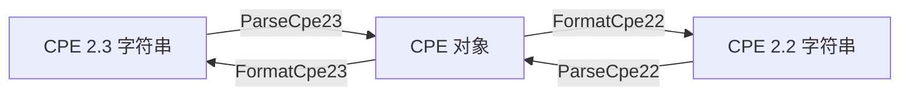

# 解析

CPE 库提供了对 CPE 2.2 和 CPE 2.3 两种格式的完整解析能力，可将字符串表示转换为结构化的 `CPE` 对象。

下图说明了解析与格式化互为逆操作，以及如何通过先解析再重新格式化把 CPE 2.2 字符串转换为 CPE 2.3：



## CPE 2.3 解析

### ParseCpe23

```go
func ParseCpe23(cpe23 string) (*CPE, error)
```

解析 CPE 2.3 格式字符串并转换为 CPE 结构体。

**参数：**
- `cpe23` - CPE 2.3 格式字符串（例如 `"cpe:2.3:a:microsoft:windows:10:*:*:*:*:*:*:*"`）

**返回值：**
- `*CPE` - 解析得到的 CPE 对象
- `error` - 解析失败时返回错误

**错误：**
- 当字符串不是恰好 13 个以冒号分隔的部分，或未以 `cpe:2.3:` 开头时，返回格式无效错误（可用 `IsInvalidFormatError` 检测）
- 当 part 字段值不是 `a`、`h`、`o` 或 `*` 时，返回 part 无效错误（可用 `IsInvalidPartError` 检测）

**示例：**
```go
// 解析 Windows 10 CPE
winCPE, err := cpeskills.ParseCpe23("cpe:2.3:a:microsoft:windows:10:*:*:*:*:*:*:*")
if err != nil {
    log.Fatalf("Failed to parse CPE: %v", err)
}

fmt.Printf("Vendor: %s\n", winCPE.Vendor)      // microsoft
fmt.Printf("Product: %s\n", winCPE.ProductName) // windows
fmt.Printf("Version: %s\n", winCPE.Version)     // 10

// 解析 Adobe Reader CPE
adobeCPE, err := cpeskills.ParseCpe23("cpe:2.3:a:adobe:reader:2021.001.20150:*:*:*:*:*:*:*")
if err != nil {
    log.Fatalf("Failed to parse CPE: %v", err)
}

// 解析操作系统 CPE
osCPE, err := cpeskills.ParseCpe23("cpe:2.3:o:microsoft:windows:10:1909:*:*:*:*:*:*")
if err != nil {
    log.Fatalf("Failed to parse CPE: %v", err)
}
```

### CPE 2.3 格式结构

CPE 2.3 格式遵循如下结构：
```text
cpe:2.3:<part>:<vendor>:<product>:<version>:<update>:<edition>:<language>:<sw_edition>:<target_sw>:<target_hw>:<other>
```

**字段：**
- `part` - 组件类型："a"（应用程序）、"h"（硬件）、"o"（操作系统）
- `vendor` - 供应商/厂商名称
- `product` - 产品名称
- `version` - 产品版本
- `update` - 更新标识符
- `edition` - 版本标识符
- `language` - 语言代码
- `sw_edition` - 软件版本
- `target_sw` - 目标软件
- `target_hw` - 目标硬件
- `other` - 其他属性

**特殊值：**
- `*` - 通配符（匹配任意值）
- `-` - 不适用

## CPE 2.2 解析

### ParseCpe22

```go
func ParseCpe22(cpe22 string) (*CPE, error)
```

解析 CPE 2.2 格式字符串并转换为 CPE 结构体。

**参数：**
- `cpe22` - CPE 2.2 格式字符串（例如 `"cpe:/a:apache:tomcat:8.5.0"`）

**返回值：**
- `*CPE` - 解析得到的 CPE 对象
- `error` - 解析失败时返回错误

**错误：**
- 当字符串未以 `cpe:/` 开头时，返回格式无效错误（可用 `IsInvalidFormatError` 检测）
- 当 part 字段值不是 `a`、`h` 或 `o` 时，返回 part 无效错误（可用 `IsInvalidPartError` 检测）

**示例：**
```go
// 解析基本格式的 CPE 2.2
tomcatCPE, err := cpeskills.ParseCpe22("cpe:/a:apache:tomcat:8.5.0")
if err != nil {
    log.Fatalf("Failed to parse CPE: %v", err)
}

fmt.Printf("Part: %s\n", tomcatCPE.Part.LongName) // Application
fmt.Printf("Vendor: %s\n", tomcatCPE.Vendor)      // apache
fmt.Printf("Product: %s\n", tomcatCPE.ProductName) // tomcat
fmt.Printf("Version: %s\n", tomcatCPE.Version)     // 8.5.0

// 解析带扩展（以 ~ 分隔的字段段）的 CPE 2.2 字符串
mysqlCPE, err := cpeskills.ParseCpe22("cpe:/a:mysql:mysql:5.7.12:::~~~enterprise~")
if err != nil {
    log.Fatalf("Failed to parse CPE: %v", err)
}
fmt.Printf("Software edition: %s\n", mysqlCPE.SoftwareEdition) // enterprise
```

### CPE 2.2 格式结构

CPE 2.2 格式遵循如下结构：
```text
cpe:/<part>:<vendor>:<product>:<version>:<update>:<edition>:<language>
```

带附加字段的扩展格式：
```text
cpe:/<part>:<vendor>:<product>:<version>:<update>:<edition>:<language>:~<sw_edition>~<target_sw>~<target_hw>~<other>
```

## 格式转换

### FormatCpe23

```go
func FormatCpe23(cpe *CPE) string
```

将 CPE 对象转换为 CPE 2.3 格式字符串。若对象已携带 `Cpe23` 值，则原样返回；否则从各字段构建新字符串，空字段以通配符 `*` 替换。

**参数：**
- `cpe` - 要格式化的 CPE 对象

**返回值：**
- `string` - CPE 2.3 格式字符串

**示例：**
```go
cpeObj := &cpeskills.CPE{
    Part:        *cpeskills.PartApplication,
    Vendor:      cpeskills.Vendor("microsoft"),
    ProductName: cpeskills.Product("windows"),
    Version:     cpeskills.Version("10"),
}

cpe23String := cpeskills.FormatCpe23(cpeObj)
fmt.Println(cpe23String) // cpe:2.3:a:microsoft:windows:10:*:*:*:*:*:*:*
```

### FormatCpe22

```go
func FormatCpe22(cpe *CPE) string
```

将 CPE 对象转换为 CPE 2.2 格式字符串。

**参数：**
- `cpe` - 要格式化的 CPE 对象

**返回值：**
- `string` - CPE 2.2 格式字符串

**示例：**
```go
cpeObj := &cpeskills.CPE{
    Part:        *cpeskills.PartApplication,
    Vendor:      cpeskills.Vendor("apache"),
    ProductName: cpeskills.Product("tomcat"),
    Version:     cpeskills.Version("8.5.0"),
}

cpe22String := cpeskills.FormatCpe22(cpeObj)
fmt.Println(cpe22String) // cpe:/a:apache:tomcat:8.5.0
```

### FormatCPE

```go
func FormatCPE(cpe *CPE, version string) (string, error)
```

根据 `version` 参数将 CPE 对象格式化为 2.2 或 2.3 字符串。接受 `"2.3"`、`"23"` 或 `""` 表示 CPE 2.3，接受 `"2.2"` 或 `"22"` 表示 CPE 2.2。其他任何值都会返回错误。

**参数：**
- `cpe` - 要格式化的 CPE 对象
- `version` - 目标版本选择器

**返回值：**
- `string` - 格式化后的 CPE 字符串
- `error` - 当 `cpe` 为 `nil` 或 `version` 不受支持时返回错误

**示例：**
```go
cpeObj := &cpeskills.CPE{
    Part:        *cpeskills.PartApplication,
    Vendor:      cpeskills.Vendor("apache"),
    ProductName: cpeskills.Product("tomcat"),
    Version:     cpeskills.Version("8.5.0"),
}

str, err := cpeskills.FormatCPE(cpeObj, "2.2")
if err != nil {
    log.Fatal(err)
}
fmt.Println(str) // cpe:/a:apache:tomcat:8.5.0
```

## 格式之间的转换

要将 CPE 2.2 字符串转换为 CPE 2.3，先用 `ParseCpe22` 解析，再用 `FormatCpe23` 重新格式化得到的对象。（事实上，`ParseCpe22` 已经填充了对象的 `Cpe23` 字段，所以 `FormatCpe23` 直接返回它。）

**示例：**
```go
cpe22 := "cpe:/a:apache:tomcat:8.5.0"

cpeObj, err := cpeskills.ParseCpe22(cpe22)
if err != nil {
    log.Fatal(err)
}

cpe23 := cpeskills.FormatCpe23(cpeObj)
fmt.Println(cpe23) // cpe:2.3:a:apache:tomcat:8.5.0:*:*:*:*:*:*:*
```

## 便捷解析

### Parse

```go
func Parse(cpeStr string) (*CPE, error)
```

解析 CPE 字符串，自动检测它是 CPE 2.2 还是 CPE 2.3 形式。

### MustParse

```go
func MustParse(cpeStr string) *CPE
```

与 `Parse` 类似，但在出错时 panic 而非返回错误。适合用已知有效的字面量做包级变量初始化。

**示例：**
```go
// 自动检测格式
cpeObj, err := cpeskills.Parse("cpe:/a:apache:tomcat:8.5.0")
if err != nil {
    log.Fatal(err)
}
fmt.Println(cpeObj.Vendor) // apache

// 输入无效时会 panic；仅对可信字面量使用
var windows = cpeskills.MustParse("cpe:2.3:a:microsoft:windows:10:*:*:*:*:*:*:*")
fmt.Println(windows.ProductName) // windows
```

## 错误处理

```go
// 处理解析错误
cpeObj, err := cpeskills.ParseCpe23("invalid:format")
if err != nil {
    if cpeskills.IsInvalidFormatError(err) {
        fmt.Println("Invalid CPE format")
    } else if cpeskills.IsInvalidPartError(err) {
        fmt.Println("Invalid part value")
    } else {
        fmt.Printf("Other error: %v\n", err)
    }
}
```

## 最佳实践

1. **解析 CPE 字符串时始终检查错误**
2. **为所处理的格式使用合适的解析器**，或使用 `Parse` 自动检测
3. **在来源不可信时先验证输入再解析**
4. **手动构造 CPE 字符串时正确处理特殊字符**
5. **在需要切换格式时使用格式转换函数**

## 完整示例

```go
package main

import (
    "fmt"
    "log"
    "github.com/scagogogo/cpe-skills"
)

func main() {
    // 解析不同的 CPE 格式
    examples := []string{
        "cpe:2.3:a:microsoft:windows:10:*:*:*:*:*:*:*",
        "cpe:2.3:a:adobe:reader:2021.001.20150:*:*:*:*:*:*:*",
        "cpe:2.3:o:linux:kernel:5.4.0:*:*:*:*:*:*:*",
    }

    for _, example := range examples {
        cpeObj, err := cpeskills.ParseCpe23(example)
        if err != nil {
            log.Printf("Failed to parse %s: %v", example, err)
            continue
        }

        fmt.Printf("Parsed: %s\n", example)
        fmt.Printf("  Type: %s\n", cpeObj.Part.LongName)
        fmt.Printf("  Vendor: %s\n", cpeObj.Vendor)
        fmt.Printf("  Product: %s\n", cpeObj.ProductName)
        fmt.Printf("  Version: %s\n", cpeObj.Version)
        fmt.Println()
    }

    // 解析 CPE 2.2 格式
    cpe22Example := "cpe:/a:apache:tomcat:8.5.0"
    cpe22Obj, err := cpeskills.ParseCpe22(cpe22Example)
    if err != nil {
        log.Fatal(err)
    }

    // 转换为 CPE 2.3
    cpe23String := cpeskills.FormatCpe23(cpe22Obj)
    fmt.Printf("CPE 2.2: %s\n", cpe22Example)
    fmt.Printf("CPE 2.3: %s\n", cpe23String)
}
```
