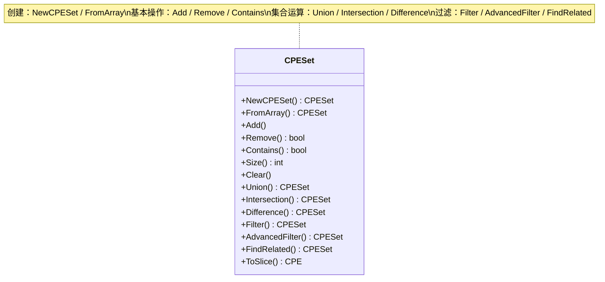
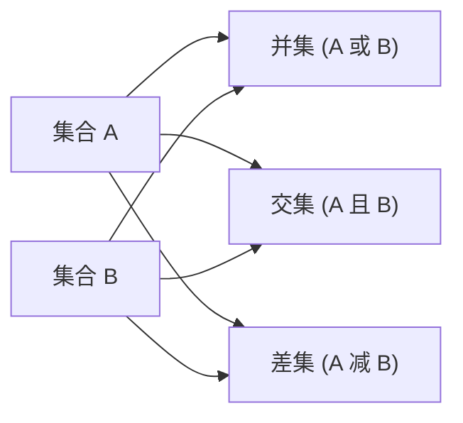

# 集合

CPE 库提供了强大的集合运算能力，用于管理 CPE 对象的集合，包括并集、交集、差集以及基于条件的过滤。

下面的类图按用途对 `CPESet` 的方法进行分组——创建集合、基本操作、集合代数运算与过滤：



下面的流程图展示了两个输入集合 A 与 B 之上的三种核心集合运算：



## CPESet 结构

### CPESet

```go
type CPESet struct {
    // Name 集合的名称，用于标识和区分不同集合
    Name string
    // Description 集合的详细描述
    Description string
    // 内部存储的 CPE 元素是隐藏的
}
```

`CPESet` 类型表示一组唯一的 CPE 对象，并提供高效的集合运算。唯一性由每个 CPE 的 URI 决定。

## 创建集合

### NewCPESet

```go
func NewCPESet(name string, description string) *CPESet
```

使用给定的名称和描述创建一个新的空 CPE 集合。

**参数：**
- `name` - 集合的名称
- `description` - 集合的描述

**返回值：**
- `*CPESet` - 新创建的空集合

**示例：**
```go
// 创建一个新的空集合
set := cpeskills.NewCPESet("Microsoft Products", "Collection of Microsoft product CPEs")
fmt.Printf("Created empty set with %d items\n", set.Size())
```

### FromArray

```go
func FromArray(cpes []*CPE, name string, description string) *CPESet
```

从 CPE 对象数组创建一个 CPE 集合。

**参数：**
- `cpes` - CPE 对象数组
- `name` - 新集合的名称
- `description` - 新集合的描述

**返回值：**
- `*CPESet` - 包含这些 CPE 对象的集合

**示例：**
```go
// 创建 CPE
cpe1, _ := cpeskills.ParseCpe23("cpe:2.3:a:microsoft:windows:10:*:*:*:*:*:*:*")
cpe2, _ := cpeskills.ParseCpe23("cpe:2.3:a:microsoft:office:2019:*:*:*:*:*:*:*")
cpe3, _ := cpeskills.ParseCpe23("cpe:2.3:a:apache:tomcat:9.0:*:*:*:*:*:*:*")

// 从数组创建集合
cpeArray := []*cpeskills.CPE{cpe1, cpe2, cpe3}
set := cpeskills.FromArray(cpeArray, "My Products", "A collection of products")
fmt.Printf("Created set with %d items\n", set.Size())
```

## 基本操作

### Add

```go
func (s *CPESet) Add(cpe *CPE)
```

向集合中添加一个 CPE 对象。如果集合中已存在相等的 CPE（按 URI 比较），则不会重复添加。

**参数：**
- `cpe` - 要添加的 CPE 对象

**示例：**
```go
set := cpeskills.NewCPESet("demo", "demo set")
cpe1, _ := cpeskills.ParseCpe23("cpe:2.3:a:microsoft:windows:10:*:*:*:*:*:*:*")
cpe2, _ := cpeskills.ParseCpe23("cpe:2.3:a:apache:tomcat:9.0:*:*:*:*:*:*:*")

// 逐个添加 CPE
set.Add(cpe1)
set.Add(cpe2)
set.Add(cpe1) // cpe1 不会被重复添加（集合中元素唯一）

fmt.Printf("Set size after adding: %d\n", set.Size())
```

### Remove

```go
func (s *CPESet) Remove(cpe *CPE) bool
```

从集合中移除一个 CPE 对象。

**参数：**
- `cpe` - 要移除的 CPE 对象

**返回值：**
- `bool` - 如果成功移除返回 `true`，如果该 CPE 不在集合中返回 `false`

**示例：**
```go
cpe1, _ := cpeskills.ParseCpe23("cpe:2.3:a:microsoft:windows:10:*:*:*:*:*:*:*")
set := cpeskills.NewCPESet("demo", "demo set")
set.Add(cpe1)

removed := set.Remove(cpe1)
fmt.Printf("CPE removed: %t\n", removed)
fmt.Printf("Set size after removal: %d\n", set.Size())
```

### Contains

```go
func (s *CPESet) Contains(cpe *CPE) bool
```

检查集合是否包含指定的 CPE 对象。

**参数：**
- `cpe` - 要检查的 CPE 对象

**返回值：**
- `bool` - 如果集合包含该 CPE 返回 `true`，否则返回 `false`

**示例：**
```go
cpe1, _ := cpeskills.ParseCpe23("cpe:2.3:a:microsoft:windows:10:*:*:*:*:*:*:*")
cpe2, _ := cpeskills.ParseCpe23("cpe:2.3:a:apache:tomcat:9.0:*:*:*:*:*:*:*")

set := cpeskills.NewCPESet("demo", "demo set")
set.Add(cpe1)

fmt.Printf("Contains Windows: %t\n", set.Contains(cpe1))
fmt.Printf("Contains Tomcat: %t\n", set.Contains(cpe2))
```

### Size

```go
func (s *CPESet) Size() int
```

返回集合中 CPE 对象的数量。

**返回值：**
- `int` - 集合中元素的数量

### Clear

```go
func (s *CPESet) Clear()
```

移除集合中的所有 CPE 对象。

**示例：**
```go
set := cpeskills.NewCPESet("demo", "demo set")
// ... 添加一些 CPE ...

fmt.Printf("Size before clear: %d\n", set.Size())
set.Clear()
fmt.Printf("Size after clear: %d\n", set.Size())
```

## 集合运算

### Union

```go
func (s *CPESet) Union(other *CPESet) *CPESet
```

返回一个包含两个集合中所有 CPE 的新集合。

**参数：**
- `other` - 另一个 CPE 集合

**返回值：**
- `*CPESet` - 包含两个集合并集的新集合

**示例：**
```go
// 创建两个集合
set1 := cpeskills.NewCPESet("set1", "first set")
set2 := cpeskills.NewCPESet("set2", "second set")

cpe1, _ := cpeskills.ParseCpe23("cpe:2.3:a:microsoft:windows:10:*:*:*:*:*:*:*")
cpe2, _ := cpeskills.ParseCpe23("cpe:2.3:a:apache:tomcat:9.0:*:*:*:*:*:*:*")
cpe3, _ := cpeskills.ParseCpe23("cpe:2.3:a:oracle:java:11:*:*:*:*:*:*:*")

set1.Add(cpe1)
set1.Add(cpe2)
set2.Add(cpe2) // cpe2 同时在两个集合中
set2.Add(cpe3)

// 并集运算
unionSet := set1.Union(set2)
fmt.Printf("Set1 size: %d\n", set1.Size())
fmt.Printf("Set2 size: %d\n", set2.Size())
fmt.Printf("Union size: %d\n", unionSet.Size()) // 应为 3（元素唯一）
```

### Intersection

```go
func (s *CPESet) Intersection(other *CPESet) *CPESet
```

返回一个仅包含同时存在于两个集合中的 CPE 的新集合。

**参数：**
- `other` - 另一个 CPE 集合

**返回值：**
- `*CPESet` - 包含两个集合交集的新集合

**示例：**
```go
set1 := cpeskills.NewCPESet("set1", "first set")
set2 := cpeskills.NewCPESet("set2", "second set")

cpe1, _ := cpeskills.ParseCpe23("cpe:2.3:a:microsoft:windows:10:*:*:*:*:*:*:*")
cpe2, _ := cpeskills.ParseCpe23("cpe:2.3:a:apache:tomcat:9.0:*:*:*:*:*:*:*")
cpe3, _ := cpeskills.ParseCpe23("cpe:2.3:a:oracle:java:11:*:*:*:*:*:*:*")

set1.Add(cpe1)
set1.Add(cpe2)
set2.Add(cpe2)
set2.Add(cpe3)

// 交集运算
intersectionSet := set1.Intersection(set2)
fmt.Printf("Intersection size: %d\n", intersectionSet.Size()) // 应为 1（cpe2）
```

### Difference

```go
func (s *CPESet) Difference(other *CPESet) *CPESet
```

返回一个包含存在于当前集合但不在另一个集合中的 CPE 的新集合。

**参数：**
- `other` - 另一个 CPE 集合

**返回值：**
- `*CPESet` - 包含差集的新集合

**示例：**
```go
set1 := cpeskills.NewCPESet("set1", "first set")
set2 := cpeskills.NewCPESet("set2", "second set")

cpe1, _ := cpeskills.ParseCpe23("cpe:2.3:a:microsoft:windows:10:*:*:*:*:*:*:*")
cpe2, _ := cpeskills.ParseCpe23("cpe:2.3:a:apache:tomcat:9.0:*:*:*:*:*:*:*")
cpe3, _ := cpeskills.ParseCpe23("cpe:2.3:a:oracle:java:11:*:*:*:*:*:*:*")

set1.Add(cpe1)
set1.Add(cpe2)
set2.Add(cpe2)
set2.Add(cpe3)

// 差集运算
diffSet := set1.Difference(set2)
fmt.Printf("Difference size: %d\n", diffSet.Size()) // 应为 1（cpe1）
```

## 集合关系

### Equals

```go
func (s *CPESet) Equals(other *CPESet) bool
```

检查两个集合是否包含完全相同的 CPE。

**参数：**
- `other` - 另一个 CPE 集合

**返回值：**
- `bool` - 如果两个集合包含相同的 CPE 返回 `true`

### IsSubsetOf

```go
func (s *CPESet) IsSubsetOf(other *CPESet) bool
```

检查当前集合是否是 `other` 的子集（当前集合中的每个 CPE 都在 `other` 中）。

**参数：**
- `other` - 候选超集

**返回值：**
- `bool` - 如果当前集合是 `other` 的子集返回 `true`

### IsSupersetOf

```go
func (s *CPESet) IsSupersetOf(other *CPESet) bool
```

检查当前集合是否是 `other` 的超集（`other` 中的每个 CPE 都在当前集合中）。

**参数：**
- `other` - 候选子集

**返回值：**
- `bool` - 如果当前集合是 `other` 的超集返回 `true`

**示例：**
```go
windowsSet := cpeskills.NewCPESet("windows", "all windows")
windows10Set := cpeskills.NewCPESet("windows10", "windows 10 only")
// ... 填充集合 ...

fmt.Printf("windows10 ⊆ windows: %t\n", windows10Set.IsSubsetOf(windowsSet))
fmt.Printf("windows ⊇ windows10: %t\n", windowsSet.IsSupersetOf(windows10Set))
```

## 过滤操作

### Filter

```go
func (s *CPESet) Filter(criteria *CPE, options *MatchOptions) *CPESet
```

返回一个仅包含匹配给定条件 CPE 的新集合。如果 `options` 为 `nil`，则使用默认匹配选项。

**参数：**
- `criteria` - 用作过滤条件的 CPE 对象
- `options` - 匹配选项；如果为 `nil`，则使用 `DefaultMatchOptions()`

**返回值：**
- `*CPESet` - 过滤后的新集合

**示例：**
```go
set := cpeskills.NewCPESet("all", "all products")
cpe1, _ := cpeskills.ParseCpe23("cpe:2.3:a:microsoft:windows:10:*:*:*:*:*:*:*")
cpe2, _ := cpeskills.ParseCpe23("cpe:2.3:a:microsoft:office:2019:*:*:*:*:*:*:*")
cpe3, _ := cpeskills.ParseCpe23("cpe:2.3:a:apache:tomcat:9.0:*:*:*:*:*:*:*")

set.Add(cpe1)
set.Add(cpe2)
set.Add(cpe3)

// 过滤出 Microsoft 产品
criteria := &cpeskills.CPE{
    Vendor: cpeskills.Vendor("microsoft"),
}
microsoftSet := set.Filter(criteria, nil)

fmt.Printf("Microsoft products: %d\n", microsoftSet.Size()) // 应为 2
```

### AdvancedFilter

```go
func (s *CPESet) AdvancedFilter(criteria *CPE, options *AdvancedMatchOptions) *CPESet
```

使用高级匹配条件（如正则表达式或基于距离的匹配）过滤集合。如果 `options` 为 `nil`，则使用 `NewAdvancedMatchOptions()`。

**参数：**
- `criteria` - 用于匹配的 CPE 模式
- `options` - 高级匹配选项

**返回值：**
- `*CPESet` - 过滤后的新集合

**示例：**
```go
set := cpeskills.NewCPESet("all", "all products")
// ... 填充集合 ...

// 创建高级匹配条件
criteria := &cpeskills.CPE{
    Vendor: cpeskills.Vendor("microsoft"),
}

options := cpeskills.NewAdvancedMatchOptions()
options.MatchMode = "distance"
options.ScoreThreshold = 0.8

// 高级过滤
filteredSet := set.AdvancedFilter(criteria, options)
fmt.Printf("Advanced filtered set size: %d\n", filteredSet.Size())
```

### FindRelated

```go
func (s *CPESet) FindRelated(cpe *CPE, options *AdvancedMatchOptions) *CPESet
```

使用宽松的基于距离的匹配查找集合中与给定 CPE 相关的 CPE。如果 `options` 为 `nil`，则使用默认的高级选项。

**参数：**
- `cpe` - 用于查找相关项的 CPE
- `options` - 高级匹配选项；如果为 `nil`，则使用默认值

**返回值：**
- `*CPESet` - 相关 CPE 的集合

**示例：**
```go
targetCPE := &cpeskills.CPE{
    Vendor:      cpeskills.Vendor("microsoft"),
    ProductName: cpeskills.Product("windows"),
    Version:     cpeskills.Version("10"),
}
relatedSet := set.FindRelated(targetCPE, nil)

fmt.Printf("Found %d related CPEs\n", relatedSet.Size())
```

## 转换与排序

### ToSlice

```go
func (s *CPESet) ToSlice() []*CPE
```

将集合转换为 CPE 对象切片。

**返回值：**
- `[]*CPE` - 包含集合中所有 CPE 的切片

### Sort

```go
func (s *CPESet) Sort(sortBy string, ascending bool) []*CPE
```

以排序后的切片形式返回集合中的 CPE。此方法不会修改集合本身。

**参数：**
- `sortBy` - 排序字段：`"part"`、`"vendor"`、`"product"`、`"version"`，或其他任意值（按 CPE 2.3 字符串排序）
- `ascending` - `true` 为升序，`false` 为降序

**返回值：**
- `[]*CPE` - 排序后的 CPE 切片

### ToString

```go
func (s *CPESet) ToString() string
```

返回集合的字符串表示，包含其名称、描述、大小以及 CPE 列表。

**返回值：**
- `string` - 集合的字符串表示

**示例：**
```go
set := cpeskills.NewCPESet("Microsoft", "Microsoft products")
// ... 填充集合 ...

// 转换为切片
cpeSlice := set.ToSlice()
fmt.Printf("Slice length: %d\n", len(cpeSlice))

// 按产品名称升序排序
sorted := set.Sort("product", true)
for i, cpe := range sorted {
    fmt.Printf("%d: %s\n", i+1, cpe.Cpe23)
}

// 可读的字符串表示
fmt.Println(set.ToString())
```

## 完整示例

```go
package main

import (
    "fmt"
    "github.com/scagogogo/cpe-skills"
)

func main() {
    // 创建 CPE 对象
    cpe1, _ := cpeskills.ParseCpe23("cpe:2.3:a:microsoft:windows:10:*:*:*:*:*:*:*")
    cpe2, _ := cpeskills.ParseCpe23("cpe:2.3:a:microsoft:office:2019:*:*:*:*:*:*:*")
    cpe3, _ := cpeskills.ParseCpe23("cpe:2.3:a:apache:tomcat:9.0:*:*:*:*:*:*:*")
    cpe4, _ := cpeskills.ParseCpe23("cpe:2.3:a:oracle:java:11:*:*:*:*:*:*:*")

    // 创建集合
    fmt.Println("=== Creating Sets ===")
    set1 := cpeskills.NewCPESet("Set1", "First set")
    set1.Add(cpe1)
    set1.Add(cpe2)
    set1.Add(cpe3)

    set2 := cpeskills.NewCPESet("Set2", "Second set")
    set2.Add(cpe3)
    set2.Add(cpe4)

    fmt.Printf("Set1 size: %d\n", set1.Size())
    fmt.Printf("Set2 size: %d\n", set2.Size())

    // 集合运算
    fmt.Println("\n=== Set Operations ===")
    unionSet := set1.Union(set2)
    intersectionSet := set1.Intersection(set2)
    differenceSet := set1.Difference(set2)

    fmt.Printf("Union size: %d\n", unionSet.Size())
    fmt.Printf("Intersection size: %d\n", intersectionSet.Size())
    fmt.Printf("Difference size: %d\n", differenceSet.Size())

    // 过滤
    fmt.Println("\n=== Filtering ===")
    criteria := &cpeskills.CPE{
        Vendor: cpeskills.Vendor("microsoft"),
    }
    microsoftSet := set1.Filter(criteria, nil)
    fmt.Printf("Microsoft products: %d\n", microsoftSet.Size())

    // 高级过滤
    fmt.Println("\n=== Advanced Filtering ===")
    options := cpeskills.NewAdvancedMatchOptions()
    options.MatchMode = "exact"

    advancedFiltered := set1.AdvancedFilter(criteria, options)
    fmt.Printf("Advanced filtered: %d\n", advancedFiltered.Size())

    // 转换为切片并排序
    fmt.Println("\n=== Conversion ===")
    cpeSlice := microsoftSet.ToSlice()
    fmt.Printf("Microsoft products (%d):\n", len(cpeSlice))
    for i, cpe := range microsoftSet.Sort("product", true) {
        fmt.Printf("%d. %s\n", i+1, cpe.Cpe23)
    }

    // 成员测试
    fmt.Println("\n=== Membership Tests ===")
    fmt.Printf("Set1 contains Windows: %t\n", set1.Contains(cpe1))
    fmt.Printf("Set1 contains Java: %t\n", set1.Contains(cpe4))

    // 从数组创建集合
    fmt.Println("\n=== Creating from Array ===")
    browsers := []*cpeskills.CPE{cpe1, cpe2}
    browserSet := cpeskills.FromArray(browsers, "Browsers", "Browser set")
    fmt.Printf("Browser set size: %d\n", browserSet.Size())
}
```
