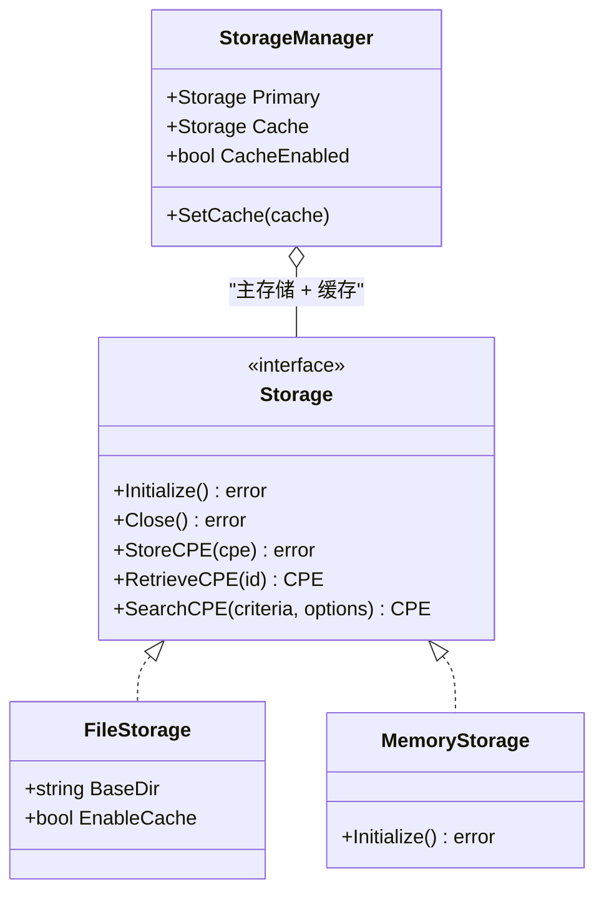

# 存储

CPE 库提供了一个灵活的存储接口，并有多种实现，用于持久化 CPE 数据、CVE 信息和字典。

下面的类图展示了存储层次结构：`FileStorage` 和 `MemoryStorage` 实现了 `Storage` 接口，`StorageManager` 将一个主后端与一个可选的缓存后端组合在一起。



## 存储接口

### Storage

```go
type Storage interface {
    // 生命周期
    Initialize() error
    Close() error
    
    // CPE 操作
    StoreCPE(cpe *CPE) error
    RetrieveCPE(id string) (*CPE, error)
    UpdateCPE(cpe *CPE) error
    DeleteCPE(id string) error
    SearchCPE(criteria *CPE, options *MatchOptions) ([]*CPE, error)
    AdvancedSearchCPE(criteria *CPE, options *AdvancedMatchOptions) ([]*CPE, error)
    
    // CVE 操作
    StoreCVE(cve *CVEReference) error
    RetrieveCVE(cveID string) (*CVEReference, error)
    UpdateCVE(cve *CVEReference) error
    DeleteCVE(cveID string) error
    SearchCVE(query string, options *SearchOptions) ([]*CVEReference, error)
    FindCVEsByCPE(cpe *CPE) ([]*CVEReference, error)
    FindCPEsByCVE(cveID string) ([]*CPE, error)
    
    // 字典操作
    StoreDictionary(dict *CPEDictionary) error
    RetrieveDictionary() (*CPEDictionary, error)
    
    // 元数据操作
    StoreModificationTimestamp(key string, timestamp time.Time) error
    RetrieveModificationTimestamp(key string) (time.Time, error)
}
```

## 文件存储

### NewFileStorage

```go
func NewFileStorage(baseDir string, enableCache bool) (*FileStorage, error)
```

创建一个新的基于文件的存储实现。

**参数：**
- `baseDir` - 用于存储文件的基础目录
- `enableCache` - 是否启用内存缓存

**返回值：**
- `*FileStorage` - 文件存储实例
- `error` - 创建失败时返回的错误

**示例：**
```go
// 创建带缓存的文件存储
storage, err := cpeskills.NewFileStorage("./cpe-data", true)
if err != nil {
    log.Fatal(err)
}
defer storage.Close()

// 初始化存储
err = storage.Initialize()
if err != nil {
    log.Fatal(err)
}
```

### FileStorage 结构

文件存储按以下目录结构组织数据：
```
baseDir/
├── cpes/           # CPE 文件（JSON 格式）
├── cves/           # CVE 文件（JSON 格式）
├── dictionary.json # CPE 字典
└── metadata.json   # 时间戳和元数据
```

### FileStorage 方法

#### StoreCPE

```go
func (f *FileStorage) StoreCPE(cpe *CPE) error
```

将 CPE 对象存储到文件系统。

**参数：**
- `cpe` - 要存储的 CPE 对象

**返回值：**
- `error` - 存储失败时返回的错误

**示例：**
```go
cpeObj, _ := cpeskills.ParseCpe23("cpe:2.3:a:microsoft:windows:10:*:*:*:*:*:*:*")
err := storage.StoreCPE(cpeObj)
if err != nil {
    log.Printf("存储 CPE 失败: %v", err)
}
```

#### RetrieveCPE

```go
func (f *FileStorage) RetrieveCPE(id string) (*CPE, error)
```

根据 ID（URI）检索 CPE 对象。

**参数：**
- `id` - CPE URI 或标识符

**返回值：**
- `*CPE` - 检索到的 CPE 对象
- `error` - 检索失败或未找到 CPE 时返回的错误

**示例：**
```go
cpeObj, err := storage.RetrieveCPE("cpe:2.3:a:microsoft:windows:10:*:*:*:*:*:*:*")
if err != nil {
    if errors.Is(err, cpeskills.ErrNotFound) {
        fmt.Println("未找到 CPE")
    } else {
        log.Printf("检索 CPE 失败: %v", err)
    }
} else {
    fmt.Printf("已检索: %s\n", cpeObj.GetURI())
}
```

#### SearchCPE

```go
func (f *FileStorage) SearchCPE(criteria *CPE, options *MatchOptions) ([]*CPE, error)
```

搜索与给定条件匹配的 CPE。

**参数：**
- `criteria` - 要搜索的 CPE 模式
- `options` - 匹配选项

**返回值：**
- `[]*CPE` - 匹配的 CPE 数组
- `error` - 搜索失败时返回的错误

**示例：**
```go
// 搜索所有 Microsoft 产品
criteria := &cpeskills.CPE{
    Vendor: cpeskills.Vendor("microsoft"),
}

options := cpeskills.DefaultMatchOptions()
results, err := storage.SearchCPE(criteria, options)
if err != nil {
    log.Fatal(err)
}

fmt.Printf("找到 %d 个 Microsoft 产品\n", len(results))
for _, result := range results {
    fmt.Printf("- %s\n", result.GetURI())
}
```

#### AdvancedSearchCPE

```go
func (f *FileStorage) AdvancedSearchCPE(criteria *CPE, options *AdvancedMatchOptions) ([]*CPE, error)
```

使用复杂的匹配算法执行高级搜索。

**示例：**
```go
criteria := &cpeskills.CPE{
    Vendor:      cpeskills.Vendor("microsoft"),
    ProductName: cpeskills.Product("windows"),
}

options := cpeskills.NewAdvancedMatchOptions()
options.MatchMode = "distance"
options.ScoreThreshold = 0.8

results, err := storage.AdvancedSearchCPE(criteria, options)
if err != nil {
    log.Fatal(err)
}

fmt.Printf("找到 %d 个 Windows 产品\n", len(results))
```

## 内存存储

### NewMemoryStorage

```go
func NewMemoryStorage() *MemoryStorage
```

创建一个新的内存存储实现（主要用于测试）。

**返回值：**
- `*MemoryStorage` - 内存存储实例

**示例：**
```go
storage := cpeskills.NewMemoryStorage()
err := storage.Initialize()
if err != nil {
    log.Fatal(err)
}

// 使用存储
cpeObj, _ := cpeskills.ParseCpe23("cpe:2.3:a:test:product:1.0:*:*:*:*:*:*:*")
err = storage.StoreCPE(cpeObj)
if err != nil {
    log.Fatal(err)
}
```

## 存储管理器

### StorageManager

```go
type StorageManager struct {
    Primary         Storage // 主存储后端
    Cache           Storage // 缓存存储后端
    CacheEnabled    bool    // 是否启用缓存
    CacheTTLSeconds int     // 缓存有效期（秒）
}
```

### NewStorageManager

```go
func NewStorageManager(primary Storage) *StorageManager
```

使用指定的主存储创建一个新的存储管理器。

**参数：**
- `primary` - 主存储后端

**返回值：**
- `*StorageManager` - 存储管理器实例

### SetCache

```go
func (sm *StorageManager) SetCache(cache Storage)
```

设置缓存存储后端并启用缓存。

**参数：**
- `cache` - 缓存存储后端

**示例：**
```go
// 创建主存储
primaryStorage, _ := cpeskills.NewFileStorage("./data", false)

// 创建缓存存储
cacheStorage := cpeskills.NewMemoryStorage()

// 创建存储管理器
manager := cpeskills.NewStorageManager(primaryStorage)
manager.SetCache(cacheStorage)

// 初始化两个存储
primaryStorage.Initialize()
cacheStorage.Initialize()
```

## 搜索选项

### SearchOptions

```go
type SearchOptions struct {
    Offset            int                    // 要跳过的结果数量
    Limit             int                    // 最大结果数量
    SortBy            string                 // 排序字段
    SortAscending     bool                   // 排序方向（true 为升序）
    Filters           map[string]interface{} // 过滤条件
    FullTextQuery     string                 // 全文搜索查询
    IncludeDeprecated bool                   // 是否包含已弃用的项
    DateStart         *time.Time             // 日期范围过滤（起始）
    DateEnd           *time.Time             // 日期范围过滤（结束）
    MinCVSS           float64                // 最小 CVSS 评分
    MaxCVSS           float64                // 最大 CVSS 评分
}
```

### NewSearchOptions

```go
func NewSearchOptions() *SearchOptions
```

返回默认搜索选项（`Offset: 0`、`Limit: 100`、`SortBy: "id"`、`SortAscending: true`）。

**示例：**
```go
options := cpeskills.NewSearchOptions()
options.Limit = 50
options.SortBy = "vendor"
options.SortAscending = true

cves, err := storage.SearchCVE("apache", options)
if err != nil {
    log.Fatal(err)
}
```

## 存储统计

### StorageStats

```go
type StorageStats struct {
    TotalCPEs            int       // CPE 总数
    TotalCVEs            int       // CVE 总数
    TotalDictionaryItems int       // 字典项总数
    StorageBytes         int64     // 存储占用空间（字节）
    LastUpdated          time.Time // 上次更新时间戳
}
```

## 错误处理

存储接口定义了若干标准错误：

```go
var (
    ErrNotFound              = errors.New("record not found")
    ErrDuplicate             = errors.New("duplicate record")
    ErrInvalidData           = errors.New("invalid data")
    ErrStorageDisconnected   = errors.New("storage is disconnected")
)
```

**示例：**
```go
cpeObj, err := storage.RetrieveCPE("non-existent-cpe")
if err != nil {
    if errors.Is(err, cpeskills.ErrNotFound) {
        fmt.Println("未找到 CPE")
    } else {
        log.Printf("存储错误: %v", err)
    }
}
```

## 完整示例

```go
package main

import (
    "fmt"
    "log"
    "github.com/scagogogo/cpe-skills"
)

func main() {
    // 创建并初始化存储
    storage, err := cpeskills.NewFileStorage("./cpe-storage", true)
    if err != nil {
        log.Fatal(err)
    }
    defer storage.Close()
    
    err = storage.Initialize()
    if err != nil {
        log.Fatal(err)
    }
    
    // 存储一些 CPE
    cpes := []string{
        "cpe:2.3:a:microsoft:windows:10:*:*:*:*:*:*:*",
        "cpe:2.3:a:microsoft:office:2019:*:*:*:*:*:*:*",
        "cpe:2.3:a:apache:tomcat:9.0:*:*:*:*:*:*:*",
    }
    
    for _, cpeStr := range cpes {
        cpeObj, err := cpeskills.ParseCpe23(cpeStr)
        if err != nil {
            log.Printf("解析 %s 失败: %v", cpeStr, err)
            continue
        }
        
        err = storage.StoreCPE(cpeObj)
        if err != nil {
            log.Printf("存储 %s 失败: %v", cpeStr, err)
        } else {
            fmt.Printf("已存储: %s\n", cpeStr)
        }
    }
    
    // 搜索 Microsoft 产品
    criteria := &cpeskills.CPE{
        Vendor: cpeskills.Vendor("microsoft"),
    }
    
    results, err := storage.SearchCPE(criteria, cpeskills.DefaultMatchOptions())
    if err != nil {
        log.Fatal(err)
    }
    
    fmt.Printf("\n找到 %d 个 Microsoft 产品:\n", len(results))
    for _, result := range results {
        fmt.Printf("- %s %s %s\n", 
            result.Vendor, result.ProductName, result.Version)
    }
    
    // 检索特定 CPE
    retrieved, err := storage.RetrieveCPE("cpe:2.3:a:apache:tomcat:9.0:*:*:*:*:*:*:*")
    if err != nil {
        log.Printf("检索失败: %v", err)
    } else {
        fmt.Printf("\n已检索: %s\n", retrieved.GetURI())
    }
}
```
