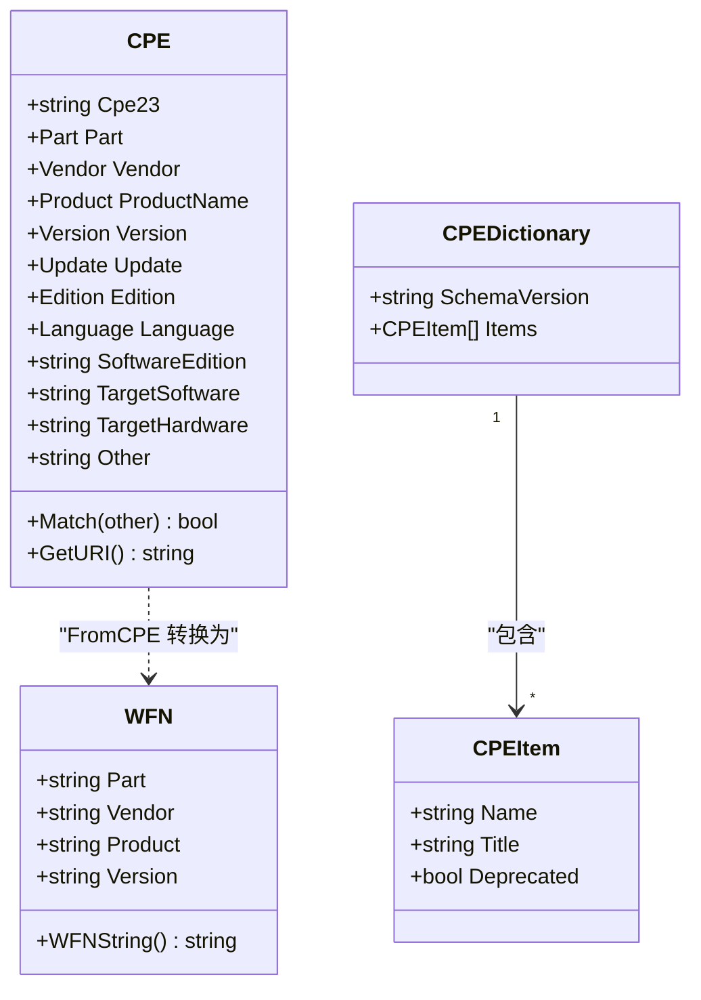

# 核心类型

本节介绍 CPE 库中使用的核心数据结构和类型定义。

下面的类图展示了核心类型之间的关系。`CPE` 可以通过 `FromCPE` 函数转换为 `WFN`，而 `CPEDictionary` 包含多个 `CPEItem` 条目。



## CPE 结构体

`CPE` 结构体是表示 Common Platform Enumeration 条目的核心数据结构。

```go
type CPE struct {
    // CPE 2.3 格式字符串表示
    Cpe23 string `json:"cpe_23" bson:"cpe_23"`
    
    // 组件类型（应用程序、硬件或操作系统）
    Part Part `json:"part" bson:"part"`
    
    // 供应商/制造商名称
    Vendor Vendor `json:"vendor" bson:"vendor"`
    
    // 产品名称
    ProductName Product `json:"product_name" bson:"product_name"`
    
    // 产品版本
    Version Version `json:"version" bson:"version"`
    
    // 更新标识符
    Update Update `json:"update" bson:"update"`
    
    // 版本标识符
    Edition Edition `json:"edition" bson:"edition"`
    
    // 语言标识符
    Language Language `json:"language" bson:"language"`
    
    // 软件版本（如 "professional"、"enterprise"）
    SoftwareEdition string `json:"software_edition" bson:"software_edition"`
    
    // 目标软件环境
    TargetSoftware string `json:"target_software" bson:"target_software"`
    
    // 目标硬件环境
    TargetHardware string `json:"target_hardware" bson:"target_hardware"`
    
    // 其他属性
    Other string `json:"other" bson:"other"`
    
    // 关联的 CVE 标识符
    Cve string `json:"cve" bson:"cve"`
    
    // 来源 URL
    Url string `json:"url" bson:"url"`
}
```

### 方法

#### Match

```go
func (c *CPE) Match(other *CPE) bool
```

根据 CPE 名称匹配规范判断当前 CPE 是否与另一个 CPE 匹配。

**参数：**
- `other` - 用于匹配的目标 CPE

**返回值：**
- `bool` - 匹配返回 `true`，否则返回 `false`

**示例：**
```go
cpe1, _ := cpeskills.ParseCpe23("cpe:2.3:a:microsoft:windows:10:*:*:*:*:*:*:*")
cpe2, _ := cpeskills.ParseCpe23("cpe:2.3:a:microsoft:windows:*:*:*:*:*:*:*:*")

if cpe2.Match(cpe1) {
    fmt.Println("CPE1 匹配 CPE2 模式")
}
```

#### GetURI

```go
func (c *CPE) GetURI() string
```

返回 CPE 2.3 URI 字符串表示。

**返回值：**
- `string` - CPE 2.3 格式字符串

#### FromCPE

```go
func FromCPE(cpe *CPE) *WFN
```

将 `CPE` 转换为规范化名称（WFN）格式。

**参数：**
- `cpe` - 要转换的 CPE

**返回值：**
- `*WFN` - CPE 的 WFN 表示

## 组件类型

### Part

表示 CPE 的组件类型（应用程序、硬件或操作系统）。

```go
type Part struct {
    ShortName   string  // 单字符标识符（"a"、"h"、"o"）
    LongName    string  // 完整名称（"Application"、"Hardware"、"Operation System"）
    Description string  // 附加描述
}
```

#### 预定义 Part

```go
var (
    // 应用软件
    PartApplication = &Part{
        ShortName: "a",
        LongName:  "Application",
    }
    
    // 硬件设备
    PartHardware = &Part{
        ShortName: "h",
        LongName:  "Hardware",
    }
    
    // 操作系统
    PartOperationSystem = &Part{
        ShortName: "o",
        LongName:  "Operation System",
    }
)
```

### 类型别名

该库定义了若干类型别名，以获得更好的类型安全性和清晰度：

```go
// Vendor 表示产品供应商/制造商
type Vendor string

// Product 表示产品名称
type Product string

// Version 表示产品版本
type Version string

// Update 表示更新标识符
type Update string

// Edition 表示版本标识符
type Edition string

// Language 表示语言标识符
type Language string
```

## 字典类型

### CPEDictionary

表示 CPE 条目的集合，通常来自 NVD。

```go
type CPEDictionary struct {
    SchemaVersion string     // XML schema 版本
    GeneratedAt   time.Time  // 字典生成时间戳
    Items         []*CPEItem // CPE 条目
}
```

### CPEItem

表示 CPE 字典中的单个条目。

```go
type CPEItem struct {
    Name            string       // CPE 名称（URI 格式）
    Title           string       // 人类可读标题
    References      []Reference  // 参考链接
    Deprecated      bool         // CPE 是否已弃用
    DeprecationDate *time.Time   // 弃用日期（如果已弃用）
    CPE             *CPE         // 解析后的 CPE 对象
}
```

### Reference

表示与 CPE 条目关联的参考链接。

```go
type Reference struct {
    URL  string // 参考 URL
    Type string // 参考类型（如 "Vendor"、"Advisory"、"External"）
}
```

## CVE 类型

### CVEReference

表示一个 CVE（Common Vulnerabilities and Exposures，通用漏洞与暴露）条目。

```go
type CVEReference struct {
    CVEID            string                 // CVE 标识符（如 "CVE-2021-44228"）
    Description      string                 // 漏洞描述
    PublishedDate    time.Time              // 发布日期
    LastModifiedDate time.Time              // 最后修改日期
    CVSSScore        float64                // CVSS 评分（0.0-10.0）
    Severity         string                 // 严重性级别（Low、Medium、High、Critical）
    References       []string               // 参考 URL
    AffectedCPEs     []string               // 受影响的 CPE URI
    Metadata         map[string]interface{} // 额外元数据
}
```

## 常量

### CPE 格式常量

```go
const (
    CPE23Header  = "cpe"    // CPE 2.3 头部
    CPE23Version = "2.3"    // CPE 2.3 版本
    CPE22Header  = "cpe"    // CPE 2.2 头部
)
```

### 特殊值

```go
const (
    ValueANY = "*"  // 通配符逻辑值（匹配任意值）
    ValueNA  = "-"  // 不适用逻辑值
)
```

## 使用示例

### 创建 CPE 对象

```go
// 手动创建 CPE
windowsCPE := &cpeskills.CPE{
    Cpe23:       "cpe:2.3:a:microsoft:windows:10:*:*:*:*:*:*:*",
    Part:        *cpeskills.PartApplication,
    Vendor:      cpeskills.Vendor("microsoft"),
    ProductName: cpeskills.Product("windows"),
    Version:     cpeskills.Version("10"),
}

// 从字符串解析
parsedCPE, err := cpeskills.ParseCpe23("cpe:2.3:a:microsoft:windows:10:*:*:*:*:*:*:*")
if err != nil {
    log.Fatal(err)
}
```

### 使用 Part

```go
// 检查 part 类型
if cpeObj.Part.ShortName == "a" {
    fmt.Println("这是一个应用程序")
}

// 使用预定义 part
newCPE := &cpeskills.CPE{
    Part: *cpeskills.PartOperationSystem,
    // ... 其他字段
}
```

### 类型转换

```go
// 转换为字符串类型
vendorStr := string(cpeObj.Vendor)
productStr := string(cpeObj.ProductName)
versionStr := string(cpeObj.Version)

// 从字符串创建
cpeObj.Vendor = cpeskills.Vendor("apache")
cpeObj.ProductName = cpeskills.Product("tomcat")
cpeObj.Version = cpeskills.Version("9.0.0")
```
