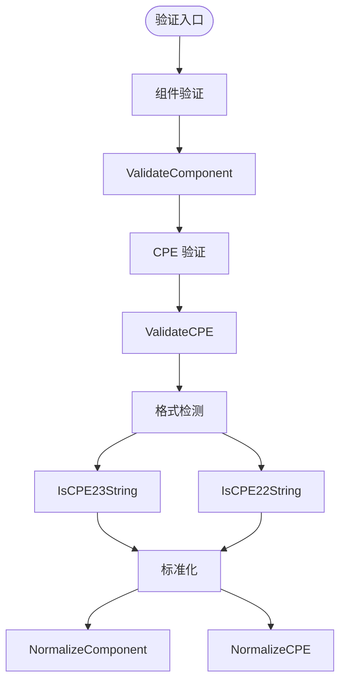

# 验证

CPE 库提供了验证、格式检测和标准化函数，用于确保 CPE 数据的完整性以及对 CPE 规范的遵从。

下图展示了验证流水线：从单字段组件检查，向上到整体 CPE 验证、格式检测和标准化：



## 组件验证

### ValidateComponent

```go
func ValidateComponent(value string, componentName string) error
```

验证单个 CPE 组件值（vendor、product、version 等）是否符合 CPE 命名规则。

**参数：**
- `value` - 要验证的组件值
- `componentName` - 组件名称（用于错误消息中标识哪个字段出错）

**返回值：**
- `error` - 验证失败时返回错误，有效时返回 `nil`

**验证规则：**
- 空字符串被视为有效（通配符）
- 允许特殊值 `*`（ANY）和 `-`（NA）
- 不得包含非法字符（`! @ # $ % ^ & ( ) { } [ ] | \ ; " ' < > ?`）
- 不得包含控制字符或可打印 ASCII 范围（32–126）之外的字符

**示例：**
```go
// 有效组件
err := cpeskills.ValidateComponent("microsoft", "Vendor")
if err != nil {
    fmt.Printf("Invalid: %v\n", err)
} else {
    fmt.Println("Valid component")
}

// 特殊值
err = cpeskills.ValidateComponent("*", "Version") // ANY 值
if err == nil {
    fmt.Println("Wildcard is valid")
}

err = cpeskills.ValidateComponent("-", "Version") // NA 值
if err == nil {
    fmt.Println("NA value is valid")
}

// 含控制字符的无效组件
err = cpeskills.ValidateComponent("invalid\x00component", "Product")
if err != nil {
    fmt.Printf("Invalid component: %v\n", err)
}
```

## CPE 验证

### ValidateCPE

```go
func ValidateCPE(cpe *CPE) error
```

验证完整的 CPE 对象的正确性和合规性。

**参数：**
- `cpe` - 要验证的 CPE 对象

**返回值：**
- `error` - 验证失败时返回错误

**验证检查项：**
- `cpe` 不得为 `nil`
- `Part` 不得为空，且必须是 `a`、`h`、`o` 或 `*` 之一
- `Vendor` 和 `ProductName` 不得为空
- 每个组件字段都会经过 `ValidateComponent` 校验

**示例：**
```go
// 创建并验证一个 CPE
cpeObj := &cpeskills.CPE{
    Part:        *cpeskills.PartApplication,
    Vendor:      cpeskills.Vendor("microsoft"),
    ProductName: cpeskills.Product("windows"),
    Version:     cpeskills.Version("10"),
}

err := cpeskills.ValidateCPE(cpeObj)
if err != nil {
    fmt.Printf("CPE validation failed: %v\n", err)
} else {
    fmt.Println("CPE is valid")
}

// 测试无效的 CPE
invalidCPE := &cpeskills.CPE{
    Part:        cpeskills.Part{ShortName: "x"}, // 无效的 part
    Vendor:      cpeskills.Vendor("microsoft"),
    ProductName: cpeskills.Product("windows"),
}

err = cpeskills.ValidateCPE(invalidCPE)
if err != nil {
    fmt.Printf("Expected validation error: %v\n", err)
}
```

## 格式检测

### IsCPE23String

```go
func IsCPE23String(s string) bool
```

判断字符串是否形如 CPE 2.3 URI（即以 `cpe:2.3:` 开头）。

**参数：**
- `s` - 要检查的字符串

**返回值：**
- `bool` - 若字符串为 CPE 2.3 形式则返回 `true`

**示例：**
```go
cpe23Examples := []string{
    "cpe:2.3:a:microsoft:windows:10:*:*:*:*:*:*:*", // CPE 2.3
    "cpe:/a:apache:tomcat:8.5.0",                    // CPE 2.2
    "not a cpe",                                      // 不是 CPE
}

for _, example := range cpe23Examples {
    if cpeskills.IsCPE23String(example) {
        fmt.Printf("CPE 2.3 string: %s\n", example)
    } else {
        fmt.Printf("Not a CPE 2.3 string: %s\n", example)
    }
}
```

### IsCPE22String

```go
func IsCPE22String(s string) bool
```

判断字符串是否形如 CPE 2.2 URI（即以 `cpe:/` 开头）。

**参数：**
- `s` - 要检查的字符串

**返回值：**
- `bool` - 若字符串为 CPE 2.2 形式则返回 `true`

**示例：**
```go
cpe22Examples := []string{
    "cpe:/a:apache:tomcat:8.5.0",                    // CPE 2.2
    "cpe:2.3:a:microsoft:windows:10:*:*:*:*:*:*:*", // CPE 2.3
    "invalid:/a:apache:tomcat:8.5.0",                // 无效前缀
}

for _, example := range cpe22Examples {
    if cpeskills.IsCPE22String(example) {
        fmt.Printf("CPE 2.2 string: %s\n", example)
    } else {
        fmt.Printf("Not a CPE 2.2 string: %s\n", example)
    }
}
```

## 标准化

### NormalizeComponent

```go
func NormalizeComponent(value string) string
```

按照 CPE 规范规则标准化一个 CPE 组件。

**参数：**
- `value` - 要标准化的组件

**返回值：**
- `string` - 标准化后的组件

**标准化规则：**
- 特殊值（`*`、`-` 和空字符串）原样返回
- 转换为小写
- 将空格替换为下划线
- 将连续的多个下划线合并为单个下划线

**示例：**
```go
// 测试组件标准化
components := []string{
    "Microsoft",              // -> "microsoft"
    "Windows 10",             // -> "windows_10"
    "Microsoft  Office",      // -> "microsoft_office"
    "*",                      // -> "*" (不变)
    "-",                      // -> "-" (不变)
}

for _, comp := range components {
    normalized := cpeskills.NormalizeComponent(comp)
    fmt.Printf("'%s' -> '%s'\n", comp, normalized)
}
```

### NormalizeCPE

```go
func NormalizeCPE(cpe *CPE) *CPE
```

标准化 CPE 对象的所有组件。输入对象保持不变；返回一个新的标准化对象（若输入为 `nil` 则返回 `nil`）。

**参数：**
- `cpe` - 要标准化的 CPE

**返回值：**
- `*CPE` - 组件已标准化的新 CPE

**示例：**
```go
// 创建含未标准化组件的 CPE
originalCPE := &cpeskills.CPE{
    Part:        *cpeskills.PartApplication,
    Vendor:      cpeskills.Vendor("Microsoft"),
    ProductName: cpeskills.Product("Windows 10"),
    Version:     cpeskills.Version("1.0"),
}

// 标准化该 CPE
normalizedCPE := cpeskills.NormalizeCPE(originalCPE)

fmt.Printf("Original vendor: %s\n", originalCPE.Vendor)
fmt.Printf("Normalized vendor: %s\n", normalizedCPE.Vendor)
fmt.Printf("Original product: %s\n", originalCPE.ProductName)
fmt.Printf("Normalized product: %s\n", normalizedCPE.ProductName)
```

## 完整示例

```go
package main

import (
    "fmt"
    "github.com/scagogogo/cpe-skills"
)

func main() {
    // 组件验证
    fmt.Println("=== Component Validation ===")
    components := []string{
        "microsoft",   // 有效
        "windows_10",  // 有效
        "*",           // 有效（通配符）
        "-",           // 有效（NA）
        "invalid\x00", // 无效（控制字符）
    }

    for _, comp := range components {
        err := cpeskills.ValidateComponent(comp, "Component")
        if err != nil {
            fmt.Printf("Invalid component '%s': %v\n", comp, err)
        } else {
            fmt.Printf("Valid component: %s\n", comp)
        }
    }

    // 格式检测
    fmt.Println("\n=== Format Detection ===")
    cpeStrings := []string{
        "cpe:2.3:a:microsoft:windows:10:*:*:*:*:*:*:*",
        "cpe:/a:apache:tomcat:8.5.0",
        "invalid:format",
    }

    for _, cpeStr := range cpeStrings {
        switch {
        case cpeskills.IsCPE23String(cpeStr):
            fmt.Printf("CPE 2.3 string: %s\n", cpeStr)
        case cpeskills.IsCPE22String(cpeStr):
            fmt.Printf("CPE 2.2 string: %s\n", cpeStr)
        default:
            fmt.Printf("Not a CPE string: %s\n", cpeStr)
        }
    }

    // CPE 对象验证
    fmt.Println("\n=== CPE Object Validation ===")
    validCPE := &cpeskills.CPE{
        Part:        *cpeskills.PartApplication,
        Vendor:      cpeskills.Vendor("microsoft"),
        ProductName: cpeskills.Product("windows"),
        Version:     cpeskills.Version("10"),
    }

    err := cpeskills.ValidateCPE(validCPE)
    if err != nil {
        fmt.Printf("CPE validation failed: %v\n", err)
    } else {
        fmt.Println("CPE object is valid")
    }

    // 组件标准化
    fmt.Println("\n=== Component Normalization ===")
    unnormalizedComponents := []string{
        "Microsoft",
        "Windows 10",
        "Microsoft  Office",
        "Product Name",
    }

    for _, comp := range unnormalizedComponents {
        normalized := cpeskills.NormalizeComponent(comp)
        fmt.Printf("'%s' -> '%s'\n", comp, normalized)
    }

    // CPE 标准化
    fmt.Println("\n=== CPE Normalization ===")
    unnormalizedCPE := &cpeskills.CPE{
        Part:        *cpeskills.PartApplication,
        Vendor:      cpeskills.Vendor("Microsoft"),
        ProductName: cpeskills.Product("Windows 10"),
        Version:     cpeskills.Version("1.0"),
    }

    normalizedCPE := cpeskills.NormalizeCPE(unnormalizedCPE)
    fmt.Printf("Original: %s %s %s\n",
        unnormalizedCPE.Vendor, unnormalizedCPE.ProductName, unnormalizedCPE.Version)
    fmt.Printf("Normalized: %s %s %s\n",
        normalizedCPE.Vendor, normalizedCPE.ProductName, normalizedCPE.Version)
}
```
