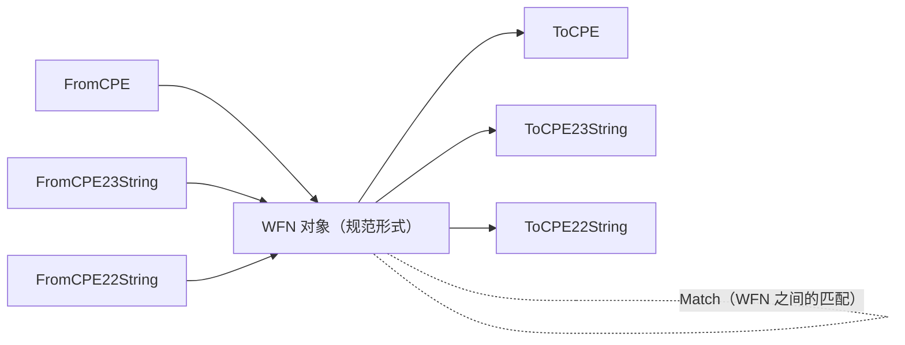

# WFN（Well-Formed Name）

CPE 库为 Well-Formed Name（WFN）提供了全面的支持。WFN 是 CPE 规范中定义的 CPE 名称的规范化内部表示形式。

WFN 对象充当中心转换枢纽：任何 CPE 表示形式都可以转换为 WFN，而 WFN 也可以序列化回任意格式。WFN 对象之间还可以直接进行匹配。



## WFN 结构

### WFN

```go
type WFN struct {
    Part            string // 组件类型
    Vendor          string // 厂商名称
    Product         string // 产品名称
    Version         string // 版本号
    Update          string // 更新版本
    Edition         string // 版本
    Language        string // 语言
    SoftwareEdition string // 软件版本
    TargetSoftware  string // 目标软件
    TargetHardware  string // 目标硬件
    Other           string // 其他信息
}
```

WFN 结构表示 CPE 名称的规范形式，所有属性都经过适当的规范化处理。

## 创建 WFN 对象

### NewWFN

```go
func NewWFN() *WFN
```

创建一个空的 WFN。通过 `Get` 读取时，未设置的属性默认为逻辑值 `ANY`（`*`）。

**返回值：**
- `*WFN` - 空的 WFN 对象

**示例：**
```go
wfn := cpeskills.NewWFN()
wfn.Set("part", "a")
wfn.Set("vendor", "microsoft")
fmt.Println(wfn.Get("vendor")) // microsoft
```

### FromCPE

```go
func FromCPE(cpe *CPE) *WFN
```

从 CPE 对象创建 WFN。

**参数：**
- `cpe` - 要转换的 CPE 对象

**返回值：**
- `*WFN` - WFN 表示形式

**示例：**
```go
// 创建 CPE 并转换为 WFN
cpeObj, _ := cpeskills.ParseCpe23("cpe:2.3:a:microsoft:windows:10:*:*:*:*:*:*:*")
wfn := cpeskills.FromCPE(cpeObj)

fmt.Printf("WFN Part: %s\n", wfn.Part)
fmt.Printf("WFN Vendor: %s\n", wfn.Vendor)
fmt.Printf("WFN Product: %s\n", wfn.Product)
fmt.Printf("WFN Version: %s\n", wfn.Version)
```

### FromCPE23String

```go
func FromCPE23String(cpe23 string) (*WFN, error)
```

直接从 CPE 2.3 格式字符串创建 WFN。

**参数：**
- `cpe23` - CPE 2.3 格式字符串

**返回值：**
- `*WFN` - WFN 对象
- `error` - 解析失败时返回错误

**示例：**
```go
wfn, err := cpeskills.FromCPE23String("cpe:2.3:a:apache:tomcat:9.0.0:*:*:*:*:*:*:*")
if err != nil {
    log.Fatal(err)
}

fmt.Printf("Vendor: %s, Product: %s, Version: %s\n", 
    wfn.Vendor, wfn.Product, wfn.Version)
```

### FromCPE22String

```go
func FromCPE22String(cpe22 string) (*WFN, error)
```

从 CPE 2.2 格式字符串创建 WFN。

**参数：**
- `cpe22` - CPE 2.2 格式字符串

**返回值：**
- `*WFN` - WFN 对象
- `error` - 解析失败时返回错误

**示例：**
```go
wfn, err := cpeskills.FromCPE22String("cpe:/a:apache:tomcat:8.5.0")
if err != nil {
    log.Fatal(err)
}

fmt.Printf("Converted CPE 2.2 to WFN: %s %s %s\n", 
    wfn.Vendor, wfn.Product, wfn.Version)
```

## 从 WFN 转换

### ToCPE

```go
func (w *WFN) ToCPE() *CPE
```

将 WFN 转换为 CPE 对象。

**返回值：**
- `*CPE` - CPE 对象表示形式

**示例：**
```go
// 创建 WFN 并转换为 CPE
wfn := &cpeskills.WFN{
    Part:    "a",
    Vendor:  "microsoft",
    Product: "windows",
    Version: "10",
}

cpeObj := wfn.ToCPE()
fmt.Printf("CPE URI: %s\n", cpeObj.GetURI())
```

### ToCPE23String

```go
func (w *WFN) ToCPE23String() string
```

将 WFN 转换为 CPE 2.3 格式字符串。

**返回值：**
- `string` - CPE 2.3 格式字符串

**示例：**
```go
wfn := &cpeskills.WFN{
    Part:    "a",
    Vendor:  "apache",
    Product: "tomcat",
    Version: "9.0.0",
}

cpe23 := wfn.ToCPE23String()
fmt.Printf("CPE 2.3: %s\n", cpe23)
// 输出: cpe:2.3:a:apache:tomcat:9.0.0:*:*:*:*:*:*:*
```

### ToCPE22String

```go
func (w *WFN) ToCPE22String() string
```

将 WFN 转换为 CPE 2.2 格式字符串。

**返回值：**
- `string` - CPE 2.2 格式字符串

**示例：**
```go
wfn := &cpeskills.WFN{
    Part:    "a",
    Vendor:  "apache",
    Product: "tomcat",
    Version: "8.5.0",
}

cpe22 := wfn.ToCPE22String()
fmt.Printf("CPE 2.2: %s\n", cpe22)
// 输出: cpe:/a:apache:tomcat:8.5.0
```

## 属性访问

### Get

```go
func (w *WFN) Get(attr string) string
```

按名称返回某个属性的值。空属性返回逻辑值 `ANY`（`*`）。有效的属性名为 `part`、`vendor`、`product`、`version`、`update`、`edition`、`language`、`sw_edition`、`target_sw`、`target_hw` 和 `other`。

**参数：**
- `attr` - 属性名

**返回值：**
- `string` - 属性值（未设置时为 `*`）

### Set

```go
func (w *WFN) Set(attr string, value string)
```

按名称设置某个属性的值。

**参数：**
- `attr` - 属性名
- `value` - 要赋的值

### WFNString

```go
func (w *WFN) WFNString() string
```

返回规范的 WFN 字符串表示，例如 `wfn:[part="a",vendor="microsoft",product="windows"]`。

**返回值：**
- `string` - WFN 字符串表示

### IsIdentifierName

```go
func (w *WFN) IsIdentifierName() bool
```

判断该 WFN 是否符合 CPE 标识名（identifier name）的要求，即 `part`、`vendor`、`product` 均为具体值且不含未转义的通配符。

**返回值：**
- `bool` - 如果该 WFN 是有效的标识名返回 `true`

**示例：**
```go
wfn := cpeskills.NewWFN()
wfn.Set("part", "a")
wfn.Set("vendor", "microsoft")
wfn.Set("product", "windows")

fmt.Println(wfn.WFNString())        // wfn:[part="a",vendor="microsoft",product="windows"]
fmt.Println(wfn.IsIdentifierName()) // true
```

## WFN 匹配

### Match

```go
func (w *WFN) Match(other *WFN) bool
```

比较两个 WFN 对象，按照 CPE 匹配规则判断它们是否匹配。属性为 `*`（ANY）时匹配任何值；两个 `-`（NA）值互相匹配；其他情况要求精确匹配。

**参数：**
- `other` - 要匹配的 WFN

**返回值：**
- `bool` - 如果两个 WFN 匹配返回 `true`，否则返回 `false`

**示例：**
```go
pattern, _ := cpeskills.FromCPE23String("cpe:2.3:a:microsoft:windows:*:*:*:*:*:*:*:*")
target, _ := cpeskills.FromCPE23String("cpe:2.3:a:microsoft:windows:10:*:*:*:*:*:*:*")

if pattern.Match(target) {
    fmt.Println("Target matches pattern")
}
```

## 值处理

WFN 对逻辑值使用特殊的值处理方式：

### 特殊值

- `ANY`（`*`）- 匹配任何值
- `NA`（`-`）- 不适用/未定义

### FSStringToURI

```go
func FSStringToURI(fs string) string
```

将 CPE 2.3 格式化字符串转换为 CPE 2.2 URI 格式。

**参数：**
- `fs` - 格式化字符串值

**返回值：**
- `string` - URI 格式的值

### URIToFSString

```go
func URIToFSString(uri string) string
```

将 CPE 2.2 URI 值转换为 CPE 2.3 格式化字符串。

**参数：**
- `uri` - URI 值

**返回值：**
- `string` - 格式化字符串值

## 格式绑定

对于将 WFN 对象与标准 CPE 字符串格式相互绑定，库还提供了 `BindToFS`、`UnbindFS`、`BindToURI` 和 `UnbindURI` 函数。详见 Binding 文档。

## 完整示例

```go
package main

import (
    "fmt"
    "log"
    "github.com/scagogogo/cpe-skills"
)

func main() {
    // 从 CPE 2.3 字符串创建 WFN
    fmt.Println("=== Creating WFN from CPE 2.3 ===")
    wfn1, err := cpeskills.FromCPE23String("cpe:2.3:a:apache:tomcat:9.0.0:*:*:*:*:*:*:*")
    if err != nil {
        log.Fatal(err)
    }

    fmt.Printf("Part: %s\n", wfn1.Part)
    fmt.Printf("Vendor: %s\n", wfn1.Vendor)
    fmt.Printf("Product: %s\n", wfn1.Product)
    fmt.Printf("Version: %s\n", wfn1.Version)

    // 从 CPE 2.2 字符串创建 WFN
    fmt.Println("\n=== Creating WFN from CPE 2.2 ===")
    wfn2, err := cpeskills.FromCPE22String("cpe:/a:microsoft:windows:10")
    if err != nil {
        log.Fatal(err)
    }

    fmt.Printf("Vendor: %s\n", wfn2.Vendor)
    fmt.Printf("Product: %s\n", wfn2.Product)
    fmt.Printf("Version: %s\n", wfn2.Version)

    // 将 WFN 转换回不同格式
    fmt.Println("\n=== Converting WFN to different formats ===")
    cpe23 := wfn1.ToCPE23String()
    cpe22 := wfn1.ToCPE22String()

    fmt.Printf("CPE 2.3: %s\n", cpe23)
    fmt.Printf("CPE 2.2: %s\n", cpe22)

    // 转换为 CPE 对象
    cpeObj := wfn1.ToCPE()
    fmt.Printf("CPE URI: %s\n", cpeObj.GetURI())

    // WFN 匹配
    fmt.Println("\n=== WFN Matching ===")
    pattern, _ := cpeskills.FromCPE23String("cpe:2.3:a:apache:*:*:*:*:*:*:*:*:*")
    target, _ := cpeskills.FromCPE23String("cpe:2.3:a:apache:tomcat:9.0.0:*:*:*:*:*:*:*")

    if pattern.Match(target) {
        fmt.Println("Target matches pattern")
    } else {
        fmt.Println("Target does not match pattern")
    }

    // 手动创建 WFN 并检查它
    fmt.Println("\n=== Creating WFN manually ===")
    manualWFN := cpeskills.NewWFN()
    manualWFN.Set("part", "a")
    manualWFN.Set("vendor", "oracle")
    manualWFN.Set("product", "java")
    manualWFN.Set("version", "11.0.12")

    fmt.Printf("WFN string: %s\n", manualWFN.WFNString())
    fmt.Printf("Is identifier name: %t\n", manualWFN.IsIdentifierName())

    // 将手动创建的 WFN 转换为 CPE
    manualCPE := manualWFN.ToCPE()
    fmt.Printf("Manual WFN as CPE: %s\n", manualCPE.GetURI())
}
```
