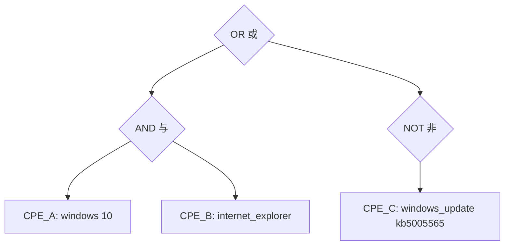

# 适用性语言

本示例演示如何使用 CPE 适用性语言来表达复杂的匹配条件和 CPE 名称之间的逻辑关系。

## 概述

CPE 适用性语言允许您创建复杂的表达式，定义特定信息（如漏洞）何时适用于系统。它支持逻辑运算符（AND、OR、NOT）和复杂的嵌套条件。

适用性表达式会被解析成一棵逻辑表达式树。下图展示了形如 `(CPE_A AND CPE_B) OR (NOT CPE_C)` 的规则如何表示：根节点为 `OR`，组合一个 `AND` 分支和一个 `NOT` 分支，叶子节点是具体的 CPE 名称。



## 完整示例

```go
package main

import (
    "fmt"
    "log"

    "github.com/scagogogo/cpe-skills"
)

func main() {
    fmt.Println("=== CPE适用性语言示例 ===")

    // 示例1：基本适用性表达式
    fmt.Println("\n1. 基本适用性表达式:")

    // 简单表达式：适用于Windows 10
    expr1 := "cpe:2.3:o:microsoft:windows:10:*:*:*:*:*:*:*"

    // OR表达式：适用于Windows 10或Windows 11
    expr2 := "OR(cpe:2.3:o:microsoft:windows:10:*:*:*:*:*:*:*, cpe:2.3:o:microsoft:windows:11:*:*:*:*:*:*:*)"

    // AND表达式：同一个CPE既是Windows 10又应用了特定更新。
    // 注意：AND是针对单个目标CPE求值的，因此实际使用时要么组合能同时匹配
    // 同一名称的CPE（例如借助通配符），要么针对系统中的每个CPE分别求值。
    expr3 := "AND(cpe:2.3:o:microsoft:windows:10:*:*:*:*:*:*:*, cpe:2.3:o:microsoft:windows_update:kb5005565:*:*:*:*:*:*:*)"

    expressions := []struct {
        name string
        expr string
        desc string
    }{
        {"简单", expr1, "单个CPE匹配"},
        {"OR逻辑", expr2, "多个备选项"},
        {"AND逻辑", expr3, "对单个目标的多个要求"},
    }

    for _, e := range expressions {
        fmt.Printf("\n%s表达式:\n", e.name)
        fmt.Printf("  描述: %s\n", e.desc)
        fmt.Printf("  表达式: %s\n", e.expr)

        // 使用真实的 ParseExpression API 解析表达式
        parsedExpr, err := cpeskills.ParseExpression(e.expr)
        if err != nil {
            log.Printf("解析表达式失败: %v", err)
            continue
        }

        fmt.Printf("  解析成功: %t\n", parsedExpr != nil)
        fmt.Printf("  表达式类型: %d\n", parsedExpr.Type())
        fmt.Printf("  字符串形式: %s\n", parsedExpr.String())
    }

    // 示例2：复杂嵌套表达式
    fmt.Println("\n2. 复杂嵌套表达式:")

    // 复杂漏洞适用性
    // 语法：AND(...)、OR(...)、NOT(...)，操作数以逗号分隔
    complexExpr := "AND(OR(cpe:2.3:o:microsoft:windows:10:*:*:*:*:*:*:*, cpe:2.3:o:microsoft:windows:11:*:*:*:*:*:*:*), NOT(cpe:2.3:a:microsoft:edge:*:*:*:*:*:*:*:*))"

    fmt.Printf("复杂表达式:\n%s\n", complexExpr)

    parsedComplex, err := cpeskills.ParseExpression(complexExpr)
    if err != nil {
        log.Printf("解析复杂表达式失败: %v", err)
    } else {
        fmt.Printf("成功解析复杂表达式\n")
        fmt.Printf("表达式类型: %d\n", parsedComplex.Type())
        fmt.Printf("字符串形式: %s\n", parsedComplex.String())
    }

    // 示例3：测试适用性
    fmt.Println("\n3. 测试适用性:")

    // 定义测试系统，每个系统是它安装的一组CPE
    testSystems := []struct {
        name string
        cpes []string
    }{
        {
            "Windows 10 with IE",
            []string{
                "cpe:2.3:o:microsoft:windows:10:*:*:*:*:*:*:*",
                "cpe:2.3:a:microsoft:internet_explorer:11:*:*:*:*:*:*:*",
            },
        },
        {
            "Windows 11 with Edge",
            []string{
                "cpe:2.3:o:microsoft:windows:11:*:*:*:*:*:*:*",
                "cpe:2.3:a:microsoft:edge:95.0.1020.44:*:*:*:*:*:*:*",
            },
        },
        {
            "Windows 10 with patch",
            []string{
                "cpe:2.3:o:microsoft:windows:10:*:*:*:*:*:*:*",
                "cpe:2.3:a:microsoft:internet_explorer:11:*:*:*:*:*:*:*",
                "cpe:2.3:a:microsoft:windows_update:kb5005565:*:*:*:*:*:*:*",
            },
        },
        {
            "Linux系统",
            []string{
                "cpe:2.3:o:canonical:ubuntu:20.04:*:*:*:*:*:*:*",
                "cpe:2.3:a:mozilla:firefox:95.0:*:*:*:*:*:*:*",
            },
        },
    }

    // 真实的 Evaluate API 针对单个目标CPE求值。要判断表达式是否“适用”于
    // 整个系统，我们针对系统中的每个CPE求值并取或：只要系统中有任意一个
    // CPE满足表达式，就认为该系统适用。
    systemApplies := func(expr cpeskills.Expression, cpes []*cpeskills.CPE) bool {
        for _, c := range cpes {
            if expr.Evaluate(c) {
                return true
            }
        }
        return false
    }

    for _, system := range testSystems {
        fmt.Printf("\n测试系统: %s\n", system.name)

        // 将CPE字符串转换为对象
        systemCPEs := make([]*cpeskills.CPE, 0, len(system.cpes))
        for _, cpeStr := range system.cpes {
            cpeObj, err := cpeskills.ParseCpe23(cpeStr)
            if err != nil {
                log.Printf("解析CPE %s失败: %v", cpeStr, err)
                continue
            }
            systemCPEs = append(systemCPEs, cpeObj)
        }

        var applies bool
        if parsedComplex != nil {
            applies = systemApplies(parsedComplex, systemCPEs)
        }

        status := "不适用"
        if applies {
            status = "适用"
        }

        fmt.Printf("  结果: %s\n", status)
        fmt.Printf("  系统CPE:\n")
        for _, cpeStr := range system.cpes {
            fmt.Printf("    - %s\n", cpeStr)
        }
    }

    // 示例4：版本范围适用性
    fmt.Println("\n4. 版本范围适用性:")

    // Java版本8.x、9.x或10.x的表达式
    javaRangeExpr := "OR(cpe:2.3:a:oracle:java:8.*:*:*:*:*:*:*:*, cpe:2.3:a:oracle:java:9.*:*:*:*:*:*:*:*, cpe:2.3:a:oracle:java:10.*:*:*:*:*:*:*:*)"

    fmt.Printf("Java版本范围表达式:\n%s\n", javaRangeExpr)

    javaExpr, err := cpeskills.ParseExpression(javaRangeExpr)
    if err != nil {
        log.Printf("解析Java表达式失败: %v", err)
    } else {
        // 测试不同的Java版本
        javaVersions := []string{
            "cpe:2.3:a:oracle:java:7.0.80:*:*:*:*:*:*:*",
            "cpe:2.3:a:oracle:java:8.0.291:*:*:*:*:*:*:*",
            "cpe:2.3:a:oracle:java:9.0.4:*:*:*:*:*:*:*",
            "cpe:2.3:a:oracle:java:11.0.12:*:*:*:*:*:*:*",
            "cpe:2.3:a:oracle:java:17.0.1:*:*:*:*:*:*:*",
        }

        fmt.Println("\n测试Java版本:")
        for _, javaVer := range javaVersions {
            javaCPE, perr := cpeskills.ParseCpe23(javaVer)
            if perr != nil {
                log.Printf("解析 %s 失败: %v", javaVer, perr)
                continue
            }
            // 针对单个目标CPE求值
            applies := javaExpr.Evaluate(javaCPE)

            status := "否"
            if applies {
                status = "是"
            }

            fmt.Printf("  [%s] %s\n", status, javaVer)
        }
    }

    // 示例5：平台特定适用性
    fmt.Println("\n5. 平台特定适用性:")

    // Linux上Web服务器的表达式
    webServerLinuxExpr := "AND(OR(cpe:2.3:o:*:linux:*:*:*:*:*:*:*:*, cpe:2.3:o:canonical:ubuntu:*:*:*:*:*:*:*:*, cpe:2.3:o:redhat:enterprise_linux:*:*:*:*:*:*:*:*), OR(cpe:2.3:a:apache:http_server:*:*:*:*:*:*:*:*, cpe:2.3:a:nginx:nginx:*:*:*:*:*:*:*:*))"

    fmt.Printf("Linux上Web服务器表达式:\n%s\n", webServerLinuxExpr)

    webServerExpr, err := cpeskills.ParseExpression(webServerLinuxExpr)
    if err != nil {
        log.Printf("解析Web服务器表达式失败: %v", err)
    } else {
        // 测试不同的服务器配置
        serverConfigs := []struct {
            name string
            cpes []string
        }{
            {
                "Ubuntu上的Apache",
                []string{
                    "cpe:2.3:o:canonical:ubuntu:20.04:*:*:*:*:*:*:*",
                    "cpe:2.3:a:apache:http_server:2.4.41:*:*:*:*:*:*:*",
                },
            },
            {
                "RHEL上的Nginx",
                []string{
                    "cpe:2.3:o:redhat:enterprise_linux:8:*:*:*:*:*:*:*",
                    "cpe:2.3:a:nginx:nginx:1.18.0:*:*:*:*:*:*:*",
                },
            },
            {
                "Windows上的IIS",
                []string{
                    "cpe:2.3:o:microsoft:windows:10:*:*:*:*:*:*:*",
                    "cpe:2.3:a:microsoft:internet_information_services:10.0:*:*:*:*:*:*:*",
                },
            },
        }

        fmt.Println("\n测试服务器配置:")
        for _, config := range serverConfigs {
            configCPEs := make([]*cpeskills.CPE, 0, len(config.cpes))
            for _, cpeStr := range config.cpes {
                cpeObj, perr := cpeskills.ParseCpe23(cpeStr)
                if perr != nil {
                    log.Printf("解析 %s 失败: %v", cpeStr, perr)
                    continue
                }
                configCPEs = append(configCPEs, cpeObj)
            }

            applies := systemApplies(webServerExpr, configCPEs)

            status := "否"
            if applies {
                status = "是"
            }

            fmt.Printf("  [%s] %s\n", status, config.name)
        }
    }

    // 示例6：过滤CPE列表
    fmt.Println("\n6. 过滤CPE列表:")

    // FilterCPEs 返回列表中满足表达式的所有CPE
    allCPEs := []*cpeskills.CPE{
        mustParse("cpe:2.3:o:microsoft:windows:10:*:*:*:*:*:*:*"),
        mustParse("cpe:2.3:o:microsoft:windows:11:*:*:*:*:*:*:*"),
        mustParse("cpe:2.3:o:canonical:ubuntu:20.04:*:*:*:*:*:*:*"),
        mustParse("cpe:2.3:o:redhat:enterprise_linux:8:*:*:*:*:*:*:*"),
    }

    winExpr, err := cpeskills.ParseExpression("OR(cpe:2.3:o:microsoft:windows:10:*:*:*:*:*:*:*, cpe:2.3:o:microsoft:windows:11:*:*:*:*:*:*:*)")
    if err != nil {
        log.Fatalf("解析Windows表达式失败: %v", err)
    }

    matched := cpeskills.FilterCPEs(allCPEs, winExpr)
    fmt.Printf("匹配到 %d 个Windows CPE:\n", len(matched))
    for _, c := range matched {
        fmt.Printf("  - %s\n", c.Cpe23)
    }
}

func mustParse(cpeStr string) *cpeskills.CPE {
    cpeObj, err := cpeskills.ParseCpe23(cpeStr)
    if err != nil {
        panic(err)
    }
    return cpeObj
}
```

## 关键概念

### 1. 逻辑运算符

- **AND**: 所有条件必须为真
- **OR**: 至少一个条件必须为真
- **NOT**: 条件必须为假

### 2. 表达式结构

- **简单**: 单个 CPE 匹配
- **复合**: 带运算符的多个 CPE
- **嵌套**: 复杂的层次条件

### 3. 用例

- **漏洞适用性**: 定义受影响的系统
- **策略合规**: 指定所需配置
- **资产分类**: 分组相似系统
- **补丁管理**: 识别更新目标

## 最佳实践

1. **使用通配符**: 适当时用通配符简化表达式
2. **逻辑分组**: 将相关条件分组在一起
3. **彻底测试**: 针对已知系统验证表达式
4. **记录意图**: 为复杂表达式添加注释
5. **优化性能**: 可能时优先选择简单表达式

## 下一步

- 学习[高级匹配](./advanced-matching.md)处理复杂场景
- 探索[CPE 集合](./sets.md)进行批量操作
- 查看[NVD 集成](./nvd-integration.md)了解实际适用性
