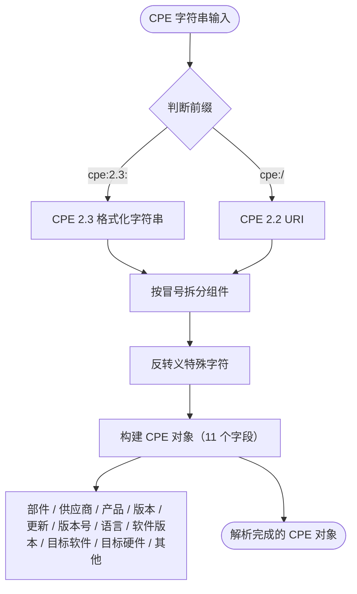

# 基础解析

本示例演示了CPE库的基本解析功能，展示如何解析CPE 2.2和2.3格式的字符串。

## 概览

CPE库支持解析两种标准格式的通用平台枚举字符串：
- **CPE 2.3**: `cpe:2.3:part:vendor:product:version:update:edition:language:sw_edition:target_sw:target_hw:other`
- **CPE 2.2**: `cpe:/part:vendor:product:version:update:edition:language`

下图展示了原始 CPE 字符串如何经过解析器变成结构化的 CPE 对象：



下图展示了 CPE 2.3 格式化字符串的 13 段顺序结构：


## 完整示例

```go
package main

import (
    "fmt"
    "log"
    "github.com/scagogogo/cpe-skills"
)

func main() {
    fmt.Println("=== CPE解析示例 ===")
    
    // 示例1：解析CPE 2.3格式
    fmt.Println("\n1. 解析CPE 2.3格式：")
    cpe23Examples := []string{
        "cpe:2.3:a:microsoft:windows:10:*:*:*:*:*:*:*",
        "cpe:2.3:a:adobe:reader:2021.001.20150:*:*:*:*:*:*:*",
        "cpe:2.3:o:linux:kernel:5.4.0:*:*:*:*:*:*:*",
        "cpe:2.3:h:cisco:catalyst_2960:*:*:*:*:*:*:*:*",
    }
    
    for i, cpeStr := range cpe23Examples {
        fmt.Printf("\n示例 %d: %s\n", i+1, cpeStr)
        
        cpeObj, err := cpeskills.ParseCpe23(cpeStr)
        if err != nil {
            log.Printf("解析失败: %v", err)
            continue
        }
        
        // 显示解析的组件
        fmt.Printf("  部件: %s (%s)\n", cpeObj.Part.ShortName, cpeObj.Part.LongName)
        fmt.Printf("  供应商: %s\n", cpeObj.Vendor)
        fmt.Printf("  产品: %s\n", cpeObj.ProductName)
        fmt.Printf("  版本: %s\n", cpeObj.Version)
        
        if cpeObj.Update != "" {
            fmt.Printf("  更新: %s\n", cpeObj.Update)
        }
        if cpeObj.Edition != "" {
            fmt.Printf("  版本: %s\n", cpeObj.Edition)
        }
    }
    
    // 示例2：解析CPE 2.2格式
    fmt.Println("\n2. 解析CPE 2.2格式：")
    cpe22Examples := []string{
        "cpe:/a:apache:tomcat:8.5.0",
        "cpe:/a:oracle:java:11.0.12",
        "cpe:/o:microsoft:windows:10",
        "cpe:/h:dell:poweredge_r740",
    }
    
    for i, cpeStr := range cpe22Examples {
        fmt.Printf("\n示例 %d: %s\n", i+1, cpeStr)
        
        cpeObj, err := cpeskills.ParseCpe22(cpeStr)
        if err != nil {
            log.Printf("解析失败: %v", err)
            continue
        }
        
        fmt.Printf("  部件: %s (%s)\n", cpeObj.Part.ShortName, cpeObj.Part.LongName)
        fmt.Printf("  供应商: %s\n", cpeObj.Vendor)
        fmt.Printf("  产品: %s\n", cpeObj.ProductName)
        fmt.Printf("  版本: %s\n", cpeObj.Version)
        
        // 显示等效的CPE 2.3格式
        fmt.Printf("  CPE 2.3等效: %s\n", cpeObj.Cpe23)
    }
    
    // 示例3：错误处理
    fmt.Println("\n3. 错误处理：")
    invalidCPEs := []string{
        "invalid:format",
        "cpe:2.3:x:vendor:product:1.0:*:*:*:*:*:*:*", // 无效部件
        "cpe:2.3:a:vendor:product", // 组件太少
        "cpe:/x:vendor:product:1.0", // 2.2中的无效部件
    }
    
    for i, invalidCPE := range invalidCPEs {
        fmt.Printf("\n无效示例 %d: %s\n", i+1, invalidCPE)
        
        // 首先尝试解析为CPE 2.3
        _, err := cpeskills.ParseCpe23(invalidCPE)
        if err != nil {
            if cpeskills.IsInvalidFormatError(err) {
                fmt.Printf("  ❌ 无效的CPE 2.3格式: %v\n", err)
            } else if cpeskills.IsInvalidPartError(err) {
                fmt.Printf("  ❌ 无效的部件值: %v\n", err)
            } else {
                fmt.Printf("  ❌ 其他解析错误: %v\n", err)
            }
        }
    }
    
    // 示例4：处理解析的CPE对象
    fmt.Println("\n4. 处理解析的CPE对象：")
    
    windowsCPE, err := cpeskills.ParseCpe23("cpe:2.3:a:microsoft:windows:10:*:*:*:*:*:*:*")
    if err != nil {
        log.Fatal(err)
    }
    
    fmt.Printf("原始CPE: %s\n", windowsCPE.GetURI())
    fmt.Printf("供应商: %s\n", windowsCPE.Vendor)
    fmt.Printf("产品: %s\n", windowsCPE.ProductName)
    fmt.Printf("版本: %s\n", windowsCPE.Version)
    
    // 修改CPE
    windowsCPE.Version = "11"
    fmt.Printf("修改后的CPE: %s\n", cpeskills.FormatCpe23(windowsCPE))
    
    // 示例5：格式转换
    fmt.Println("\n5. 格式转换：")
    
    // 解析CPE 2.2并转换为2.3
    tomcatCPE, err := cpeskills.ParseCpe22("cpe:/a:apache:tomcat:9.0.0")
    if err != nil {
        log.Fatal(err)
    }
    
    fmt.Printf("原始CPE 2.2: cpe:/a:apache:tomcat:9.0.0\n")
    fmt.Printf("转换为CPE 2.3: %s\n", tomcatCPE.Cpe23)
    
    // 转换回CPE 2.2格式
    cpe22Format := cpeskills.FormatCpe22(tomcatCPE)
    fmt.Printf("转换回CPE 2.2: %s\n", cpe22Format)
    
    // 示例6：特殊值
    fmt.Println("\n6. 特殊值：")
    
    specialCPE, err := cpeskills.ParseCpe23("cpe:2.3:a:*:*:*:*:*:*:*:*:*:*")
    if err != nil {
        log.Fatal(err)
    }
    
    fmt.Printf("通配符CPE: %s\n", specialCPE.GetURI())
    fmt.Printf("供应商（通配符）: %s\n", specialCPE.Vendor)
    fmt.Printf("产品（通配符）: %s\n", specialCPE.ProductName)
    
    naCPE, err := cpeskills.ParseCpe23("cpe:2.3:a:vendor:product:-:-:-:*:*:*:*:*")
    if err != nil {
        log.Fatal(err)
    }
    
    fmt.Printf("带有NA值的CPE: %s\n", naCPE.GetURI())
    fmt.Printf("版本（NA）: %s\n", naCPE.Version)
    fmt.Printf("更新（NA）: %s\n", naCPE.Update)
}
```

## 预期输出

```
=== CPE解析示例 ===

1. 解析CPE 2.3格式：

示例 1: cpe:2.3:a:microsoft:windows:10:*:*:*:*:*:*:*
  部件: a (Application)
  供应商: microsoft
  产品: windows
  版本: 10

示例 2: cpe:2.3:a:adobe:reader:2021.001.20150:*:*:*:*:*:*:*
  部件: a (Application)
  供应商: adobe
  产品: reader
  版本: 2021.001.20150

示例 3: cpe:2.3:o:linux:kernel:5.4.0:*:*:*:*:*:*:*
  部件: o (Operation System)
  供应商: linux
  产品: kernel
  版本: 5.4.0

示例 4: cpe:2.3:h:cisco:catalyst_2960:*:*:*:*:*:*:*:*
  部件: h (Hardware)
  供应商: cisco
  产品: catalyst_2960
  版本: *

2. 解析CPE 2.2格式：

示例 1: cpe:/a:apache:tomcat:8.5.0
  部件: a (Application)
  供应商: apache
  产品: tomcat
  版本: 8.5.0
  CPE 2.3等效: cpe:2.3:a:apache:tomcat:8.5.0:*:*:*:*:*:*:*

...
```

## 关键概念

### 1. CPE组件

每个CPE都有这些主要组件：
- **部件**: 组件类型（a=应用程序，h=硬件，o=操作系统）
- **供应商**: 制造商或开发者
- **产品**: 产品名称
- **版本**: 版本号
- **附加字段**: 更新、版本、语言等

### 2. 特殊值

- `*`（星号）: 通配符 - 匹配任何值
- `-`（连字符）: 不适用 - 表示属性不相关

### 3. 错误处理

库提供特定的错误类型：
- `InvalidFormatError`: 格式错误的CPE字符串
- `InvalidPartError`: 无效的部件值
- `ParsingError`: 一般解析失败

### 4. 格式转换

库自动处理CPE 2.2和2.3格式之间的转换，允许你无缝地使用任一格式。

## 最佳实践

1. **始终处理错误** 解析CPE字符串时
2. **验证输入** 如果来源不可信，解析前先验证
3. **使用适当的格式** 根据你的用例
4. **检查特殊值** 处理CPE组件时

## 下一步

- 学习[CPE匹配](./matching.md)来比较CPE对象
- 探索[WFN转换](./wfn-conversion.md)了解内部表示
- 查看[存储操作](./storage.md)来持久化解析的CPE数据
