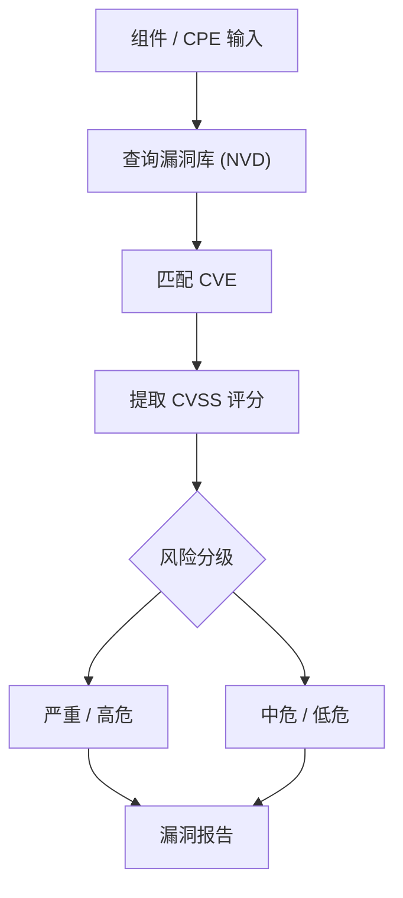

# CVE 映射

本示例演示如何将 CPE 与 CVE（通用漏洞披露）数据进行映射，执行漏洞分析和安全评估。

## 概述

CVE 映射功能允许您将系统中的软件组件与已知漏洞关联，进行风险评估，并生成安全报告。

下图展示了 CVE 映射与风险评估的整体流程：



## 完整示例

```go
package main

import (
    "fmt"
    "sort"
    "strings"
    "time"

    "github.com/scagogogo/cpe-skills"
)

func main() {
    fmt.Println("=== CVE映射示例 ===")

    // 示例1：构建CVE引用列表并完成CPE到CVE的映射
    fmt.Println("\n1. 基础 CPE 到 CVE 映射:")

    // 使用真实的 CVEReference API 构建 CVE 列表
    // （实际项目中应通过 DownloadAllNVDData 从 NVD 数据源加载，
    // 这里手工构造以保证示例可离线运行）
    cves := buildSampleCVEReferences()
    fmt.Printf("已加载 %d 个 CVE 条目\n", len(cves))

    // 待查询漏洞的测试 CPE
    testCPEs := []string{
        "cpe:2.3:a:apache:log4j:2.14.1:*:*:*:*:*:*:*",
        "cpe:2.3:a:apache:tomcat:8.5.0:*:*:*:*:*:*:*",
        "cpe:2.3:a:oracle:java:8.0.291:*:*:*:*:*:*:*",
        "cpe:2.3:o:microsoft:windows:10:*:*:*:*:*:*:*",
        "cpe:2.3:a:nginx:nginx:1.18.0:*:*:*:*:*:*:*",
    }

    for _, cpeStr := range testCPEs {
        fmt.Printf("\nCPE: %s\n", cpeStr)

        // QueryByCVE 返回某个 CVE 影响的 *CPE 列表；
        // 要查某个 CPE 受哪些 CVE 影响，先解析再按厂商/产品/版本用 QueryByProduct 查询。
        cpeObj, err := cpeskills.ParseCpe23(cpeStr)
        if err != nil {
            fmt.Printf("  解析错误: %v\n", err)
            continue
        }

        affecting := cpeskills.QueryByProduct(
            cves,
            string(cpeObj.Vendor),
            string(cpeObj.ProductName),
            string(cpeObj.Version),
        )

        if len(affecting) == 0 {
            fmt.Println("  未发现已知漏洞")
        } else {
            fmt.Printf("  发现 %d 个漏洞:\n", len(affecting))
            for i, cve := range affecting[:minInt(3, len(affecting))] {
                fmt.Printf("    %d. %s (CVSS: %.1f, %s)\n", i+1, cve.CVEID, cve.CVSSScore, cve.Severity)
                fmt.Printf("       %s\n", truncateString(cve.Description, 60))
            }
            if len(affecting) > 3 {
                fmt.Printf("    ... 还有 %d 个\n", len(affecting)-3)
            }
        }
    }

    // 示例2：版本范围漏洞映射
    fmt.Println("\n2. 版本范围漏洞映射:")

    versionRanges := []struct {
        product  string
        vendor   string
        versions []string
    }{
        {product: "log4j", vendor: "apache", versions: []string{"2.0", "2.10.0", "2.14.1", "2.15.0", "2.16.0"}},
        {product: "tomcat", vendor: "apache", versions: []string{"8.5.0", "8.5.50", "9.0.0", "9.0.45", "10.0.0"}},
    }

    for _, vr := range versionRanges {
        fmt.Printf("\n%s %s 版本漏洞分析:\n", vr.vendor, vr.product)

        for _, version := range vr.versions {
            matched := cpeskills.QueryByProduct(cves, vr.vendor, vr.product, version)

            status, riskLevel := "OK", "低"
            if len(matched) > 0 {
                maxScore := 0.0
                for _, cve := range matched {
                    if cve.CVSSScore > maxScore {
                        maxScore = cve.CVSSScore
                    }
                }
                status, riskLevel = riskBadge(maxScore)
            }

            fmt.Printf("  %s v%s: %d 个 CVE (%s 风险)\n", status, version, len(matched), riskLevel)
        }
    }

    // 示例3：系统清单漏洞评估
    fmt.Println("\n3. 系统清单漏洞评估:")

    systemInventory := []struct {
        name string
        cpes []string
    }{
        {
            name: "Web 服务器",
            cpes: []string{
                "cpe:2.3:o:canonical:ubuntu:20.04:*:*:*:*:*:*:*",
                "cpe:2.3:a:apache:http_server:2.4.41:*:*:*:*:*:*:*",
                "cpe:2.3:a:apache:tomcat:8.5.0:*:*:*:*:*:*:*",
                "cpe:2.3:a:oracle:java:8.0.291:*:*:*:*:*:*:*",
            },
        },
        {
            name: "应用服务器",
            cpes: []string{
                "cpe:2.3:o:redhat:enterprise_linux:8:*:*:*:*:*:*:*",
                "cpe:2.3:a:apache:tomcat:9.0.0:*:*:*:*:*:*:*",
                "cpe:2.3:a:oracle:java:11.0.12:*:*:*:*:*:*:*",
                "cpe:2.3:a:apache:log4j:2.14.1:*:*:*:*:*:*:*",
            },
        },
    }

    fmt.Println("系统漏洞评估:")
    for _, system := range systemInventory {
        fmt.Printf("\n%s:\n", system.name)

        totalCVEs, criticalCVEs, highCVEs := 0, 0, 0
        maxScore := 0.0

        for _, cpeStr := range system.cpes {
            cpeObj, err := cpeskills.ParseCpe23(cpeStr)
            if err != nil {
                continue
            }
            matched := cpeskills.QueryByProduct(
                cves,
                string(cpeObj.Vendor),
                string(cpeObj.ProductName),
                string(cpeObj.Version),
            )
            totalCVEs += len(matched)

            for _, cve := range matched {
                if cve.CVSSScore > maxScore {
                    maxScore = cve.CVSSScore
                }
                if cve.CVSSScore >= 9.0 {
                    criticalCVEs++
                } else if cve.CVSSScore >= 7.0 {
                    highCVEs++
                }
            }
        }

        fmt.Printf("  组件数: %d\n", len(system.cpes))
        fmt.Printf("  漏洞总数: %d\n", totalCVEs)
        fmt.Printf("  严重: %d, 高危: %d\n", criticalCVEs, highCVEs)
        fmt.Printf("  最高 CVSS: %.1f\n", maxScore)
        fmt.Printf("  风险等级: %s\n", riskLevel(maxScore))
    }

    // 示例4：漏洞时间线分析
    fmt.Println("\n4. 漏洞时间线分析:")

    // 按发布日期排序构建时间线
    timeline := make([]*cpeskills.CVEReference, len(cves))
    copy(timeline, cves)
    sort.Slice(timeline, func(i, j int) bool {
        return timeline[i].PublishedDate.Before(timeline[j].PublishedDate)
    })

    fmt.Println("CVE 时间线（按发布日期排序）:")
    for _, cve := range timeline {
        fmt.Printf("  %s: %s (CVSS: %.1f)\n",
            cve.PublishedDate.Format("2006-01-02"), cve.CVEID, cve.CVSSScore)
    }

    if len(timeline) > 1 {
        firstCVE := timeline[0].PublishedDate
        lastCVE := timeline[len(timeline)-1].PublishedDate
        timespan := lastCVE.Sub(firstCVE)

        fmt.Println("\n漏洞趋势:")
        fmt.Printf("  最早漏洞: %s\n", firstCVE.Format("2006-01-02"))
        fmt.Printf("  最新漏洞: %s\n", lastCVE.Format("2006-01-02"))
        days := timespan.Hours() / 24
        if days > 0 {
            fmt.Printf("  跨度: %.0f 天\n", days)
            fmt.Printf("  频率: %.2f 个/月\n", float64(len(timeline))/(days/30))
        }
    }

    // 示例5：补丁优先级分析
    fmt.Println("\n5. 补丁优先级分析:")

    patchCandidates := []string{
        "cpe:2.3:a:apache:log4j:2.14.1:*:*:*:*:*:*:*",
        "cpe:2.3:a:apache:tomcat:8.5.0:*:*:*:*:*:*:*",
        "cpe:2.3:a:oracle:java:8.0.291:*:*:*:*:*:*:*",
    }

    type patchPriority struct {
        cpe      string
        cveCount int
        maxScore float64
        priority string
        urgency  string
    }

    var priorities []patchPriority
    for _, cpeStr := range patchCandidates {
        cpeObj, err := cpeskills.ParseCpe23(cpeStr)
        if err != nil {
            continue
        }
        matched := cpeskills.QueryByProduct(
            cves,
            string(cpeObj.Vendor),
            string(cpeObj.ProductName),
            string(cpeObj.Version),
        )

        maxScore := 0.0
        for _, cve := range matched {
            if cve.CVSSScore > maxScore {
                maxScore = cve.CVSSScore
            }
        }

        priorities = append(priorities, patchPriority{
            cpe:      cpeStr,
            cveCount: len(matched),
            maxScore: maxScore,
            priority: patchPriorityLevel(len(matched), maxScore),
            urgency:  patchUrgency(maxScore, matched),
        })
    }

    sort.Slice(priorities, func(i, j int) bool {
        return priorities[i].maxScore > priorities[j].maxScore
    })

    fmt.Println("补丁优先级排名:")
    for i, p := range priorities {
        cpeObj, _ := cpeskills.ParseCpe23(p.cpe)
        fmt.Printf("  %d. %s %s\n", i+1, cpeObj.Vendor, cpeObj.ProductName)
        fmt.Printf("     CVE 数: %d, 最高 CVSS: %.1f\n", p.cveCount, p.maxScore)
        fmt.Printf("     优先级: %s, 紧急度: %s\n", p.priority, p.urgency)
    }

    // 示例6：CVE 影响分析（查询某个 CVE 及其受影响的 CPE）
    fmt.Println("\n6. CVE 影响分析:")

    impactAnalysis := []string{
        "CVE-2021-44228", // Log4Shell
        "CVE-2021-25122", // Apache Tomcat
    }

    for _, cveID := range impactAnalysis {
        fmt.Printf("\n%s 影响分析:\n", cveID)

        cveInfo := cpeskills.GetCVEInfo(cves, cveID)
        if cveInfo == nil {
            fmt.Println("  数据库中未找到该 CVE")
            continue
        }

        fmt.Printf("  CVSS 评分: %.1f\n", cveInfo.CVSSScore)
        fmt.Printf("  严重性: %s\n", cveInfo.Severity)
        fmt.Printf("  发布日期: %s\n", cveInfo.PublishedDate.Format("2006-01-02"))
        fmt.Printf("  描述: %s\n", cveInfo.Description)

        // QueryByCVE 返回该 CVE 影响的已解析 CPE 对象
        affectedCPEs := cpeskills.QueryByCVE(cves, cveID)
        fmt.Printf("  受影响 CPE 数: %d\n", len(affectedCPEs))
        if len(affectedCPEs) > 0 {
            fmt.Println("  受影响产品示例:")
            for i, cpe := range affectedCPEs[:minInt(5, len(affectedCPEs))] {
                fmt.Printf("    %d. %s %s %s\n", i+1, cpe.Vendor, cpe.ProductName, cpe.Version)
            }
        }
    }

    // 示例7：CVE 文本提取、分组、排序、去重与校验
    fmt.Println("\n7. CVE 文本挖掘与校验:")

    sampleText := `系统受到 CVE-2021-44228 和 cve-2021-45046 的影响，
另见 CVE-2017-5638 (Apache Struts) 及重复的 cve-2021-44228。`

    extracted := cpeskills.ExtractCVEsFromText(sampleText)
    fmt.Printf("从文本提取: %v\n", extracted)

    unique := cpeskills.RemoveDuplicateCVEs(extracted)
    fmt.Printf("去重后: %v\n", unique)

    sorted := cpeskills.SortCVEs(unique)
    fmt.Printf("排序后: %v\n", sorted)

    grouped := cpeskills.GroupCVEsByYear(sorted)
    fmt.Println("按年份分组:")
    for year, ids := range grouped {
        fmt.Printf("  %s: %v\n", year, ids)
    }

    fmt.Println("校验:")
    for _, id := range []string{"CVE-2021-44228", "CVE-2099-12345", "CVE2021-44228"} {
        fmt.Printf("  %s -> 有效=%v\n", id, cpeskills.ValidateCVE(id))
    }

    fmt.Println("\nCVE 映射示例完成")
}

// buildSampleCVEReferences 使用真实的 CVEReference API 创建一个内存中的 CVE 列表：
// NewCVEReference + AddAffectedCPE + SetSeverity + 元数据。
func buildSampleCVEReferences() []*cpeskills.CVEReference {
    log4j := cpeskills.NewCVEReference("CVE-2021-44228")
    log4j.Description = "Apache Log4j2 JNDI features do not protect against attacker controlled LDAP and other JNDI related endpoints."
    log4j.PublishedDate = time.Date(2021, 12, 10, 0, 0, 0, 0, time.UTC)
    log4j.AddAffectedCPE("cpe:2.3:a:apache:log4j:2.0:*:*:*:*:*:*:*")
    log4j.AddAffectedCPE("cpe:2.3:a:apache:log4j:2.14.1:*:*:*:*:*:*:*")
    log4j.AddAffectedCPE("cpe:2.3:a:apache:log4j:2.15.0:*:*:*:*:*:*:*")
    log4j.SetSeverity(10.0)
    log4j.SetMetadata("exploitAvailable", true)

    tomcat := cpeskills.NewCVEReference("CVE-2021-25122")
    tomcat.Description = "When responding to new h2c connection requests, Apache Tomcat could duplicate request headers."
    tomcat.PublishedDate = time.Date(2021, 3, 1, 0, 0, 0, 0, time.UTC)
    tomcat.AddAffectedCPE("cpe:2.3:a:apache:tomcat:8.5.0:*:*:*:*:*:*:*")
    tomcat.AddAffectedCPE("cpe:2.3:a:apache:tomcat:9.0.0:*:*:*:*:*:*:*")
    tomcat.SetSeverity(7.5)

    struts := cpeskills.NewCVEReference("CVE-2017-5638")
    struts.Description = "The Jakarta Multipart parser in Apache Struts 2 allows remote code execution."
    struts.PublishedDate = time.Date(2017, 3, 10, 0, 0, 0, 0, time.UTC)
    struts.AddAffectedCPE("cpe:2.3:a:apache:struts:2.3.5:*:*:*:*:*:*:*")
    struts.SetSeverity(9.8)

    return []*cpeskills.CVEReference{log4j, tomcat, struts}
}

func riskLevel(score float64) string {
    switch {
    case score >= 9.0:
        return "严重"
    case score >= 7.0:
        return "高"
    case score >= 4.0:
        return "中"
    case score > 0:
        return "低"
    default:
        return "无"
    }
}

func riskBadge(score float64) (string, string) {
    switch {
    case score >= 9.0:
        return "严重", "严重"
    case score >= 7.0:
        return "高", "高"
    case score >= 4.0:
        return "中", "中"
    default:
        return "低", "低"
    }
}

func patchPriorityLevel(cveCount int, maxScore float64) string {
    switch {
    case maxScore >= 9.0 || cveCount >= 5:
        return "严重"
    case maxScore >= 7.0 || cveCount >= 3:
        return "高"
    case maxScore >= 4.0 || cveCount >= 1:
        return "中"
    }
    return "低"
}

func patchUrgency(maxScore float64, cves []*cpeskills.CVEReference) string {
    recent := 0
    thirtyDaysAgo := time.Now().AddDate(0, 0, -30)
    for _, cve := range cves {
        if cve.PublishedDate.After(thirtyDaysAgo) {
            recent++
        }
    }
    switch {
    case maxScore >= 9.0 && recent > 0:
        return "立即"
    case maxScore >= 7.0:
        return "紧急"
    case recent > 0:
        return "尽快"
    }
    return "计划"
}

func minInt(a, b int) int {
    if a < b {
        return a
    }
    return b
}

func truncateString(s string, maxLen int) string {
    if len(s) <= maxLen {
        return s
    }
    if maxLen < 3 {
        return s[:maxLen]
    }
    return s[:maxLen-3] + "..."
}

// 确保 strings 包被使用（为后续文本处理预留）
var _ = strings.TrimSpace
```

## 关键概念

### 1. CVE 映射

- **组件识别**: 将 CPE 与 CVE 数据库中的漏洞关联
- **版本匹配**: 确定特定版本是否受影响
- **影响评估**: 评估漏洞对系统的潜在影响

### 2. 风险评估

- **CVSS 评分**: 使用通用漏洞评分系统
- **严重程度分类**: 严重、高、中、低风险级别
- **整体风险**: 基于所有漏洞的综合风险评估

### 3. 修复优先级

- **紧急**: CVSS ≥ 9.0，需要立即行动
- **高**: CVSS ≥ 7.0，尽快修复
- **中**: CVSS ≥ 4.0，计划修复
- **低**: CVSS < 4.0，监控即可

## 最佳实践

1. **定期更新**: 保持 CVE 数据库最新
2. **自动化扫描**: 实施自动化漏洞扫描
3. **优先级管理**: 根据业务影响确定修复优先级
4. **合规监控**: 持续监控合规状态
5. **趋势分析**: 分析漏洞趋势以预防未来风险

## 集成模式

1. **CI/CD 集成**: 在构建流水线中加入漏洞扫描
2. **资产管理**: 与配置管理数据库（CMDB）关联
3. **事件响应**: 集成到安全事件处理工作流中
4. **合规报告**: 生成监管合规报告

## 性能考虑

1. **数据库优化**: 为 CVE 数据建立索引以加速查询
2. **缓存**: 缓存频繁访问的漏洞数据
3. **批量处理**: 高效处理多个 CPE
4. **增量更新**: 只更新发生变化的漏洞数据

## 下一步

- 学习[NVD 集成](./nvd-integration.md)获取实时 CVE 数据
- 探索[高级匹配](./advanced-matching.md)改进漏洞检测
- 查看[存储](./storage.md)来持久化安全数据
