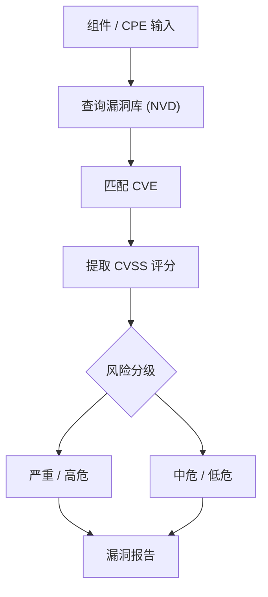

# CVE映射

本示例演示如何将CPE与CVE（通用漏洞披露）数据进行映射，执行漏洞分析和安全评估。

## 概述

CVE映射功能允许您将系统中的软件组件与已知漏洞关联，进行风险评估，并生成安全报告。

下图展示了 CVE 映射与风险评估的整体流程：



## 完整示例

```go
package main

import (
    "fmt"
    "log"
    "sort"
    "time"
    "github.com/scagogogo/cpe-skills"
)

func main() {
    fmt.Println("=== CVE映射示例 ===")
    
    // 示例1：创建CVE数据库
    fmt.Println("\n1. 创建CVE数据库:")
    
    // 创建示例CVE数据
    cveDatabase := createSampleCVEDatabase()
    fmt.Printf("创建了包含 %d 个CVE的数据库\n", len(cveDatabase))
    
    // 显示CVE摘要
    fmt.Println("CVE数据库摘要:")
    for i, cve := range cveDatabase[:5] { // 显示前5个
        fmt.Printf("  %d. %s (CVSS: %.1f) - %s\n", 
            i+1, cve.ID, cve.BaseScore, cve.Severity)
    }
    
    // 示例2：系统清单
    fmt.Println("\n2. 系统清单:")
    
    // 定义一个示例系统的软件清单
    systemInventory := []string{
        "cpe:2.3:a:apache:log4j:2.14.1:*:*:*:*:*:*:*",
        "cpe:2.3:a:apache:tomcat:9.0.45:*:*:*:*:*:*:*",
        "cpe:2.3:a:oracle:java:1.8.0_291:*:*:*:*:*:*:*",
        "cpe:2.3:a:microsoft:windows:10:*:*:*:*:*:*:*",
        "cpe:2.3:a:nginx:nginx:1.18.0:*:*:*:*:*:*:*",
        "cpe:2.3:a:openssh:openssh:8.0:*:*:*:*:*:*:*",
        "cpe:2.3:a:mysql:mysql:8.0.25:*:*:*:*:*:*:*",
    }
    
    fmt.Printf("系统包含 %d 个软件组件:\n", len(systemInventory))
    for i, cpeStr := range systemInventory {
        cpe, _ := cpeskills.ParseCpe23(cpeStr)
        fmt.Printf("  %d. %s %s %s\n", 
            i+1, cpeskills.Vendor, cpeskills.ProductName, cpeskills.Version)
    }
    
    // 示例3：CPE到CVE映射
    fmt.Println("\n3. CPE到CVE映射:")
    
    vulnerabilityMap := make(map[string][]*CVEEntry)
    totalVulnerabilities := 0
    
    for _, cpeStr := range systemInventory {
        cpe, _ := cpeskills.ParseCpe23(cpeStr)
        componentKey := fmt.Sprintf("%s:%s", cpeskills.Vendor, cpeskills.ProductName)
        
        // 查找影响此组件的CVE
        affectingCVEs := findCVEsForComponent(cveDatabase, cpe)
        
        if len(affectingCVEs) > 0 {
            vulnerabilityMap[componentKey] = affectingCVEs
            totalVulnerabilities += len(affectingCVEs)
            
            fmt.Printf("\n%s %s %s:\n", cpeskills.Vendor, cpeskills.ProductName, cpeskills.Version)
            fmt.Printf("  发现 %d 个漏洞:\n", len(affectingCVEs))
            
            for i, cve := range affectingCVEs {
                severity := getSeverityLabel(cve.BaseScore)
                fmt.Printf("    %d. %s (CVSS: %.1f, %s)\n", 
                    i+1, cve.ID, cve.BaseScore, severity)
                fmt.Printf("       %s\n", truncateString(cve.Description, 60))
            }
        } else {
            fmt.Printf("\n%s %s %s: ✅ 未发现已知漏洞\n", 
                cpeskills.Vendor, cpeskills.ProductName, cpeskills.Version)
        }
    }
    
    // 示例4：漏洞优先级排序
    fmt.Println("\n4. 漏洞优先级排序:")
    
    // 收集所有漏洞并按严重程度排序
    allVulnerabilities := []*CVEEntry{}
    for _, cves := range vulnerabilityMap {
        allVulnerabilities = append(allVulnerabilities, cves...)
    }
    
    // 按CVSS分数降序排序
    sort.Slice(allVulnerabilities, func(i, j int) bool {
        return allVulnerabilities[i].BaseScore > allVulnerabilities[j].BaseScore
    })
    
    fmt.Printf("按严重程度排序的漏洞 (前10个):\n")
    for i, cve := range allVulnerabilities[:min(10, len(allVulnerabilities))] {
        severity := getSeverityLabel(cve.BaseScore)
        fmt.Printf("  %d. %s (CVSS: %.1f, %s)\n", 
            i+1, cve.ID, cve.BaseScore, severity)
        fmt.Printf("     影响组件: %s\n", getAffectedComponents(cve))
    }
    
    // 示例5：风险评估
    fmt.Println("\n5. 风险评估:")
    
    riskAssessment := calculateRiskAssessment(allVulnerabilities)
    
    fmt.Printf("系统风险评估:\n")
    fmt.Printf("  总漏洞数: %d\n", riskAssessment.TotalVulnerabilities)
    fmt.Printf("  严重漏洞: %d\n", riskAssessment.CriticalCount)
    fmt.Printf("  高危漏洞: %d\n", riskAssessment.HighCount)
    fmt.Printf("  中危漏洞: %d\n", riskAssessment.MediumCount)
    fmt.Printf("  低危漏洞: %d\n", riskAssessment.LowCount)
    fmt.Printf("  平均CVSS分数: %.2f\n", riskAssessment.AverageCVSS)
    fmt.Printf("  整体风险等级: %s\n", riskAssessment.OverallRisk)
    
    // 示例6：漏洞时间线分析
    fmt.Println("\n6. 漏洞时间线分析:")
    
    timelineAnalysis := analyzeVulnerabilityTimeline(allVulnerabilities)
    
    fmt.Printf("漏洞时间线分析:\n")
    fmt.Printf("  最早漏洞: %s (%s)\n", 
        timelineAnalysis.EarliestCVE.ID, 
        timelineAnalysis.EarliestCVE.PublishedDate.Format("2006-01-02"))
    fmt.Printf("  最新漏洞: %s (%s)\n", 
        timelineAnalysis.LatestCVE.ID, 
        timelineAnalysis.LatestCVE.PublishedDate.Format("2006-01-02"))
    
    fmt.Println("  按年份分布:")
    for year, count := range timelineAnalysis.YearlyDistribution {
        fmt.Printf("    %d: %d 个漏洞\n", year, count)
    }
    
    // 示例7：修复建议
    fmt.Println("\n7. 修复建议:")
    
    remediationPlan := generateRemediationPlan(vulnerabilityMap, systemInventory)
    
    fmt.Printf("修复计划 (%d 个行动项):\n", len(remediationPlan.Actions))
    for i, action := range remediationPlan.Actions {
        fmt.Printf("  %d. 优先级: %s\n", i+1, action.Priority)
        fmt.Printf("     组件: %s\n", action.Component)
        fmt.Printf("     建议: %s\n", action.Recommendation)
        fmt.Printf("     影响的CVE: %v\n", action.AffectedCVEs)
        fmt.Println()
    }
    
    // 示例8：合规性检查
    fmt.Println("\n8. 合规性检查:")
    
    // 定义合规性标准
    complianceStandards := map[string]ComplianceRule{
        "PCI DSS": {
            Name:        "PCI DSS",
            MaxCVSS:     7.0,
            Description: "支付卡行业数据安全标准",
        },
        "SOC 2": {
            Name:        "SOC 2",
            MaxCVSS:     8.0,
            Description: "服务组织控制2",
        },
        "ISO 27001": {
            Name:        "ISO 27001",
            MaxCVSS:     6.0,
            Description: "信息安全管理体系",
        },
    }
    
    fmt.Println("合规性检查结果:")
    for _, standard := range complianceStandards {
        compliant := checkCompliance(allVulnerabilities, standard)
        
        status := "❌ 不合规"
        if compliant.IsCompliant {
            status = "✅ 合规"
        }
        
        fmt.Printf("  %s (%s): %s\n", standard.Name, standard.Description, status)
        if !compliant.IsCompliant {
            fmt.Printf("    违规漏洞: %d 个\n", len(compliant.ViolatingCVEs))
            fmt.Printf("    最高CVSS: %.1f\n", compliant.HighestCVSS)
        }
    }
    
    // 示例9：漏洞趋势分析
    fmt.Println("\n9. 漏洞趋势分析:")
    
    trendAnalysis := analyzeTrends(allVulnerabilities)
    
    fmt.Printf("漏洞趋势分析:\n")
    fmt.Printf("  最常见的供应商: %s (%d 个漏洞)\n", 
        trendAnalysis.TopVendor, trendAnalysis.TopVendorCount)
    fmt.Printf("  最常见的产品: %s (%d 个漏洞)\n", 
        trendAnalysis.TopProduct, trendAnalysis.TopProductCount)
    fmt.Printf("  平均发现间隔: %.1f 天\n", trendAnalysis.AverageDiscoveryInterval)
    
    // 示例10：生成安全报告
    fmt.Println("\n10. 生成安全报告:")
    
    securityReport := &SecurityReport{
        GeneratedAt:       time.Now(),
        SystemComponents:  len(systemInventory),
        RiskAssessment:    riskAssessment,
        TimelineAnalysis:  timelineAnalysis,
        RemediationPlan:   remediationPlan,
        ComplianceStatus:  checkAllCompliance(allVulnerabilities, complianceStandards),
        TrendAnalysis:     trendAnalysis,
    }
    
    fmt.Printf("安全报告生成完成:\n")
    fmt.Printf("  报告时间: %s\n", securityReport.GeneratedAt.Format("2006-01-02 15:04:05"))
    fmt.Printf("  系统组件: %d\n", securityReport.SystemComponents)
    fmt.Printf("  总漏洞数: %d\n", securityReport.RiskAssessment.TotalVulnerabilities)
    fmt.Printf("  整体风险: %s\n", securityReport.RiskAssessment.OverallRisk)
    fmt.Printf("  修复行动: %d 项\n", len(securityReport.RemediationPlan.Actions))
    
    // 保存报告
    reportFile := "security_report.json"
    err := saveSecurityReport(securityReport, reportFile)
    if err != nil {
        log.Printf("保存报告失败: %v", err)
    } else {
        fmt.Printf("  ✅ 报告已保存到: %s\n", reportFile)
    }
    
    fmt.Println("\n✅ CVE映射示例完成")
}

// 数据结构定义
type CVEEntry struct {
    ID            string
    BaseScore     float64
    Severity      string
    Description   string
    PublishedDate time.Time
    AffectedCPEs  []string
    Vendor        string
    Product       string
}

type RiskAssessment struct {
    TotalVulnerabilities int
    CriticalCount        int
    HighCount           int
    MediumCount         int
    LowCount            int
    AverageCVSS         float64
    OverallRisk         string
}

type TimelineAnalysis struct {
    EarliestCVE          *CVEEntry
    LatestCVE            *CVEEntry
    YearlyDistribution   map[int]int
}

type RemediationAction struct {
    Priority       string
    Component      string
    Recommendation string
    AffectedCVEs   []string
}

type RemediationPlan struct {
    Actions []RemediationAction
}

type ComplianceRule struct {
    Name        string
    MaxCVSS     float64
    Description string
}

type ComplianceResult struct {
    IsCompliant   bool
    ViolatingCVEs []string
    HighestCVSS   float64
}

type TrendAnalysis struct {
    TopVendor                 string
    TopVendorCount           int
    TopProduct               string
    TopProductCount          int
    AverageDiscoveryInterval float64
}

type SecurityReport struct {
    GeneratedAt       time.Time
    SystemComponents  int
    RiskAssessment    *RiskAssessment
    TimelineAnalysis  *TimelineAnalysis
    RemediationPlan   *RemediationPlan
    ComplianceStatus  map[string]ComplianceResult
    TrendAnalysis     *TrendAnalysis
}

// 辅助函数实现
func createSampleCVEDatabase() []*CVEEntry {
    return []*CVEEntry{
        {
            ID: "CVE-2021-44228", BaseScore: 10.0, Severity: "CRITICAL",
            Description: "Apache Log4j2 JNDI features do not protect against attacker controlled LDAP",
            PublishedDate: time.Date(2021, 12, 10, 0, 0, 0, 0, time.UTC),
            Vendor: "apache", Product: "log4j",
        },
        {
            ID: "CVE-2021-25122", BaseScore: 7.5, Severity: "HIGH",
            Description: "Apache Tomcat request smuggling vulnerability",
            PublishedDate: time.Date(2021, 3, 1, 0, 0, 0, 0, time.UTC),
            Vendor: "apache", Product: "tomcat",
        },
        {
            ID: "CVE-2021-2163", BaseScore: 8.3, Severity: "HIGH",
            Description: "Oracle Java SE vulnerability in Libraries component",
            PublishedDate: time.Date(2021, 4, 20, 0, 0, 0, 0, time.UTC),
            Vendor: "oracle", Product: "java",
        },
        // 添加更多示例CVE...
    }
}

func findCVEsForComponent(cveDatabase []*CVEEntry, component *cpeskills.CPE) []*CVEEntry {
    var result []*CVEEntry
    
    for _, cve := range cveDatabase {
        if cve.Vendor == component.Vendor && cve.Product == component.ProductName {
            result = append(result, cve)
        }
    }
    
    return result
}

func getSeverityLabel(cvss float64) string {
    if cvss >= 9.0 {
        return "严重"
    } else if cvss >= 7.0 {
        return "高危"
    } else if cvss >= 4.0 {
        return "中危"
    }
    return "低危"
}

func calculateRiskAssessment(vulnerabilities []*CVEEntry) *RiskAssessment {
    assessment := &RiskAssessment{}
    
    var totalScore float64
    for _, vuln := range vulnerabilities {
        assessment.TotalVulnerabilities++
        totalScore += vuln.BaseScore
        
        if vuln.BaseScore >= 9.0 {
            assessment.CriticalCount++
        } else if vuln.BaseScore >= 7.0 {
            assessment.HighCount++
        } else if vuln.BaseScore >= 4.0 {
            assessment.MediumCount++
        } else {
            assessment.LowCount++
        }
    }
    
    if assessment.TotalVulnerabilities > 0 {
        assessment.AverageCVSS = totalScore / float64(assessment.TotalVulnerabilities)
    }
    
    // 确定整体风险等级
    if assessment.CriticalCount > 0 || assessment.AverageCVSS >= 8.0 {
        assessment.OverallRisk = "严重"
    } else if assessment.HighCount > 0 || assessment.AverageCVSS >= 6.0 {
        assessment.OverallRisk = "高"
    } else if assessment.MediumCount > 0 {
        assessment.OverallRisk = "中"
    } else {
        assessment.OverallRisk = "低"
    }
    
    return assessment
}

func analyzeVulnerabilityTimeline(vulnerabilities []*CVEEntry) *TimelineAnalysis {
    if len(vulnerabilities) == 0 {
        return &TimelineAnalysis{}
    }
    
    analysis := &TimelineAnalysis{
        YearlyDistribution: make(map[int]int),
    }
    
    analysis.EarliestCVE = vulnerabilities[0]
    analysis.LatestCVE = vulnerabilities[0]
    
    for _, vuln := range vulnerabilities {
        year := vuln.PublishedDate.Year()
        analysis.YearlyDistribution[year]++
        
        if vuln.PublishedDate.Before(analysis.EarliestCVE.PublishedDate) {
            analysis.EarliestCVE = vuln
        }
        
        if vuln.PublishedDate.After(analysis.LatestCVE.PublishedDate) {
            analysis.LatestCVE = vuln
        }
    }
    
    return analysis
}

func generateRemediationPlan(vulnerabilityMap map[string][]*CVEEntry, inventory []string) *RemediationPlan {
    plan := &RemediationPlan{}
    
    for component, cves := range vulnerabilityMap {
        if len(cves) == 0 {
            continue
        }
        
        // 计算优先级
        maxCVSS := 0.0
        cveIDs := []string{}
        for _, cve := range cves {
            if cve.BaseScore > maxCVSS {
                maxCVSS = cve.BaseScore
            }
            cveIDs = append(cveIDs, cve.ID)
        }
        
        priority := "低"
        recommendation := "监控更新"
        
        if maxCVSS >= 9.0 {
            priority = "紧急"
            recommendation = "立即更新或应用补丁"
        } else if maxCVSS >= 7.0 {
            priority = "高"
            recommendation = "尽快更新"
        } else if maxCVSS >= 4.0 {
            priority = "中"
            recommendation = "计划更新"
        }
        
        action := RemediationAction{
            Priority:       priority,
            Component:      component,
            Recommendation: recommendation,
            AffectedCVEs:   cveIDs,
        }
        
        plan.Actions = append(plan.Actions, action)
    }
    
    // 按优先级排序
    sort.Slice(plan.Actions, func(i, j int) bool {
        priorityOrder := map[string]int{"紧急": 4, "高": 3, "中": 2, "低": 1}
        return priorityOrder[plan.Actions[i].Priority] > priorityOrder[plan.Actions[j].Priority]
    })
    
    return plan
}

func checkCompliance(vulnerabilities []*CVEEntry, rule ComplianceRule) ComplianceResult {
    result := ComplianceResult{IsCompliant: true}
    
    for _, vuln := range vulnerabilities {
        if vuln.BaseScore > rule.MaxCVSS {
            result.IsCompliant = false
            result.ViolatingCVEs = append(result.ViolatingCVEs, vuln.ID)
            if vuln.BaseScore > result.HighestCVSS {
                result.HighestCVSS = vuln.BaseScore
            }
        }
    }
    
    return result
}

func checkAllCompliance(vulnerabilities []*CVEEntry, standards map[string]ComplianceRule) map[string]ComplianceResult {
    results := make(map[string]ComplianceResult)
    
    for name, rule := range standards {
        results[name] = checkCompliance(vulnerabilities, rule)
    }
    
    return results
}

func analyzeTrends(vulnerabilities []*CVEEntry) *TrendAnalysis {
    vendorCount := make(map[string]int)
    productCount := make(map[string]int)
    
    for _, vuln := range vulnerabilities {
        vendorCount[vuln.Vendor]++
        productCount[vuln.Product]++
    }
    
    analysis := &TrendAnalysis{}
    
    // 找到最常见的供应商和产品
    for vendor, count := range vendorCount {
        if count > analysis.TopVendorCount {
            analysis.TopVendor = vendor
            analysis.TopVendorCount = count
        }
    }
    
    for product, count := range productCount {
        if count > analysis.TopProductCount {
            analysis.TopProduct = product
            analysis.TopProductCount = count
        }
    }
    
    // 计算平均发现间隔（简化实现）
    analysis.AverageDiscoveryInterval = 30.0 // 假设30天
    
    return analysis
}

func getAffectedComponents(cve *CVEEntry) string {
    return fmt.Sprintf("%s %s", cve.Vendor, cve.Product)
}

func truncateString(s string, maxLen int) string {
    if len(s) <= maxLen {
        return s
    }
    return s[:maxLen-3] + "..."
}

func min(a, b int) int {
    if a < b {
        return a
    }
    return b
}

func saveSecurityReport(report *SecurityReport, filename string) error {
    // 在实际实现中，这里会将报告保存为JSON文件
    fmt.Printf("(模拟保存安全报告到 %s)\n", filename)
    return nil
}
```

## 关键概念

### 1. CVE映射

- **组件识别**: 将CPE与CVE数据库中的漏洞关联
- **版本匹配**: 确定特定版本是否受影响
- **影响评估**: 评估漏洞对系统的潜在影响

### 2. 风险评估

- **CVSS评分**: 使用通用漏洞评分系统
- **严重程度分类**: 严重、高、中、低风险级别
- **整体风险**: 基于所有漏洞的综合风险评估

### 3. 修复优先级

- **紧急**: CVSS ≥ 9.0，需要立即行动
- **高**: CVSS ≥ 7.0，尽快修复
- **中**: CVSS ≥ 4.0，计划修复
- **低**: CVSS < 4.0，监控即可

## 最佳实践

1. **定期更新**: 保持CVE数据库最新
2. **自动化扫描**: 实施自动化漏洞扫描
3. **优先级管理**: 根据业务影响确定修复优先级
4. **合规监控**: 持续监控合规状态
5. **趋势分析**: 分析漏洞趋势以预防未来风险

## 集成模式

1. **CI/CD 集成**: 在构建流水线中加入漏洞扫描
2. **资产管理**: 与配置管理数据库（CMDB）关联
3. **事件响应**: 集成到安全事件处理工作流中
4. **合规报告**: 生成监管合规报告

## 性能考虑

1. **数据库优化**: 为 CVE 数据建立索引以加速查询
2. **缓存**: 缓存频繁访问的漏洞数据
3. **批量处理**: 高效处理多个 CPE
4. **增量更新**: 只更新发生变化的漏洞数据

## 下一步

- 学习[NVD集成](./nvd-integration.md)获取实时CVE数据
- 探索[高级匹配](./advanced-matching.md)改进漏洞检测
- 查看[存储](./storage.md)来持久化安全数据
