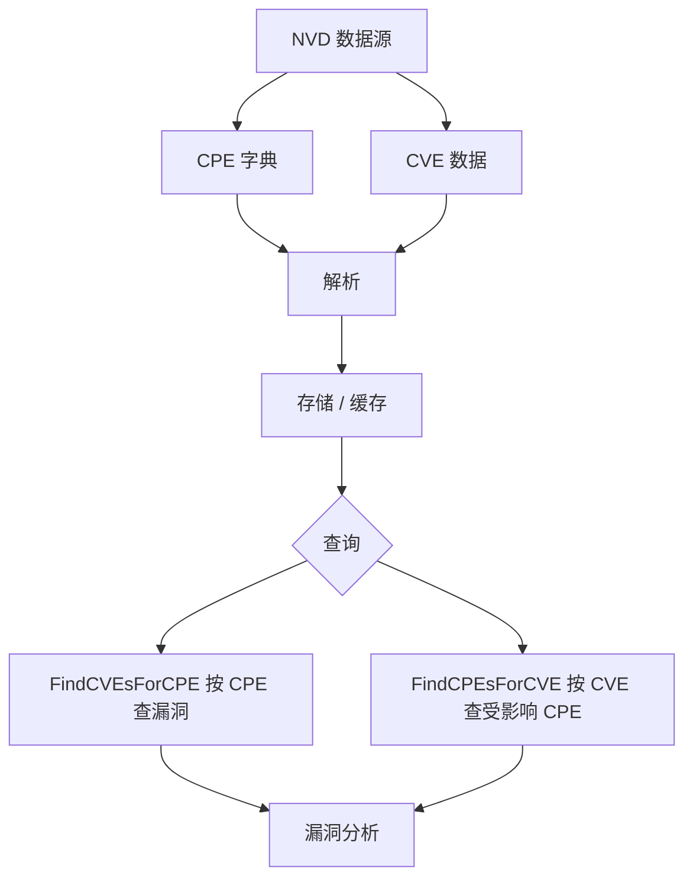

# NVD 集成

本示例演示如何与美国国家漏洞数据库（NVD）集成，下载 CPE 字典和漏洞数据，并执行安全分析。

## 概述

NVD 集成功能允许您从官方来源获取最新的 CPE 字典和 CVE 数据，进行漏洞评估和安全分析。

下图展示了 NVD 数据从下载到查询与分析的整体流转过程：



## 完整示例

```go
package main

import (
    "fmt"
    "log"
    "time"

    "github.com/scagogogo/cpe-skills"
)

func main() {
    fmt.Println("=== NVD集成示例 ===")

    // 示例1：配置NVD数据下载选项。
    // NVDFeedOptions用于控制缓存、并发数以及下载时使用的HTTP客户端。
    // 通常以默认值为起点，再按需调整。
    fmt.Println("\n1. 配置NVD数据下载选项:")

    options := cpeskills.DefaultNVDFeedOptions()
    options.CacheDir = "./nvd_cache" // 下载的数据存放目录
    options.CacheMaxAge = 24         // 缓存24小时后视为过期
    options.MaxConcurrentDownloads = 2
    options.ShowProgress = false

    fmt.Printf("缓存目录:           %s\n", options.CacheDir)
    fmt.Printf("缓存有效期:         %d 小时\n", options.CacheMaxAge)
    fmt.Printf("最大并发下载数:     %d\n", options.MaxConcurrentDownloads)

    // 示例2：下载全部NVD数据（CPE字典 + CPE/CVE映射）。
    // DownloadAllNVDData会同时获取CPE字典与CPE匹配数据，返回打包了二者的NVDCPEData。
    // 该函数需要联网，这里仅记录错误，并在失败时回退到空数据集继续演示。
    fmt.Println("\n2. 下载NVD数据:")

    fmt.Println("正在从NVD下载CPE字典与CPE/CVE映射...")
    nvdData, err := cpeskills.DownloadAllNVDData(options)
    if err != nil {
        log.Printf("下载NVD数据失败: %v", err)
        // 回退到空数据集，使后续示例在不联网的情况下也能编译运行。
        nvdData = &cpeskills.NVDCPEData{
            CPEDictionary: &cpeskills.CPEDictionary{
                Items:         []*cpeskills.CPEItem{},
                GeneratedAt:   time.Now(),
                SchemaVersion: "2.3",
            },
            CPEMatchData: &cpeskills.CPEMatchData{
                CVEToCPEs: map[string][]string{},
                CPEToCVEs: map[string][]string{},
            },
            DownloadTime: time.Now(),
        }
    } else {
        fmt.Printf("下载完成，包含 %d 个CPE条目（schema %s）\n",
            len(nvdData.CPEDictionary.Items), nvdData.CPEDictionary.SchemaVersion)
        fmt.Printf("数据下载时间: %s\n", nvdData.DownloadTime.Format(time.RFC3339))
    }

    // 示例3：查看CPE字典内容。
    fmt.Println("\n3. 查看CPE字典:")

    dict := nvdData.CPEDictionary
    fmt.Printf("字典生成时间:   %s\n", dict.GeneratedAt.Format("2006-01-02"))
    fmt.Printf("规范版本:       %s\n", dict.SchemaVersion)
    fmt.Printf("条目总数:       %d\n", len(dict.Items))

    // 展示若干字典条目（标题、名称和第一个参考链接URL）
    shown := 0
    for _, item := range dict.Items {
        if item.Deprecated {
            continue
        }
        fmt.Printf("  - %s\n", item.Title)
        fmt.Printf("    %s\n", item.Name)
        if len(item.References) > 0 {
            fmt.Printf("    参考: %s\n", item.References[0].URL)
        }
        shown++
        if shown >= 3 {
            break
        }
    }
    if shown == 0 {
        fmt.Println("  （没有可用的未弃用条目）")
    }

    // 示例4：按CPE查询其相关CVE。
    fmt.Println("\n4. 按CPE查询CVE:")

    tomcatCPE, err := cpeskills.ParseCpe23("cpe:2.3:a:apache:tomcat:9.0.0:*:*:*:*:*:*:*")
    if err != nil {
        log.Fatalf("解析CPE失败: %v", err)
    }

    cves := nvdData.FindCVEsForCPE(tomcatCPE)
    fmt.Printf("为 %s 找到 %d 个CVE\n", tomcatCPE.Cpe23, len(cves))
    for i, cveID := range cves {
        if i >= 5 {
            fmt.Printf("  ... 还有 %d 个\n", len(cves)-5)
            break
        }
        fmt.Printf("  %d. %s\n", i+1, cveID)
    }

    // 示例5：按CVE查询受影响的CPE。
    fmt.Println("\n5. 按CVE查询受影响的CPE:")

    log4Shell := "CVE-2021-44228"
    affectedCPEs := nvdData.FindCPEsForCVE(log4Shell)
    fmt.Printf("%s 影响 %d 个CPE\n", log4Shell, len(affectedCPEs))
    for i, cpe := range affectedCPEs {
        if i >= 5 {
            fmt.Printf("  ... 还有 %d 个\n", len(affectedCPEs)-5)
            break
        }
        fmt.Printf("  %d. %s\n", i+1, cpe.Cpe23)
    }

    // 示例6：用NVD数据丰富CPE的漏洞信息。
    // EnrichCPEWithVulnerabilityData会把NVD中查到的第一个相关CVE ID
    // 写入CPE的Cve字段。
    fmt.Println("\n6. 丰富CPE的漏洞数据:")

    fmt.Printf("丰富前: Cve=%q\n", tomcatCPE.Cve)
    nvdData.EnrichCPEWithVulnerabilityData(tomcatCPE)
    fmt.Printf("丰富后: Cve=%q\n", tomcatCPE.Cve)

    // 示例7：对系统清单做漏洞评估。
    fmt.Println("\n7. 系统漏洞评估:")

    systemInventory := []string{
        "cpe:2.3:o:microsoft:windows:10:*:*:*:*:*:*:*",
        "cpe:2.3:a:apache:tomcat:8.5.0:*:*:*:*:*:*:*",
        "cpe:2.3:a:oracle:java:8.0.291:*:*:*:*:*:*:*",
        "cpe:2.3:a:mozilla:firefox:95.0:*:*:*:*:*:*:*",
    }

    fmt.Printf("系统清单: %d 个组件\n", len(systemInventory))

    totalVulns := 0
    for _, cpeStr := range systemInventory {
        cpe, err := cpeskills.ParseCpe23(cpeStr)
        if err != nil {
            log.Printf("  跳过无效CPE %q: %v", cpeStr, err)
            continue
        }
        vulns := nvdData.FindCVEsForCPE(cpe)
        totalVulns += len(vulns)
        fmt.Printf("  %s -> %d 个漏洞\n", cpeStr, len(vulns))
    }

    fmt.Printf("评估结果:\n")
    fmt.Printf("  漏洞总数: %d\n", totalVulns)

    // 示例8：仅下载CPE字典。
    // 当不需要CVE映射时，DownloadAndParseCPEDict比DownloadAllNVDData更省流量。
    fmt.Println("\n8. 仅下载CPE字典:")

    dictOnly, err := cpeskills.DownloadAndParseCPEDict(options)
    if err != nil {
        log.Printf("下载CPE字典失败: %v", err)
    } else {
        fmt.Printf("下载完成，包含 %d 个CPE条目\n", len(dictOnly.Items))
    }

    // 示例9：仅下载CPE匹配数据。
    fmt.Println("\n9. 仅下载CPE匹配数据:")

    matchData, err := cpeskills.DownloadAndParseCPEMatch(options)
    if err != nil {
        log.Printf("下载CPE匹配数据失败: %v", err)
    } else {
        fmt.Printf("CPE匹配数据: %d 条CVE->CPE映射，%d 条CPE->CVE映射\n",
            len(matchData.CVEToCPEs), len(matchData.CPEToCVEs))

        // CPEMatchData上的map可直接查询。
        for cveID, cpeURIs := range matchData.CVEToCPEs {
            fmt.Printf("  %s -> %d 个CPE\n", cveID, len(cpeURIs))
            break // 只展示一个示例
        }
    }

    fmt.Println("\n=== NVD集成示例结束 ===")
}
```

## 关键概念

### 1. NVD 数据源

- **CPE 字典**: 官方 CPE 名称和描述
- **CVE 数据**: 漏洞信息和影响的 CPE
- **CVSS 分数**: 漏洞严重程度评分
- **时间戳**: 发布和修改日期

### 2. API 集成

- **速率限制**: 遵守 NVD API 限制
- **缓存**: 减少 API 调用
- **增量更新**: 只下载新数据
- **错误处理**: 处理网络和 API 错误

### 3. 安全分析

- **漏洞匹配**: 将系统组件与已知漏洞匹配
- **风险评估**: 基于 CVSS 分数评估风险
- **报告生成**: 创建安全评估报告
- **合规检查**: 验证 CPE 的官方状态

## 最佳实践

1. **使用 API 密钥**: 获取更高的速率限制
2. **启用缓存**: 减少重复的 API 调用
3. **定期更新**: 保持漏洞数据最新
4. **批量处理**: 高效处理大量 CPE
5. **错误恢复**: 实现重试和降级机制

## 性能优化

1. **批量处理**: 将多个 CPE 一起处理
2. **并行下载**: 对大型数据集使用并发下载
3. **本地存储**: 将频繁访问的数据存储在本地
4. **压缩**: 压缩缓存数据以节省空间

## 安全性考虑

1. **数据校验**: 校验下载数据的完整性
2. **安全存储**: 保护缓存的漏洞数据
3. **访问控制**: 限制对敏感漏洞信息的访问
4. **更新验证**: 验证更新来源的真实性

## 下一步

- 学习[CVE 映射](./cve-mapping.md)进行详细的漏洞分析
- 探索[存储](./storage.md)来持久化 NVD 数据
- 查看[高级匹配](./advanced-matching.md)来改进漏洞检测
