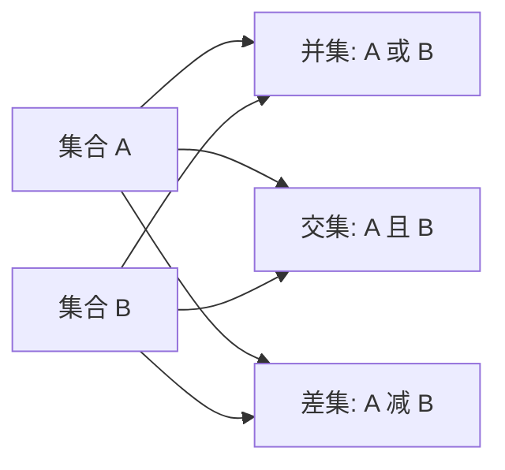
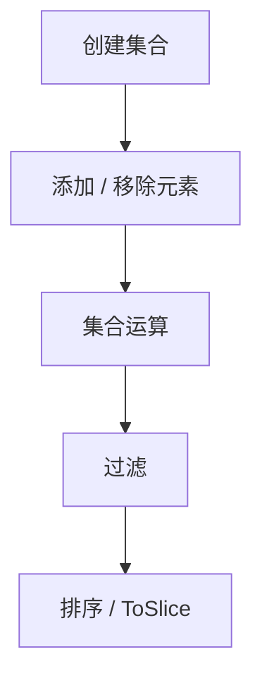

# CPE 集合

本示例演示如何使用 CPE 集合功能处理 CPE 对象集合，进行高效的批量操作。

## 概述

CPE 集合提供了一种强大的方式来管理 CPE 对象集合，执行集合操作（并集、交集、差集），并应用批量转换和过滤器。

下图展示了两个 CPE 集合 A 与 B 在三种集合运算下的组合方式，每种运算各自产生一个结果集合。



集合通常经过一条处理管线：创建集合、添加或移除元素、执行集合运算、过滤，最后排序或提取结果。



## 完整示例

```go
package main

import (
    "fmt"
    "log"

    "github.com/scagogogo/cpe-skills"
)

// parseAll 解析一组 CPE 2.3 字符串为 CPE 对象，解析失败者跳过。
// 返回成功解析的对象。
func parseAll(strs []string) []*cpeskills.CPE {
    var out []*cpeskills.CPE
    for _, s := range strs {
        c, err := cpeskills.ParseCpe23(s)
        if err != nil {
            log.Printf("解析 %s 失败: %v", s, err)
            continue
        }
        out = append(out, c)
    }
    return out
}

// printSet 按 ToSlice 返回的顺序打印集合中的每个 CPE。
func printSet(label string, s *cpeskills.CPESet) {
    fmt.Printf("%s (大小: %d):\n", label, s.Size())
    for _, c := range s.ToSlice() {
        fmt.Printf("  - %s\n", c.GetURI())
    }
}

func main() {
    fmt.Println("=== CPE 集合示例 ===")

    // 示例1：创建 CPE 集合
    fmt.Println("\n1. 创建 CPE 集合:")

    cpeStrings := []string{
        "cpe:2.3:a:microsoft:windows:10:*:*:*:*:*:*:*",
        "cpe:2.3:a:microsoft:office:2019:*:*:*:*:*:*:*",
        "cpe:2.3:a:apache:tomcat:9.0.0:*:*:*:*:*:*:*",
        "cpe:2.3:a:oracle:java:11.0.12:*:*:*:*:*:*:*",
        "cpe:2.3:o:canonical:ubuntu:20.04:*:*:*:*:*:*:*",
    }

    // 方法1：先解析字符串得到 CPE 切片，再用 FromArray 构建集合。
    // FromArray 接收 []*CPE 以及集合的名称和描述。
    set1 := cpeskills.FromArray(parseAll(cpeStrings), "set1", "所有解析的 CPE")
    fmt.Printf("集合1大小: %d\n", set1.Size())

    // 方法2：创建空集合（名称和描述为必填），再逐个 Add。
    set2 := cpeskills.NewCPESet("set2", "前三个 CPE")
    for _, c := range parseAll(cpeStrings[:3]) {
        set2.Add(c)
    }
    fmt.Printf("集合2大小: %d\n", set2.Size())

    // 方法3：从 CPE 对象的子切片构建集合。
    set3 := cpeskills.FromArray(parseAll(cpeStrings[2:]), "set3", "后三个 CPE")
    fmt.Printf("集合3大小: %d\n", set3.Size())

    // 示例2：集合操作
    fmt.Println("\n2. 集合操作:")

    printSet("集合1", set1)
    printSet("集合2", set2)
    printSet("集合3", set3)

    // 并集：两个集合中的所有唯一项目。
    unionSet := set2.Union(set3)
    printSet("\n集合2和集合3的并集", unionSet)

    // 交集：两个集合中都存在的项目。
    intersectionSet := set1.Intersection(set2)
    printSet("\n集合1和集合2的交集", intersectionSet)

    // 差集：第一个集合中有但第二个集合中没有的项目。
    differenceSet := set1.Difference(set2)
    printSet("\n集合1 - 集合2的差集", differenceSet)

    // 示例3：过滤集合
    fmt.Println("\n3. 过滤集合:")

    // 为过滤示例构建一个更大的集合。
    largeSetStrings := []string{
        "cpe:2.3:a:microsoft:windows:10:*:*:*:*:*:*:*",
        "cpe:2.3:a:microsoft:office:2019:*:*:*:*:*:*:*",
        "cpe:2.3:a:microsoft:edge:95.0.1020.44:*:*:*:*:*:*:*",
        "cpe:2.3:a:apache:tomcat:9.0.0:*:*:*:*:*:*:*",
        "cpe:2.3:a:apache:http_server:2.4.41:*:*:*:*:*:*:*",
        "cpe:2.3:a:oracle:java:11.0.12:*:*:*:*:*:*:*",
        "cpe:2.3:a:oracle:mysql:8.0.26:*:*:*:*:*:*:*",
        "cpe:2.3:o:canonical:ubuntu:20.04:*:*:*:*:*:*:*",
        "cpe:2.3:o:microsoft:windows:10:*:*:*:*:*:*:*",
        "cpe:2.3:h:cisco:catalyst_2960:*:*:*:*:*:*:*:*",
    }
    largeSet := cpeskills.FromArray(parseAll(largeSetStrings), "largeSet", "过滤演示集合")
    fmt.Printf("大集合大小: %d\n", largeSet.Size())

    // Filter 接收一个条件 CPE 和 MatchOptions。条件中为空或 "*"
    // 的字段作为通配符，因此只设置 Vendor 即可匹配该供应商的全部 CPE。
    // IgnoreVersion 使版本不参与比较。
    msOpts := &cpeskills.MatchOptions{IgnoreVersion: true}

    microsoftCPE := &cpeskills.CPE{Vendor: cpeskills.Vendor("microsoft")}
    printSet("\nMicrosoft CPE", largeSet.Filter(microsoftCPE, msOpts))

    // 按部件过滤（仅应用程序）。Part 是结构体，仅 ShortName 参与匹配。
    appCPE := &cpeskills.CPE{Part: cpeskills.Part{ShortName: "a"}}
    printSet("\n应用程序 CPE", largeSet.Filter(appCPE, msOpts))

    // 按产品/供应商模式过滤。Apache 有两个产品，因此使用正则匹配。
    apacheOpts := &cpeskills.MatchOptions{IgnoreVersion: true, UseRegex: true}
    apacheCPE := &cpeskills.CPE{ProductName: cpeskills.Product("apache")}
    // 仅靠供应商 "apache" 无法匹配 http_server，因此改为用正则匹配供应商字段。
    apacheVendor := &cpeskills.CPE{Vendor: cpeskills.Vendor("apache")}
    printSet("\nApache CPE", largeSet.Filter(apacheVendor, apacheOpts))
    _ = apacheCPE // 演示 Product 字段的用法

    // 示例4：遍历与聚合
    fmt.Println("\n4. 遍历与聚合:")

    // 库中没有内置的 Map/GroupBy；用普通 Go 的 map 和切片遍历
    // ToSlice() 来聚合即可。
    vendorGroups := make(map[string][]*cpeskills.CPE)
    for _, c := range largeSet.ToSlice() {
        vendorGroups[string(c.Vendor)] = append(vendorGroups[string(c.Vendor)], c)
    }

    fmt.Println("按供应商分组的 CPE:")
    for vendor, cpes := range vendorGroups {
        fmt.Printf("  %s (%d项):\n", vendor, len(cpes))
        for _, c := range cpes {
            fmt.Printf("    - %s\n", c.GetURI())
        }
    }

    // 收集去重后的供应商列表。
    uniqueVendors := make([]string, 0, len(vendorGroups))
    for v := range vendorGroups {
        uniqueVendors = append(uniqueVendors, v)
    }
    fmt.Printf("\n唯一供应商: %v\n", uniqueVendors)

    // 示例5：排序
    fmt.Println("\n5. 排序:")

    // Sort 返回排好序的 []*CPE 切片。sortBy 合法值为 "part"、
    // "vendor"、"product"、"version"；其他值回退为按 Cpe23 排序。
    sortedByProduct := largeSet.Sort("product", true)
    fmt.Println("按产品升序排序:")
    for _, c := range sortedByProduct {
        fmt.Printf("  - %s\n", c.GetURI())
    }

    // 示例6：集合比较
    fmt.Println("\n6. 集合比较:")

    setA := cpeskills.FromArray(parseAll([]string{
        "cpe:2.3:a:microsoft:windows:10:*:*:*:*:*:*:*",
        "cpe:2.3:a:microsoft:office:2019:*:*:*:*:*:*:*",
        "cpe:2.3:a:apache:tomcat:9.0.0:*:*:*:*:*:*:*",
    }), "setA", "比较集合 A")

    setB := cpeskills.FromArray(parseAll([]string{
        "cpe:2.3:a:microsoft:windows:10:*:*:*:*:*:*:*",
        "cpe:2.3:a:microsoft:office:2019:*:*:*:*:*:*:*",
        "cpe:2.3:a:oracle:java:11.0.12:*:*:*:*:*:*:*",
    }), "setB", "比较集合 B")

    fmt.Printf("集合A大小: %d\n", setA.Size())
    fmt.Printf("集合B大小: %d\n", setB.Size())

    // 检查相等性。
    fmt.Printf("集合相等: %t\n", setA.Equals(setB))

    // 检查子集/超集关系。
    fmt.Printf("集合A是集合B的子集: %t\n", setA.IsSubsetOf(setB))
    fmt.Printf("集合A是集合B的超集: %t\n", setA.IsSupersetOf(setB))

    // 通过集合操作查找公共元素和各自独有的元素。
    common := setA.Intersection(setB)
    uniqueA := setA.Difference(setB)
    uniqueB := setB.Difference(setA)
    fmt.Printf("公共元素: %d\n", common.Size())
    fmt.Printf("集合A独有: %d\n", uniqueA.Size())
    fmt.Printf("集合B独有: %d\n", uniqueB.Size())

    // ToString 输出整个集合的可读摘要。
    fmt.Printf("\n集合A摘要: %s\n", setA.ToString())
}
```

## 关键概念

### 1. 集合创建

- **从字符串**: 直接将 CPE 字符串解析为集合
- **从对象**: 从现有 CPE 对象创建集合
- **空集合**: 从空集合开始并添加项目

### 2. 集合操作

- **并集**: 合并两个集合 (A ∪ B)
- **交集**: 公共元素 (A ∩ B)
- **差集**: A 中有但 B 中没有的元素 (A - B)

### 3. 过滤和转换

- **过滤**: 根据条件选择子集
- **映射**: 转换每个元素
- **分组**: 按键组织元素

### 4. 集合分析

- **统计**: 按类型计算元素
- **比较**: 检查相等性和子集关系
- **聚合**: 汇总集合内容

## 最佳实践

1. **批量操作使用集合**: 比单个操作更高效
2. **早期过滤**: 在昂贵操作前应用过滤器以减少集合大小
3. **缓存结果**: 存储经常使用的过滤集合
4. **验证输入**: 添加到集合前检查 CPE 有效性
5. **监控内存**: 大集合可能消耗大量内存

## 性能提示

1. **批量操作**: 将多个操作组合在一起
2. **使用适当的数据结构**: 集合针对唯一性进行了优化
3. **并行处理**: 对独立的集合操作使用 goroutine
4. **延迟评估**: 延迟昂贵操作直到需要时

## 下一步

- 学习[高级匹配](./advanced-matching.md)与集合
- 探索[存储](./storage.md)来持久化大集合
- 查看[NVD 集成](./nvd-integration.md)了解实际数据集
