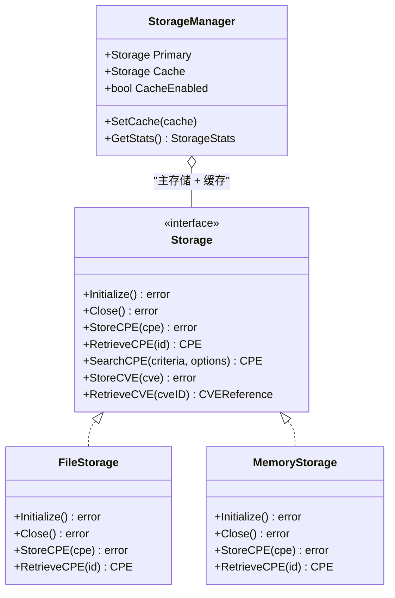

# 存储操作

本示例演示如何使用 CPE 库的存储功能来持久化 CPE 数据，包括文件存储、内存存储和存储管理器。

## 概述

CPE 存储功能提供了多种后端选项来持久化 CPE 数据，支持 CRUD 操作、CVE 关联查询和字典存储。

下图展示了存储架构，以及各具体后端与 `Storage` 接口之间的关系：



## 完整示例

```go
package main

import (
    "errors"
    "fmt"
    "log"
    "os"
    "time"
    "github.com/scagogogo/cpe-skills"
)

func main() {
    fmt.Println("=== CPE存储操作示例 ===")

    // 示例1：文件存储
    fmt.Println("\n1. 文件存储:")

    // 创建文件存储，启用缓存
    storage, err := cpeskills.NewFileStorage("./cpe_data", true)
    if err != nil {
        log.Fatal(err)
    }
    defer storage.Close()

    // 初始化存储
    err = storage.Initialize()
    if err != nil {
        log.Fatal(err)
    }

    fmt.Println("✅ 文件存储初始化成功")

    // 示例2：存储CPE数据
    fmt.Println("\n2. 存储CPE数据:")

    testCPEs := []string{
        "cpe:2.3:a:microsoft:windows:10:*:*:*:*:*:*:*",
        "cpe:2.3:a:apache:tomcat:9.0.0:*:*:*:*:*:*:*",
        "cpe:2.3:a:oracle:java:11.0.12:*:*:*:*:*:*:*",
        "cpe:2.3:o:canonical:ubuntu:20.04:*:*:*:*:*:*:*",
        "cpe:2.3:h:cisco:catalyst_2960:*:*:*:*:*:*:*:*",
    }

    for i, cpeStr := range testCPEs {
        cpeObj, err := cpeskills.ParseCpe23(cpeStr)
        if err != nil {
            log.Printf("解析CPE %s失败: %v", cpeStr, err)
            continue
        }

        err = storage.StoreCPE(cpeObj)
        if err != nil {
            log.Printf("存储CPE失败: %v", err)
        } else {
            fmt.Printf("  ✅ %d. 已存储: %s %s\n", i+1, cpeObj.Vendor, cpeObj.ProductName)
        }
    }

    // 示例3：检索CPE数据
    fmt.Println("\n3. 检索CPE数据:")

    retrieveID := "cpe:2.3:a:apache:tomcat:9.0.0:*:*:*:*:*:*:*"
    retrieved, err := storage.RetrieveCPE(retrieveID)
    if err != nil {
        if errors.Is(err, cpeskills.ErrNotFound) {
            log.Printf("CPE未找到: %s", retrieveID)
        } else {
            log.Printf("检索失败: %v", err)
        }
    } else {
        fmt.Printf("  ✅ 检索到: %s %s %s\n",
            retrieved.Vendor, retrieved.ProductName, retrieved.Version)
    }

    // 示例4：搜索CPE
    fmt.Println("\n4. 搜索CPE (Microsoft产品):")

    // 以Microsoft为条件搜索
    criteria := &cpeskills.CPE{
        Vendor: cpeskills.Vendor("microsoft"),
    }

    results, err := storage.SearchCPE(criteria, cpeskills.DefaultMatchOptions())
    if err != nil {
        log.Printf("搜索失败: %v", err)
    } else {
        fmt.Printf("找到 %d 个Microsoft产品:\n", len(results))
        for i, result := range results {
            fmt.Printf("  %d. %s\n", i+1, result.GetURI())
        }
    }

    // 示例5：高级搜索
    fmt.Println("\n5. 高级搜索 (应用程序):")

    // 以Part=Application为条件进行高级搜索
    advancedCriteria := &cpeskills.CPE{
        Part: *cpeskills.PartApplication,
    }

    advancedOptions := cpeskills.NewAdvancedMatchOptions()
    advancedOptions.MatchMode = "exact"

    advancedResults, err := storage.AdvancedSearchCPE(advancedCriteria, advancedOptions)
    if err != nil {
        log.Printf("高级搜索失败: %v", err)
    } else {
        fmt.Printf("找到 %d 个应用程序:\n", len(advancedResults))
        for i, result := range advancedResults {
            fmt.Printf("  %d. %s\n", i+1, result.GetURI())
        }
    }

    // 示例6：内存存储
    fmt.Println("\n6. 内存存储:")

    memStorage := cpeskills.NewMemoryStorage()
    err = memStorage.Initialize()
    if err != nil {
        log.Fatal(err)
    }

    // 将部分CPE存入内存
    for _, cpeStr := range testCPEs[:3] {
        cpeObj, _ := cpeskills.ParseCpe23(cpeStr)
        _ = memStorage.StoreCPE(cpeObj)
    }
    fmt.Printf("✅ 已将 %d 个CPE存入内存存储\n", 3)

    // 从内存检索
    memRetrieved, err := memStorage.RetrieveCPE(retrieveID)
    if err != nil {
        log.Printf("从内存检索失败: %v", err)
    } else {
        fmt.Printf("✅ 从内存检索到: %s\n", memRetrieved.GetURI())
    }

    // 示例7：存储管理器与统计
    fmt.Println("\n7. 存储管理器:")

    // 以文件存储为主、内存存储为缓存创建管理器
    manager := cpeskills.NewStorageManager(storage)
    manager.SetCache(memStorage)

    fmt.Println("✅ 存储管理器已创建 (文件为主，内存为缓存)")

    // 通过管理器获取统计信息
    stats, err := manager.GetStats()
    if err != nil {
        log.Printf("获取统计失败: %v", err)
    } else {
        fmt.Printf("存储统计:\n")
        fmt.Printf("  CPE总数: %d\n", stats.TotalCPEs)
        fmt.Printf("  CVE总数: %d\n", stats.TotalCVEs)
        fmt.Printf("  最后更新: %s\n", stats.LastUpdated.Format("2006-01-02 15:04:05"))
    }

    // 示例8：CVE存储与检索
    fmt.Println("\n8. CVE存储与检索:")

    // 创建一个示例CVE，使用真实字段名
    sampleCVE := &cpeskills.CVEReference{
        CVEID:       "CVE-2021-44228",
        Description: "Apache Log4j2 JNDI特征未对攻击者控制的LDAP等注入做防护",
        CVSSScore:   10.0,
        Severity:    "Critical",
    }
    // 关联受影响的CPE
    sampleCVE.AddAffectedCPE("cpe:2.3:a:apache:log4j:2.14:*:*:*:*:*:*:*")

    err = storage.StoreCVE(sampleCVE)
    if err != nil {
        log.Printf("存储CVE失败: %v", err)
    } else {
        fmt.Printf("✅ 已存储CVE: %s\n", sampleCVE.CVEID)
    }

    // 检索CVE
    retrievedCVE, err := storage.RetrieveCVE("CVE-2021-44228")
    if err != nil {
        log.Printf("检索CVE失败: %v", err)
    } else {
        fmt.Printf("✅ 检索到CVE: %s (CVSS: %.1f, 严重性: %s)\n",
            retrievedCVE.CVEID, retrievedCVE.CVSSScore, retrievedCVE.Severity)
    }

    // 示例9：CVE与CPE关联及字典
    fmt.Println("\n9. CVE与CPE关联:")

    // 将关联CVE也存入内存存储，以便通过CPE反查CVE
    _ = memStorage.StoreCVE(sampleCVE)

    // 通过CPE查找关联的CVE
    log4jCPE, _ := cpeskills.ParseCpe23("cpe:2.3:a:apache:log4j:2.14:*:*:*:*:*:*:*")
    relatedCVEs, err := memStorage.FindCVEsByCPE(log4jCPE)
    if err != nil {
        log.Printf("查找关联CVE失败: %v", err)
    } else {
        fmt.Printf("影响 log4j 的CVE (%d 个):\n", len(relatedCVEs))
        for i, cve := range relatedCVEs {
            fmt.Printf("  %d. %s (%.1f)\n", i+1, cve.CVEID, cve.CVSSScore)
        }
    }

    // 通过CVE查找关联的CPE
    relatedCPEs, err := memStorage.FindCPEsByCVE("CVE-2021-44228")
    if err != nil {
        log.Printf("查找关联CPE失败: %v", err)
    } else {
        fmt.Printf("CVE-2021-44228 影响的CPE (%d 个):\n", len(relatedCPEs))
        for i, c := range relatedCPEs {
            fmt.Printf("  %d. %s\n", i+1, c.GetURI())
        }
    }

    // 存储CPE字典
    dictionary := &cpeskills.CPEDictionary{
        Items: []*cpeskills.CPEItem{
            {
                Name:  "cpe:2.3:a:apache:log4j:2.14:*:*:*:*:*:*:*",
                Title: "Apache Log4j 2.14",
            },
        },
        GeneratedAt:    time.Now(),
        SchemaVersion: "2.3",
    }
    err = storage.StoreDictionary(dictionary)
    if err != nil {
        log.Printf("存储字典失败: %v", err)
    } else {
        fmt.Println("✅ CPE字典已存储")
    }

    // 示例10：更新、删除与清理
    fmt.Println("\n10. 更新、删除与清理:")

    // 更新CPE
    if retrieved != nil {
        updateCPE := retrieved
        updateCPE.Version = "9.0.0.1"
        err = storage.UpdateCPE(updateCPE)
        if err != nil {
            log.Printf("更新CPE失败: %v", err)
        } else {
            fmt.Printf("✅ 已更新CPE版本为: %s\n", updateCPE.Version)
        }
    }

    // 删除CPE
    deleteCPE, _ := cpeskills.ParseCpe23("cpe:2.3:h:cisco:catalyst_2960:*:*:*:*:*:*:*")
    err = storage.DeleteCPE(deleteCPE.GetURI())
    if err != nil {
        log.Printf("删除CPE失败: %v", err)
    } else {
        fmt.Printf("✅ 已删除CPE: %s\n", deleteCPE.GetURI())
    }

    // 清理存储目录
    defer func() {
        err := os.RemoveAll("./cpe_data")
        if err != nil {
            log.Printf("清理失败: %v", err)
        } else {
            fmt.Println("✅ 已清理存储目录")
        }
    }()

    fmt.Println("\n✅ 存储操作示例完成")
}
```

## 预期输出

```text
=== CPE存储操作示例 ===

1. 文件存储:
✅ 文件存储初始化成功

2. 存储CPE数据:
  ✅ 1. 已存储: microsoft windows
  ✅ 2. 已存储: apache tomcat
  ✅ 3. 已存储: oracle java
  ✅ 4. 已存储: canonical ubuntu
  ✅ 5. 已存储: cisco catalyst_2960

3. 检索CPE数据:
  ✅ 检索到: apache tomcat 9.0.0

...
```

## 关键概念

### 1. 存储后端

- **文件存储**: 基于文件系统，支持缓存
- **内存存储**: 快速访问，适用于测试
- **存储管理器**: 协调主存储与缓存后端

### 2. CRUD 操作

- **Create**: 存储新的 CPE 对象
- **Read**: 检索和查询 CPE 数据
- **Update**: 修改现有 CPE 对象
- **Delete**: 删除 CPE 对象

### 3. 高级功能

- **CVE关联**: 通过 `FindCVEsByCPE` / `FindCPEsByCVE` 在 CPE 与 CVE 之间双向查询
- **字典存储**: 通过 `StoreDictionary` / `RetrieveDictionary` 持久化 CPE 字典
- **高级搜索**: 使用 `AdvancedSearchCPE` 与 `AdvancedMatchOptions` 进行精细匹配
- **错误处理**: 用 `errors.Is(err, ErrNotFound)` 区分"未找到"与其他错误

### 4. 性能优化

- **缓存**: 通过 `StorageManager.SetCache` 为文件存储叠加内存缓存
- **搜索选项**: 合理设置 `SearchOptions` 的分页与过滤条件
- **匹配选项**: 使用 `DefaultMatchOptions` 简化常见匹配场景

## 最佳实践

1. **选择合适的存储后端**: 文件存储用于持久化，内存存储用于测试
2. **启用缓存**: 生产环境通过 `StorageManager` 叠加内存缓存
3. **区分错误**: 用 `errors.Is(err, ErrNotFound)` 处理"未找到"场景
4. **关闭存储**: 使用 `defer storage.Close()` 释放资源
5. **初始化存储**: 使用前务必调用 `Initialize()`

## 下一步

- 学习[NVD 集成](./nvd-integration.md)来存储大规模数据
- 探索[CPE 集合](./sets.md)进行批量存储操作
- 查看[高级匹配](./advanced-matching.md)来优化查询
