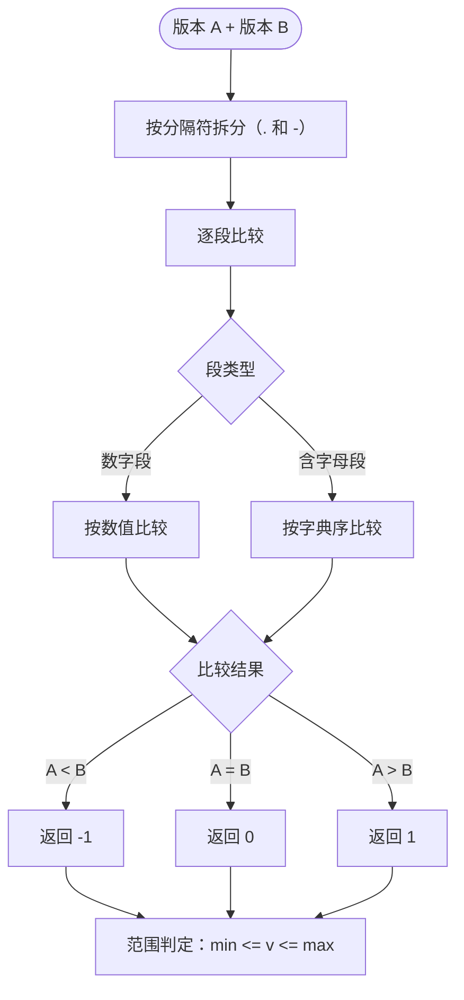

# 版本比较

本示例演示如何在 CPE 字符串中比较版本并执行基于版本的匹配操作。

## 概述

版本比较在处理 CPE 数据进行漏洞管理和软件清单时至关重要。CPE 库提供了多种方法来比较版本并确定兼容性。

下图展示了两个版本字符串如何逐段比较，以及比较结果如何用于范围判定：



## 完整示例

```go
package main

import (
    "fmt"
    "log"
    "sort"
    "strings"

    "github.com/scagogogo/cpe-skills"
)

// matchVersionPattern 检查具体版本是否匹配可能含 "*" 通配符的模式
// （如 "1.8.*" 匹配 "1.8.0_291"）。按 "." 分段，模式段为 "*" 即匹配，
// 否则需与目标对应段相等；模式比版本短时，只要其所有段都匹配前缀即可。
func matchVersionPattern(version, pattern string) bool {
    pSeg := strings.Split(pattern, ".")
    vSeg := strings.Split(version, ".")
    for i, p := range pSeg {
        if p == "*" {
            return true
        }
        if i >= len(vSeg) {
            return false
        }
        if p != vSeg[i] {
            return false
        }
    }
    return len(pSeg) >= len(vSeg)
}

func main() {
    fmt.Println("=== CPE版本比较示例 ===")

    // 示例1：基本版本比较
    fmt.Println("\n1. 基本版本比较:")

    versions := []string{
        "cpe:2.3:a:apache:tomcat:8.5.0:*:*:*:*:*:*:*",
        "cpe:2.3:a:apache:tomcat:8.5.1:*:*:*:*:*:*:*",
        "cpe:2.3:a:apache:tomcat:9.0.0:*:*:*:*:*:*:*",
        "cpe:2.3:a:apache:tomcat:9.0.1:*:*:*:*:*:*:*",
    }

    for i, versionStr := range versions {
        cpeObj, err := cpeskills.ParseCpe23(versionStr)
        if err != nil {
            log.Printf("解析失败 %s: %v", versionStr, err)
            continue
        }

        fmt.Printf("版本 %d: %s (版本: %s)\n", i+1, cpeObj.ProductName, cpeObj.Version)
    }

    // 示例2：版本范围匹配
    fmt.Println("\n2. 版本范围匹配:")

    targetVersion, _ := cpeskills.ParseCpe23("cpe:2.3:a:apache:tomcat:8.5.5:*:*:*:*:*:*:*")

    ranges := []struct {
        min         string
        max         string
        description string
    }{
        {"8.5.0", "8.5.10", "Tomcat 8.5.x 系列 (0-10)"},
        {"8.0.0", "9.0.0", "Tomcat 8.x 系列"},
        {"9.0.0", "10.0.0", "Tomcat 9.x 系列"},
    }

    for _, r := range ranges {
        // Version 是具名类型，传给 IsVersionInRange 前需转为 string。
        inRange := cpeskills.IsVersionInRange(string(targetVersion.Version), r.min, r.max)
        fmt.Printf("版本 %s 在范围 %s - %s (%s): %t\n",
            targetVersion.Version, r.min, r.max, r.description, inRange)
    }

    // 示例3：语义版本比较
    fmt.Println("\n3. 语义版本比较:")

    baseVersion := "8.5.0"
    compareVersions := []string{"8.4.9", "8.5.0", "8.5.1", "9.0.0"}

    for _, compareVer := range compareVersions {
        result := cpeskills.CompareVersions(baseVersion, compareVer)
        var relationship string
        switch result {
        case -1:
            relationship = "较旧"
        case 0:
            relationship = "相等"
        case 1:
            relationship = "较新"
        }

        fmt.Printf("%s 相对于 %s: %s\n", baseVersion, compareVer, relationship)
    }

    // 示例4：版本模式匹配
    fmt.Println("\n4. 版本模式匹配:")

    patterns := []string{
        "cpe:2.3:a:microsoft:windows:10:*:*:*:*:*:*:*",
        "cpe:2.3:a:microsoft:windows:11:*:*:*:*:*:*:*",
        "cpe:2.3:a:oracle:java:1.8.*:*:*:*:*:*:*:*",
        "cpe:2.3:a:oracle:java:11.*:*:*:*:*:*:*:*",
    }

    testCPEs := []string{
        "cpe:2.3:a:microsoft:windows:10:*:*:*:*:*:*:*",
        "cpe:2.3:a:oracle:java:1.8.0_291:*:*:*:*:*:*:*",
        "cpe:2.3:a:oracle:java:11.0.12:*:*:*:*:*:*:*",
    }

    for _, testCPE := range testCPEs {
        testObj, _ := cpeskills.ParseCpe23(testCPE)
        fmt.Printf("\n测试: %s\n", testCPE)

        for _, pattern := range patterns {
            patternObj, _ := cpeskills.ParseCpe23(pattern)
            // 仅比较 Version 字段，模式中的 "*" 通配符按段处理。
            if matchVersionPattern(string(testObj.Version), string(patternObj.Version)) {
                fmt.Printf("  ✓ 匹配模式: %s\n", pattern)
            }
        }
    }

    // 示例5：版本漏洞检查
    fmt.Println("\n5. 版本漏洞检查:")

    vulnerableRanges := []struct {
        product     string
        minVersion  string
        maxVersion  string
        description string
    }{
        {"tomcat", "8.5.0", "8.5.4", "CVE-2021-25122"},
        {"java", "1.8.0", "1.8.0_291", "CVE-2021-2163"},
        {"windows", "10.0.0", "10.0.19041", "CVE-2021-1675"},
    }

    checkCPEs := []string{
        "cpe:2.3:a:apache:tomcat:8.5.3:*:*:*:*:*:*:*",
        "cpe:2.3:a:oracle:java:1.8.0_281:*:*:*:*:*:*:*",
        "cpe:2.3:o:microsoft:windows:10.0.19042:*:*:*:*:*:*:*",
    }

    for _, checkCPE := range checkCPEs {
        cpeObj, _ := cpeskills.ParseCpe23(checkCPE)
        fmt.Printf("\n检查: %s\n", checkCPE)

        for _, vuln := range vulnerableRanges {
            // ProductName 是具名类型，与 string 比较前需转换。
            if string(cpeObj.ProductName) == vuln.product {
                isVulnerable := cpeskills.IsVersionInRange(string(cpeObj.Version), vuln.minVersion, vuln.maxVersion)
                if isVulnerable {
                    fmt.Printf("  ⚠️  存在漏洞: %s (版本 %s - %s)\n",
                        vuln.description, vuln.minVersion, vuln.maxVersion)
                } else {
                    fmt.Printf("  ✅ 不受 %s 影响\n", vuln.description)
                }
            }
        }
    }

    // 示例6：版本排序
    fmt.Println("\n6. 版本排序:")

    unsortedCPEs := []string{
        "cpe:2.3:a:apache:tomcat:9.0.1:*:*:*:*:*:*:*",
        "cpe:2.3:a:apache:tomcat:8.5.0:*:*:*:*:*:*:*",
        "cpe:2.3:a:apache:tomcat:9.0.0:*:*:*:*:*:*:*",
        "cpe:2.3:a:apache:tomcat:8.5.10:*:*:*:*:*:*:*",
        "cpe:2.3:a:apache:tomcat:10.0.0:*:*:*:*:*:*:*",
    }

    fmt.Println("未排序的版本:")
    for _, cpeStr := range unsortedCPEs {
        cpeObj, _ := cpeskills.ParseCpe23(cpeStr)
        fmt.Printf("  %s\n", cpeObj.Version)
    }

    // 用 sort.Slice + CompareVersions 升序排序。
    sort.Slice(unsortedCPEs, func(i, j int) bool {
        ci, _ := cpeskills.ParseCpe23(unsortedCPEs[i])
        cj, _ := cpeskills.ParseCpe23(unsortedCPEs[j])
        return cpeskills.CompareVersions(string(ci.Version), string(cj.Version)) < 0
    })

    fmt.Println("\n已排序的版本 (升序):")
    for _, cpeStr := range unsortedCPEs {
        cpeObj, _ := cpeskills.ParseCpe23(cpeStr)
        fmt.Printf("  %s\n", cpeObj.Version)
    }
}
```

## 预期输出

```text
=== CPE版本比较示例 ===

1. 基本版本比较:
版本 1: tomcat (版本: 8.5.0)
版本 2: tomcat (版本: 8.5.1)
版本 3: tomcat (版本: 9.0.0)
版本 4: tomcat (版本: 9.0.1)

2. 版本范围匹配:
版本 8.5.5 在范围 8.5.0 - 8.5.10 (Tomcat 8.5.x 系列 (0-10)): true
版本 8.5.5 在范围 8.0.0 - 9.0.0 (Tomcat 8.x 系列): true
版本 8.5.5 在范围 9.0.0 - 10.0.0 (Tomcat 9.x 系列): false

3. 语义版本比较:
8.5.0 相对于 8.4.9: 较新
8.5.0 相对于 8.5.0: 相等
8.5.0 相对于 8.5.1: 较旧
8.5.0 相对于 9.0.0: 较旧

...
```

## 关键概念

### 1. 版本比较类型

- **精确匹配**: 直接字符串比较
- **语义版本**: 理解版本层次结构 (major.minor.patch)
- **范围匹配**: 检查版本是否在范围内
- **模式匹配**: 使用通配符和模式

### 2. 版本格式

库支持各种版本格式：
- 语义版本: `1.2.3`
- 构建号: `1.8.0_291`
- 基于日期: `2021.03.15`
- 自定义格式: `10.0.19041.1234`

### 3. 漏洞评估

版本比较对以下方面至关重要：
- 识别易受攻击的软件版本
- 检查补丁级别
- 合规性验证
- 安全扫描

## 最佳实践

1. **规范化版本**: 比较前始终规范化版本字符串
2. **处理边界情况**: 考虑预发布、测试版和 RC 版本
3. **使用范围**: 定义漏洞范围而不是精确版本
4. **一致排序**: 对版本列表使用语义排序
5. **验证输入**: 处理前始终验证版本字符串

## 下一步

- 学习[高级匹配](./advanced-matching.md)处理复杂场景
- 探索[NVD 集成](./nvd-integration.md)获取漏洞数据
- 查看[CVE 映射](./cve-mapping.md)了解安全应用
