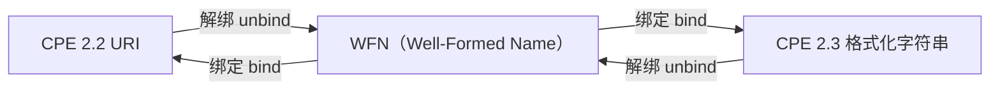

# WFN 转换

本示例演示如何在 CPE 格式和 Well-Formed Name（WFN）格式之间进行转换，以及如何使用 WFN 进行高效的处理和匹配操作。

## 概述

Well-Formed Name (WFN) 是 CPE 的内部标准表示格式，提供了一种规范化的方式来表示 CPE 组件，使匹配和比较操作更加高效和可靠。

下图以 WFN 为中心展示了三种格式的互转，绑定（bind）与解绑（unbind）操作在 WFN 与各外部表示之间转换：



## 完整示例

```go
package main

import (
    "fmt"
    "log"

    "github.com/scagogogo/cpe-skills"
)

func main() {
    fmt.Println("=== WFN 转换示例 ===")

    // 示例 1：CPE 到 WFN 转换
    fmt.Println("\n1. CPE 到 WFN 转换:")

    cpeStrings := []string{
        "cpe:2.3:a:microsoft:windows:10:*:*:*:*:*:*:*",
        "cpe:2.3:a:apache:tomcat:9.0.0:*:*:*:*:*:*:*",
        "cpe:/a:oracle:java:1.8.0_291",
        "cpe:2.3:o:linux:kernel:5.4.0:*:*:*:*:*:*:*",
    }

    for i, cpeStr := range cpeStrings {
        fmt.Printf("\n示例 %d: %s\n", i+1, cpeStr)

        // 解析 CPE 字符串（自动识别 2.2 / 2.3 格式）
        cpeObj, err := cpeskills.Parse(cpeStr)
        if err != nil {
            log.Printf("解析 CPE 失败: %v", err)
            continue
        }

        // 将 CPE 转换为 WFN
        wfn := cpeskills.FromCPE(cpeObj)

        fmt.Printf("  原始 CPE: %s\n", cpeStr)
        fmt.Printf("  WFN 格式: %s\n", wfn.WFNString())
        fmt.Printf("  部件:     %s\n", wfn.Get(cpeskills.AttrPart))
        fmt.Printf("  供应商:   %s\n", wfn.Get(cpeskills.AttrVendor))
        fmt.Printf("  产品:     %s\n", wfn.Get(cpeskills.AttrProduct))
        fmt.Printf("  版本:     %s\n", wfn.Get(cpeskills.AttrVersion))
    }

    // 示例 2：WFN 到 CPE 转换
    fmt.Println("\n2. WFN 到 CPE 转换:")

    // 手动创建 WFN（未设置的字符串字段通过 Get 读回为 ANY）
    wfn := &cpeskills.WFN{
        Part:    "a",
        Vendor:  "adobe",
        Product: "reader",
        Version: "2021.001.20150",
    }

    fmt.Printf("WFN: %s\n", wfn.WFNString())

    // 将 WFN 绑定为 CPE 2.3 格式化字符串
    fmt.Printf("CPE 2.3: %s\n", wfn.ToCPE23String())
    // 将 WFN 绑定为 CPE 2.2 URI
    fmt.Printf("CPE 2.2: %s\n", wfn.ToCPE22String())

    // 示例 3：WFN 属性值与 Get/Set
    fmt.Println("\n3. WFN 属性值:")

    w := cpeskills.NewWFN() // 所有属性默认为 ANY
    fmt.Printf("  空 WFN Get(product): %s（ANY 匹配任意值）\n", w.Get(cpeskills.AttrProduct))
    w.Set(cpeskills.AttrPart, cpeskills.PartApplicationShort)
    w.Set(cpeskills.AttrVendor, "microsoft")
    w.Set(cpeskills.AttrProduct, "windows")
    w.Set(cpeskills.AttrVersion, "10")
    w.Set(cpeskills.AttrUpdate, cpeskills.ValueNA) // NA = 不适用
    fmt.Printf("  Set 后: %s\n", w.WFNString())
    fmt.Printf("  ANY 常量: %q\n", cpeskills.ValueANY)
    fmt.Printf("  NA  常量: %q\n", cpeskills.ValueNA)

    // 示例 4：WFN 匹配
    fmt.Println("\n4. WFN 匹配:")

    // 源属性为 ANY (*) 时可匹配任意目标值
    sourceWFN := &cpeskills.WFN{
        Part:    "a",
        Vendor:  "microsoft",
        Product: cpeskills.ValueANY, // 任意产品
        Version: cpeskills.ValueANY, // 任意版本
    }

    targetWFNs := []*cpeskills.WFN{
        {Part: "a", Vendor: "microsoft", Product: "windows", Version: "10"},
        {Part: "a", Vendor: "microsoft", Product: "office", Version: "2019"},
        {Part: "a", Vendor: "oracle", Product: "java", Version: "11"},
        {Part: "o", Vendor: "microsoft", Product: "windows", Version: "10"},
    }

    fmt.Printf("源 WFN: %s\n", sourceWFN.WFNString())
    fmt.Println("匹配目标:")

    for i, targetWFN := range targetWFNs {
        match := sourceWFN.Match(targetWFN)
        status := "否"
        if match {
            status = "是"
        }
        fmt.Printf("  [%s] 目标 %d: %s\n", status, i+1, targetWFN.WFNString())
    }

    // 示例 5：WFN 校验（标识符名称检查）
    fmt.Println("\n5. WFN 校验:")

    validationTests := []struct {
        wfn  *cpeskills.WFN
        desc string
        want bool
    }{
        {
            &cpeskills.WFN{Part: "a", Vendor: "microsoft", Product: "windows"},
            "含部件、供应商、产品 => 是标识符",
            true,
        },
        {
            &cpeskills.WFN{Part: "x", Vendor: "microsoft", Product: "windows"},
            "仍是标识符（此处不校验部件取值）",
            true,
        },
        {
            &cpeskills.WFN{Part: "a", Vendor: "", Product: "windows"},
            "空供应商（ANY）不是标识符",
            false,
        },
        {
            &cpeskills.WFN{Part: "a", Vendor: "microsoft", Product: ""},
            "空产品（ANY）不是标识符",
            false,
        },
    }

    for i, test := range validationTests {
        isValid := test.wfn.IsIdentifierName()
        status := "通过"
        if isValid != test.want {
            status = "失败"
        }
        fmt.Printf("  [%s] 测试 %d: %s\n", status, i+1, test.desc)
        fmt.Printf("    WFN: %s\n", test.wfn.WFNString())
    }

    // 示例 6：绑定到外部格式
    fmt.Println("\n6. 绑定到外部格式:")

    bindWFN := &cpeskills.WFN{
        Part:    "a",
        Vendor:  "apache",
        Product: "tomcat",
        Version: "9.0.0",
    }
    fmt.Printf("  WFN:        %s\n", bindWFN.WFNString())
    fmt.Printf("  BindToFS:   %s\n", cpeskills.BindToFS(bindWFN))
    fmt.Printf("  BindToURI:  %s\n", cpeskills.BindToURI(bindWFN))

    // 反向解绑回 WFN
    roundTrip, err := cpeskills.UnbindFS(cpeskills.BindToFS(bindWFN))
    if err != nil {
        log.Printf("  UnbindFS 失败: %v", err)
    } else {
        fmt.Printf("  UnbindFS:   %s\n", roundTrip.WFNString())
    }

    // 示例 7：属性级比较
    fmt.Println("\n7. 属性级比较:")

    wfn1 := &cpeskills.WFN{Part: "a", Vendor: "apache", Product: "tomcat", Version: "9.0.0"}
    wfn2 := &cpeskills.WFN{Part: "a", Vendor: "apache", Product: "tomcat", Version: "9.0.1"}
    wfn3 := &cpeskills.WFN{Part: "a", Vendor: "apache", Product: "tomcat", Version: "9.0.0"}

    fmt.Printf("WFN1: %s\n", wfn1.WFNString())
    fmt.Printf("WFN2: %s\n", wfn2.WFNString())
    fmt.Printf("WFN3: %s\n", wfn3.WFNString())

    // CompareWFNs 返回每个属性的关系映射。
    // 取值含义：1=超集，0=相等，-1=子集，-2=不相交。
    cmp12 := cpeskills.CompareWFNs(wfn1, wfn2)
    cmp13 := cpeskills.CompareWFNs(wfn1, wfn3)
    fmt.Printf("WFN1 与 WFN2 版本关系: %d（0=相等，-2=不相交）\n", cmp12[cpeskills.AttrVersion])
    fmt.Printf("WFN1 与 WFN3 版本关系: %d（0=相等）\n", cmp13[cpeskills.AttrVersion])
    fmt.Printf("WFN1 与 WFN3 所有属性相等: %t\n", cpeskills.CompareWFNRelation(cmp13) == cpeskills.RelationEqual)

    // 示例 8：批量转换
    fmt.Println("\n8. 批量转换:")

    batchCPEs := []string{
        "cpe:2.3:a:microsoft:windows:10:*:*:*:*:*:*:*",
        "cpe:2.3:a:apache:tomcat:9.0.0:*:*:*:*:*:*:*",
        "cpe:2.3:a:oracle:java:11.0.12:*:*:*:*:*:*:*",
        "cpe:2.3:o:canonical:ubuntu:20.04:*:*:*:*:*:*:*",
    }

    fmt.Printf("批量转换 %d 个 CPE:\n", len(batchCPEs))

    wfnList := make([]*cpeskills.WFN, 0, len(batchCPEs))
    for i, cpeStr := range batchCPEs {
        cpeObj, err := cpeskills.Parse(cpeStr)
        if err != nil {
            fmt.Printf("  [否] %d. 解析失败: %s\n", i+1, cpeStr)
            continue
        }
        w := cpeskills.FromCPE(cpeObj)
        wfnList = append(wfnList, w)
        fmt.Printf("  [是] %d. %s %s %s\n", i+1, w.Get(cpeskills.AttrVendor), w.Get(cpeskills.AttrProduct), w.Get(cpeskills.AttrVersion))
    }

    fmt.Println("\n转换回 CPE 2.3:")
    for i, w := range wfnList {
        fmt.Printf("  [是] %d. %s\n", i+1, w.ToCPE23String())
    }
}
```

## 预期输出

```text
=== WFN 转换示例 ===

1. CPE 到 WFN 转换:

示例 1: cpe:2.3:a:microsoft:windows:10:*:*:*:*:*:*:*
  原始 CPE: cpe:2.3:a:microsoft:windows:10:*:*:*:*:*:*:*
  WFN 格式: wfn:[part="a",vendor="microsoft",product="windows",version="10"]
  部件:     a
  供应商:   microsoft
  产品:     windows
  版本:     10

示例 2: cpe:2.3:a:apache:tomcat:9.0.0:*:*:*:*:*:*:*
  原始 CPE: cpe:2.3:a:apache:tomcat:9.0.0:*:*:*:*:*:*:*
  WFN 格式: wfn:[part="a",vendor="apache",product="tomcat",version="9.0.0"]
  部件:     a
  供应商:   apache
  产品:     tomcat
  版本:     9.0.0

示例 3: cpe:/a:oracle:java:1.8.0_291
  原始 CPE: cpe:/a:oracle:java:1.8.0_291
  WFN 格式: wfn:[part="a",vendor="oracle",product="java",version="1.8.0_291"]
  部件:     a
  供应商:   oracle
  产品:     java
  版本:     1.8.0_291

示例 4: cpe:2.3:o:linux:kernel:5.4.0:*:*:*:*:*:*:*
  原始 CPE: cpe:2.3:o:linux:kernel:5.4.0:*:*:*:*:*:*:*
  WFN 格式: wfn:[part="o",vendor="linux",product="kernel",version="5.4.0"]
  部件:     o
  供应商:   linux
  产品:     kernel
  版本:     5.4.0

2. WFN 到 CPE 转换:
WFN: wfn:[part="a",vendor="adobe",product="reader",version="2021.001.20150"]
CPE 2.3: cpe:2.3:a:adobe:reader:2021\.001\.20150:::::::
CPE 2.2: cpe:/a:adobe:reader:2021%2e001%2e20150:

3. WFN 属性值:
  空 WFN Get(product): *（ANY 匹配任意值）
  Set 后: wfn:[part="a",vendor="microsoft",product="windows",version="10",update="-"]
  ANY 常量: "*"
  NA  常量: "-"

4. WFN 匹配:
源 WFN: wfn:[part="a",vendor="microsoft"]
匹配目标:
  [是] 目标 1: wfn:[part="a",vendor="microsoft",product="windows",version="10"]
  [是] 目标 2: wfn:[part="a",vendor="microsoft",product="office",version="2019"]
  [否] 目标 3: wfn:[part="a",vendor="oracle",product="java",version="11"]
  [否] 目标 4: wfn:[part="o",vendor="microsoft",product="windows",version="10"]

5. WFN 校验:
  [通过] 测试 1: 含部件、供应商、产品 => 是标识符
    WFN: wfn:[part="a",vendor="microsoft",product="windows"]
  [通过] 测试 2: 仍是标识符（此处不校验部件取值）
    WFN: wfn:[part="x",vendor="microsoft",product="windows"]
  [通过] 测试 3: 空供应商（ANY）不是标识符
    WFN: wfn:[part="a",product="windows"]
  [通过] 测试 4: 空产品（ANY）不是标识符
    WFN: wfn:[part="a",vendor="microsoft"]

6. 绑定到外部格式:
  WFN:        wfn:[part="a",vendor="apache",product="tomcat",version="9.0.0"]
  BindToFS:   cpe:2.3:a:apache:tomcat:9\.0\.0:*:*:*:*:*:*:*
  BindToURI:  cpe:/a:apache:tomcat:9%2e0%2e0:*
  UnbindFS:   wfn:[part="a",vendor="apache",product="tomcat",version="9.0.0"]

7. 属性级比较:
WFN1: wfn:[part="a",vendor="apache",product="tomcat",version="9.0.0"]
WFN2: wfn:[part="a",vendor="apache",product="tomcat",version="9.0.1"]
WFN3: wfn:[part="a",vendor="apache",product="tomcat",version="9.0.0"]
WFN1 与 WFN2 版本关系: -2（0=相等，-2=不相交）
WFN1 与 WFN3 版本关系: 0（0=相等）
WFN1 与 WFN3 所有属性相等: true

8. 批量转换:
批量转换 4 个 CPE:
  [是] 1. microsoft windows 10
  [是] 2. apache tomcat 9.0.0
  [是] 3. oracle java 11.0.12
  [是] 4. canonical ubuntu 20.04

转换回 CPE 2.3:
  [是] 1. cpe:2.3:a:microsoft:windows:10:*:*:*:*:*:*:*
  [是] 2. cpe:2.3:a:apache:tomcat:9\.0\.0:*:*:*:*:*:*:*
  [是] 3. cpe:2.3:a:oracle:java:11\.0\.12:*:*:*:*:*:*:*
  [是] 4. cpe:2.3:o:canonical:ubuntu:20\.04:*:*:*:*:*:*:*
```

## 关键概念

### 1. WFN 结构

WFN 包含 11 个属性：
- **part**: 组件类型 (a, h, o)
- **vendor**: 供应商名称
- **product**: 产品名称
- **version**: 版本字符串
- **update**: 更新标识符
- **edition**: 版本信息
- **language**: 语言代码
- **sw_edition**: 软件版本
- **target_sw**: 目标软件
- **target_hw**: 目标硬件
- **other**: 其他信息

### 2. 特殊值

- **ANY (*)**: 匹配任意值
- **NA (-)**: 不适用/未定义
- **字面值**: 精确字符串匹配

### 3. WFN 优势

- **规范形式**: 标准化表示
- **高效匹配**: 优化的比较操作
- **验证**: 内置验证规则
- **规范化**: 一致的格式化

## 最佳实践

1. **内部处理使用 WFN**: 将 CPE 字符串转换为 WFN 进行操作
2. **验证 WFN**: 使用前始终验证 WFN 对象
3. **规范化输入**: 规范化 WFN 以确保一致的比较
4. **处理特殊值**: 正确处理 ANY 和 NA 值
5. **转换回去**: 将 WFN 转换回 CPE 格式进行输出

## 下一步

- 学习[高级匹配](./advanced-matching.md)使用 WFN
- 探索[CPE 集合](./sets.md)进行批量 WFN 操作
- 查看[存储](./storage.md)来持久化 WFN 数据
